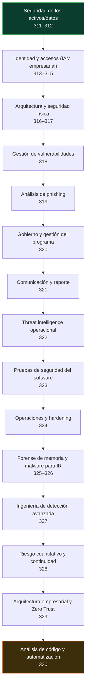

# 📈 Parte 17 — Profundización para certificaciones

> [⬅️ Volver al programa](../../README.md) · [📚 Índice completo](../README.md)

Gestión de datos, IAM empresarial, arquitectura, seguridad física, gestión de vulnerabilidades, gobierno, threat intelligence, reporte, operaciones, forense avanzado, riesgo cuantitativo, Zero Trust y análisis de código

**Fuentes de referencia de esta parte:**

- Chapple, Stewart, Gibson — *(ISC)² CISSP Official Study Guide* — dominios de Asset Security, IAM, Security Architecture y Security & Risk Management.
- NIST — *SP 800-63* (identidad digital), *SP 800-88* (sanitización de medios), *SP 800-40* (gestión de parches/vulnerabilidades), *SP 800-53* (controles).
- CompTIA — objetivos de *Security+ (SY0-701)* y *CySA+ (CS0-003)*.
- DMARC.org / M3AAWG — autenticación de correo (SPF, DKIM, DMARC).

---

## 🎯 ¿De qué trata esta parte?

Las partes 0–16 construyen un profesional técnico muy completo. Esta parte **cierra las brechas que piden las certificaciones** — sobre todo los dominios de **gestión, identidad y arquitectura** de CISSP, Security+ y CySA+, que suelen quedar cortos en un temario puramente técnico.

No es "relleno teórico": son los temas que separan a un buen operador técnico de un profesional que también entiende cómo se **gobierna, clasifica, identifica, arquitecta y mide** la seguridad en una organización. Y son, justamente, los que más pesan en los exámenes de certificación de perfil amplio.

## 🧩 Problemas que resuelve

- Clasificar y proteger la información según su valor, durante todo su ciclo de vida (Asset Security).
- Destruir datos de forma segura y evitar fugas con DLP.
- Diseñar la identidad de una empresa: alta/baja de usuarios, federación, SSO, MFA y accesos privilegiados.
- Entender los modelos formales de seguridad y la arquitectura de confianza que sustentan los controles.
- Proteger las instalaciones físicas y su entorno.
- Operar un **programa de gestión de vulnerabilidades** con SLAs y métricas, no escaneos sueltos.
- Analizar phishing con rigor y gobernar la seguridad con marcos, leyes y métricas.

## 🎓 Resultados de aprendizaje

Al terminar la parte, el alumno podrá:

1. **Diseñar** un esquema de clasificación de datos y su ciclo de vida.
2. **Definir** políticas de retención y sanitización segura alineadas a NIST 800-88.
3. **Modelar** el ciclo de vida de identidades (joiner-mover-leaver) y las revisiones de acceso.
4. **Explicar** federación, SAML/OIDC, MFA y PAM, y cuándo usar cada uno.
5. **Comparar** los modelos de seguridad clásicos (Bell-LaPadula, Biba, Clark-Wilson).
6. **Enumerar** controles físicos y ambientales de un centro de datos.
7. **Operar** un ciclo de gestión de vulnerabilidades con priorización (CVSS/EPSS/KEV) y SLAs.
8. **Analizar** un correo de phishing (cabeceras, SPF/DKIM/DMARC, adjuntos, URLs).
9. **Situar** la seguridad en un marco de gobierno, cumplimiento legal y métricas de programa.

## 🧱 Prerrequisitos

Haber cursado (o dominar) la **Parte 0** (fundamentos) y tener contexto de la **Parte 14** (GRC). Ayuda haber visto la **Parte 8** (SOC), **Parte 9** (DFIR) y **Parte 10** (nube/IAM cloud), que esta parte complementa desde la óptica empresarial.

## 🗺️ Estructura temática

<!-- arco:inicio -->

<!-- arco:fin -->

| Bloque | Clases | Enfoque de certificación |
|---|---|---|
| Seguridad de los activos/datos | 311–312 | CISSP *Asset Security*, Security+ |
| Identidad y accesos (IAM empresarial) | 313–315 | CISSP *IAM* |
| Arquitectura y seguridad física | 316–317 | CISSP *Security Architecture & Engineering* |
| Gestión de vulnerabilidades | 318 | CySA+ *Vulnerability Management* |
| Análisis de phishing | 319 | BTL1, Security+ |
| Gobierno y gestión del programa | 320 | Security+ *Program Management*, CISSP *Risk Management* |
| Comunicación y reporte | 321 | CySA+ *Reporting and Communication* |
| Threat intelligence operacional | 322 | BTL1 *Threat Intelligence*, CySA+ |
| Pruebas de seguridad del software | 323 | CISSP *Assessment & Software Dev Security* |
| Operaciones y hardening | 324 | Security+ / CISSP *Security Operations* |
| Forense de memoria y malware para IR | 325–326 | SANS *GCFA/GCIH*, BTL1 |
| Ingeniería de detección avanzada | 327 | BTL1 *SIEM*, CySA+ |
| Riesgo cuantitativo y continuidad | 328 | CISSP *Risk Management* |
| Arquitectura empresarial y Zero Trust | 329 | Security+ / CISSP *Architecture* |
| Análisis de código y automatización | 330 | PenTest+ *Tools*, CISSP *Software Dev* |

## 🔗 Referencias de la parte

- (ISC)² — [CISSP](https://www.isc2.org/certifications/cissp)
- NIST — [SP 800-63](https://pages.nist.gov/800-63-3/), [SP 800-88](https://csrc.nist.gov/pubs/sp/800/88/r1/final), [SP 800-40](https://csrc.nist.gov/pubs/sp/800/40/r4/final)
- [DMARC.org](https://dmarc.org/)

## ▶️ Empezar

[Clase 311 — Clasificación y ciclo de vida de los datos](311-clasificacion-y-ciclo-de-vida-de-los-datos/README.md)
