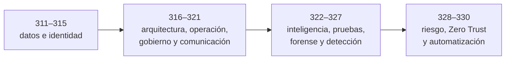

# Parte 17 — Profundización para certificaciones

> [⬅️ Volver al programa](../../README.md) · [📚 Índice completo](../README.md)

**20 clases** · rango 311–330 · Gestión de datos, IAM empresarial, arquitectura, seguridad física, gestión de vulnerabilidades, gobierno, threat intelligence, reporte, operaciones, forense avanzado, riesgo cuantitativo, Zero Trust y análisis de código

**Fuentes de referencia de esta parte:**

- Chapple, Stewart, Gibson — *(ISC)² CISSP Official Study Guide* — dominios de Asset Security, IAM, Security Architecture y Security & Risk Management.
- NIST — *SP 800-63* (identidad digital), *SP 800-88* (sanitización de medios), *SP 800-40* (gestión de parches/vulnerabilidades), *SP 800-53* (controles).
- CompTIA — objetivos de *Security+ (SY0-701)* y *CySA+ (CS0-003)*.
- DMARC.org / M3AAWG — autenticación de correo (SPF, DKIM, DMARC).

---

## 🎯 ¿De qué trata esta parte?

Las partes 0–16 construyen un profesional técnico muy completo. Esta parte **cierra las brechas que piden las certificaciones** — sobre todo los dominios de **gestión, identidad y arquitectura** de CISSP, Security+ y CySA+, que suelen quedar cortos en un temario puramente técnico.

No es "relleno teórico": son los temas que separan a un buen operador técnico de un profesional que también entiende cómo se **gobierna, clasifica, identifica, arquitecta y mide** la seguridad en una organización. Y son, justamente, los que más pesan en los exámenes de certificación de perfil amplio.

## 🧩 Problemas que resuelve

- Clasificar y proteger la información según su valor, durante todo su ciclo de vida (Asset Security).
- Destruir datos de forma segura y evitar fugas con DLP.
- Diseñar la identidad de una empresa: alta/baja de usuarios, federación, SSO, MFA y accesos privilegiados.
- Entender los modelos formales de seguridad y la arquitectura de confianza que sustentan los controles.
- Proteger las instalaciones físicas y su entorno.
- Operar un **programa de gestión de vulnerabilidades** con SLAs y métricas, no escaneos sueltos.
- Analizar phishing con rigor y gobernar la seguridad con marcos, leyes y métricas.

## 🎓 Resultados de aprendizaje

Al terminar la parte, el alumno podrá:

1. **Diseñar** un esquema de clasificación de datos y su ciclo de vida.
2. **Definir** políticas de retención y sanitización segura alineadas a NIST 800-88.
3. **Modelar** el ciclo de vida de identidades (joiner-mover-leaver) y las revisiones de acceso.
4. **Explicar** federación, SAML/OIDC, MFA y PAM, y cuándo usar cada uno.
5. **Comparar** los modelos de seguridad clásicos (Bell-LaPadula, Biba, Clark-Wilson).
6. **Enumerar** controles físicos y ambientales de un centro de datos.
7. **Operar** un ciclo de gestión de vulnerabilidades con priorización (CVSS/EPSS/KEV) y SLAs.
8. **Analizar** un correo de phishing (cabeceras, SPF/DKIM/DMARC, adjuntos, URLs).
9. **Situar** la seguridad en un marco de gobierno, cumplimiento legal y métricas de programa.

## 🧱 Prerrequisitos

Haber cursado (o dominar) la **Parte 0** (fundamentos) y tener contexto de la **Parte 14** (GRC). Ayuda haber visto la **Parte 8** (SOC), **Parte 9** (DFIR) y **Parte 10** (nube/IAM cloud), que esta parte complementa desde la óptica empresarial.

## 🗺️ Estructura temática

```mermaid
flowchart LR
  A["311–315<br/>datos e identidad"] --> B["316–321<br/>arquitectura, operación,<br/>gobierno y comunicación"] --> C["322–327<br/>inteligencia, pruebas,<br/>forense y detección"] --> D["328–330<br/>riesgo, Zero Trust<br/>y automatización"]
```

## 🧭 Recorrido clase a clase

Las clases 311–315 gobiernan datos e identidades durante todo su ciclo. Las 316–321 conectan modelos, seguridad física, vulnerabilidades, correo, obligaciones y comunicación. Las 322–327 profundizan inteligencia y capacidades técnicas de evaluación, forense, malware y detección. Las 328–330 integran riesgo cuantitativo, continuidad, arquitectura Zero Trust y automatización segura. La progresión está diseñada para decidir y justificar, no para memorizar dominios de examen.

### Capítulos enlazados

**[Clase 311 — Clasificación y ciclo de vida de los datos](311-clasificacion-y-ciclo-de-vida-de-los-datos/README.md).** Comprender cómo una organización identifica, valora y clasifica sus activos de información, y cómo gobierna cada dato a lo largo de su ciclo de vida (creación → uso → archivo → destrucción).

**[Clase 312 — Retención, destrucción segura de datos y DLP](312-retencion-destruccion-segura-de-datos-y-dlp/README.md).** Aprender a gobernar el **final del ciclo de vida** del dato: definir cuánto tiempo se conserva la información (retención), cómo se elimina de forma verificable (sanitización según NIST SP 800-88) y cómo se evita su fuga durante el uso mediante **DLP** (Data Loss Prevention).

**[Clase 313 — Gestión del ciclo de vida de identidades (IAM empresarial)](313-gestion-del-ciclo-de-vida-de-identidades-iam-empresarial/README.md).** Dominar cómo una organización gobierna las identidades de sus usuarios desde el alta hasta la baja: el ciclo **Joiner–Mover–Leaver (JML)**, el aprovisionamiento y desaprovisionamiento, los modelos de autorización (RBAC/ABAC/least privilege) y las **revisiones de acceso** periódicas.

**[Clase 314 — Federación, SSO, SAML y OpenID Connect](314-federacion-sso-saml-y-openid-connect/README.md).** Entender cómo las organizaciones permiten a un usuario autenticarse una vez y acceder a múltiples aplicaciones (**SSO**) y cómo se establece confianza entre dominios distintos (**federación**) mediante **SAML 2.0** y **OpenID Connect (OIDC)**.

**[Clase 315 — MFA y gestión de accesos privilegiados (PAM)](315-mfa-y-gestion-de-accesos-privilegiados-pam/README.md).** Reforzar la autenticación con **múltiples factores (MFA)** —incluyendo passkeys/FIDO2 resistentes al phishing— y gobernar las cuentas más peligrosas de la organización mediante **PAM** (Privileged Access Management): bóvedas de credenciales, acceso *just-in-time* (JIT), grabación de sesión y mínimo privilegio para administradores.

**[Clase 316 — Modelos de seguridad y arquitectura (Bell-LaPadula, Biba, Clark-Wilson)](316-modelos-de-seguridad-y-arquitectura/README.md).** Entender los **modelos formales de seguridad** que fundamentan la arquitectura de sistemas confiables y traducir sus propiedades (confidencialidad, integridad, separación) a decisiones de diseño reales.

**[Clase 317 — Seguridad física y ambiental](317-seguridad-fisica-y-ambiental/README.md).** Diseñar y evaluar **controles de seguridad física y ambiental** que protegen personas, equipos e información en instalaciones y centros de datos.

**[Clase 318 — Gestión del programa de vulnerabilidades](318-gestion-del-programa-de-vulnerabilidades/README.md).** Construir y operar un **programa de gestión de vulnerabilidades (VM)** completo: no un escaneo aislado, sino un ciclo continuo de descubrimiento, priorización basada en riesgo, remediación con SLAs y medición.

**[Clase 319 — Análisis avanzado de phishing y correo malicioso](319-analisis-avanzado-de-phishing-y-correo-malicioso/README.md).** Analizar correos sospechosos como lo hace un analista SOC: leer **cabeceras**, verificar autenticación **SPF/DKIM/DMARC**, examinar **URLs y adjuntos** de forma segura, hacer **triaje** por indicadores y ejecutar la **respuesta** (contención, purga, bloqueo, reporte).

**[Clase 320 — Gobierno, aspectos legales/regulatorios y gestión del programa](320-gobierno-aspectos-legales-regulatorios-y-gestion-del-programa/README.md).** Cerrar el programa entendiendo cómo se **gobierna** la seguridad: alinear el programa con los objetivos del negocio, elegir **marcos** de control, cumplir **leyes y regulaciones**, y gestionar el programa con **políticas, roles, métricas y modelos de madurez**.

**[Clase 321 — Comunicación y reporte para analistas de seguridad](321-comunicacion-y-reporte-para-analistas-de-seguridad/README.md).** Un hallazgo que nadie entiende no se remedia.

**[Clase 322 — Threat intelligence operacional avanzada](322-threat-intelligence-operacional-avanzada/README.md).** Transformar datos sueltos de amenazas en **inteligencia accionable** que dirija la defensa.

**[Clase 323 — Pruebas de seguridad del software y evaluación](323-pruebas-de-seguridad-del-software-y-evaluacion/README.md).** Verificar que el software es seguro **antes** y **después** de desplegarlo.

**[Clase 324 — Operaciones de seguridad: hardening y gestión de configuración](324-operaciones-de-seguridad-hardening-y-gestion-de-configuracion/README.md).** Reducir la superficie de ataque **antes** de que llegue el atacante.

**[Clase 325 — Forense de memoria avanzado](325-forense-de-memoria-avanzado/README.md).** Dominar el análisis forense de memoria RAM con **Volatility 3** como herramienta central: desde la adquisición correcta de un volcado hasta la caza de inyección de código, procesos ocultos, hooks y rootkits que solo viven en memoria.

**[Clase 326 — Análisis de malware para respuesta a incidentes](326-analisis-de-malware-para-respuesta-a-incidentes/README.md).** Aprender el análisis de malware **orientado a la respuesta a incidentes**: no un desensamblado exhaustivo, sino un **triaje rápido** que en minutos extrae los IOCs necesarios para contener y erradicar la amenaza, alimenta la línea de tiempo del incidente y produce un informe DFIR accionable.

**[Clase 327 — Ingeniería de detección avanzada y validación](327-ingenieria-de-deteccion-avanzada-y-validacion/README.md).** Convertir la detección de amenazas en una **disciplina de ingeniería**: tratar las reglas como código (*detection-as-code*), gestionar su ciclo de vida completo, **validarlas** con emulación de adversario (Atomic Red Team), reducir sistemáticamente los falsos positivos y medir su eficacia con métricas objetivas.

**[Clase 328 — Gestión de riesgos cuantitativa y continuidad avanzada](328-gestion-de-riesgos-cuantitativa-y-continuidad-avanzada/README.md).** Pasar del riesgo "por colores" (alto/medio/bajo) al riesgo **medido en dinero**.

**[Clase 329 — Arquitectura de seguridad empresarial y Zero Trust](329-arquitectura-de-seguridad-empresarial-y-zero-trust/README.md).** Diseñar seguridad **a nivel de empresa**, no controles sueltos.

**[Clase 330 — Análisis de código y automatización de seguridad](330-analisis-de-codigo-y-automatizacion-de-seguridad/README.md).** Encontrar y **corregir** vulnerabilidades en el código antes de que lleguen a producción, y hacerlo de forma **automatizada y repetible**.

| Bloque | Clases | Enfoque de certificación |
|---|---|---|
| Seguridad de los activos/datos | 311–312 | CISSP *Asset Security*, Security+ |
| Identidad y accesos (IAM empresarial) | 313–315 | CISSP *IAM* |
| Arquitectura y seguridad física | 316–317 | CISSP *Security Architecture & Engineering* |
| Gestión de vulnerabilidades | 318 | CySA+ *Vulnerability Management* |
| Análisis de phishing | 319 | BTL1, Security+ |
| Gobierno y gestión del programa | 320 | Security+ *Program Management*, CISSP *Risk Management* |
| Comunicación y reporte | 321 | CySA+ *Reporting and Communication* |
| Threat intelligence operacional | 322 | BTL1 *Threat Intelligence*, CySA+; cadenas CaaS y atribución con límites |
| Pruebas de seguridad del software | 323 | CISSP *Assessment & Software Dev Security* |
| Operaciones y hardening | 324 | Security+ / CISSP *Security Operations* |
| Forense de memoria y malware para IR | 325–326 | SANS *GCFA/GCIH*, BTL1 |
| Ingeniería de detección avanzada | 327 | BTL1 *SIEM*, CySA+ |
| Riesgo cuantitativo y continuidad | 328 | CISSP *Risk Management* |
| Arquitectura empresarial y Zero Trust | 329 | Security+ / CISSP *Architecture* |
| Análisis de código y automatización | 330 | PenTest+ *Tools*, CISSP *Software Dev* |

## 🔗 Referencias de la parte

- (ISC)² — [CISSP](https://www.isc2.org/certifications/cissp)
- NIST — [SP 800-63](https://pages.nist.gov/800-63-3/), [SP 800-88](https://csrc.nist.gov/pubs/sp/800/88/r1/final), [SP 800-40](https://csrc.nist.gov/pubs/sp/800/40/r4/final)
- [DMARC.org](https://dmarc.org/)

## ▶️ Empezar

[Clase 311 — Clasificación y ciclo de vida de los datos](311-clasificacion-y-ciclo-de-vida-de-los-datos/README.md)
