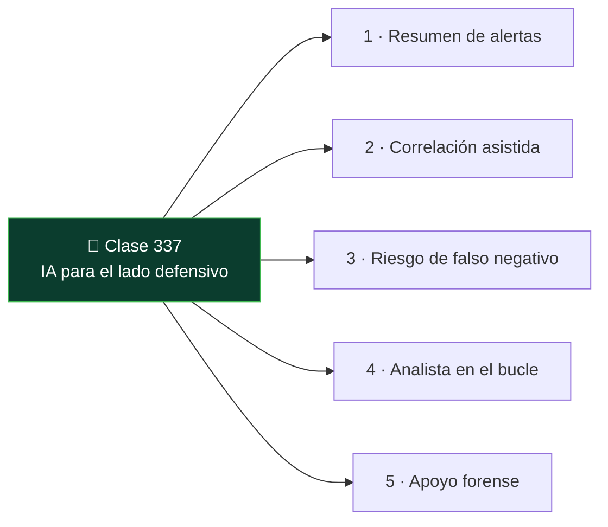

# Clase 337 — IA para el lado defensivo: SOC, triaje y forense

<!-- cabecera:inicio -->

> 🗂️ Parte: **18 — IA aplicada a la ciberseguridad** · 📖 Fuente: OWASP LLM · prácticas de SOC/DFIR (Partes 8–9)
> ⏱️ Duración estimada: **100 min** · 🎚️ Nivel: **Intermedio**

<!-- cabecera:fin -->

---

## 🎯 Objetivo

Aplicar la IA al **lado azul**: resumir y correlacionar alertas, asistir el triaje del SOC y
apoyar el análisis forense, entendiendo dónde ayuda (velocidad, reducción de ruido) y dónde es
peligrosa (falsos negativos, decisiones automáticas sin contexto). El humano sigue decidiendo.

## 📚 Resultados de aprendizaje

Al finalizar, el alumno podrá:

1. **Usar** un LLM para resumir alertas y logs y acelerar el triaje.
2. **Correlacionar** eventos de varias fuentes con apoyo de IA.
3. **Reconocer** el riesgo de falsos negativos (que la IA "tranquilice" de más).
4. **Mantener** al analista en el bucle para toda decisión de escalado/cierre.
5. **Apoyar** el análisis forense (resúmenes, hipótesis) sin sustituir la evidencia.

## 🗺️ Temas

<!-- mapa:inicio -->

<!-- mapa:fin -->

| # | Tema | Por qué importa |
|---|---|---|
| 1 | Resumen de alertas | Reduce la fatiga de alertas del SOC. |
| 2 | Correlación asistida | Une señales dispersas en una narrativa. |
| 3 | Riesgo de falso negativo | Una IA que minimiza un incidente real es peligrosa. |
| 4 | Analista en el bucle | Escalar/cerrar es decisión humana. |
| 5 | Apoyo forense | Hipótesis y resúmenes, nunca en lugar de la evidencia. |

## 📖 Definiciones y características

**Triaje asistido**
: Uso de IA para priorizar y resumir alertas, dejando la decisión de escalar al analista.

**Fatiga de alertas**
: Saturación por exceso de alertas que lleva a ignorar las importantes; la IA puede aliviarla resumiendo y agrupando.

**Falso negativo**
: Amenaza real no detectada/clasificada como benigna. En defensa asistida por IA es el riesgo más grave.

**Cadena de evidencia**
: En forense, la IA puede sugerir hipótesis, pero las conclusiones deben apoyarse en evidencia verificable y preservada (ver clase 201).

## 🧰 Herramientas y preparación

Un LLM y datos de un ejercicio defensivo (p. ej. el [lab blue-team-soc](../../../labs/blue-team-soc/README.md)
o el [dfir-memoria](../../../labs/dfir-memoria/README.md)). Trabaja con datos anonimizados.

## 🧪 Laboratorio guiado

1. **Resumen de alertas.** Da al LLM un lote de alertas del lab SOC y pídele un resumen priorizado. Contrasta con tu propia priorización.
2. **Correlación.** Aporta logs de dos fuentes (auth + red) y pídele la narrativa del incidente. ¿Reconstruyó la fuerza bruta → acceso → movimiento lateral?
3. **Caza del falso negativo.** Introduce un evento malicioso sutil y comprueba si la IA lo minimiza. Documenta el riesgo.
4. **Apoyo forense.** Sobre una salida de Volatility, pide hipótesis y verifica cada una con la evidencia real.
5. **Decisión.** Redacta la decisión de escalado con tu criterio, citando lo que la IA aportó y lo que verificaste.

## ✍️ Ejercicios

1. ¿Qué tareas del SOC acelera más un LLM?
2. Explica por qué un falso negativo asistido por IA es más peligroso que un falso positivo.
3. Diseña un flujo de triaje con IA donde el analista siempre decide.
4. ¿Cómo usarías IA en forense sin comprometer la cadena de evidencia?
5. ¿Qué datos del SOC no enviarías a un modelo externo?

## 📝 Reto verificable

Toma un incidente del lab, genera con IA un resumen + narrativa y **valida** cada afirmación
contra los logs reales.

**Criterio de aceptación:** entregas el resumen, marcas al menos una afirmación imprecisa de la
IA y la corriges con la evidencia; la decisión de escalado es tuya y está justificada.

## ⚠️ Errores comunes

| Síntoma / mensaje | Causa y cómo arreglar |
|---|---|
| Cerrar una alerta porque "la IA dijo que era benigna" | Falso negativo. El analista decide con evidencia. |
| Automatizar respuestas sin supervisión | Riesgo de acción errónea a escala. Mantén aprobación humana. |
| Enviar logs con PII a un modelo externo | Fuga de datos. Anonimiza o usa modelo aprobado. |
| Tomar hipótesis forenses como conclusiones | La IA sugiere; la evidencia concluye. |

## ❓ Preguntas frecuentes

**❓ ¿La IA reemplaza a los analistas del SOC?**
No; reduce el trabajo repetitivo y acelera el triaje, pero el criterio, el contexto de negocio y
la decisión de escalar siguen siendo humanos.

**❓ ¿Puedo automatizar la respuesta (SOAR) con IA?**
Con mucho cuidado y aprobación humana en las acciones con impacto. Una respuesta automática
equivocada puede causar más daño que el incidente.

## 🔗 Referencias

- Parte 8 (SOC/detección) y Parte 9 (DFIR) del programa.
- [OWASP Top 10 for LLM Applications](https://genai.owasp.org/)

## 📥 Material descargable

- 📄 [Guía en PDF](./clase-337-guia.pdf) — versión imprimible de esta clase.
- 🎞️ [Presentación (PPTX)](./clase-337-presentacion.pptx) — deck para proyectar en clase.

## ⬅️ Clase anterior

[Clase 336 — OSINT y auditoría web con agentes de IA](../336-osint-y-auditoria-web-con-agentes-de-ia/README.md)

## ➡️ Siguiente clase

[Clase 338 — Generación de informes y flujos de trabajo con IA](../338-generacion-de-informes-y-flujos-de-trabajo-con-ia/README.md)
