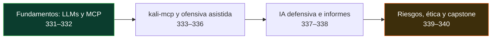

# 🧠 Parte 18 — IA aplicada a la ciberseguridad

> [⬅️ Volver al programa](../../README.md) · [📚 Índice completo](../README.md)

LLMs y agentes de IA para hacer seguridad: MCP, kali-mcp, pentesting asistido, defensa, informes, guardrails y ética

**Fuentes de referencia de esta parte:**

- **kali-mcp** (pabpereza, licencia MIT) — servidor MCP que conecta un agente de IA con herramientas de Kali: <https://github.com/pabpereza/kali-mcp>
- **Model Context Protocol** — especificación oficial: <https://modelcontextprotocol.io/>
- **OWASP Top 10 for LLM Applications** y **MITRE ATLAS** (amenazas a sistemas de IA).
- Documentación de agentes de IA (Claude Code, etc.) y de las herramientas de Kali orquestadas.

---

## 🎯 ¿De qué trata esta parte?

Esta parte cubre el ángulo que está transformando la profesión: **usar IA — LLMs y agentes —
para hacer trabajo de seguridad**. Es lo opuesto y complementario a la [Parte 15](../parte-15-seguridad-de-ia-y-machine-learning/README.md)
(que trata de *proteger* la IA): aquí la IA es la **herramienta**, no el objetivo.

El hilo conductor es el **Model Context Protocol (MCP)** y, como caso práctico, el proyecto
**[kali-mcp](https://github.com/pabpereza/kali-mcp)** (MIT), que permite a un agente de IA
orquestar las herramientas de Kali Linux (nmap, gobuster, sqlmap, etc.) dentro de un
contenedor Docker. Verás cómo un agente puede coordinar reconocimiento, escaneo, auditoría
web, OSINT y la generación de informes — siempre con **el humano en el bucle** y **solo en
entornos autorizados**.

> ⚠️ **Ético y legal.** Automatizar con IA no cambia la ley: todo pentest, escaneo o
> explotación se hace **únicamente** contra sistemas propios o con **autorización explícita
> por escrito**. La IA propone y acelera; la responsabilidad y la autorización son **humanas**.

## 🧩 Problemas que resuelve

- Entender qué aportan (y qué no) los LLMs en seguridad, evitando la falsa confianza.
- Conectar un agente de IA con herramientas reales mediante MCP de forma segura.
- Acelerar recon, escaneo, OSINT y auditoría web con supervisión humana.
- Usar IA en el lado defensivo: resumir alertas, correlacionar y asistir el triaje.
- Generar informes consistentes sin que la IA "invente" hallazgos.
- Proteger tu propio flujo de IA (prompt injection, fuga de datos) y auditar sus acciones.

## 🎓 Resultados de aprendizaje

Al terminar la parte, el alumno podrá:

1. **Explicar** capacidades y límites de los LLMs en ciberseguridad.
2. **Describir** la arquitectura MCP (cliente–servidor–herramientas) y sus riesgos.
3. **Montar** kali-mcp en un laboratorio propio y ejecutar un flujo supervisado.
4. **Coordinar** recon/escaneo/OSINT/auditoría web con un agente, validando los resultados.
5. **Aplicar** supervisión humana a la explotación y post-explotación autorizadas.
6. **Usar** IA para tareas defensivas (SOC, triaje, forense) con criterio.
7. **Generar** informes verificables con apoyo de IA.
8. **Defender** su propio agente y **auditar** sus acciones; aplicar el marco legal.

## 🧱 Prerrequisitos

Haber cursado la base ofensiva (Partes 3–7) y defensiva (Partes 8–9), la [Parte 0](../parte-0-fundamentos-y-prerrequisitos/README.md)
(Docker, clase 022) y, muy recomendable, la [Parte 15](../parte-15-seguridad-de-ia-y-machine-learning/README.md)
(seguridad de la IA: prompt injection, OWASP LLM). El [lab red-team-ad](../../labs/red-team-ad/README.md)
y el [appsec-web](../../labs/appsec-web/README.md) sirven como objetivos autorizados.

## 🗺️ Estructura temática

<!-- arco:inicio -->

<!-- arco:fin -->

| Bloque | Clases | Enfoque |
|---|---|---|
| Fundamentos: LLMs y MCP | 331–332 | Qué aportan, arquitectura de agentes |
| kali-mcp y ofensiva asistida | 333–336 | Orquestar Kali, recon, explotación autorizada, OSINT/web |
| IA defensiva e informes | 337–338 | SOC/triaje/forense, generación de informes |
| Riesgos, ética y capstone | 339–340 | Guardrails/OPSEC y operación integradora |

## 🔗 Referencias de la parte

- kali-mcp (MIT) — <https://github.com/pabpereza/kali-mcp>
- Model Context Protocol — <https://modelcontextprotocol.io/>
- [OWASP Top 10 for LLM Applications](https://genai.owasp.org/) · [MITRE ATLAS](https://atlas.mitre.org/)

## ▶️ Empezar

[Clase 331 — IA generativa y LLMs en ciberseguridad: panorama y límites](331-ia-generativa-y-llms-en-ciberseguridad-panorama-y-limites/README.md)
