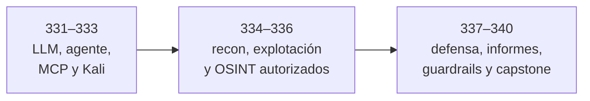

# Parte 18 — IA aplicada a la ciberseguridad

> [⬅️ Volver al programa](../../README.md) · [📚 Índice completo](../README.md)

**10 clases** · rango 331–340 · LLMs y agentes de IA para hacer seguridad: MCP, kali-mcp, pentesting asistido, defensa, informes, guardrails y ética

**Fuentes de referencia de esta parte:**

- **kali-mcp** (pabpereza, licencia MIT) — servidor MCP que conecta un agente de IA con herramientas de Kali: <https://github.com/pabpereza/kali-mcp>
- **Model Context Protocol** — especificación oficial: <https://modelcontextprotocol.io/>
- **OWASP Top 10 for LLM Applications** y **MITRE ATLAS** (amenazas a sistemas de IA).
- Documentación de agentes de IA (Claude Code, etc.) y de las herramientas de Kali orquestadas.

---

## 🎯 ¿De qué trata esta parte?

Esta parte cubre el ángulo que está transformando la profesión: **usar IA — LLMs y agentes —
para hacer trabajo de seguridad**. Es lo opuesto y complementario a la [Parte 15](../parte-15-seguridad-de-ia-y-machine-learning/README.md)
(que trata de *proteger* la IA): aquí la IA es la **herramienta**, no el objetivo.

El hilo conductor es el **Model Context Protocol (MCP)** y, como caso práctico, el proyecto
**[kali-mcp](https://github.com/pabpereza/kali-mcp)** (MIT), que permite a un agente de IA
orquestar las herramientas de Kali Linux (nmap, gobuster, sqlmap, etc.) dentro de un
contenedor Docker. Verás cómo un agente puede coordinar reconocimiento, escaneo, auditoría
web, OSINT y la generación de informes — siempre con **el humano en el bucle** y **solo en
entornos autorizados**.

> ⚠️ **Ético y legal.** Automatizar con IA no cambia la ley: todo pentest, escaneo o
> explotación se hace **únicamente** contra sistemas propios o con **autorización explícita
> por escrito**. La IA propone y acelera; la responsabilidad y la autorización son **humanas**.

## 🧩 Problemas que resuelve

- Entender qué aportan (y qué no) los LLMs en seguridad, evitando la falsa confianza.
- Conectar un agente de IA con herramientas reales mediante MCP de forma segura.
- Acelerar recon, escaneo, OSINT y auditoría web con supervisión humana.
- Usar IA en el lado defensivo: resumir alertas, correlacionar y asistir el triaje.
- Generar informes consistentes sin que la IA "invente" hallazgos.
- Proteger tu propio flujo de IA (prompt injection, fuga de datos) y auditar sus acciones.

## 🎓 Resultados de aprendizaje

Al terminar la parte, el alumno podrá:

1. **Explicar** capacidades y límites de los LLMs en ciberseguridad.
2. **Describir** la arquitectura MCP (cliente–servidor–herramientas) y sus riesgos.
3. **Montar** kali-mcp en un laboratorio propio y ejecutar un flujo supervisado.
4. **Coordinar** recon/escaneo/OSINT/auditoría web con un agente, validando los resultados.
5. **Aplicar** supervisión humana a la explotación y post-explotación autorizadas.
6. **Usar** IA para tareas defensivas (SOC, triaje, forense) con criterio.
7. **Generar** informes verificables con apoyo de IA.
8. **Defender** su propio agente y **auditar** sus acciones; aplicar el marco legal.

## 🧱 Prerrequisitos

Haber cursado la base ofensiva (Partes 3–7) y defensiva (Partes 8–9), la [Parte 0](../parte-0-fundamentos-y-prerrequisitos/README.md)
(Docker, clase 022) y, muy recomendable, la [Parte 15](../parte-15-seguridad-de-ia-y-machine-learning/README.md)
(seguridad de la IA: prompt injection, OWASP LLM). El [lab red-team-ad](../../labs/red-team-ad/README.md)
y el [appsec-web](../../labs/appsec-web/README.md) sirven como objetivos autorizados.

## 🗺️ Estructura temática

```mermaid
flowchart LR
  A["331–333<br/>LLM, agente,<br/>MCP y Kali"] --> B["334–336<br/>recon, explotación<br/>y OSINT autorizados"] --> C["337–340<br/>defensa, informes,<br/>guardrails y capstone"]
```

## 🧭 Recorrido clase a clase

Las clases 331–333 construyen límites del modelo y la arquitectura de agentes, MCP y herramientas aisladas. Las 334–336 aplican esa arquitectura a colección, pruebas mínimas y OSINT sin ampliar alcance. Las 337–339 trasladan el método a SOC, forense, informes y guardrails. La clase 340 integra autorización, checkpoints, evidencia, comunicación y cleanup. El principio común es verificable: una salida del modelo puede ser hipótesis o propuesta, nunca permiso ni prueba por sí sola.

### Capítulos enlazados

**[Clase 331 — IA generativa y LLMs en ciberseguridad: panorama, capacidades y límites](331-ia-generativa-y-llms-en-ciberseguridad-panorama-y-limites/README.md).** Entender qué son los modelos generativos de lenguaje (LLM) y qué papel real juegan como **herramienta de trabajo** para hacer ciberseguridad: dónde aportan valor (acelerar tareas repetitivas, sintetizar información, redactar) y dónde fallan (alucinaciones, falta de contexto, datos desactualizados).

**[Clase 332 — Agentes de IA y el Model Context Protocol (MCP) para seguridad](332-agentes-de-ia-y-el-model-context-protocol-mcp-para-seguridad/README.md).** Entender qué es un **agente de IA** y cómo el **Model Context Protocol (MCP)** le permite usar herramientas reales (escáneres, bases de datos, sistemas de archivos) de forma estandarizada.

**[Clase 333 — kali-mcp: orquestar herramientas de Kali desde un agente de IA](333-kali-mcp-orquestar-herramientas-de-kali-desde-un-agente-de-ia/README.md).** Montar y entender **kali-mcp**, un servidor MCP (de código abierto, MIT) que conecta un agente de IA con más de 50 herramientas de Kali Linux dentro de un contenedor Docker.

**[Clase 334 — Reconocimiento y escaneo asistidos por IA](334-reconocimiento-y-escaneo-asistidos-por-ia/README.md).** Ver cómo un agente de IA coordina las fases de **reconocimiento y escaneo** (descubrimiento de hosts, puertos, servicios, subdominios) usando kali-mcp, y —lo más importante— cómo el profesional **valida** los resultados y evita que la IA saque conclusiones falsas o toque objetivos fuera de alcance.

**[Clase 335 — Explotación y post-explotación autorizada asistida por IA](335-explotacion-y-post-explotacion-autorizada-asistida-por-ia/README.md).** Comprender el rol —y los **límites**— de un agente de IA en las fases de explotación y post-explotación de un pentest autorizado: la IA **propone y documenta**, el profesional **decide y ejecuta** las acciones con impacto.

**[Clase 336 — OSINT y auditoría web con agentes de IA](336-osint-y-auditoria-web-con-agentes-de-ia/README.md).** Ver cómo un agente de IA acelera dos tareas muy repetitivas —**OSINT** (recolección de información de fuentes abiertas) y **auditoría web**— coordinando herramientas y sintetizando resultados, y cómo el profesional filtra el ruido, evita falsos positivos y respeta la legalidad.

**[Clase 337 — IA para el lado defensivo: SOC, triaje y forense](337-ia-para-el-lado-defensivo-soc-triaje-y-forense/README.md).** Aplicar la IA al **lado azul**: resumir y correlacionar alertas, asistir el triaje del SOC y apoyar el análisis forense, entendiendo dónde ayuda (velocidad, reducción de ruido) y dónde es peligrosa (falsos negativos, decisiones automáticas sin contexto).

**[Clase 338 — Generación de informes y flujos de trabajo con IA](338-generacion-de-informes-y-flujos-de-trabajo-con-ia/README.md).** Usar la IA para lo que mejor hace en un engagement: **compilar hallazgos y redactar informes** consistentes y legibles — sin que "invente" hallazgos.

**[Clase 339 — Riesgos, guardrails, OPSEC y ética del hacking con IA](339-riesgos-guardrails-opsec-y-etica-del-hacking-con-ia/README.md).** Cerrar el círculo: los **riesgos de usar IA para hacer seguridad** y cómo mitigarlos.

**[Clase 340 — Capstone: pentest autorizado asistido por IA con MCP](340-capstone-pentest-autorizado-asistido-por-ia-con-mcp/README.md).** Integrar todo el programa en una operación completa: montar kali-mcp, definir el alcance, ejecutar un pentest **supervisado** asistido por IA contra tu laboratorio (recon → auditoría → PoC de bajo impacto → informe), aplicando los guardrails y la ética de las clases anteriores.

| Bloque | Clases | Enfoque |
|---|---|---|
| Fundamentos: LLMs y MCP | 331–332 | Qué aportan, arquitectura de agentes |
| kali-mcp y ofensiva asistida | 333–336 | Orquestar Kali, recon, explotación autorizada, OSINT/web |
| IA defensiva e informes | 337–338 | SOC/triaje/forense, generación de informes |
| Riesgos, ética y capstone | 339–340 | Guardrails/OPSEC y operación integradora |

## 🔗 Referencias de la parte

- kali-mcp (MIT) — <https://github.com/pabpereza/kali-mcp>
- Model Context Protocol — <https://modelcontextprotocol.io/>
- [OWASP Top 10 for LLM Applications](https://genai.owasp.org/) · [MITRE ATLAS](https://atlas.mitre.org/)

## ▶️ Empezar

[Clase 331 — IA generativa y LLMs en ciberseguridad: panorama y límites](331-ia-generativa-y-llms-en-ciberseguridad-panorama-y-limites/README.md)
