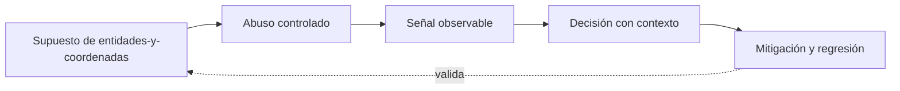

# Clase 346 — Información expuesta, radar, ESP y world-to-screen

> Parte: **19 — Seguridad de videojuegos, cheats y anti-cheat** · Fuente principal: documentación de Epic Games y Valve
> ⏱️ Duración estimada: **120 min** · Nivel: **Avanzado**

---

## 🎯 Objetivo

Comprender y verificar **información expuesta, radar, esp y world-to-screen** sobre el Game Security Range, conectando vulnerabilidad, abuso controlado, telemetría, evidencia, causa raíz, mitigación y prueba de regresión sin actuar sobre software de terceros.

## 📚 Resultados de aprendizaje

Al finalizar, el alumno podrá:

1. **Explicar** entidades y coordenadas desde la arquitectura y no solo desde la herramienta.
2. **Relacionar** world→view→projection→screen con una frontera de confianza concreta.
3. **Producir** evidencia reproducible sobre bounding boxes y visibilidad.
4. **Evaluar** límites, falsos positivos y consecuencias de minimización de información.
5. **Verificar** una mitigación mediante un caso legítimo y uno adversarial.

## 🗺️ Temas

| # | Tema | Evidencia esperada |
|---|---|---|
| 1 | Entidades y coordenadas | Produce una decisión o evidencia verificable |
| 2 | WORLD→VIEW→PROJECTION→SCREEN | Produce una decisión o evidencia verificable |
| 3 | Bounding boxes y visibilidad | Produce una decisión o evidencia verificable |
| 4 | Minimización de información | Produce una decisión o evidencia verificable |

## 🧠 Explicación en profundidad

Un radar necesita posición relativa; un ESP añade atributos como distancia, salud o equipo; un overlay proyecta geometría 3D a píxeles. El pipeline usa coordenadas homogéneas: un punto WORLD se lleva al espacio de cámara mediante VIEW, a clip mediante PROJECTION, se divide por w para obtener NDC y se escala al viewport SCREEN. Si w no es positivo, el punto está detrás; si NDC sale de [-1,1], no está en pantalla. Una bounding box proyecta varios puntos, no solo el centro.

El overlay es el síntoma visible. La causa decisiva puede ser que el servidor replicó entidades que el jugador no necesita conocer. Cifrar el tráfico no ayuda cuando el cliente legítimo debe descifrarlo para renderizar. Interest management, relevancia, line-of-sight y retraso de información reducen exposición, con costos de CPU, ancho de banda y pop-in. El objetivo no es afirmar que toda ocultación es perfecta, sino medir qué conocimiento mínimo requiere una experiencia correcta.

El diagrama se lee como un bucle de ingeniería, no como una cadena de sanción. El supuesto habilita un abuso dentro del target propio; la señal solo permite formular una hipótesis; la decisión incorpora contexto; la mitigación debe volver al supuesto y demostrar con una regresión que la confianza cambió. Si el último arco no puede verificarse, solo se ocultó el síntoma.

## 📖 Definiciones y características

- **Señal:** medida observable; característica clave: no prueba por sí sola intención.
- **Evidencia:** señal contextualizada y reproducible; característica clave: trazabilidad.
- **Autoridad:** componente que decide el estado canónico; característica clave: valida intenciones.
- **Causa raíz:** condición sistémica que permitió el incidente; característica clave: su corrección evita recurrencia.

## 📔 Glosario

| Término | Definición en contexto |
|---|---|
| Entidades | Concepto de esta clase aplicado al Game Security Range y a su frontera de confianza. |
| WORLD→VIEW→PROJECTION→SCREEN | Concepto de esta clase aplicado al Game Security Range y a su frontera de confianza. |
| Bounding | Concepto de esta clase aplicado al Game Security Range y a su frontera de confianza. |
| Minimización | Concepto de esta clase aplicado al Game Security Range y a su frontera de confianza. |

## 🧰 Herramientas y preparación

- Python 3.12 y el [Game Security Range](../../../labs/game-security/README.md).
- Escenario correspondiente de [SCENARIOS.md](../../../labs/game-security/SCENARIOS.md).
- Dataset sintético documentado; nunca datos personales ni procesos de terceros.
- Prerrequisitos: clases 023–024 (procesos/memoria), 130–134 (RE/debugging), 182/199 (telemetría/detección) y 217 (RCA).

## 🧪 Laboratorio guiado

1. Ejecuta `python -m unittest discover -s tests -v` desde `labs/game-security` y conserva la línea base.
2. Prueba `world_to_screen` con la matriz identidad, puntos fuera de NDC y w no positivo. Diseña un filtro de relevancia y documenta qué gameplay podría romper.
3. Registra modo, comando, decisión, señal, umbral o invariante, semilla y resultado esperado.
4. Formula al menos una explicación legítima alternativa antes de atribuir abuso.
5. Aplica o diseña la mitigación y repite el caso adversarial y un caso normal.
6. Redacta la cadena `síntoma → timeline → evidencia → hipótesis → causa raíz → fix → regresión`.

## ✍️ Ejercicios

1. Explica qué cambia si el cliente controla el dato frente a si solo solicita una acción.
2. Identifica una señal débil y combínala con otra fuente independiente.
3. Diseña un caso límite de latencia, FPS, dispositivo o accesibilidad.
4. Separa prevención, detección, respuesta y gobernanza para este tema.
5. Explica qué información no necesitas recoger y por qué.

## 📝 Reto verificable

Entrega una ficha con threat boundary, reproducción en el rango, evento de telemetría, decisión explicada, alternativa legítima, causa raíz, mitigación y prueba de regresión.

**Criterio de aceptación:** otra persona puede ejecutar los comandos con la misma semilla, obtener la evidencia citada y comprobar que la mitigación bloquea el caso adversarial sin romper el caso normal.

## ⚠️ Errores comunes

| Síntoma | Causa y corrección |
|---|---|
| La anomalía se trata como culpabilidad | Falta contexto; correlaciona y revisa alternativas legítimas. |
| El control solo oculta un valor | La autoridad no cambió; valida o deriva el estado en servidor. |
| El experimento no se reproduce | Faltan semilla, versión, unidades o configuración; regístralas. |
| El detector castiga lag/FPS | El dataset no estratifica condiciones; evalúa por subpoblación. |
| Se propone instrumentar terceros | Fuera del alcance; usa exclusivamente el target educativo. |

## ❓ Preguntas frecuentes

**¿Una alerta basta para sancionar?** No. Es una hipótesis con un nivel de confianza; la consecuencia exige evidencia proporcional, política, auditabilidad y apelación.

**¿Ofuscar el cliente resuelve el problema?** Puede elevar costo, pero no reemplaza autoridad, invariantes ni minimización de información.

**¿Por qué el laboratorio es sintético?** Permite controlar verdad, semilla y falsos positivos sin invadir jugadores ni construir una herramienta reutilizable contra terceros.

## 🔗 Referencias

- Epic Games, *Networking Overview* — autoridad y replicación aplicadas a WORLD→VIEW→PROJECTION→SCREEN. <https://dev.epicgames.com/documentation/unreal-engine/networking-overview-for-unreal-engine>
- Valve, *Latency Compensating Methods* — predicción, interpolación y límites usados para Minimización de información. <https://developer.valvesoftware.com/wiki/Latency_Compensating_Methods_in_Client/Server_In-game_Protocol_Design_and_Optimization>
- Montero et al., *Anticheat System Based on Reinforcement Learning Agents in Unity* — ejemplo académico para contrastar prevención y detección en la clase 346. <https://doi.org/10.3390/info13040173>

## ⬅️ Clase anterior

[Clase 345 — Trainers e instrumentación del cliente](../345-trainers-instrumentacion-cliente/README.md)

## ➡️ Siguiente clase

[Clase 347 — Rendering, visibilidad, occlusion y wallhack](../347-rendering-visibilidad-occlusion-wallhack/README.md)
