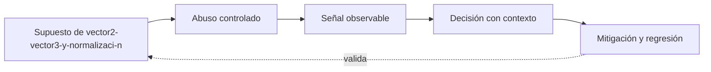

# Clase 348 — Matemática de un aimbot

> Parte: **19 — Seguridad de videojuegos, cheats y anti-cheat** · Fuente principal: documentación de Epic Games y Valve
> ⏱️ Duración estimada: **120 min** · Nivel: **Avanzado**

---

## 🎯 Objetivo

Comprender y verificar **matemática de un aimbot** sobre el Game Security Range, conectando vulnerabilidad, abuso controlado, telemetría, evidencia, causa raíz, mitigación y prueba de regresión sin actuar sobre software de terceros.

## 📚 Resultados de aprendizaje

Al finalizar, el alumno podrá:

1. **Explicar** vector2/vector3 y normalización desde la arquitectura y no solo desde la herramienta.
2. **Relacionar** dot product y distancia angular con una frontera de confianza concreta.
3. **Producir** evidencia reproducible sobre yaw, pitch, fov y selección.
4. **Evaluar** límites, falsos positivos y consecuencias de line-of-sight y experimento.
5. **Verificar** una mitigación mediante un caso legítimo y uno adversarial.

## 🗺️ Temas

| # | Tema | Evidencia esperada |
|---|---|---|
| 1 | Vector2/Vector3 y normalización | Produce una decisión o evidencia verificable |
| 2 | Dot product y distancia angular | Produce una decisión o evidencia verificable |
| 3 | Yaw, pitch, FOV y selección | Produce una decisión o evidencia verificable |
| 4 | Line-of-sight y experimento | Produce una decisión o evidencia verificable |

## 🧠 Explicación en profundidad

La dirección al blanco nace de `target_position - camera_position`. Normalizar divide por la magnitud para separar orientación de distancia. El producto punto de dos vectores unitarios es el coseno del ángulo; `acos(clamp(dot,-1,1))` recupera la distancia angular sin fallar por error de coma flotante. En coordenadas habituales, yaw rota en el plano horizontal y pitch eleva o baja; la convención de ejes y signo debe declararse porque cambia entre motores.

FOV angular no es un círculo arbitrario en píxeles: selecciona direcciones cuyo ángulo respecto al forward es menor que la mitad de la apertura. 'Nearest target' minimiza distancia mundial; 'nearest-to-crosshair' minimiza ángulo y puede elegir otro objetivo. Line-of-sight agrega una consulta de física; sin ella, una selección matemáticamente óptima puede apuntar a través de una pared. El rango separa cálculo, decisión y disparo para que cada fase deje evidencia medible.

Ejemplo: forward=(1,0,0) y target=(1,1,0) forman 45°. Con FOV total de 60°, queda fuera porque el semiancho es 30°. Este detalle evita el error frecuente de comparar contra el FOV completo. La tolerancia numérica y el vector cero son casos límite explícitos en las pruebas.

El diagrama se lee como un bucle de ingeniería, no como una cadena de sanción. El supuesto habilita un abuso dentro del target propio; la señal solo permite formular una hipótesis; la decisión incorpora contexto; la mitigación debe volver al supuesto y demostrar con una regresión que la confianza cambió. Si el último arco no puede verificarse, solo se ocultó el síntoma.

## 📖 Definiciones y características

- **Señal:** medida observable; característica clave: no prueba por sí sola intención.
- **Evidencia:** señal contextualizada y reproducible; característica clave: trazabilidad.
- **Autoridad:** componente que decide el estado canónico; característica clave: valida intenciones.
- **Causa raíz:** condición sistémica que permitió el incidente; característica clave: su corrección evita recurrencia.

## 📔 Glosario

| Término | Definición en contexto |
|---|---|
| Vector2/Vector3 | Concepto de esta clase aplicado al Game Security Range y a su frontera de confianza. |
| Dot | Concepto de esta clase aplicado al Game Security Range y a su frontera de confianza. |
| Yaw, | Concepto de esta clase aplicado al Game Security Range y a su frontera de confianza. |
| Line-of-sight | Concepto de esta clase aplicado al Game Security Range y a su frontera de confianza. |

## 🧰 Herramientas y preparación

- Python 3.12 y el [Game Security Range](../../../labs/game-security/README.md).
- Escenario correspondiente de [SCENARIOS.md](../../../labs/game-security/SCENARIOS.md).
- Dataset sintético documentado; nunca datos personales ni procesos de terceros.
- Prerrequisitos: clases 023–024 (procesos/memoria), 130–134 (RE/debugging), 182/199 (telemetría/detección) y 217 (RCA).

## 🧪 Laboratorio guiado

1. Ejecuta `python -m unittest discover -s tests -v` desde `labs/game-security` y conserva la línea base.
2. Reproduce ángulos 0°, 45°, 90° y 180°; prueba FOV en el borde y vector cero. Compara nearest-distance con nearest-angle usando tres targets.
3. Registra modo, comando, decisión, señal, umbral o invariante, semilla y resultado esperado.
4. Formula al menos una explicación legítima alternativa antes de atribuir abuso.
5. Aplica o diseña la mitigación y repite el caso adversarial y un caso normal.
6. Redacta la cadena `síntoma → timeline → evidencia → hipótesis → causa raíz → fix → regresión`.

## ✍️ Ejercicios

1. Explica qué cambia si el cliente controla el dato frente a si solo solicita una acción.
2. Identifica una señal débil y combínala con otra fuente independiente.
3. Diseña un caso límite de latencia, FPS, dispositivo o accesibilidad.
4. Separa prevención, detección, respuesta y gobernanza para este tema.
5. Explica qué información no necesitas recoger y por qué.

## 📝 Reto verificable

Entrega una ficha con threat boundary, reproducción en el rango, evento de telemetría, decisión explicada, alternativa legítima, causa raíz, mitigación y prueba de regresión.

**Criterio de aceptación:** otra persona puede ejecutar los comandos con la misma semilla, obtener la evidencia citada y comprobar que la mitigación bloquea el caso adversarial sin romper el caso normal.

## ⚠️ Errores comunes

| Síntoma | Causa y corrección |
|---|---|
| La anomalía se trata como culpabilidad | Falta contexto; correlaciona y revisa alternativas legítimas. |
| El control solo oculta un valor | La autoridad no cambió; valida o deriva el estado en servidor. |
| El experimento no se reproduce | Faltan semilla, versión, unidades o configuración; regístralas. |
| El detector castiga lag/FPS | El dataset no estratifica condiciones; evalúa por subpoblación. |
| Se propone instrumentar terceros | Fuera del alcance; usa exclusivamente el target educativo. |

## ❓ Preguntas frecuentes

**¿Una alerta basta para sancionar?** No. Es una hipótesis con un nivel de confianza; la consecuencia exige evidencia proporcional, política, auditabilidad y apelación.

**¿Ofuscar el cliente resuelve el problema?** Puede elevar costo, pero no reemplaza autoridad, invariantes ni minimización de información.

**¿Por qué el laboratorio es sintético?** Permite controlar verdad, semilla y falsos positivos sin invadir jugadores ni construir una herramienta reutilizable contra terceros.

## 🔗 Referencias

- Epic Games, *Networking Overview* — autoridad y replicación aplicadas a Dot product y distancia angular. <https://dev.epicgames.com/documentation/unreal-engine/networking-overview-for-unreal-engine>
- Valve, *Latency Compensating Methods* — predicción, interpolación y límites usados para Line-of-sight y experimento. <https://developer.valvesoftware.com/wiki/Latency_Compensating_Methods_in_Client/Server_In-game_Protocol_Design_and_Optimization>
- Montero et al., *Anticheat System Based on Reinforcement Learning Agents in Unity* — ejemplo académico para contrastar prevención y detección en la clase 348. <https://doi.org/10.3390/info13040173>

## ⬅️ Clase anterior

[Clase 347 — Rendering, visibilidad, occlusion y wallhack](../347-rendering-visibilidad-occlusion-wallhack/README.md)

## ➡️ Siguiente clase

[Clase 349 — Aimbot avanzado, predicción, smoothing y recoil](../349-aimbot-avanzado-prediccion-smoothing-recoil/README.md)
