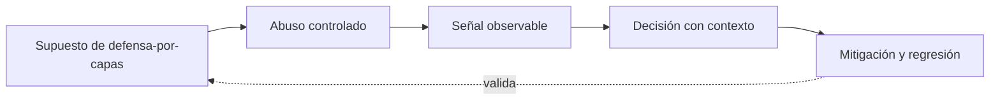

# Clase 353 — Arquitecturas Anti-Cheat

> Parte: **19 — Seguridad de videojuegos, cheats y anti-cheat** · Fuente principal: documentación de Epic Games y Valve
> ⏱️ Duración estimada: **120 min** · Nivel: **Avanzado**

---

## 🎯 Objetivo

Comprender y verificar **arquitecturas anti-cheat** sobre el Game Security Range, conectando vulnerabilidad, abuso controlado, telemetría, evidencia, causa raíz, mitigación y prueba de regresión sin actuar sobre software de terceros.

## 📚 Resultados de aprendizaje

Al finalizar, el alumno podrá:

1. **Explicar** defensa por capas desde la arquitectura y no solo desde la herramienta.
2. **Relacionar** integridad, telemetría y comportamiento con una frontera de confianza concreta.
3. **Producir** evidencia reproducible sobre user-mode y kernel-mode.
4. **Evaluar** límites, falsos positivos y consecuencias de privacidad, privilegio y enforcement.
5. **Verificar** una mitigación mediante un caso legítimo y uno adversarial.

## 🗺️ Temas

| # | Tema | Evidencia esperada |
|---|---|---|
| 1 | Defensa por capas | Produce una decisión o evidencia verificable |
| 2 | Integridad, telemetría y comportamiento | Produce una decisión o evidencia verificable |
| 3 | User-mode y kernel-mode | Produce una decisión o evidencia verificable |
| 4 | Privacidad, privilegio y enforcement | Produce una decisión o evidencia verificable |

## 🧠 Explicación en profundidad

Anti-cheat es una arquitectura socio-técnica: prevención autoritativa, integridad del cliente, telemetría, análisis conductual, reputación, revisión y enforcement. Cada capa observa cosas distintas y falla de forma distinta. Delayed enforcement puede proteger señales, pero alarga el daño; una revisión inmediata reduce daño, pero puede revelar el detector y amplificar falsos positivos.

User-mode comparte restricciones con aplicaciones; kernel-mode obtiene visibilidad y control mayores a costa de privilegio, superficie de ataque, compatibilidad y confianza. Que una capacidad sea técnicamente posible no la vuelve proporcional. El laboratorio permanece en user-space y estudia drivers solo como frontera arquitectónica: threat model del propio componente, actualización segura, mínimo privilegio, auditoría, rollback y respuesta a vulnerabilidades.

El diagrama se lee como un bucle de ingeniería, no como una cadena de sanción. El supuesto habilita un abuso dentro del target propio; la señal solo permite formular una hipótesis; la decisión incorpora contexto; la mitigación debe volver al supuesto y demostrar con una regresión que la confianza cambió. Si el último arco no puede verificarse, solo se ocultó el síntoma.

## 📖 Definiciones y características

- **Señal:** medida observable; característica clave: no prueba por sí sola intención.
- **Evidencia:** señal contextualizada y reproducible; característica clave: trazabilidad.
- **Autoridad:** componente que decide el estado canónico; característica clave: valida intenciones.
- **Causa raíz:** condición sistémica que permitió el incidente; característica clave: su corrección evita recurrencia.

## 📔 Glosario

| Término | Definición en contexto |
|---|---|
| Defensa | Concepto de esta clase aplicado al Game Security Range y a su frontera de confianza. |
| Integridad, | Concepto de esta clase aplicado al Game Security Range y a su frontera de confianza. |
| User-mode | Concepto de esta clase aplicado al Game Security Range y a su frontera de confianza. |
| Privacidad, | Concepto de esta clase aplicado al Game Security Range y a su frontera de confianza. |

## 🧰 Herramientas y preparación

- Python 3.12 y el [Game Security Range](../../../labs/game-security/README.md).
- Escenario correspondiente de [SCENARIOS.md](../../../labs/game-security/SCENARIOS.md).
- Dataset sintético documentado; nunca datos personales ni procesos de terceros.
- Prerrequisitos: clases 023–024 (procesos/memoria), 130–134 (RE/debugging), 182/199 (telemetría/detección) y 217 (RCA).

## 🧪 Laboratorio guiado

1. Ejecuta `python -m unittest discover -s tests -v` desde `labs/game-security` y conserva la línea base.
2. Diseña una arquitectura en capas y una tabla de fallos. Justifica qué dato y privilegio necesita cada capa y qué ocurre si el anti-cheat es comprometido.
3. Registra modo, comando, decisión, señal, umbral o invariante, semilla y resultado esperado.
4. Formula al menos una explicación legítima alternativa antes de atribuir abuso.
5. Aplica o diseña la mitigación y repite el caso adversarial y un caso normal.
6. Redacta la cadena `síntoma → timeline → evidencia → hipótesis → causa raíz → fix → regresión`.

## ✍️ Ejercicios

1. Explica qué cambia si el cliente controla el dato frente a si solo solicita una acción.
2. Identifica una señal débil y combínala con otra fuente independiente.
3. Diseña un caso límite de latencia, FPS, dispositivo o accesibilidad.
4. Separa prevención, detección, respuesta y gobernanza para este tema.
5. Explica qué información no necesitas recoger y por qué.

## 📝 Reto verificable

Entrega una ficha con threat boundary, reproducción en el rango, evento de telemetría, decisión explicada, alternativa legítima, causa raíz, mitigación y prueba de regresión.

**Criterio de aceptación:** otra persona puede ejecutar los comandos con la misma semilla, obtener la evidencia citada y comprobar que la mitigación bloquea el caso adversarial sin romper el caso normal.

## ⚠️ Errores comunes

| Síntoma | Causa y corrección |
|---|---|
| La anomalía se trata como culpabilidad | Falta contexto; correlaciona y revisa alternativas legítimas. |
| El control solo oculta un valor | La autoridad no cambió; valida o deriva el estado en servidor. |
| El experimento no se reproduce | Faltan semilla, versión, unidades o configuración; regístralas. |
| El detector castiga lag/FPS | El dataset no estratifica condiciones; evalúa por subpoblación. |
| Se propone instrumentar terceros | Fuera del alcance; usa exclusivamente el target educativo. |

## ❓ Preguntas frecuentes

**¿Una alerta basta para sancionar?** No. Es una hipótesis con un nivel de confianza; la consecuencia exige evidencia proporcional, política, auditabilidad y apelación.

**¿Ofuscar el cliente resuelve el problema?** Puede elevar costo, pero no reemplaza autoridad, invariantes ni minimización de información.

**¿Por qué el laboratorio es sintético?** Permite controlar verdad, semilla y falsos positivos sin invadir jugadores ni construir una herramienta reutilizable contra terceros.

## 🔗 Referencias

- Epic Games, *Networking Overview* — autoridad y replicación aplicadas a Integridad, telemetría y comportamiento. <https://dev.epicgames.com/documentation/unreal-engine/networking-overview-for-unreal-engine>
- Valve, *Latency Compensating Methods* — predicción, interpolación y límites usados para Privacidad, privilegio y enforcement. <https://developer.valvesoftware.com/wiki/Latency_Compensating_Methods_in_Client/Server_In-game_Protocol_Design_and_Optimization>
- NIST Privacy Framework 1.0 — minimización, gobernanza y riesgo de datos en la clase 353. <https://www.nist.gov/privacy-framework>

## ⬅️ Clase anterior

[Clase 352 — Seguridad del protocolo de juego](../352-seguridad-protocolo-juego/README.md)

## ➡️ Siguiente clase

[Clase 354 — Server-side Anti-Cheat y diseño autoritativo](../354-server-side-anticheat-diseno-autoritativo/README.md)
