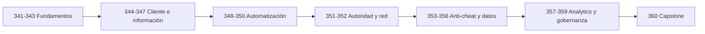

# Parte 19 — Seguridad de videojuegos, cheats y anti-cheat

Esta especialización aplica memoria, reversing, redes, detección, estadística, ML y respuesta a incidentes a una pregunta concreta: **¿qué confianza permite una ventaja ilegítima y cómo se corrige sin convertir una señal en culpabilidad?** No repite las Partes 5–9; las usa para razonar sobre un cliente controlado por el jugador, un servidor que decide estado y una operación anti-cheat que también debe ser segura, privada y auditable.

## Resultado profesional

Al terminar, el estudiante puede construir un threat model, reproducir un abuso solo en el target propio, diseñar autoridad e invariantes, crear telemetría minimizada, evaluar reglas/estadística/ML, investigar falsos positivos, ejecutar RCA y entregar una corrección con regresión e informe ejecutivo.

## Prerrequisitos y tiempo

Se recomiendan 023–024, 026–027, 116–140, 141–160, 182, 199, 201–220, 298 y Python. Son **40 horas guiadas** (20 × 120 min), más 20–30 horas de práctica y capstone.

## Bloques de progresión

1. **Fundamentos y superficie de ataque (341–343):** activos, arquitectura y taxonomía.
2. **Cliente, memoria e información (344–347):** estado, trainers, ESP y rendering.
3. **Automatización de apuntado y juego (348–350):** matemática, predicción y bots.
4. **Multiplayer y protocolo (351–352):** autoridad, ticks, replay y reconciliación.
5. **Anti-cheat y observabilidad (353–356):** capas, prevención, eventos y comportamiento.
6. **Analytics, IA y gobernanza (357–359):** estadística, ML, privacidad y sanciones.
7. **Capstone (360):** incidente completo con RCA y regresión.

```mermaid
flowchart LR
  F[341-343 Fundamentos] --> C[344-347 Cliente e información]
  C --> A[348-350 Automatización]
  A --> N[351-352 Autoridad y red]
  N --> D[353-356 Anti-cheat y datos]
  D --> G[357-359 Analytics y gobernanza]
  G --> P[360 Capstone]
```

La progresión avanza de **qué se protege** a **por qué puede romperse**, luego a **cómo se observa sin sobrerreaccionar** y finalmente a **cómo se elimina la causa**. Cada bloque entrega evidencia reutilizada por el siguiente: el threat model fija supuestos; el rango produce eventos; la detección genera hipótesis; estadística y gobernanza limitan la decisión; el capstone demuestra cierre.

## Guía clase por clase

| Capítulo enlazado | Descripción y recorrido causal | Evidencia |
|---|---|---|
| **[Clase 341 — Introducción a Game Security y modelo de amenazas](./341-introduccion-game-security-modelo-amenazas/README.md)** | Activos, adversarios y fairness → Trust boundaries y threat model | Evidencia reproducible del rango |
| **[Clase 342 — Arquitectura de videojuegos desde la perspectiva de seguridad](./342-arquitectura-videojuegos-perspectiva-seguridad/README.md)** | Game loop y entidades → Networking, persistencia y autoridad | Evidencia reproducible del rango |
| **[Clase 343 — Taxonomía técnica de cheats](./343-taxonomia-tecnica-cheats/README.md)** | Estado, recursos y movimiento → Automatización conductual y señales | Evidencia reproducible del rango |
| **[Clase 344 — Estado del juego, memoria y manipulación controlada](./344-estado-juego-memoria-manipulacion-controlada/README.md)** | Representación y lifetime → Estado local frente a autoritativo | Evidencia reproducible del rango |
| **[Clase 345 — Trainers e instrumentación del cliente](./345-trainers-instrumentacion-cliente/README.md)** | Observación, modificación y freeze → Comparación vulnerable/autoritativa | Evidencia reproducible del rango |
| **[Clase 346 — Información expuesta, radar, ESP y world-to-screen](./346-informacion-expuesta-radar-esp-world-to-screen/README.md)** | Entidades y coordenadas → Minimización de información | Evidencia reproducible del rango |
| **[Clase 347 — Rendering, visibilidad, occlusion y wallhack](./347-rendering-visibilidad-occlusion-wallhack/README.md)** | Pipeline y depth buffer → Demostración y defensa | Evidencia reproducible del rango |
| **[Clase 348 — Matemática de un aimbot](./348-matematica-aimbot/README.md)** | Vector2/Vector3 y normalización → Line-of-sight y experimento | Evidencia reproducible del rango |
| **[Clase 349 — Aimbot avanzado, predicción, smoothing y recoil](./349-aimbot-avanzado-prediccion-smoothing-recoil/README.md)** | Velocidad, proyectil y tiempo de vuelo → Recoil, spread y señales | Evidencia reproducible del rango |
| **[Clase 350 — Triggerbot, macros, input automation y bots](./350-triggerbot-macros-input-automation-bots/README.md)** | Decisión de disparo y timing → Legítimo, asistivo y abusivo | Evidencia reproducible del rango |
| **[Clase 351 — Multiplayer y autoridad: nunca confiar en el cliente](./351-multiplayer-autoridad-nunca-confiar-cliente/README.md)** | Client-authoritative vs server-authoritative → Predicción, corrección e invariantes | Evidencia reproducible del rango |
| **[Clase 352 — Seguridad del protocolo de juego](./352-seguridad-protocolo-juego/README.md)** | TCP, UDP, WebSocket y ticks → Replay, reorder e invalid state | Evidencia reproducible del rango |
| **[Clase 353 — Arquitecturas Anti-Cheat](./353-arquitecturas-anticheat/README.md)** | Defensa por capas → Privacidad, privilegio y enforcement | Evidencia reproducible del rango |
| **[Clase 354 — Server-side Anti-Cheat y diseño autoritativo](./354-server-side-anticheat-diseno-autoritativo/README.md)** | Invariants y sanity checks → Reconciliación y regression tests | Evidencia reproducible del rango |
| **[Clase 355 — Telemetría para Game Security](./355-telemetria-game-security/README.md)** | Schema y versionado → Minimización y reproducibilidad | Evidencia reproducible del rango |
| **[Clase 356 — Detección de aimbot y automatización por comportamiento](./356-deteccion-aimbot-automatizacion-comportamiento/README.md)** | Datasets controlados → Trayectoria, disparo y cambio de target | Evidencia reproducible del rango |
| **[Clase 357 — Estadística, anomalías y falsos positivos](./357-estadistica-anomalias-falsos-positivos/README.md)** | Centro, dispersión y percentiles → Precision, recall y errores | Evidencia reproducible del rango |
| **[Clase 358 — Machine Learning aplicado a Anti-Cheat](./358-machine-learning-aplicado-anticheat/README.md)** | Features y normalización → Drift, adaptación y explainability | Evidencia reproducible del rango |
| **[Clase 359 — Privacidad, gobernanza, sanciones y seguridad del propio Anti-Cheat](./359-privacidad-gobernanza-sanciones-seguridad-anticheat/README.md)** | Minimización y transparencia → Proporcionalidad y auditabilidad | Evidencia reproducible del rango |
| **[Clase 360 — Capstone: incidente completo de Game Security](./360-capstone-incidente-completo-game-security/README.md)** | Threat model y reproducción → RCA, mitigación, regresión e informe | Evidencia reproducible del rango |

## Cómo recorrer la parte

Lee la explicación, interpreta el diagrama y ejecuta el laboratorio antes del reto. Conserva un cuaderno con comando, versión, semilla, evento, decisión y limitación. Todos los experimentos ofensivos se restringen al [Game Security Range](../../labs/game-security/README.md); los componentes invasivos se estudian arquitectónicamente y no se implementan.

## Roles y separación de responsabilidades

Esta parte habilita dos salidas principales: [Game Security / Anti-Cheat Engineer](../../rutas/game-security-engineer.md), que construye autoridad, telemetría y controles; y [Game Integrity / Anti-Cheat Analyst](../../rutas/game-integrity-analyst.md), que investiga señales, falsos positivos y casos. Gameplay/backend, Data/ML, Trust & Safety, privacidad/legal y SOC/DFIR conservan responsabilidades distintas. El [modelo operativo de Game Security](../../docs/modelo-operativo-game-security.md) documenta esas fronteras, los entregables y quién puede proponer, revisar o aplicar una sanción.

La separación importa: quien crea una detección no debe tratar automáticamente su salida como veredicto. Toda decisión necesita política aplicable, evidencia contextual, revisión proporcionada, trazabilidad y apelación.

## Anatomía y evaluación

Cada clase incluye objetivo, resultados verificables, temas, explicación causal, diagrama interpretado, definiciones, glosario, preparación, laboratorio, ejercicios, reto con aceptación, errores, FAQ y fuentes. La evidencia de bloque culmina en un paquete profesional: threat model, reglas del servidor, dataset documentado, evaluación de falsos positivos, ficha de privacidad y reporte de incidente.

## Después de terminar

Continúa con la ruta [Game Security Engineer / Anti-Cheat Engineer](../../rutas/game-security-engineer.md) o [Game Integrity / Anti-Cheat Analyst](../../rutas/game-integrity-analyst.md), resuelve la [autoevaluación](../../autoevaluaciones/README.md#parte-19--seguridad-de-videojuegos-cheats-y-anti-cheat), los [retos CTF](../../ctf/game-security/README.md) y presenta el capstone según el [examen final por rol](../../docs/examen-final-por-rol.md).

## Navegación

- [Índice completo](../README.md)
- [Parte 18](../parte-18-ia-aplicada-a-la-ciberseguridad/README.md)
