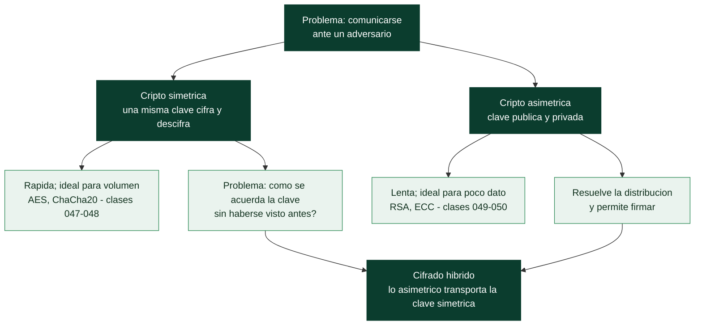

# Clase 046 — Historia y fundamentos de la criptografía

> Parte: **2 — Criptografía aplicada** · Fuente: *Serious Cryptography* (Aumasson) y *Cryptography Engineering* (Ferguson/Schneier/Kohno)
> ⏱️ Duración estimada: **90 min** · Nivel: **Fundamentos**

---

## 🎯 Objetivo

Comprender qué problemas resuelve la criptografía, cómo evolucionó de los cifrados clásicos (sustitución, transposición, Vigenère, Enigma) a la criptografía moderna, y asimilar los principios que rigen todo el resto de la parte: el principio de Kerckhoffs, el modelo de amenaza, la diferencia entre confidencialidad, integridad y autenticidad, y por qué "no inventes tu propia cripto".

## 📚 Resultados de aprendizaje

Al finalizar, el alumno podrá:

1. **Distinguir** los cuatro objetivos de seguridad: confidencialidad, integridad, autenticación y no repudio.
2. **Cifrar y descifrar** con cifrados clásicos (César, Vigenère) y explicar por qué son inseguros hoy.
3. **Aplicar** el principio de Kerckhoffs para evaluar la seguridad de un diseño.
4. **Describir** qué es un modelo de amenaza y por qué la seguridad depende de él.
5. **Justificar** por qué el secreto debe residir en la clave y no en el algoritmo.

## 🗺️ Temas

| # | Tema | Por qué importa |
|---|------|-----------------|
| 1 | Objetivos de la criptografía | Define qué se protege y contra qué |
| 2 | Cifrados clásicos (sustitución, transposición) | Base histórica y análisis de frecuencias |
| 3 | Vigenère y su ruptura (Kasiski) | Muestra cómo cae un cifrado "irrompible" |
| 4 | Enigma y la criptografía de la II Guerra Mundial | Origen del criptoanálisis moderno |
| 5 | Principio de Kerckhoffs | Fundamento del diseño abierto |
| 6 | Modelo de amenaza y del adversario | La seguridad es relativa al atacante |
| 7 | Cripto simétrica vs asimétrica (panorama) | Mapa de lo que viene en la parte |

## 🧠 Explicación en profundidad

### Dos operaciones, dos mil años y un mismo error repetido

Casi toda la criptografía anterior al siglo XX se construye con dos operaciones.
La **sustitución** reemplaza cada símbolo por otro (el cifrado del César desplaza tres
posiciones); la **transposición** mantiene los símbolos pero cambia su orden. Ninguna de
las dos destruye la estructura estadística del idioma, y ahí está su ruina: en español
la `e` y la `a` aparecen mucho más que la `x`, y una sustitución simple traslada esa
desigualdad al texto cifrado intacta. El **análisis de frecuencias**, descrito por
al-Kindi en el siglo IX, rompe cualquier sustitución monoalfabética con lápiz y papel.

**Vigenère** parecía la solución: usar varios alfabetos rotando según una clave, de modo
que la misma letra se cifre distinto según su posición. Durante tres siglos se le llamó
*le chiffre indéchiffrable*. Cayó con el **método de Kasiski**, que se apoya en una
observación sencilla: si la clave se repite, dos fragmentos idénticos del texto claro
separados por un múltiplo de la longitud de la clave producen el mismo cifrado. Midiendo
las distancias entre repeticiones se deduce la longitud de la clave, y a partir de ahí el
problema se descompone en varios cifrados de César independientes, cada uno resoluble por
frecuencias. La lección que atraviesa toda la parte es esa: **la repetición y la
estructura son el enemigo**, y volverás a verla en el modo ECB de la clase 047 y en la
reutilización de nonce de la 048.

### Kerckhoffs: la seguridad está en la clave, no en el secreto del diseño

En 1883 Auguste Kerckhoffs enunció el principio que separa la criptografía seria del
ilusionismo: **un sistema debe seguir siendo seguro aunque todo sobre él sea público,
excepto la clave**. No es una preferencia estética, es una consecuencia práctica. Los
diseños se filtran, se reversan y se descubren; si la seguridad dependía del secreto del
algoritmo, se derrumba entera el día que alguien lo publica. Y al revés: un algoritmo
abierto puede ser analizado por miles de criptógrafos durante años, y esa exposición es
lo único que genera confianza justificada. Lo contrario —la *seguridad por oscuridad*—
sigue apareciendo hoy cada vez que alguien "inventa su propio cifrado", y es la razón por
la que la regla profesional es tajante: **no diseñes tu propia criptografía**.

Enigma ilustra el principio por la vía dolorosa. Su diseño era conocido, y aun así su
espacio de claves era enorme; lo que la rompió no fue la matemática pura sino los fallos
de operación —mensajes con formato previsible, claves repetidas, un rotor que nunca
cifraba una letra en sí misma— explotados con máquinas en Bletchley Park. Es la primera
demostración a escala de que **el eslabón débil suele ser la implementación y el
procedimiento, no la primitiva**, que es exactamente la tesis de las clases 060 y 065.

### El modelo de amenaza: "seguro" no significa nada por sí solo

Preguntar si un cifrado es seguro sin decir *contra quién* es una pregunta vacía. La
criptografía moderna define siempre las capacidades del adversario: qué puede ver, qué
puede pedir y cuánto puede computar. Un cifrado que resiste a alguien que solo ve texto
cifrado puede caer ante alguien que puede elegir qué textos se cifran. Formalizar esos
escenarios es lo que se hace en la clase 061 con los modelos COA, KPA, CPA y CCA, y es lo
que permite afirmaciones precisas en lugar de eslóganes.



Ese esquema es el mapa de la parte entera: lo simétrico es rápido pero no resuelve cómo
ponerse de acuerdo en la clave; lo asimétrico resuelve el acuerdo pero es lento; y el
**cifrado híbrido** —usar lo asimétrico para transportar una clave simétrica— es la
síntesis que emplea TLS y prácticamente todo lo demás.

## 📖 Definiciones y características

- **Confidencialidad**: garantía de que solo las partes autorizadas leen el mensaje. Se logra con cifrado. Característica clave: no impide por sí sola la manipulación.
- **Integridad**: garantía de que el mensaje no fue alterado. Se logra con hashes y MAC. Característica: detecta cambios, no los previene.
- **Autenticación**: garantía del origen del mensaje o la identidad de una parte. Se logra con MAC y firmas.
- **Principio de Kerckhoffs**: un sistema debe ser seguro aunque todo sobre él, excepto la clave, sea público. Contrasta con "seguridad por oscuridad".
- **Modelo de amenaza**: descripción explícita de qué capacidades tiene el atacante (¿ve el texto cifrado? ¿elige textos? ¿tiene tiempo cuántico?).
- **Espacio de claves**: número total de claves posibles. Determina la resistencia a fuerza bruta (128 bits ≈ 3.4×10³⁸).
- **Texto plano / texto cifrado**: entrada legible y salida cifrada de un algoritmo.

## 📔 Glosario

| Término | Definición concisa |
|---------|--------------------|
| Texto claro / texto cifrado | Mensaje legible / resultado de cifrarlo |
| Sustitución | Reemplazar cada símbolo por otro |
| Transposición | Reordenar los símbolos sin cambiarlos |
| Cifrado de César | Sustitución por desplazamiento fijo del alfabeto |
| Análisis de frecuencias | Romper una sustitución explotando la estadística del idioma |
| Vigenère | Cifrado polialfabético con clave repetida |
| Método de Kasiski | Deduce la longitud de la clave por las repeticiones del cifrado |
| Enigma | Máquina de rotores alemana; rota por fallos de operación |
| Principio de Kerckhoffs | Todo puede ser público salvo la clave |
| Seguridad por oscuridad | Confiar en el secreto del diseño; anti-patrón |
| Modelo de amenaza | Descripción explícita de las capacidades del adversario |
| Criptografía simétrica | La misma clave cifra y descifra |
| Criptografía asimétrica | Par de claves: pública y privada |
| Cifrado híbrido | Lo asimétrico transporta la clave simétrica |

## 🧰 Herramientas y preparación

Trabajaremos en un entorno de laboratorio aislado (máquina virtual o contenedor propio). Herramientas:

```bash
# Python 3 con utilidades estándar; opcional pycipher para clásicos
python3 --version
pip install pycipher

# OpenSSL para comprobar tamaños de clave más adelante
openssl version
```

No se requiere red externa. Todos los ejercicios son locales.

## 🧪 Laboratorio guiado

1. **Cifrado César en Python**. Implementa un desplazamiento y verifica que el espacio de claves (25) es trivial de romper:

   ```python
   def cesar(texto, k):
       return ''.join(
           chr((ord(c) - 65 + k) % 26 + 65) if c.isalpha() else c
           for c in texto.upper()
       )
   print(cesar("ATAQUE AL AMANECER", 3))
   ```

2. **Fuerza bruta**. Recorre las 26 claves e imprime todas las salidas; observa que un humano identifica la correcta al instante.

3. **Análisis de frecuencias**. Cuenta la frecuencia de cada letra en un texto cifrado por sustitución y compárala con la distribución del español (la `E` y la `A` dominan). Deduce el mapeo.

4. **Vigenère y Kasiski**. Cifra un texto largo con clave `SEGURIDAD`. Busca repeticiones de trigramas y mide las distancias; el máximo común divisor sugiere la longitud de la clave, rompiendo la ilusión de seguridad.

5. **Discusión de Kerckhoffs**. Toma un "algoritmo secreto" inventado y argumenta por qué su secreto no puede sostenerse: se filtra, se aplica ingeniería inversa, no se audita.

## ✍️ Ejercicios

1. Descifra a mano `WKLV LV D WHVW` sabiendo que es César.
2. Escribe una función que rompa Vigenère dada la longitud de clave.
3. Redacta un modelo de amenaza para una app de chat: define atacante, capacidades y activos.
4. Explica con un ejemplo por qué la "seguridad por oscuridad" falló en un caso real (p. ej. cifrados propietarios rotos).
5. Compara el espacio de claves de César, DES (56 bits) y AES-128; expresa cuántas veces mayor es cada uno.
6. Diseña un cifrado de transposición columnar y descíbelo con criptoanálisis.

## 📝 Reto verificable

Implementa un rompedor automático de cifrado por sustitución monoalfabética usando análisis de frecuencias y bigramas. **Criterio de aceptación**: dado un texto cifrado en español de al menos 500 caracteres, tu programa recupera al menos el 90 % del texto plano sin conocer la clave, mostrando el mapeo deducido.

## ⚠️ Errores comunes

| Síntoma / mensaje | Causa y cómo arreglar |
|-------------------|-----------------------|
| "Mi cifrado es seguro porque nadie conoce el algoritmo" | Viola Kerckhoffs; asume que el algoritmo se filtrará y basa la seguridad en la clave |
| Análisis de frecuencias no funciona | Texto demasiado corto; necesita muestra suficiente |
| Confundir codificación (Base64) con cifrado | Base64 no oculta nada; es reversible sin clave |
| "Doble ROT13 = más seguro" | ROT13 es su propia inversa; doble no cifra nada |
| Reusar clave de Vigenère en muchos mensajes | Facilita Kasiski y correlación entre textos |

## ❓ Preguntas frecuentes

**❓ ¿Sigue siendo útil estudiar cifrados clásicos?**
Sí: enseñan intuición sobre patrones, frecuencias y por qué las primitivas modernas están diseñadas para eliminar esas estructuras.

**❓ ¿Qué significa que un cifrado sea "seguro"?**
Que ningún atacante dentro del modelo de amenaza definido puede romperlo con recursos razonables. La seguridad siempre es relativa a un adversario concreto.

**❓ ¿Por qué "no hagas tu propia cripto"?**
Porque los errores sutiles (nonces, padding, timing) rompen esquemas que parecen correctos; usa librerías auditadas.

## 🔗 Referencias

- Aumasson, *Serious Cryptography*, cap. 1 — <https://nostarch.com/serious-cryptography-2nd-edition>
- Ferguson, Schneier, Kohno, *Cryptography Engineering*, cap. 1–2.
- Singh, *The Code Book* (divulgación histórica).
- NIST, "Cryptographic Standards and Guidelines" — <https://csrc.nist.gov/>

## 📥 Material descargable

- 📄 [Guía en PDF](./clase-046-guia.pdf) — versión imprimible de esta clase.
- 🎞️ [Presentación (PPTX)](./clase-046-presentacion.pptx) — deck para proyectar en clase.

## ⬅️ Clase anterior

[Clase 045 — NetFlow y análisis de metadatos de tráfico](../../parte-1-redes-y-seguridad-de-redes/045-netflow-y-analisis-de-metadatos-de-trafico/README.md)

## ➡️ Siguiente clase

[Clase 047 — Cifrado simétrico: AES y modos de operación](../047-cifrado-simetrico-aes-y-modos-de-operacion/README.md)
