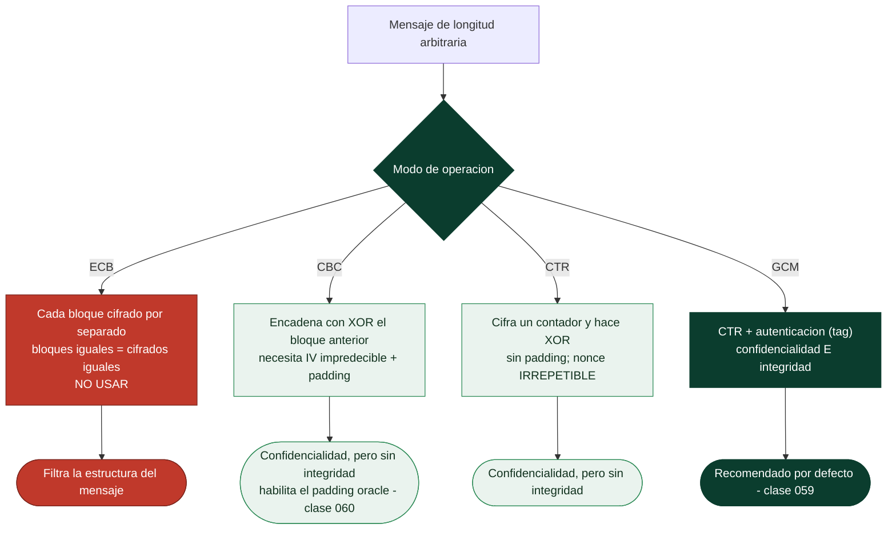

# Clase 047 — Cifrado simétrico: AES y modos de operación

> Parte: **2 — Criptografía aplicada** · Fuente: *Serious Cryptography* (Aumasson) y NIST FIPS 197 / SP 800-38A
> ⏱️ Duración estimada: **120 min** · Nivel: **Intermedio**

---

## 🎯 Objetivo

Dominar el cifrado simétrico moderno con AES: entender qué es un cifrado por bloques, cómo funciona AES a alto nivel (SubBytes, ShiftRows, MixColumns, AddRoundKey), y —lo más importante en la práctica— por qué el **modo de operación** determina la seguridad real. Verás en carne propia por qué ECB filtra estructura y por qué CBC, CTR y GCM se comportan de forma distinta.

## 📚 Resultados de aprendizaje

Al finalizar, el alumno podrá:

1. **Explicar** la estructura de un cifrado por bloques y el papel de la clave y del tamaño de bloque (128 bits en AES).
2. **Distinguir** los modos ECB, CBC, CTR y GCM y sus garantías.
3. **Demostrar** visualmente la fuga de información de ECB.
4. **Cifrar y descifrar** con OpenSSL y con la librería `cryptography` de Python usando IV/nonce correctos.
5. **Justificar** por qué GCM (AEAD) es la elección por defecto hoy.

## 🗺️ Temas

| # | Tema | Por qué importa |
|---|------|-----------------|
| 1 | Cifrado por bloques vs de flujo | Define cómo se procesan los datos |
| 2 | Interior de AES (rondas, S-box) | Entender la primitiva base |
| 3 | Modo ECB y su fallo | El error más didáctico de la cripto |
| 4 | Modo CBC e IV | Encadenamiento y aleatoriedad del IV |
| 5 | Modo CTR | Convierte un bloque en cifrado de flujo |
| 6 | Padding (PKCS#7) | Necesario en CBC; fuente de padding oracle |
| 7 | GCM / AEAD (adelanto) | Confidencialidad + integridad juntas |

## 🧠 Explicación en profundidad

### AES cifra 16 bytes; el modo decide qué pasa con los demás

Conviene separar dos cosas que se confunden constantemente. **AES es una primitiva de
bloque**: una permutación que, dada una clave, transforma exactamente 128 bits en otros
128 bits. Eso es todo lo que hace. Internamente aplica 10, 12 o 14 rondas (según la clave
sea de 128, 192 o 256 bits) de cuatro operaciones —`SubBytes` con su S-box no lineal,
`ShiftRows`, `MixColumns` y `AddRoundKey`— diseñadas para producir **confusión** (romper
la relación entre clave y cifrado) y **difusión** (que cambiar un bit de entrada afecte a
todo el bloque). AES lleva más de dos décadas de criptoanálisis público sin una rotura
práctica, y los procesadores modernos lo implementan en hardware (AES-NI).

Pero los mensajes reales no miden 16 bytes. El **modo de operación** es la receta que
dice cómo aplicar esa primitiva a un mensaje de longitud arbitraria, y **es ahí donde se
gana o se pierde la seguridad**. La primitiva está bien; los modos mal elegidos son la
causa de la mayoría de los desastres.

### ECB, o por qué la repetición delata

El modo **ECB** cifra cada bloque de forma independiente con la misma clave. Su
consecuencia es inmediata: **bloques de texto claro iguales producen bloques cifrados
iguales**. La estructura del mensaje sobrevive al cifrado, y el ejemplo canónico —la
imagen del pingüino Tux que sigue siendo perfectamente reconocible después de cifrarse
con ECB— es el mejor argumento pedagógico de toda la criptografía. Es exactamente el
mismo fallo que hundió a Vigenère en la clase anterior: **la repetición filtra
información**. ECB no debe usarse nunca para datos reales.

**CBC** lo arregla encadenando: cada bloque se combina con XOR con el bloque cifrado
anterior antes de cifrarse, de modo que bloques iguales producen cifrados distintos. Para
el primer bloque hace falta un **IV** (vector de inicialización), y aquí hay dos reglas
que no se negocian: el IV debe ser **impredecible y distinto en cada mensaje** —un IV fijo
devuelve a CBC al problema de ECB para los primeros bloques—, y **no es secreto**, se
envía junto al cifrado.

**CTR** cambia el enfoque: en lugar de cifrar los datos, cifra un contador para generar
un *keystream* que se combina con XOR con el texto claro. Eso convierte a AES en un
cifrado de flujo, permite paralelizar y acceder aleatoriamente, y elimina la necesidad de
relleno. A cambio hereda la regla de oro de los cifrados de flujo: **nunca repetir el par
(clave, nonce)**, algo que se desarrolla en la clase 048.



### Padding, y la puerta que abre

CBC exige que el mensaje sea múltiplo del tamaño de bloque, así que se rellena. **PKCS#7**
añade *n* bytes con el valor *n*: si faltan tres bytes, se añaden tres bytes `0x03`; y si
el mensaje ya es múltiplo exacto, se añade un bloque entero de relleno, para que el
descifrado siempre sepa cuánto quitar. Ese diseño es correcto, pero **si el sistema revela
si el relleno era válido o no** —con un mensaje de error distinto, o simplemente tardando
distinto— entrega un oráculo con el que se puede descifrar el mensaje entero sin conocer
la clave. Es el **padding oracle** de la clase 060.

La conclusión práctica que ordena todo lo anterior: CBC y CTR dan **confidencialidad pero
no integridad**, es decir, impiden leer pero no impiden que un atacante altere el cifrado.
Por eso el consejo moderno es no elegir entre estos modos en absoluto, sino usar
directamente un modo **AEAD** como GCM, que cifra y autentica en una sola operación
(clase 059).

## 📖 Definiciones y características

- **AES (Advanced Encryption Standard)**: cifrado por bloques de 128 bits con claves de 128/192/256 bits (FIPS 197). Rápido en hardware (AES-NI).
- **Modo de operación**: forma de aplicar un cifrado por bloques a mensajes de tamaño arbitrario. Característica: sin un buen modo, AES es inseguro.
- **IV (vector de inicialización)**: valor aleatorio que aleatoriza el cifrado en CBC/CTR. Nunca debe repetirse con la misma clave.
- **ECB (Electronic Codebook)**: cifra cada bloque independientemente. Bloques iguales → cifrados iguales. **Nunca usar.**
- **CBC (Cipher Block Chaining)**: encadena bloques con XOR del cifrado anterior; requiere IV aleatorio e impredecible.
- **CTR (Counter)**: cifra un contador y hace XOR con el texto; convierte AES en cifrado de flujo, paralelizable.
- **Padding PKCS#7**: relleno para completar el último bloque; su verificación insegura habilita padding oracle.

## 📔 Glosario

| Término | Definición concisa |
|---------|--------------------|
| Cifrado por bloques | Primitiva que transforma bloques de tamaño fijo (AES: 128 bits) |
| AES | *Advanced Encryption Standard*; claves de 128, 192 o 256 bits |
| Ronda | Repetición de las operaciones internas de AES (10, 12 o 14) |
| S-box | Tabla de sustitución no lineal; aporta confusión |
| Confusión / difusión | Ocultar la relación con la clave / propagar cada bit de entrada |
| AES-NI | Instrucciones de CPU que implementan AES en hardware |
| Modo de operación | Receta para aplicar la primitiva a mensajes largos |
| ECB | Cada bloque por separado; filtra la estructura. No usar |
| CBC | Encadenamiento por XOR con el cifrado anterior |
| IV | Vector de inicialización; impredecible, único y **no** secreto |
| CTR | Cifra un contador para generar keystream; convierte AES en flujo |
| Keystream | Flujo pseudoaleatorio que se combina con XOR con el mensaje |
| PKCS#7 | Relleno que añade *n* bytes con el valor *n* |
| Padding oracle | Fuga que revela si el relleno era válido; permite descifrar |
| AEAD | Cifrado autenticado: confidencialidad **e** integridad juntas |

## 🧰 Herramientas y preparación

```bash
openssl version
pip install cryptography pillow
```

Trabaja siempre en tu propia máquina de laboratorio; el objetivo es entender, no atacar sistemas ajenos.

## 🧪 Laboratorio guiado

1. **Cifra un archivo con ECB y CBC en OpenSSL** y compara:

   ```bash
   openssl enc -aes-128-ecb -in mensaje.txt -out ecb.bin -K 00112233445566778899aabbccddeeff -nosalt
   openssl enc -aes-128-cbc -in mensaje.txt -out cbc.bin \
       -K 00112233445566778899aabbccddeeff -iv 0102030405060708090a0b0c0d0e0f10
   ```

2. **Fuga visual de ECB**. Convierte una imagen a formato crudo, cífrala con ECB y vuelve a interpretarla como imagen: el patrón original (el famoso pingüino Tux) sigue visible. Repite con CBC y observa el ruido uniforme.

3. **AES-CBC en Python** con IV aleatorio:

   ```python
   import os
   from cryptography.hazmat.primitives.ciphers import Cipher, algorithms, modes
   from cryptography.hazmat.primitives import padding
   key, iv = os.urandom(16), os.urandom(16)
   pad = padding.PKCS7(128).padder()
   data = pad.update(b"ataque al amanecer") + pad.finalize()
   ct = Cipher(algorithms.AES(key), modes.CBC(iv)).encryptor().update(data)
   print(ct.hex())
   ```

4. **AES-CTR**. Repite con `modes.CTR(nonce)` y verifica que no necesita padding.

5. **Reflexión sobre integridad**. Modifica un byte del texto cifrado CBC y descífralo: obtienes basura pero *no hay error*. Concluye que CBC no protege integridad → necesitas GCM.

## ✍️ Ejercicios

1. Explica por qué ECB revela si dos bloques de texto plano son iguales.
2. ¿Qué ocurre si reutilizas el mismo IV en CBC para dos mensajes distintos?
3. Implementa cifrado/descifrado AES-CTR y comprueba que `E(k)⊕E(k)=texto`.
4. Mide con `openssl speed aes-128-cbc` el rendimiento con y sin AES-NI.
5. Convierte una imagen BMP a ECB y documenta la fuga con capturas.
6. Argumenta por qué CTR permite acceso aleatorio a bloques y CBC no.

## 📝 Reto verificable

Escribe un script que cifre la misma imagen BMP con ECB y con CBC y genere las dos salidas visualizables. **Criterio de aceptación**: la versión ECB muestra claramente la silueta original y la CBC es indistinguible de ruido; documenta ambas con la explicación de por qué ocurre.

## ⚠️ Errores comunes

| Síntoma / mensaje | Causa y cómo arreglar |
|-------------------|-----------------------|
| `bad decrypt` en OpenSSL | Clave/IV/modo incorrectos o padding no coincide |
| Imagen ECB revela contenido | Comportamiento esperado; nunca uses ECB en producción |
| IV fijo o cero en CBC | Rompe la aleatoriedad; genera IV con CSPRNG por mensaje |
| Cifrar sin autenticar (CBC solo) | Sin integridad; usa AES-GCM |
| Reutilizar nonce en CTR | Fuga catastrófica (dos textos con el mismo keystream) |

## ❓ Preguntas frecuentes

**❓ ¿AES-256 es "el doble de seguro" que AES-128?**
No; ambos son inquebrantables por fuerza bruta. 256 aporta margen post-cuántico, pero el modo importa mucho más que el tamaño de clave.

**❓ ¿Qué modo debo usar?**
AES-GCM o ChaCha20-Poly1305 (AEAD). Evita ECB siempre; CBC/CTR solo con un MAC añadido y hecho correctamente.

**❓ ¿El IV debe ser secreto?**
No, pero sí impredecible (CBC) o único (CTR/GCM). Se transmite junto al texto cifrado.

## 🔗 Referencias

- NIST FIPS 197 (AES) — <https://csrc.nist.gov/publications/detail/fips/197/final>
- NIST SP 800-38A (modos) — <https://csrc.nist.gov/publications/detail/sp/800-38a/final>
- Aumasson, *Serious Cryptography*, cap. 4.
- Documentación `cryptography` (Python) — <https://cryptography.io/>

## 📥 Material descargable

- 📄 [Guía en PDF](./clase-047-guia.pdf) — versión imprimible de esta clase.
- 🎞️ [Presentación (PPTX)](./clase-047-presentacion.pptx) — deck para proyectar en clase.

## ⬅️ Clase anterior

[Clase 046 — Historia y fundamentos de la criptografía](../046-historia-y-fundamentos-de-la-criptografia/README.md)

## ➡️ Siguiente clase

[Clase 048 — Cifrado de flujo: ChaCha20 y por qué evitar RC4](../048-cifrado-de-flujo-chacha20-y-por-que-evitar-rc4/README.md)
