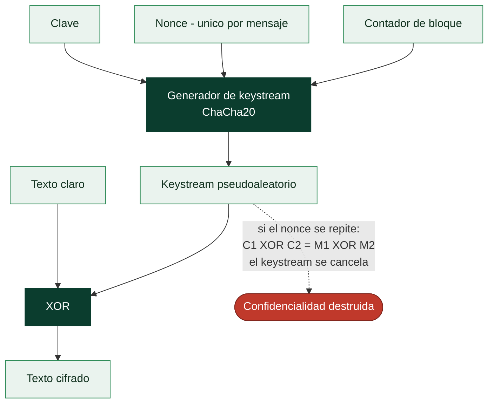

# Clase 048 — Cifrado de flujo: ChaCha20 y por qué evitar RC4

> Parte: **2 — Criptografía aplicada** · Fuente: *Real-World Cryptography* (Wong) e IETF RFC 8439
> ⏱️ Duración estimada: **90 min** · Nivel: **Intermedio**

---

## 🎯 Objetivo

Entender qué es un cifrado de flujo, cómo genera un *keystream* que se combina por XOR con el texto plano, y por qué ChaCha20 (junto a Poly1305) es hoy el cifrado de flujo recomendado, mientras que RC4 está prohibido en TLS por sus sesgos estadísticos explotables. El alumno interiorizará la regla de oro: **nunca reutilizar un par (clave, nonce)**.

## 📚 Resultados de aprendizaje

Al finalizar, el alumno podrá:

1. **Explicar** el modelo XOR keystream de los cifrados de flujo.
2. **Describir** la estructura de ChaCha20 (estado de 512 bits, quarter-round, contador y nonce).
3. **Enumerar** las debilidades de RC4 y por qué se retiró de TLS.
4. **Cifrar** con ChaCha20 en Python y verificar la simetría del XOR.
5. **Demostrar** el desastre de reutilizar un nonce mediante XOR de dos textos.

## 🗺️ Temas

| # | Tema | Por qué importa |
|---|------|-----------------|
| 1 | Cifrado de flujo vs de bloque | Elección según latencia y hardware |
| 2 | Keystream y XOR | Base de todo cifrado de flujo |
| 3 | ChaCha20 internamente | El estándar moderno (móviles sin AES-NI) |
| 4 | Nonce y contador | Unicidad obligatoria |
| 5 | RC4 y sus sesgos | Lección histórica de fallo |
| 6 | Reutilización de nonce | El error catastrófico |
| 7 | ChaCha20-Poly1305 (adelanto AEAD) | Confidencialidad + integridad |

## 🧠 Explicación en profundidad

### Un cifrado de flujo es una máquina de generar keystream

La idea es minimalista y por eso frágil: generar a partir de la clave un flujo
pseudoaleatorio —el **keystream**— y combinarlo con el texto claro mediante **XOR**. El
descifrado es la misma operación, porque `(M ⊕ K) ⊕ K = M`. Toda la seguridad recae
entonces en una sola propiedad: que el keystream sea **indistinguible de aleatorio** y
que **nunca se reutilice**.

El ideal teórico existe y es el *one-time pad*: si el keystream es verdaderamente
aleatorio, tan largo como el mensaje y se usa una sola vez, el cifrado es
demostrablemente irrompible. Es inútil en la práctica porque distribuir una clave tan
larga como el mensaje es el mismo problema que se quería resolver. Los cifrados de flujo
reales son la aproximación práctica: expanden una clave corta en un keystream largo con
un generador determinista.

### Reutilizar el nonce es la catástrofe, y es fácil de razonar

Si dos mensajes se cifran con el mismo keystream, un atacante que capture ambos puede
hacer XOR entre los cifrados y **el keystream se cancela**: `(M₁ ⊕ K) ⊕ (M₂ ⊕ K) = M₁ ⊕
M₂`. Le queda el XOR de dos textos claros, que se separa con análisis estadístico y
palabras probables. Y no hace falta ni eso: si conoce uno de los mensajes, obtiene el
otro directamente. Por eso todo cifrado de flujo (y el modo CTR de la clase anterior)
lleva un **nonce** —*number used once*— junto a la clave: para que el keystream sea
distinto en cada mensaje aunque la clave se mantenga.

La regla es absoluta: **el par (clave, nonce) no debe repetirse jamás**. En la práctica se
garantiza con un contador que nunca retrocede o con un nonce aleatorio suficientemente
largo (los 192 bits de XChaCha20 lo hacen seguro incluso eligiéndolo al azar; los 96 bits
de ChaCha20 estándar o de AES-GCM invitan a llevar contador). Este es el fallo que rompió
WEP en las redes WiFi y el que hace tan peligroso restaurar una máquina virtual desde un
*snapshot* sin renovar el estado del nonce.



### ChaCha20 frente a RC4: cómo se ve un buen diseño al lado de uno malo

**RC4** fue durante años el cifrado de flujo más usado del mundo (SSL, WEP, WPA-TKIP), y
su historia es un caso de estudio. Su keystream tenía **sesgos estadísticos**: ciertos
bytes aparecían con probabilidad ligeramente distinta a la uniforme, y esa desviación
mínima, acumulada sobre millones de sesiones que cifran el mismo dato (una cookie de
sesión, por ejemplo), permitió recuperarlo. RC4 está prohibido en TLS desde 2015. La
lección no es que RC4 fuera torpe, sino que **en criptografía un sesgo diminuto acaba
siendo explotable**, y que la migración fuera de una primitiva rota tarda años.

**ChaCha20**, de Daniel J. Bernstein, es el reemplazo moderno. Se construye con
operaciones ARX —suma, rotación y XOR— que son rápidas en software puro y, crucialmente,
se ejecutan en **tiempo constante** por naturaleza, sin tablas dependientes de la clave y
por tanto sin los canales laterales por caché que complican implementar AES en software.
Esa es la razón concreta de que en un móvil sin aceleración AES-NI, ChaCha20-Poly1305 sea
más rápido *y* más seguro de implementar que AES-GCM, y de que Google lo impulsara para
TLS móvil. Como en el resto de la parte, el cifrado de flujo por sí solo no aporta
integridad: la construcción que de verdad se usa es **ChaCha20-Poly1305**, el AEAD de la
clase 059.

## 📖 Definiciones y características

- **Cifrado de flujo**: genera un keystream pseudoaleatorio y lo combina por XOR con el texto. Característica: cifrado byte a byte, sin padding.
- **Keystream**: secuencia pseudoaleatoria derivada de (clave, nonce, contador). Debe ser único por mensaje.
- **ChaCha20**: cifrado de flujo de Daniel Bernstein con 20 rondas ARX (add-rotate-xor). Rápido en software y resistente a timing.
- **Nonce**: número usado una sola vez. En ChaCha20 (RFC 8439) mide 96 bits. Repetirlo con la misma clave es fatal.
- **RC4**: cifrado de flujo antiguo con fuertes sesgos en los primeros bytes del keystream; explotado en ataques a TLS/WEP. **Obsoleto.**
- **XOR malleability**: cambiar un bit del cifrado cambia el mismo bit del plano; por eso el cifrado de flujo necesita un MAC.

## 📔 Glosario

| Término | Definición concisa |
|---------|--------------------|
| Cifrado de flujo | Genera keystream y lo combina con XOR con el mensaje |
| Keystream | Flujo pseudoaleatorio derivado de clave y nonce |
| XOR | Operación reversible: `(M ⊕ K) ⊕ K = M` |
| One-time pad | Keystream verdaderamente aleatorio y de un solo uso; irrompible |
| Nonce | *Number used once*; hace único el keystream de cada mensaje |
| Reutilización de nonce | Cancela el keystream y destruye la confidencialidad |
| ChaCha20 | Cifrado de flujo moderno basado en operaciones ARX |
| ARX | Suma, rotación y XOR; rápidas y en tiempo constante |
| XChaCha20 | Variante con nonce de 192 bits; seguro elegirlo al azar |
| Poly1305 | Autenticador que acompaña a ChaCha20 para formar un AEAD |
| RC4 | Cifrado de flujo obsoleto; keystream con sesgos explotables |
| Sesgo estadístico | Desviación de la uniformidad que acaba siendo explotable |
| WEP | Cifrado WiFi roto en parte por reutilización de nonce |
| Tiempo constante | Ejecución cuyo tiempo no depende de datos secretos |

## 🧰 Herramientas y preparación

```bash
pip install cryptography
openssl version   # openssl enc no soporta ChaCha20 directamente; usa Python o TLS
```

Entorno local. La reutilización de nonce se practica solo sobre datos propios de laboratorio.

## 🧪 Laboratorio guiado

1. **ChaCha20 básico en Python**:

   ```python
   import os
   from cryptography.hazmat.primitives.ciphers import Cipher, algorithms
   key = os.urandom(32)
   nonce = os.urandom(16)  # 16 bytes para la primitiva raw de cryptography
   enc = Cipher(algorithms.ChaCha20(key, nonce), mode=None).encryptor()
   ct = enc.update(b"mensaje secreto")
   print(ct.hex())
   ```

2. **Verifica la simetría del XOR**: descifra reusando la misma clave y nonce y recupera el texto.

3. **Ataque de nonce reutilizado (laboratorio propio)**. Cifra `m1` y `m2` con la **misma** clave y nonce. Calcula `c1 XOR c2 = m1 XOR m2`. Si conoces parte de `m1`, recuperas la parte correspondiente de `m2`. Documenta cómo se filtra información sin conocer la clave.

4. **Sesgo de RC4 (demostración estadística)**. Genera muchos keystreams RC4 con claves aleatorias y grafica la frecuencia del segundo byte: verás que no es uniforme (sesgo de Fluhrer-McGrew), la base de los ataques prácticos.

5. **Comparación de rendimiento**. Mide ChaCha20 vs AES-CTR en tu CPU; en dispositivos sin AES-NI ChaCha20 suele ganar.

## ✍️ Ejercicios

1. Explica por qué un cifrado de flujo no necesita padding.
2. Demuestra matemáticamente por qué `c1 XOR c2 = m1 XOR m2` con nonce repetido.
3. Investiga el ataque a WEP y qué papel jugó RC4.
4. ¿Por qué ChaCha20 es preferible en móviles frente a AES sin aceleración hardware?
5. Modifica un byte de un cifrado ChaCha20 y observa el efecto en el descifrado.
6. Explica qué añade Poly1305 que ChaCha20 solo no ofrece.

## 📝 Reto verificable

Implementa el ataque de "nonce reutilizado": dados dos textos cifrados con la misma clave y nonce y conocido parcialmente uno de ellos (crib dragging), recupera el otro. **Criterio de aceptación**: recuperas al menos el fragmento de texto plano solapado con la porción conocida, sin usar la clave.

## ⚠️ Errores comunes

| Síntoma / mensaje | Causa y cómo arreglar |
|-------------------|-----------------------|
| Textos correlacionados | Nonce reutilizado; genera nonce único por mensaje |
| Uso de RC4 en configuración TLS | Prohibido (RFC 7465); deshabilítalo |
| Nonce de tamaño incorrecto | Ajusta a lo que exige la librería (12 o 16 bytes) |
| Cifrado sin MAC | XOR malleable; usa ChaCha20-Poly1305 |
| Contador desbordado | No reuses claves más allá del límite del contador |

## ❓ Preguntas frecuentes

**❓ ¿ChaCha20 es más seguro que AES?**
Ambos son seguros. ChaCha20 destaca en software y resistencia a timing; AES gana con aceleración hardware.

**❓ ¿Puedo usar el mismo nonce si cambio la clave?**
Sí; lo prohibido es repetir el par (clave, nonce). Un nonce por clave es único de forma segura.

**❓ ¿Por qué se sigue viendo RC4 en sistemas viejos?**
Legado. Debe deshabilitarse; TLS moderno lo prohíbe.

## 🔗 Referencias

- IETF RFC 8439 (ChaCha20-Poly1305) — <https://www.rfc-editor.org/rfc/rfc8439>
- IETF RFC 7465 (prohibición de RC4) — <https://www.rfc-editor.org/rfc/rfc7465>
- Wong, *Real-World Cryptography*, cap. 3–4.
- Bernstein, "ChaCha, a variant of Salsa20" — <https://cr.yp.to/chacha.html>

## 📥 Material descargable

- 📄 [Guía en PDF](./clase-048-guia.pdf) — versión imprimible de esta clase.
- 🎞️ [Presentación (PPTX)](./clase-048-presentacion.pptx) — deck para proyectar en clase.

## ⬅️ Clase anterior

[Clase 047 — Cifrado simétrico: AES y modos de operación](../047-cifrado-simetrico-aes-y-modos-de-operacion/README.md)

## ➡️ Siguiente clase

[Clase 049 — Cifrado asimétrico: RSA](../049-cifrado-asimetrico-rsa/README.md)
