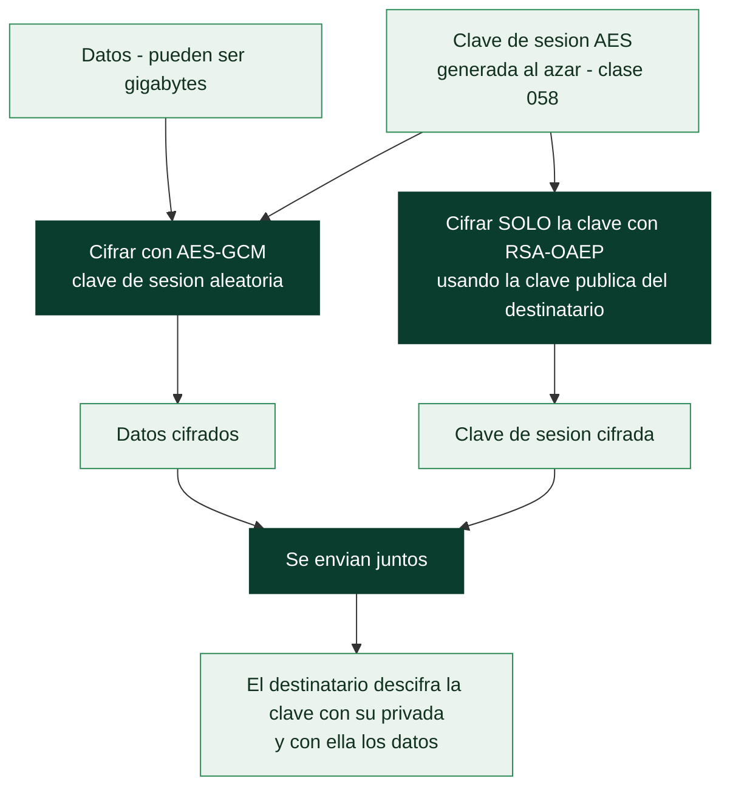

# Clase 049 — Cifrado asimétrico: RSA

> Parte: **2 — Criptografía aplicada** · Fuente: *Serious Cryptography* (Aumasson) y *A Graduate Course in Applied Cryptography* (Boneh/Shoup)
> ⏱️ Duración estimada: **120 min** · Nivel: **Intermedio**

---

## 🎯 Objetivo

Comprender la criptografía de clave pública a través de RSA: cómo se genera un par de claves a partir de dos primos grandes, en qué problema matemático se apoya su seguridad (factorización), y por qué RSA "de libro" (textbook) es inseguro y debe usarse con padding OAEP para cifrado y PSS para firma. El alumno generará claves con OpenSSL y verá el porqué de cada decisión.

## 📚 Resultados de aprendizaje

Al finalizar, el alumno podrá:

1. **Explicar** el funcionamiento de RSA: generación, cifrado, descifrado con aritmética modular.
2. **Justificar** por qué la seguridad depende de la dificultad de factorizar `n`.
3. **Generar** claves RSA con OpenSSL y examinar sus componentes.
4. **Distinguir** RSA textbook (inseguro) de RSA-OAEP y RSA-PSS.
5. **Argumentar** por qué RSA cifra claves de sesión y no datos grandes.

## 🗺️ Temas

| # | Tema | Por qué importa |
|---|------|-----------------|
| 1 | Idea de clave pública/privada | Resuelve la distribución de claves |
| 2 | Matemática de RSA (n, e, d, φ) | Fundamento del algoritmo |
| 3 | Problema de la factorización | Base de la seguridad |
| 4 | RSA textbook y sus fallos | Determinista y maleable |
| 5 | Padding OAEP | Cifrado seguro |
| 6 | Firma con PSS | Firma segura (se amplía en clase 054) |
| 7 | Cifrado híbrido | RSA envuelve una clave AES |

## 🧠 Explicación en profundidad

### El problema que la clave pública resuelve

Toda la criptografía simétrica arrastra un problema logístico insalvable: para hablar en
secreto hay que compartir antes una clave, y compartirla exige un canal seguro que es
justo lo que no se tiene. Peor aún, con *n* participantes hacen falta *n(n−1)/2* claves
distintas. La criptografía de clave pública (Diffie y Hellman, 1976; RSA, 1977) rompe ese
nudo con una idea contraintuitiva: **dos claves relacionadas matemáticamente, una
publicable y otra secreta**, de modo que lo que cifra una solo lo descifra la otra. Ya no
hay que acordar nada en privado; basta con publicar la clave pública.

### Por qué RSA funciona, en cuatro pasos

La construcción se apoya en una **función unidireccional con trampilla**: multiplicar dos
primos grandes es trivial, factorizar su producto es inviable, pero quien conoce los
factores puede invertir la operación. En concreto: se eligen dos primos grandes `p` y `q`
y se calcula `n = p·q`; se calcula la función de Euler `φ(n) = (p−1)(q−1)`; se elige un
exponente público `e` coprimo con `φ(n)` —casi siempre 65537—; y se obtiene `d`, el
inverso de `e` módulo `φ(n)`. La clave pública es `(n, e)` y la privada es `(n, d)`.
Cifrar es `c = mᵉ mod n` y descifrar es `m = cᵈ mod n`.

La seguridad descansa por completo en que **factorizar `n` sea inviable**: quien obtenga
`p` y `q` calcula `φ(n)` y de ahí `d` de inmediato. De ahí que los tamaños hayan tenido
que crecer —1024 bits está obsoleto, 2048 es el mínimo actual y 3072 o 4096 lo
recomendable a largo plazo— y de ahí también que RSA sea el objetivo directo del
algoritmo de Shor en la clase 062.

### RSA "de libro de texto" es inseguro, y hay que saber por qué

Aplicar la fórmula tal cual —el llamado **textbook RSA**— falla por dos razones
independientes. Es **determinista**: el mismo mensaje produce siempre el mismo cifrado,
así que un atacante que sepa que el mensaje es "sí" o "no" solo tiene que cifrar ambos y
comparar. Y es **maleable**: por la aritmética modular, multiplicar el cifrado por `rᵉ`
produce un cifrado válido del mensaje multiplicado por `r`, lo que permite manipular el
resultado sin conocer la clave. Es la misma lección que ECB y que Vigenère: **el
determinismo filtra información**.

La solución es el **relleno probabilístico**. **OAEP** añade aleatoriedad estructurada
antes de cifrar, de modo que el mismo mensaje da cifrados distintos cada vez y la
maleabilidad desaparece. Para firmar, el relleno correcto es **PSS** (clase 054); el
antiguo PKCS#1 v1.5 se sigue encontrando por compatibilidad, pero arrastra el ataque de
Bleichenbacher, otro oráculo de la familia de la clase 060.

### En la práctica, RSA casi nunca cifra tus datos

RSA es lento y solo puede cifrar mensajes más cortos que su módulo, así que **no se usa
para cifrar contenido**. Se usa en un esquema **híbrido**: se genera una clave AES
aleatoria, se cifra el contenido con AES, y se cifra únicamente esa clave AES con RSA.
Lo asimétrico transporta la clave; lo simétrico hace el trabajo pesado. Ese patrón,
esbozado en la clase 046, es el que emplean TLS, PGP, S/MIME y prácticamente todo lo
demás.



## 📖 Definiciones y características

- **Clave pública/privada**: par matemáticamente relacionado; lo que cifra una descifra la otra. Característica: elimina el problema del canal secreto previo.
- **RSA**: criptosistema basado en `n = p·q` (primos grandes), exponente público `e` (típico 65537) y privado `d`. Cifrado: `c = mᵉ mod n`.
- **Función φ de Euler**: `φ(n) = (p-1)(q-1)`; se usa para calcular `d` como inverso de `e`.
- **RSA textbook**: RSA sin padding; determinista y maleable → inseguro. Nunca usar directo.
- **OAEP (Optimal Asymmetric Encryption Padding)**: relleno aleatorizado que hace el cifrado no determinista y resistente. Estándar para cifrar con RSA.
- **PSS (Probabilistic Signature Scheme)**: esquema de padding para firmas RSA, con prueba de seguridad sólida.
- **Cifrado híbrido**: RSA cifra una clave simétrica aleatoria y AES cifra los datos; combina lo mejor de ambos.

## 📔 Glosario

| Término | Definición concisa |
|---------|--------------------|
| Clave pública / privada | Par relacionado: una se publica, la otra se guarda |
| Función unidireccional con trampilla | Fácil de calcular, difícil de invertir salvo con un secreto |
| `n` (módulo) | Producto de dos primos grandes; parte de ambas claves |
| `e` (exponente público) | Coprimo con φ(n); habitualmente 65537 |
| `d` (exponente privado) | Inverso de `e` módulo φ(n) |
| φ(n) | Función de Euler; `(p−1)(q−1)` para RSA |
| Problema de factorización | Base de la seguridad de RSA |
| Textbook RSA | Aplicar la fórmula sin relleno; determinista y maleable |
| Maleabilidad | Poder alterar el mensaje manipulando el cifrado |
| OAEP | Relleno probabilístico para **cifrar** con RSA |
| PSS | Relleno probabilístico para **firmar** con RSA |
| PKCS#1 v1.5 | Relleno antiguo; vulnerable al ataque de Bleichenbacher |
| Cifrado híbrido | RSA transporta una clave AES que cifra los datos |
| Tamaño de clave | 2048 bits mínimo actual; 3072–4096 recomendable |

## 🧰 Herramientas y preparación

```bash
openssl version
pip install cryptography
```

Genera y prueba solo con claves propias. Nunca uses claves de terceros sin autorización.

## 🧪 Laboratorio guiado

1. **Genera un par RSA de 3072 bits** (equivalente a ~128 bits de seguridad simétrica):

   ```bash
   openssl genpkey -algorithm RSA -pkeyopt rsa_keygen_bits:3072 -out priv.pem
   openssl rsa -in priv.pem -pubout -out pub.pem
   openssl rsa -in priv.pem -text -noout | head -n 20
   ```

2. **Cifra con OAEP** un mensaje corto (una clave de sesión):

   ```bash
   echo -n "clave-de-sesion-32-bytes........" > k.bin
   openssl pkeyutl -encrypt -pubin -inkey pub.pem \
       -pkeyopt rsa_padding_mode:oaep -in k.bin -out k.enc
   openssl pkeyutl -decrypt -inkey priv.pem \
       -pkeyopt rsa_padding_mode:oaep -in k.enc -out k.dec
   diff k.bin k.dec && echo "OK"
   ```

3. **Observa el determinismo del RSA textbook** (didáctico): cifra dos veces el mismo mensaje sin padding con un módulo pequeño en Python y comprueba que da idéntico cifrado → filtra igualdad.

4. **Cifrado híbrido**: genera una clave AES aleatoria, cifra un archivo grande con AES-GCM y cifra solo la clave AES con RSA-OAEP. Documenta por qué RSA no cifra el archivo entero (límite de tamaño y lentitud).

## ✍️ Ejercicios

1. Calcula a mano un RSA de juguete con `p=61, q=53, e=17`; halla `d` y cifra `m=65`.
2. Explica por qué `e=65537` es una elección común.
3. ¿Por qué RSA textbook es maleable? Da un ejemplo con multiplicación.
4. Compara tamaños de clave RSA vs ECC para 128 bits de seguridad.
5. Implementa cifrado híbrido RSA-OAEP + AES-GCM en Python.
6. Investiga por qué claves RSA de 1024 bits ya no se consideran seguras.

## 📝 Reto verificable

Implementa un esquema de "sobre digital": cifra un archivo de varios MB con AES-GCM y protege la clave AES con RSA-OAEP; entrega un descifrador que recupere el archivo original. **Criterio de aceptación**: el archivo descifrado es idéntico byte a byte al original y la clave AES nunca aparece en claro en disco.

## ⚠️ Errores comunes

| Síntoma / mensaje | Causa y cómo arreglar |
|-------------------|-----------------------|
| `data too large for key size` | Intentas cifrar datos grandes con RSA; usa cifrado híbrido |
| Cifrado determinista | Usaste RSA sin OAEP; aplica padding aleatorizado |
| Clave de 1024 bits | Insegura; usa 3072 bits o migra a ECC |
| Firmar cifrando con la privada "a mano" | Usa PSS, no operaciones RSA crudas |
| Exponente `d` filtrado o `p,q` reutilizados | Compromete todo; genera claves con CSPRNG y no reutilices primos |

## ❓ Preguntas frecuentes

**❓ ¿Por qué no cifrar todo con RSA?**
Es lento y limitado al tamaño del módulo. Se usa para cifrar claves de sesión, no datos masivos.

**❓ ¿RSA está roto?**
No para tamaños adecuados (≥3072 bits), pero es vulnerable a computación cuántica futura (Shor) y muchas implementaciones fallaron por mal padding.

**❓ ¿OAEP o PKCS#1 v1.5?**
OAEP para cifrado nuevo; PKCS#1 v1.5 es propenso a ataques (Bleichenbacher) y se mantiene solo por compatibilidad.

## 🔗 Referencias

- Aumasson, *Serious Cryptography*, cap. 10.
- Boneh & Shoup, *A Graduate Course in Applied Cryptography* — <https://toc.cryptobook.us/>
- PKCS #1 v2.2 (RFC 8017) — <https://www.rfc-editor.org/rfc/rfc8017>
- NIST SP 800-56B (RSA key establishment).

## 📥 Material descargable

- 📄 [Guía en PDF](./clase-049-guia.pdf) — versión imprimible de esta clase.
- 🎞️ [Presentación (PPTX)](./clase-049-presentacion.pptx) — deck para proyectar en clase.

## ⬅️ Clase anterior

[Clase 048 — Cifrado de flujo: ChaCha20 y por qué evitar RC4](../048-cifrado-de-flujo-chacha20-y-por-que-evitar-rc4/README.md)

## ➡️ Siguiente clase

[Clase 050 — Criptografía de curva elíptica (ECC)](../050-criptografia-de-curva-eliptica-ecc/README.md)
