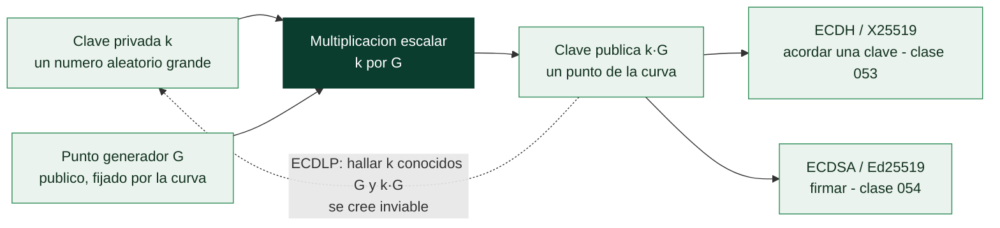

# Clase 050 — Criptografía de curva elíptica (ECC)

> Parte: **2 — Criptografía aplicada** · Fuente: *Serious Cryptography* (Aumasson) y *Real-World Cryptography* (Wong)
> ⏱️ Duración estimada: **120 min** · Nivel: **Avanzado**

---

## 🎯 Objetivo

Entender por qué la criptografía de curva elíptica logra la misma seguridad que RSA con claves mucho más pequeñas, en qué consiste el problema del logaritmo discreto sobre curvas elípticas (ECDLP), y cómo se usan las curvas modernas (P-256, Curve25519) para intercambio de claves (ECDH/X25519) y firma (ECDSA/Ed25519). El alumno generará claves EC con OpenSSL y comparará tamaños y rendimiento.

## 📚 Resultados de aprendizaje

Al finalizar, el alumno podrá:

1. **Explicar** intuitivamente la suma de puntos y la multiplicación escalar en una curva.
2. **Justificar** por qué ECC ofrece 128 bits de seguridad con claves de 256 bits.
3. **Identificar** las curvas recomendadas (P-256, Curve25519, Ed25519) y sus usos.
4. **Generar** claves EC y realizar un ECDH con OpenSSL/Python.
5. **Comparar** ECC frente a RSA en tamaño, velocidad y adopción.

## 🗺️ Temas

| # | Tema | Por qué importa |
|---|------|-----------------|
| 1 | Curvas elípticas sobre campos finitos | Estructura matemática base |
| 2 | Suma de puntos y multiplicación escalar | Operación fundamental |
| 3 | ECDLP | Base de la seguridad |
| 4 | Curvas NIST vs Curve25519 | Elección y confianza |
| 5 | ECDH / X25519 | Intercambio de claves |
| 6 | ECDSA / Ed25519 | Firmas |
| 7 | ECC vs RSA | Trade-offs prácticos |

## 🧠 Explicación en profundidad

### La misma seguridad con claves diez veces más cortas

La criptografía de curva elíptica resuelve el mismo problema que RSA con otra estructura
matemática, y su ventaja es puramente cuantitativa pero decisiva: una clave ECC de **256
bits** ofrece aproximadamente la seguridad de una RSA de **3072 bits**. Claves más cortas
significan firmas más pequeñas, *handshakes* más rápidos, menos ancho de banda y menos
consumo, lo que importa mucho en móviles, IoT y en cada conexión TLS del planeta. Por eso
ECC es hoy el valor por defecto y RSA el legado que se mantiene por compatibilidad.

La estructura es una **curva elíptica sobre un campo finito**: el conjunto de puntos que
satisfacen una ecuación del tipo `y² = x³ + ax + b` con la aritmética hecha módulo un
primo. Sobre esos puntos se define una **suma** con reglas geométricas, y repetir esa suma
*k* veces sobre un punto `G` es la **multiplicación escalar** `k·G`. Ahí está todo: `k` es
la clave privada, `k·G` es la clave pública, y el **ECDLP** —dados `G` y `k·G`, hallar
`k`— es el problema que se cree inviable. Es el análogo elíptico del logaritmo discreto, y
resiste mucho mejor que su versión clásica, que es exactamente la razón de que las claves
puedan ser tan cortas.



### Qué curva elegir, y por qué la pregunta tiene carga política

No todas las curvas son iguales, y la elección tiene una historia. Las curvas **NIST**
(P-256, P-384, P-521) son las estandarizadas y las que exige buena parte de la
normativa, pero sus parámetros provienen de semillas cuyo origen la NSA nunca explicó
del todo; tras el caso Dual_EC_DRBG —un generador con una puerta trasera plausible
promovido por la misma agencia— parte de la comunidad dejó de confiar en ellas. Además,
implementarlas de forma segura es difícil: exigen cuidado explícito para evitar canales
laterales por tiempo.

**Curve25519**, diseñada por Bernstein, responde a esas dos objeciones. Sus parámetros son
**verificablemente rígidos** (elegidos por criterios públicos que no dejan margen para
esconder nada) y su diseño hace que las implementaciones sean naturalmente resistentes a
canales laterales y difíciles de programar mal. Sus dos usos son **X25519** para
intercambio de claves y **Ed25519** para firmas. Cuando puedas elegir, esa es la
recomendación; las curvas NIST se usan cuando el cumplimiento normativo o la
interoperabilidad lo imponen.

### El compromiso real frente a RSA

ECC gana en tamaño, velocidad de generación de claves y de firma, y es la opción moderna.
RSA conserva dos ventajas prácticas: verificar una firma RSA con `e = 65537` es muy rápido
—útil cuando se verifica muchísimo más de lo que se firma— y su soporte en sistemas
antiguos es universal. Hay además un matiz de implementación importante: **ECDSA depende
de un nonce aleatorio por firma, y filtrar o repetir ese nonce revela la clave privada**;
así se rompió la firma de código de la PlayStation 3. **Ed25519** elimina ese riesgo
generando el nonce de forma determinista a partir del mensaje y de la clave, y es otra
razón para preferirlo.

Conviene cerrar con una advertencia que enlaza con la clase 062: tanto RSA como ECC caen
ante el algoritmo de Shor en un computador cuántico suficientemente grande. ECC no es más
resistente por ser más nueva —de hecho necesita menos qubits para ser rota—, y por eso la
migración post-cuántica afecta a ambas por igual.

## 📖 Definiciones y características

- **Curva elíptica**: conjunto de puntos que satisfacen `y² = x³ + ax + b` sobre un campo finito, con una operación de grupo. Característica: permite cripto con claves pequeñas.
- **Multiplicación escalar**: `Q = k·P` (sumar `P` consigo mismo `k` veces). Fácil hacia adelante, difícil de invertir (ECDLP).
- **ECDLP**: dado `P` y `Q = k·P`, hallar `k` es computacionalmente inviable. Base de ECC.
- **Curve25519 / X25519**: curva de Bernstein optimizada para ECDH; rápida, segura y resistente a errores de implementación.
- **Ed25519**: esquema de firma sobre la curva Edwards25519; determinista y de alto rendimiento.
- **P-256 (secp256r1)**: curva NIST muy usada en TLS y certificados.
- **Cofactor y validación de puntos**: verificar que un punto pertenece a la curva evita ataques de curva inválida.

## 📔 Glosario

| Término | Definición concisa |
|---------|--------------------|
| Curva elíptica | Conjunto de puntos que cumplen `y² = x³ + ax + b` sobre un campo finito |
| Campo finito | Aritmética modular sobre un primo, donde vive la curva |
| Punto generador `G` | Punto base público fijado por los parámetros de la curva |
| Multiplicación escalar | Sumar `G` consigo mismo `k` veces; operación fundamental |
| ECDLP | Hallar `k` conocidos `G` y `k·G`; base de la seguridad |
| Curvas NIST (P-256…) | Estándares extendidos; parámetros de origen discutido |
| Curve25519 | Curva de Bernstein con parámetros verificablemente rígidos |
| Rigidez (*rigidity*) | Que los parámetros se elijan por criterios públicos y sin margen |
| X25519 | Intercambio de claves sobre Curve25519 |
| Ed25519 | Firma sobre Curve25519, con nonce determinista |
| ECDSA | Firma sobre curvas NIST; el nonce filtrado revela la clave |
| Dual_EC_DRBG | Generador retirado por sospecha de puerta trasera |
| Canal lateral | Fuga por tiempo, consumo o caché al ejecutar la operación |
| Equivalencia de tamaños | ECC 256 bits ≈ RSA 3072 bits |

## 🧰 Herramientas y preparación

```bash
openssl version
openssl ecparam -list_curves | head
pip install cryptography
```

Entorno de laboratorio propio. La generación de claves es local.

## 🧪 Laboratorio guiado

1. **Genera una clave EC P-256**:

   ```bash
   openssl ecparam -name prime256v1 -genkey -noout -out ec_priv.pem
   openssl ec -in ec_priv.pem -pubout -out ec_pub.pem
   openssl ec -in ec_priv.pem -text -noout | head
   ```

2. **Compara tamaños**: observa que una clave EC de 256 bits equivale en seguridad a una RSA de 3072 bits; la clave EC es mucho más compacta.

3. **ECDH con X25519 en Python** (dos partes derivan el mismo secreto):

   ```python
   from cryptography.hazmat.primitives.asymmetric.x25519 import X25519PrivateKey
   a = X25519PrivateKey.generate(); b = X25519PrivateKey.generate()
   s1 = a.exchange(b.public_key())
   s2 = b.exchange(a.public_key())
   assert s1 == s2  # secreto compartido idéntico
   ```

4. **Firma con Ed25519**:

   ```python
   from cryptography.hazmat.primitives.asymmetric.ed25519 import Ed25519PrivateKey
   k = Ed25519PrivateKey.generate()
   sig = k.sign(b"documento")
   k.public_key().verify(sig, b"documento")  # no lanza excepción = válida
   ```

5. **Benchmark**. Mide operaciones/segundo de ECDSA P-256 vs firma RSA-3072 con `openssl speed`.

## ✍️ Ejercicios

1. Explica con un dibujo la suma de dos puntos en una curva sobre los reales.
2. ¿Por qué claves EC más pequeñas dan la misma seguridad que RSA grandes?
3. Genera un secreto compartido con X25519 entre dos pares y verifica que coinciden.
4. Investiga la polémica de la curva Dual_EC_DRBG y la confianza en parámetros.
5. Compara Ed25519 con ECDSA en cuanto a determinismo y riesgo de nonce.
6. ¿Por qué validar puntos recibidos evita ataques de curva inválida?

## 📝 Reto verificable

Implementa un mini protocolo de establecimiento de canal: dos partes hacen ECDH (X25519), derivan una clave con HKDF y la usan para cifrar un mensaje con AES-GCM. **Criterio de aceptación**: ambas partes descifran el mensaje del otro y un tercero que solo ve las claves públicas no puede.

## ⚠️ Errores comunes

| Síntoma / mensaje | Causa y cómo arreglar |
|-------------------|-----------------------|
| Secretos ECDH distintos | Curvas o codificaciones distintas; usa la misma curva |
| ECDSA roto por nonce reutilizado | Nonce `k` repetido revela la clave; usa RFC 6979 o Ed25519 |
| Punto público no validado | Riesgo de curva inválida; valida pertenencia a la curva |
| Uso de curvas débiles/obsoletas | Elige P-256, P-384 o Curve25519 |
| Confundir clave de firma con clave de ECDH | Separa propósitos; no reutilices el par de claves |

## ❓ Preguntas frecuentes

**❓ ¿ECC o RSA?**
ECC para nuevos diseños: claves pequeñas, rápido, adoptado por TLS 1.3. RSA persiste por compatibilidad.

**❓ ¿Curvas NIST o Curve25519?**
Curve25519/Ed25519 minimizan errores de implementación y no dependen de constantes de origen dudoso; muy recomendadas.

**❓ ¿ECC resiste computación cuántica?**
No; como RSA, cae ante Shor. Por eso existe la criptografía post-cuántica (clase 062).

## 🔗 Referencias

- Aumasson, *Serious Cryptography*, cap. 12.
- Wong, *Real-World Cryptography*, cap. 5–7.
- RFC 7748 (Curve25519/X25519) — <https://www.rfc-editor.org/rfc/rfc7748>
- RFC 8032 (Ed25519) — <https://www.rfc-editor.org/rfc/rfc8032>

## 📥 Material descargable

- 📄 [Guía en PDF](./clase-050-guia.pdf) — versión imprimible de esta clase.
- 🎞️ [Presentación (PPTX)](./clase-050-presentacion.pptx) — deck para proyectar en clase.

## ⬅️ Clase anterior

[Clase 049 — Cifrado asimétrico: RSA](../049-cifrado-asimetrico-rsa/README.md)

## ➡️ Siguiente clase

[Clase 051 — Funciones hash: SHA-2, SHA-3 y sus propiedades](../051-funciones-hash-sha-2-sha-3-y-sus-propiedades/README.md)
