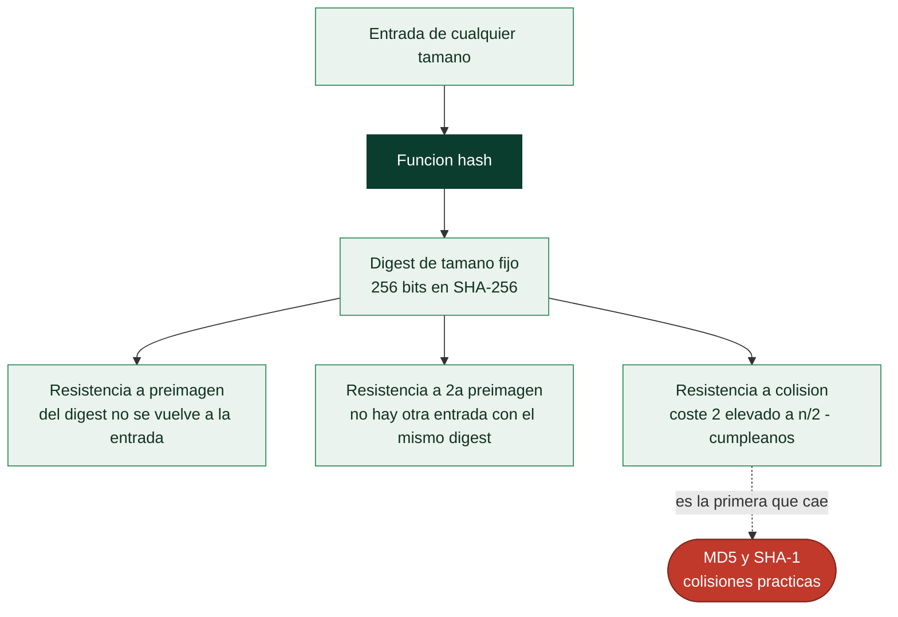

# Clase 051 — Funciones hash: SHA-2, SHA-3 y sus propiedades

> Parte: **2 — Criptografía aplicada** · Fuente: *Serious Cryptography* (Aumasson) y NIST FIPS 180-4 / FIPS 202
> ⏱️ Duración estimada: **90 min** · Nivel: **Intermedio**

---

## 🎯 Objetivo

Comprender qué es una función hash criptográfica, qué tres propiedades debe cumplir (resistencia a preimagen, segunda preimagen y colisión), por qué MD5 y SHA-1 están rotos, y en qué se diferencian SHA-2, SHA-3 (Keccak) y BLAKE2/3. El alumno aprenderá para qué sirven realmente los hashes y para qué **no** (no cifran, no protegen contraseñas por sí solos).

## 📚 Resultados de aprendizaje

Al finalizar, el alumno podrá:

1. **Definir** las propiedades de seguridad de una función hash.
2. **Explicar** por qué MD5 y SHA-1 no deben usarse (colisiones prácticas).
3. **Calcular** hashes con distintas familias y comparar salidas.
4. **Diferenciar** la construcción Merkle-Damgård (SHA-2) de la esponja (SHA-3).
5. **Identificar** el ataque de extensión de longitud y cómo evitarlo.

## 🗺️ Temas

| # | Tema | Por qué importa |
|---|------|-----------------|
| 1 | Qué es y qué no es un hash | Evita malentendidos frecuentes |
| 2 | Propiedades (preimagen, colisión) | Definen su seguridad |
| 3 | Efecto avalancha | Un bit cambia toda la salida |
| 4 | MD5 y SHA-1 rotos | Lección de obsolescencia |
| 5 | SHA-2 y Merkle-Damgård | Estándar dominante |
| 6 | SHA-3 (esponja) y BLAKE | Alternativas modernas |
| 7 | Extensión de longitud | Trampa de diseño |

## 🧠 Explicación en profundidad

### Qué es un hash y, sobre todo, qué no es

Una función hash criptográfica toma una entrada de cualquier tamaño y produce una salida
de tamaño fijo —el *digest*— de forma determinista. Y aquí conviene desactivar de entrada
el malentendido más caro de toda la criptografía aplicada: **un hash no es cifrado**. No
hay clave y **no se puede invertir**, porque la operación destruye información: infinitas
entradas comparten un mismo digest. "Desencriptar un MD5" no significa nada; lo que hacen
las herramientas de crackeo es hashear candidatos hasta encontrar uno que coincida, que
es un problema completamente distinto.

Su seguridad se define por tres propiedades, en orden creciente de dificultad para el
atacante. **Resistencia a preimagen**: dado un digest, es inviable encontrar *alguna*
entrada que lo produzca. **Resistencia a segunda preimagen**: dada una entrada concreta,
es inviable encontrar *otra distinta* con el mismo digest. **Resistencia a colisión**: es
inviable encontrar *dos entradas cualesquiera* que colisionen. A esto se suma el **efecto
avalancha**: cambiar un solo bit de la entrada debe alterar aproximadamente la mitad de
los bits de salida, sin ninguna correlación aprovechable.

### La paradoja del cumpleaños explica por qué las colisiones son más baratas

La resistencia a colisión es siempre la primera en caer, y no por debilidad del diseño
sino por combinatoria. La **paradoja del cumpleaños** dice que en un grupo de 23 personas
la probabilidad de que dos compartan cumpleaños supera el 50 %, muy por debajo de las 183
que la intuición sugiere. Trasladado a hashes: encontrar una colisión en una función de
*n* bits cuesta del orden de **2^(n/2)** operaciones, no 2^n. Por eso SHA-256 ofrece 128
bits de seguridad frente a colisiones, y por eso un hash de 64 bits es inservible aunque
"parezca" grande.

Esa es la aritmética que sentenció a **MD5** (colisiones prácticas desde 2004, hoy en
segundos) y a **SHA-1** (colisión real demostrada por Google en 2017 con el ataque
SHAttered). Ninguno de los dos debe usarse ya para nada que dependa de la integridad. Se
siguen encontrando como suma de comprobación no criptográfica, pero esa distinción se
malinterpreta constantemente y acaba en vulnerabilidades.



### Dos construcciones, y la trampa de una de ellas

**SHA-2** (SHA-256, SHA-512) sigue la construcción **Merkle-Damgård**: procesa el mensaje
en bloques encadenando un estado interno. Es sólida y sigue siendo el estándar dominante,
pero arrastra una peculiaridad estructural con consecuencias reales: el **ataque de
extensión de longitud**. Como el digest final *es* el estado interno, quien conozca
`H(secreto ‖ mensaje)` y la longitud del secreto puede calcular
`H(secreto ‖ mensaje ‖ relleno ‖ añadido)` **sin conocer el secreto**. De ahí que
construir un autenticador concatenando clave y mensaje sea un error grave, y de ahí que
exista HMAC (clase 052).

**SHA-3** (Keccak) usa una construcción distinta, la **esponja**, que absorbe la entrada
en un estado grande y luego exprime la salida, y por diseño **no sufre extensión de
longitud**. No sustituye a SHA-2 —ambos son estándar— sino que aporta diversidad de
diseño: si un día se encontrara un fallo estructural en Merkle-Damgård, existe una
alternativa que no comparte el mismo cimiento. **BLAKE2** y **BLAKE3** completan el
panorama con un enfoque orientado a velocidad, muy usados fuera de la normativa.

Y una separación final que se aplica en la clase 057: estas funciones están diseñadas
para ser **rápidas**, que es justo lo contrario de lo que se necesita para almacenar
contraseñas. Hashear una contraseña con SHA-256 es un fallo de seguridad, no una
optimización.

## 📖 Definiciones y características

- **Función hash criptográfica**: transforma una entrada arbitraria en una salida fija (digest). Característica: determinista, rápida, unidireccional.
- **Resistencia a preimagen**: dado `h`, es inviable hallar `m` con `hash(m)=h`.
- **Resistencia a segunda preimagen**: dado `m1`, es inviable hallar `m2≠m1` con igual hash.
- **Resistencia a colisiones**: es inviable hallar cualquier par `m1≠m2` con igual hash (limitada por el cumpleaños: ~2^(n/2)).
- **Efecto avalancha**: un cambio mínimo en la entrada altera drásticamente la salida.
- **SHA-2**: familia (SHA-256/384/512) con construcción Merkle-Damgård. Segura y ubicua.
- **SHA-3 / Keccak**: construcción de esponja, inmune a extensión de longitud. **BLAKE2/3**: rápidas y modernas.

## 📔 Glosario

| Término | Definición concisa |
|---------|--------------------|
| Función hash criptográfica | Salida de tamaño fijo, determinista y no invertible |
| Digest | Resultado de aplicar la función hash |
| Preimagen | Encontrar una entrada que produzca un digest dado |
| Segunda preimagen | Encontrar otra entrada con el mismo digest que una dada |
| Colisión | Dos entradas cualesquiera con el mismo digest |
| Efecto avalancha | Un bit de entrada cambia ~la mitad de los de salida |
| Paradoja del cumpleaños | Las colisiones cuestan 2^(n/2), no 2^n |
| Bits de seguridad | Coste real del mejor ataque conocido, en potencias de 2 |
| MD5 / SHA-1 | Rotos para integridad; colisiones prácticas |
| SHAttered | Colisión real de SHA-1 demostrada por Google en 2017 |
| SHA-2 | Familia estándar (SHA-256, SHA-512); Merkle-Damgård |
| Merkle-Damgård | Construcción por bloques encadenados; sufre extensión de longitud |
| Extensión de longitud | Extender un hash con secreto sin conocer el secreto |
| SHA-3 / Keccak | Construcción de esponja; inmune a extensión de longitud |
| BLAKE2 / BLAKE3 | Hashes modernos orientados a velocidad |

## 🧰 Herramientas y preparación

```bash
openssl version
sha256sum --version 2>/dev/null || echo "usa openssl dgst"
pip install cryptography
```

Todo local. Los hashes se calculan sobre datos propios.

## 🧪 Laboratorio guiado

1. **Calcula hashes de una cadena** con varias familias:

   ```bash
   echo -n "hola" | openssl dgst -md5
   echo -n "hola" | openssl dgst -sha1
   echo -n "hola" | openssl dgst -sha256
   echo -n "hola" | openssl dgst -sha3-256
   ```

2. **Efecto avalancha**: cambia una letra (`hola` → `Hola`) y compara el SHA-256; observa que casi todos los bits cambian.

3. **Colisión de MD5 (histórica)**. Descarga los famosos bloques de colisión de MD5 (p. ej. los PDF de Marc Stevens) y verifica con `md5sum` que dos archivos distintos comparten hash. Nunca uses MD5 para integridad.

4. **Integridad de archivos**: genera `sha256sum *.iso > SHA256SUMS` y verifica con `sha256sum -c SHA256SUMS`.

5. **Extensión de longitud (concepto)**. Explica por qué `hash(clave || mensaje)` con SHA-256 es vulnerable a extensión y por qué HMAC (clase 052) lo resuelve.

## ✍️ Ejercicios

1. Calcula cuántos hashes necesitas para una colisión al 50 % en SHA-256 (paradoja del cumpleaños).
2. Verifica la integridad de una descarga comparando su SHA-256 publicado.
3. Explica por qué un hash no sirve para cifrar (no es reversible ni tiene clave).
4. Compara la velocidad de SHA-256, SHA3-256 y BLAKE2b en tu máquina.
5. Investiga el ataque SHAttered contra SHA-1 y su impacto en Git.
6. Diseña un esquema de "prueba de descarga" con árbol de Merkle.

## 📝 Reto verificable

Construye un verificador de integridad que, dado un directorio, genere un manifiesto con el SHA-256 de cada archivo y luego detecte cualquier alteración. **Criterio de aceptación**: si modificas un solo byte de cualquier archivo, tu verificador lo reporta indicando la ruta afectada.

## ⚠️ Errores comunes

| Síntoma / mensaje | Causa y cómo arreglar |
|-------------------|-----------------------|
| Usar MD5/SHA-1 para integridad de seguridad | Rotos; migra a SHA-256/SHA-3 |
| "Ciframos con SHA-256" | Un hash no cifra; usa AES/ChaCha20 |
| `hash(clave\|\|msg)` como MAC | Vulnerable a extensión; usa HMAC |
| Hash de contraseña con SHA-256 simple | Demasiado rápido; usa Argon2/bcrypt (clase 057) |
| Comparar hashes con `==` en contexto sensible | Riesgo de timing; usa comparación constante |

## ❓ Preguntas frecuentes

**❓ ¿SHA-256 o SHA-3?**
Ambos son seguros. SHA-3 aporta diversidad de diseño e inmunidad a extensión de longitud; SHA-2 sigue siendo perfectamente válido.

**❓ ¿Un hash garantiza que nadie modificó el archivo?**
Solo si el hash se obtuvo por un canal confiable; si el atacante controla ambos, puede sustituirlos. Combínalo con firmas.

**❓ ¿Por qué las colisiones importan si "es improbable"?**
Porque atacantes las fabrican intencionadamente (SHAttered); afectan firmas y control de versiones.

## 🔗 Referencias

- NIST FIPS 180-4 (SHA-2) — <https://csrc.nist.gov/publications/detail/fips/180/4/final>
- NIST FIPS 202 (SHA-3) — <https://csrc.nist.gov/publications/detail/fips/202/final>
- Aumasson, *Serious Cryptography*, cap. 6–7.
- Stevens et al., "SHAttered" — <https://shattered.io/>

## 📥 Material descargable

- 📄 [Guía en PDF](./clase-051-guia.pdf) — versión imprimible de esta clase.
- 🎞️ [Presentación (PPTX)](./clase-051-presentacion.pptx) — deck para proyectar en clase.

## ⬅️ Clase anterior

[Clase 050 — Criptografía de curva elíptica (ECC)](../050-criptografia-de-curva-eliptica-ecc/README.md)

## ➡️ Siguiente clase

[Clase 052 — HMAC y autenticación de mensajes](../052-hmac-y-autenticacion-de-mensajes/README.md)
