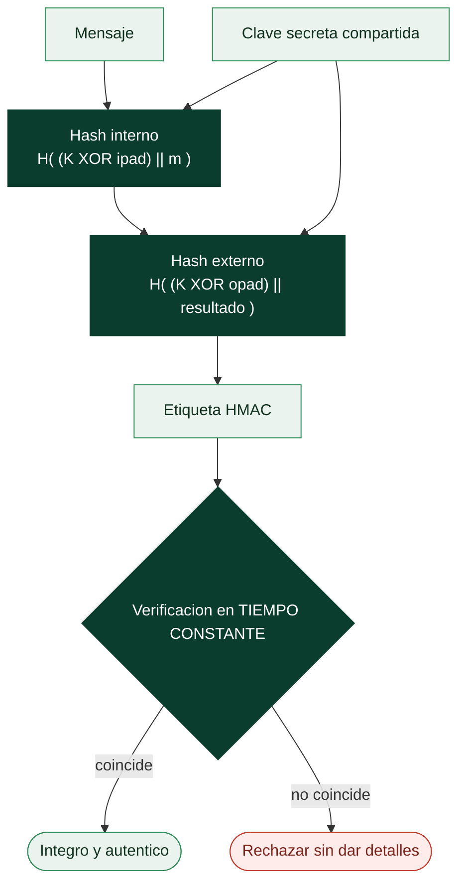

# Clase 052 — HMAC y autenticación de mensajes

> Parte: **2 — Criptografía aplicada** · Fuente: *Cryptography Engineering* (Ferguson/Schneier/Kohno) e IETF RFC 2104
> ⏱️ Duración estimada: **90 min** · Nivel: **Intermedio**

---

## 🎯 Objetivo

Entender qué es un código de autenticación de mensajes (MAC), por qué la integridad sin autenticación no basta, y cómo HMAC combina una función hash con una clave secreta para garantizar que un mensaje proviene de quien dice y no fue alterado. El alumno aprenderá también el orden correcto de combinar cifrado y MAC (Encrypt-then-MAC) y por qué la comparación debe ser en tiempo constante.

## 📚 Resultados de aprendizaje

Al finalizar, el alumno podrá:

1. **Distinguir** integridad de autenticación e identificar qué aporta un MAC.
2. **Explicar** la construcción HMAC y por qué neutraliza la extensión de longitud.
3. **Generar y verificar** HMAC con OpenSSL y Python.
4. **Aplicar** correctamente el patrón Encrypt-then-MAC.
5. **Implementar** comparación en tiempo constante para evitar timing.

## 🗺️ Temas

| # | Tema | Por qué importa |
|---|------|-----------------|
| 1 | MAC: definición y objetivo | Autenticidad de mensajes |
| 2 | Construcción HMAC | Estándar seguro y simple |
| 3 | HMAC vs hash con clave concatenada | Evita extensión de longitud |
| 4 | Encrypt-then-MAC vs MAC-then-Encrypt | Orden correcto |
| 5 | Comparación en tiempo constante | Evita fugas de timing |
| 6 | Claves y rotación | Gestión práctica |
| 7 | HMAC en la práctica (JWT, APIs) | Uso real |

## 🧠 Explicación en profundidad

### Un hash prueba integridad; solo una clave prueba origen

Un digest garantiza que un dato no cambió **si el digest llegó por un canal fiable**. Pero
si viaja junto al mensaje, un atacante que altere el mensaje recalcula el digest y nadie
lo nota: un hash sin clave no aporta autenticidad ninguna. Un **MAC** (*Message
Authentication Code*) resuelve eso incorporando una clave secreta compartida: solo quien
la conoce puede generar una etiqueta válida, así que verificarla prueba a la vez que el
mensaje no se alteró **y** que proviene de alguien que posee la clave.

La diferencia con una firma digital (clase 054) es el tipo de clave y su consecuencia
jurídica. El MAC usa una clave **simétrica**, que ambas partes conocen; por eso el
receptor puede fabricar mensajes indistinguibles de los del emisor y **no hay no
repudio**. La firma usa clave privada, que solo tiene el emisor, y por eso sí lo hay. El
MAC es más rápido y suficiente cuando ambas partes se confían mutuamente.

### Por qué HMAC y no "hashear la clave con el mensaje"

La construcción intuitiva —`H(clave ‖ mensaje)`— es exactamente la que rompe el ataque de
**extensión de longitud** de la clase anterior: con SHA-256, un atacante que vea el
mensaje y su etiqueta puede añadir datos al final y calcular la etiqueta correcta sin
conocer la clave. Poner la clave al final (`H(mensaje ‖ clave)`) traslada el problema a
las colisiones del hash. **HMAC** resuelve ambos casos con una construcción anidada de dos
pasadas:

`HMAC(K, m) = H( (K ⊕ opad) ‖ H( (K ⊕ ipad) ‖ m ) )`

El hash interno procesa el mensaje con una versión de la clave; el externo vuelve a
hashear ese resultado con otra versión. Esa anidación neutraliza la extensión de longitud
y tiene, además, una demostración de seguridad: **HMAC es seguro incluso si la función
hash subyacente pierde resistencia a colisión**, y por eso HMAC-SHA1 siguió siendo
aceptable como MAC durante años después de que SHA-1 cayera para firmas.



### El orden importa: encrypt-then-MAC

Cuando hay que cifrar y autenticar por separado, el orden de composición no es indiferente
y la comunidad tardó años y varias vulnerabilidades en fijar la respuesta correcta.
**Encrypt-then-MAC** —cifrar primero y calcular el MAC sobre el **texto cifrado**— es la
única de las tres combinaciones que es segura en general. Su virtud práctica es enorme: el
receptor verifica el MAC **antes de descifrar nada**, así que descarta cualquier mensaje
manipulado sin ejecutar la lógica de descifrado ni la de relleno, lo que **elimina de raíz
el padding oracle** de la clase 060.

Las otras dos son problemáticas. *MAC-then-encrypt* (lo que hacía TLS 1.2) obliga a
descifrar antes de poder verificar, que es precisamente la ventana que explotan Lucky13 y
POODLE. *Encrypt-and-MAC* puede filtrar información sobre el texto claro a través del MAC.
La conclusión moderna es la misma que en la clase 047: **no compongas tú**; usa un AEAD
(clase 059) que ya trae la composición resuelta y probada.

### La comparación también es criptografía

Un detalle de implementación arruina lo anterior si se descuida. Comparar la etiqueta
recibida con la calculada usando `==` o `memcmp` corta en el primer byte distinto, así que
el **tiempo de respuesta revela cuántos bytes iniciales acertó** el atacante, que puede
entonces construir una etiqueta válida byte a byte con unos miles de intentos. La
verificación debe hacerse en **tiempo constante**, recorriendo siempre la longitud
completa (`hmac.compare_digest` en Python, `crypto/subtle` en Go). Es un ejemplo temprano
de la idea que domina la clase 060: en criptografía, **el tiempo es un canal de salida**.

## 📖 Definiciones y características

- **MAC**: etiqueta que autentica un mensaje usando una clave secreta compartida. Característica: sin la clave no se puede falsificar.
- **HMAC**: `HMAC(k,m) = H((k⊕opad) || H((k⊕ipad) || m))`. Seguro con cualquier hash decente, inmune a extensión de longitud.
- **Integridad vs autenticación**: un hash detecta cambios accidentales; un MAC detecta cambios maliciosos porque el atacante no tiene la clave.
- **Encrypt-then-MAC**: cifrar y luego calcular el MAC sobre el texto cifrado. Patrón recomendado; permite rechazar sin descifrar.
- **Comparación en tiempo constante**: comparar etiquetas sin salir antes en el primer byte distinto, evitando fugas temporales.
- **Clave simétrica de MAC**: debe ser distinta de la clave de cifrado y protegerse igual de bien.

## 📔 Glosario

| Término | Definición concisa |
|---------|--------------------|
| MAC | Etiqueta con clave secreta que prueba integridad y origen |
| Autenticidad | Garantía de que el mensaje viene de quien dice |
| Clave simétrica compartida | La misma clave genera y verifica el MAC |
| No repudio | Imposibilidad de negar la autoría; el MAC **no** lo da |
| HMAC | MAC estándar con dos pasadas de hash anidadas |
| `ipad` / `opad` | Constantes de relleno interno y externo de HMAC |
| Extensión de longitud | Ataque que HMAC neutraliza por su anidación |
| Encrypt-then-MAC | Cifrar y luego autenticar el cifrado; la composición segura |
| MAC-then-encrypt | Orden inseguro usado por TLS 1.2; habilita Lucky13 |
| Encrypt-and-MAC | Orden que puede filtrar información del texto claro |
| Tiempo constante | Comparación que no depende de dónde falla la coincidencia |
| `compare_digest` | Función de comparación segura en la stdlib de Python |
| Rotación de claves | Renovar periódicamente la clave del MAC |
| JWT (HS256) | Token web firmado con HMAC-SHA256 |

## 🧰 Herramientas y preparación

```bash
openssl version
pip install cryptography
```

Laboratorio local. Las claves de HMAC son de práctica.

## 🧪 Laboratorio guiado

1. **HMAC con OpenSSL**:

   ```bash
   echo -n "mensaje" | openssl dgst -sha256 -hmac "clave-secreta"
   ```

2. **HMAC en Python y verificación segura**:

   ```python
   import hmac, hashlib
   key = b"clave-secreta"
   tag = hmac.new(key, b"mensaje", hashlib.sha256).hexdigest()
   # verificación en tiempo constante
   ok = hmac.compare_digest(tag, tag)
   print(tag, ok)
   ```

3. **Detecta manipulación**: envía `(mensaje, tag)`; el receptor recomputa el HMAC. Cambia un carácter del mensaje y comprueba que la verificación falla.

4. **Encrypt-then-MAC**: cifra con AES-CBC, calcula HMAC-SHA256 sobre `IV || ciphertext`, y verifica el MAC **antes** de descifrar. Documenta por qué esto previene padding oracle (clase 060).

5. **Timing (concepto)**: implementa una comparación ingenua byte a byte con salida temprana y razona por qué filtra información; sustitúyela por `compare_digest`.

## ✍️ Ejercicios

1. Explica por qué `hash(clave || mensaje)` es inseguro y HMAC no.
2. Implementa Encrypt-then-MAC y verifica el MAC antes de descifrar.
3. ¿Por qué se usan claves distintas para cifrar y para el MAC?
4. Investiga cómo firma un JWT HS256 y verifica uno con tu HMAC.
5. Demuestra que cambiar un bit del mensaje invalida el tag.
6. Compara HMAC con los MAC integrados en AEAD (GCM/Poly1305).

## 📝 Reto verificable

Implementa un canal autenticado sencillo: el emisor envía `(IV, ciphertext, HMAC)` y el receptor rechaza cualquier mensaje manipulado sin descifrarlo. **Criterio de aceptación**: alterar cualquier byte del IV, del texto cifrado o del tag provoca rechazo, y solo los mensajes íntegros se descifran.

## ⚠️ Errores comunes

| Síntoma / mensaje | Causa y cómo arreglar |
|-------------------|-----------------------|
| MAC-then-Encrypt con CBC | Habilita padding oracle; usa Encrypt-then-MAC o AEAD |
| Comparar tags con `==` | Fuga de timing; usa `compare_digest` |
| Reutilizar la clave de cifrado como clave de MAC | Debilita ambas; deriva claves separadas |
| Verificar el MAC después de descifrar | Ya procesaste datos no autenticados; verifica antes |
| Hash simple como "firma" de API | No autentica origen; usa HMAC con clave secreta |

## ❓ Preguntas frecuentes

**❓ ¿HMAC o AEAD?**
Si ya cifras, prefiere AEAD (GCM, ChaCha20-Poly1305), que integra el MAC. HMAC brilla para autenticar datos que no ciframos (tokens, webhooks).

**❓ ¿Puedo usar HMAC-MD5?**
HMAC-MD5 resiste mejor que MD5 solo, pero usa HMAC-SHA256 por buenas prácticas.

**❓ ¿El MAC da confidencialidad?**
No; solo autenticidad e integridad. Combínalo con cifrado para confidencialidad.

## 🔗 Referencias

- IETF RFC 2104 (HMAC) — <https://www.rfc-editor.org/rfc/rfc2104>
- Ferguson, Schneier, Kohno, *Cryptography Engineering*, cap. 6–7.
- NIST FIPS 198-1 (HMAC) — <https://csrc.nist.gov/publications/detail/fips/198/1/final>
- OWASP, "Cryptographic Storage Cheat Sheet".

## 📥 Material descargable

- 📄 [Guía en PDF](./clase-052-guia.pdf) — versión imprimible de esta clase.
- 🎞️ [Presentación (PPTX)](./clase-052-presentacion.pptx) — deck para proyectar en clase.

## ⬅️ Clase anterior

[Clase 051 — Funciones hash: SHA-2, SHA-3 y sus propiedades](../051-funciones-hash-sha-2-sha-3-y-sus-propiedades/README.md)

## ➡️ Siguiente clase

[Clase 053 — Intercambio de claves: Diffie-Hellman](../053-intercambio-de-claves-diffie-hellman/README.md)
