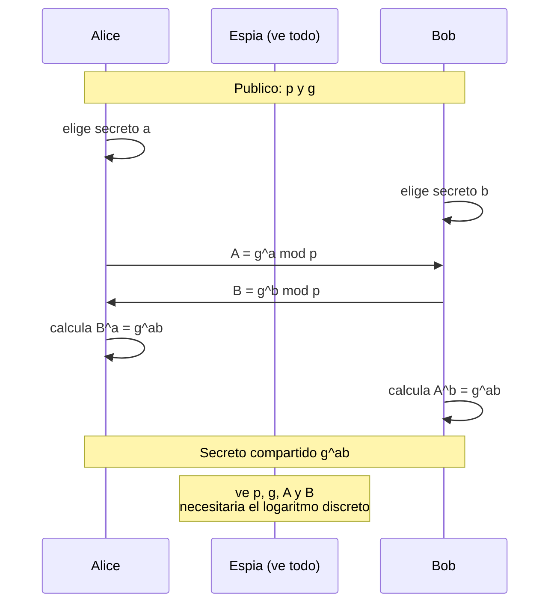

# Clase 053 — Intercambio de claves: Diffie-Hellman

> Parte: **2 — Criptografía aplicada** · Fuente: *Real-World Cryptography* (Wong) y *Serious Cryptography* (Aumasson)
> ⏱️ Duración estimada: **100 min** · Nivel: **Avanzado**

---

## 🎯 Objetivo

Comprender cómo dos partes que nunca se han visto pueden acordar una clave secreta compartida sobre un canal público, mediante Diffie-Hellman (DH) y su variante de curva elíptica (ECDH). El alumno entenderá el problema del logaritmo discreto, la diferencia entre DH estático y efímero, el concepto de **forward secrecy** y por qué DH sin autenticación es vulnerable a un ataque de intermediario (MITM).

## 📚 Resultados de aprendizaje

Al finalizar, el alumno podrá:

1. **Ejecutar** el protocolo DH paso a paso con números y explicar por qué funciona.
2. **Distinguir** DH estático de efímero (DHE/ECDHE) y su relación con forward secrecy.
3. **Demostrar** por qué DH sin autenticación cae ante MITM.
4. **Derivar** una clave de sesión a partir del secreto compartido con HKDF.
5. **Elegir** parámetros seguros (grupos MODP fuertes o X25519).

## 🗺️ Temas

| # | Tema | Por qué importa |
|---|------|-----------------|
| 1 | Problema del logaritmo discreto | Base de la seguridad |
| 2 | DH clásico (grupos multiplicativos) | Protocolo fundacional |
| 3 | ECDH / X25519 | Variante moderna eficiente |
| 4 | Efímero vs estático | Forward secrecy |
| 5 | Derivación de clave (HKDF) | Del secreto bruto a claves útiles |
| 6 | MITM y necesidad de autenticación | DH solo no autentica |
| 7 | Parámetros seguros | Evitar grupos débiles (Logjam) |

## 🧠 Explicación en profundidad

### Acordar un secreto hablando en público

Diffie-Hellman (1976) es probablemente la idea más elegante de la criptografía: **dos
partes que nunca se han visto pueden acordar una clave secreta intercambiando solo
mensajes públicos**, de modo que quien escuche toda la conversación no puede deducirla.
El mecanismo se apoya en la conmutatividad de la exponenciación modular: se acuerdan
públicamente un primo grande `p` y un generador `g`; Alice elige un secreto `a` y envía
`A = gᵃ mod p`; Bob elige `b` y envía `B = gᵇ mod p`; cada uno eleva lo recibido a su
propio secreto y ambos obtienen `gᵃᵇ mod p`. El espía ve `p`, `g`, `A` y `B`, y para
obtener el secreto tendría que resolver el **problema del logaritmo discreto**, que se
cree inviable para parámetros suficientemente grandes.

La analogía de las pinturas ayuda: ambos parten de un color público, cada uno le añade un
color secreto y se intercambian las mezclas; al añadir cada uno su color secreto a la
mezcla del otro llegan al mismo tono final, mientras que separar los colores de una mezcla
—el equivalente al logaritmo discreto— es lo difícil.



### DH no autentica, y por eso solo nunca basta

Hay una carencia fundamental que conviene enunciar sin rodeos: **Diffie-Hellman no
autentica a nadie**. Alice acuerda una clave con quienquiera que esté al otro lado, y si
un atacante se interpone puede hacer un DH con cada uno por separado, quedándose en medio
con dos claves y leyendo todo mientras reenvía. Es el man-in-the-middle de la clase 040
aplicado al acuerdo de claves. Por eso DH **siempre** se combina con un mecanismo de
autenticación —una firma digital sobre los valores intercambiados, un certificado, una
clave precompartida—, y es exactamente lo que hace el *handshake* de TLS 1.3 en la clase
056: DH efímero para acordar, firma del servidor para autenticar.

### Efímero: la clave de la forward secrecy

La distinción entre DH **estático** y **efímero** (DHE, ECDHE) tiene una consecuencia
enorme. Si el servidor usa siempre el mismo secreto, quien un día robe esa clave privada
puede descifrar **todo el tráfico pasado** que haya grabado. Con DH efímero se genera un
par nuevo para cada sesión y se destruye al terminar: comprometer la clave a largo plazo
del servidor permite suplantarlo en el futuro, pero **no descifrar sesiones anteriores**.
Esa propiedad es la **forward secrecy**, y es la razón de que TLS 1.3 haya eliminado
directamente todos los modos que no la ofrecen. Su relevancia práctica es directa contra
el "*harvest now, decrypt later*" de la clase 062.

### Del secreto bruto a claves utilizables

El valor `gᵃᵇ` no debe usarse como clave tal cual: es un número con estructura matemática
y una distribución que no es uniforme. Se pasa por una **función de derivación de claves**
—**HKDF** es el estándar—, que primero *extrae* entropía uniforme del secreto y luego la
*expande* en tantas claves como haga falta (una para cada dirección, otra para el MAC),
incorporando además contexto de la sesión para que claves de sesiones distintas nunca
coincidan.

Por último, los **parámetros importan**. El ataque **Logjam** (2015) demostró que muchos
servidores compartían los mismos grupos DH de 1024 bits, y que precomputar sobre un grupo
tan usado ponía al alcance de un Estado el descifrado de miles de servidores. La lección
fue triple: grupos de al menos 2048 bits, grupos estandarizados y bien elegidos, y
preferir **X25519** (la variante sobre curva elíptica de la clase 050), que es más rápida
y no admite parámetros débiles por construcción.

## 📖 Definiciones y características

- **Diffie-Hellman**: protocolo donde cada parte elige un secreto, publica `gˣ mod p` y ambos calculan `gˣʸ`. Característica: acuerdan clave sin transmitirla.
- **Problema del logaritmo discreto**: dado `g`, `p` y `gˣ mod p`, hallar `x` es inviable con parámetros grandes.
- **DHE / ECDHE (efímero)**: se genera un par nuevo por sesión; aporta forward secrecy.
- **Forward secrecy**: comprometer la clave de largo plazo no descifra sesiones pasadas, porque los efímeros ya se descartaron.
- **HKDF**: función de derivación (extract-then-expand) que convierte el secreto compartido en claves de longitud y propósito adecuados.
- **MITM**: sin autenticación, un atacante intercepta y sustituye las claves públicas, estableciendo dos canales que él controla.
- **Grupos MODP / Curve25519**: parámetros recomendados; evitar primos pequeños o de origen dudoso (Logjam).

## 📔 Glosario

| Término | Definición concisa |
|---------|--------------------|
| Diffie-Hellman | Acuerdo de clave secreta mediante mensajes públicos |
| Logaritmo discreto | Hallar `a` conocidos `g` y `gᵃ mod p`; base de la seguridad |
| `p` y `g` | Primo y generador públicos que definen el grupo |
| Secreto compartido | `gᵃᵇ mod p`, al que llegan ambas partes |
| DH estático | Secreto fijo reutilizado; sin forward secrecy |
| DHE / ECDHE | Diffie-Hellman efímero: par nuevo por sesión |
| Forward secrecy | Robar la clave a largo plazo no descifra sesiones pasadas |
| X25519 | DH sobre Curve25519; rápido y sin parámetros débiles |
| MitM en DH | Un intermediario acuerda una clave con cada parte |
| Autenticación del acuerdo | Firma o certificado que ata el DH a una identidad |
| KDF | Función de derivación de claves a partir de un secreto |
| HKDF | KDF estándar en dos fases: extraer y expandir |
| Logjam | Ataque que explotó grupos DH de 1024 bits compartidos |
| Grupo débil | Parámetros pequeños o reutilizados que permiten precomputación |

## 🧰 Herramientas y preparación

```bash
openssl version
pip install cryptography
```

Laboratorio local. El MITM se simula solo entre procesos propios.

## 🧪 Laboratorio guiado

1. **DH de juguete a mano**. Con `p=23`, `g=5`, Alice elige `a=6` y Bob `b=15`. Calcula `A=5⁶ mod 23`, `B=5¹⁵ mod 23` y verifica que `Bᵃ mod 23 = Aᵇ mod 23`. Ese es el secreto compartido.

2. **ECDH con X25519 y HKDF en Python**:

   ```python
   from cryptography.hazmat.primitives.asymmetric.x25519 import X25519PrivateKey
   from cryptography.hazmat.primitives.kdf.hkdf import HKDF
   from cryptography.hazmat.primitives import hashes
   a = X25519PrivateKey.generate(); b = X25519PrivateKey.generate()
   shared = a.exchange(b.public_key())
   key = HKDF(algorithm=hashes.SHA256(), length=32, salt=None,
              info=b"canal").derive(shared)
   print(key.hex())
   ```

3. **Simula un MITM**. Coloca un "atacante" entre A y B que reemplaza cada clave pública por la suya. Comprueba que A y B acaban con claves distintas que el atacante conoce → demuestra la necesidad de autenticar (certificados/firmas).

4. **Forward secrecy**. Genera efímeros por sesión y razona por qué revelar la clave estática no compromete sesiones antiguas.

## ✍️ Ejercicios

1. Repite el DH de juguete con `p=97, g=5` y valores propios.
2. Explica por qué `gˣʸ = gʸˣ` permite el acuerdo.
3. Implementa el MITM y muéstralo funcionando en tu laboratorio.
4. Investiga el ataque Logjam y qué grupos evitar.
5. Deriva dos claves (cifrado y MAC) del mismo secreto con HKDF e `info` distintos.
6. Compara DHE clásico con ECDHE en rendimiento y tamaño.

## 📝 Reto verificable

Implementa un handshake ECDHE **autenticado**: cada parte firma su clave pública efímera con Ed25519 (clave de largo plazo) y verifica la del otro antes de derivar la clave de sesión. **Criterio de aceptación**: un MITM que altere las claves efímeras es detectado porque la firma no valida, y el canal solo se establece entre las partes legítimas.

## ⚠️ Errores comunes

| Síntoma / mensaje | Causa y cómo arreglar |
|-------------------|-----------------------|
| DH sin autenticación | Vulnerable a MITM; añade firmas o certificados |
| Usar el secreto DH directamente como clave | Deriva con HKDF; el secreto bruto no es uniforme |
| Grupos DH pequeños o compartidos débiles | Logjam; usa ≥2048 bits o X25519 |
| DH estático sin forward secrecy | Compromiso futuro descifra el pasado; usa efímeros |
| Reutilizar el par efímero | Anula forward secrecy; genera uno por sesión |

## ❓ Preguntas frecuentes

**❓ ¿DH cifra datos?**
No; solo acuerda una clave. Luego cifras con AES/ChaCha20 usando esa clave derivada.

**❓ ¿Qué es forward secrecy y por qué importa?**
Que capturar tráfico hoy y robar la clave del servidor mañana no permite descifrarlo, gracias a los efímeros. TLS 1.3 lo exige.

**❓ ¿DH resiste cuántica?**
No; cae ante Shor, igual que RSA/ECC. De ahí la cripto post-cuántica.

## 🔗 Referencias

- Wong, *Real-World Cryptography*, cap. 5.
- Aumasson, *Serious Cryptography*, cap. 11.
- RFC 5869 (HKDF) — <https://www.rfc-editor.org/rfc/rfc5869>
- Adrian et al., "Imperfect Forward Secrecy / Logjam" — <https://weakdh.org/>

## 📥 Material descargable

- 📄 [Guía en PDF](./clase-053-guia.pdf) — versión imprimible de esta clase.
- 🎞️ [Presentación (PPTX)](./clase-053-presentacion.pptx) — deck para proyectar en clase.

## ⬅️ Clase anterior

[Clase 052 — HMAC y autenticación de mensajes](../052-hmac-y-autenticacion-de-mensajes/README.md)

## ➡️ Siguiente clase

[Clase 054 — Firmas digitales](../054-firmas-digitales/README.md)
