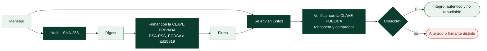

# Clase 054 — Firmas digitales

> Parte: **2 — Criptografía aplicada** · Fuente: *Serious Cryptography* (Aumasson) y NIST FIPS 186-5
> ⏱️ Duración estimada: **100 min** · Nivel: **Avanzado**

---

## 🎯 Objetivo

Comprender cómo las firmas digitales proporcionan autenticidad, integridad y no repudio usando criptografía de clave pública: se firma con la clave privada y se verifica con la pública. El alumno estudiará RSA-PSS, ECDSA y Ed25519, entenderá por qué se firma el hash del mensaje y no el mensaje entero, y por qué un nonce mal generado en ECDSA puede revelar la clave privada (caso PlayStation 3).

## 📚 Resultados de aprendizaje

Al finalizar, el alumno podrá:

1. **Explicar** el modelo firmar-con-privada / verificar-con-pública y qué garantiza.
2. **Diferenciar** firma digital de MAC (no repudio vs clave compartida).
3. **Firmar y verificar** con RSA-PSS, ECDSA y Ed25519 usando OpenSSL/Python.
4. **Explicar** por qué se firma el hash y los riesgos del nonce en ECDSA.
5. **Aplicar** firmas para verificar integridad de software.

## 🗺️ Temas

| # | Tema | Por qué importa |
|---|------|-----------------|
| 1 | Firma vs MAC | No repudio con clave pública |
| 2 | Hash-then-sign | Eficiencia y seguridad |
| 3 | RSA-PSS | Firma RSA moderna |
| 4 | ECDSA y el riesgo del nonce | Fallo famoso (PS3) |
| 5 | Ed25519 (determinista) | Elimina el riesgo del nonce |
| 6 | Verificación de software | Uso real (paquetes, releases) |
| 7 | No repudio y sus límites | Legal y técnico |

## 🧠 Explicación en profundidad

### Lo que una firma añade sobre un MAC

Una firma digital se genera con la **clave privada** y se verifica con la **pública**, y
esa asimetría cambia cualitativamente lo que se puede afirmar. Como solo el firmante posee
la clave privada, una firma válida prueba tres cosas a la vez: **integridad** (el mensaje
no cambió), **autenticidad** (viene de quien tiene esa clave) y **no repudio** (el
firmante no puede negarlo de forma creíble, porque nadie más pudo producirla). El MAC de
la clase 052 da las dos primeras pero no la tercera, porque el verificador también podría
haber fabricado la etiqueta.

Además, la verificación es **pública**: cualquiera con la clave pública puede comprobar la
firma, sin secretos compartidos. Eso es lo que hace posible firmar un paquete de software
una vez y que millones de máquinas lo verifiquen de forma independiente.

### Hash-then-sign: no se firma el mensaje, se firma su digest

Firmar directamente un mensaje grande sería lento y, en RSA, imposible por encima del
tamaño del módulo. Por eso todos los esquemas reales aplican **hash-then-sign**: se calcula
el digest del mensaje y se firma el digest. La consecuencia es que **la seguridad de la
firma queda acotada por la del hash**: si alguien encuentra una colisión, dos documentos
distintos comparten digest y una firma válida para uno lo es para el otro. Ese es el
motivo exacto por el que SHA-1 quedó prohibido para firmas tras SHAttered, y por el que se
falsificaron certificados con MD5.



### Tres esquemas y el fallo del nonce

**RSA-PSS** es la forma correcta de firmar con RSA: incorpora aleatoriedad en el relleno,
lo que lo hace probabilístico y le da una demostración de seguridad de la que carece el
antiguo PKCS#1 v1.5, todavía omnipresente por compatibilidad.

**ECDSA** firma sobre curva elíptica y es compacto y rápido, pero arrastra una fragilidad
seria: **necesita un valor aleatorio secreto (`k`, el nonce) distinto en cada firma**, y
si ese valor se repite o se filtra, **la clave privada se recupera con álgebra
elemental**. No es teórico: así se extrajo la clave de firma de código de la PlayStation
3 en 2010, porque Sony usaba un `k` constante; y varias carteras de criptomonedas han
perdido fondos por generadores de aleatoriedad defectuosos. Es la conexión más directa
entre esta clase y la 058.

**Ed25519** elimina el problema de raíz: deriva el nonce de forma **determinista** a partir
del mensaje y de la clave privada, así que no depende del generador de aleatoriedad del
sistema en el momento de firmar. Es además rápido, sus firmas son pequeñas (64 bytes) y su
implementación es resistente a canales laterales por diseño. Cuando puedas elegir, es la
recomendación.

### Dónde se usa esto de verdad, y qué no cubre

La firma digital es lo que sostiene la cadena de confianza del software: paquetes de
distribución firmados por el repositorio, *releases* firmadas en GitHub, binarios con
firma de código, imágenes de contenedor firmadas con Sigstore, y los propios certificados
X.509 de la clase 055, que no son otra cosa que una clave pública firmada por una CA.

Dos límites conviene tener claros. Primero, una firma válida solo prueba que **quien tenía
la clave** firmó: si la clave privada fue robada, la firma sigue verificando, y por eso
existen la revocación y las marcas de tiempo. Segundo, el **no repudio técnico no equivale
al jurídico**: el valor legal de una firma depende de la legislación aplicable y del
proceso que rodeó su creación, no solo de la matemática.

## 📖 Definiciones y características

- **Firma digital**: valor generado con la clave privada que cualquiera verifica con la pública. Característica: aporta no repudio, algo que el MAC no da.
- **No repudio**: el firmante no puede negar haber firmado, porque solo él posee la clave privada.
- **Hash-then-sign**: se firma el hash del mensaje; permite firmar mensajes grandes y liga la firma al contenido exacto.
- **RSA-PSS**: esquema de firma RSA probabilístico con prueba de seguridad; preferible a PKCS#1 v1.5.
- **ECDSA**: firma sobre curvas; requiere un nonce `k` único y aleatorio por firma. Repetirlo o predecirlo revela la clave privada.
- **Ed25519**: firma determinista (deriva `k` del mensaje y la clave), eliminando el riesgo del nonce; rápida y robusta.
- **Verificación de integridad de software**: firmar releases para que los usuarios comprueben autenticidad.

## 📔 Glosario

| Término | Definición concisa |
|---------|--------------------|
| Firma digital | Se genera con clave privada y se verifica con la pública |
| No repudio | El firmante no puede negar creíblemente la autoría |
| Verificación pública | Cualquiera con la clave pública puede comprobar la firma |
| Hash-then-sign | Firmar el digest en lugar del mensaje completo |
| Colisión y firmas | Dos mensajes con el mismo digest comparten firma válida |
| RSA-PSS | Relleno probabilístico moderno para firmar con RSA |
| PKCS#1 v1.5 | Relleno de firma antiguo, aún presente por compatibilidad |
| ECDSA | Firma sobre curva elíptica; depende de un nonce secreto |
| Nonce `k` de ECDSA | Repetirlo o filtrarlo revela la clave privada |
| Ed25519 | Firma con nonce determinista; elimina ese riesgo |
| Firma de código | Firma de binarios y paquetes para verificar procedencia |
| Sigstore | Infraestructura moderna de firma de artefactos de software |
| Revocación | Invalidar una clave o certificado comprometido |
| Marca de tiempo | Prueba de que la firma existía antes de una fecha |

## 🧰 Herramientas y preparación

```bash
openssl version
gpg --version   # opcional, para firma de software
pip install cryptography
```

Trabaja con tus propias claves. Firmar en nombre de otros sin autorización es fraude.

## 🧪 Laboratorio guiado

1. **Firma y verifica con OpenSSL (RSA-PSS)**:

   ```bash
   openssl genpkey -algorithm RSA -pkeyopt rsa_keygen_bits:3072 -out priv.pem
   openssl rsa -in priv.pem -pubout -out pub.pem
   openssl dgst -sha256 -sign priv.pem -sigopt rsa_padding_mode:pss \
       -out firma.bin documento.txt
   openssl dgst -sha256 -verify pub.pem -sigopt rsa_padding_mode:pss \
       -signature firma.bin documento.txt
   ```

2. **Ed25519 en Python** (ver clase 050): firma un documento y verifica; altera un byte del documento y comprueba que la verificación falla.

3. **Riesgo del nonce en ECDSA (concepto)**. Explica con la fórmula cómo, si dos firmas usan el mismo `k`, se despeja la clave privada. Es exactamente el fallo que rompió la firma de código de la PS3.

4. **Detecta manipulación de software**: firma un binario, publica la clave pública, y muestra que cualquier modificación invalida la firma.

## ✍️ Ejercicios

1. Explica la diferencia entre firma digital y HMAC en cuanto a no repudio.
2. Firma un archivo con RSA-PSS y verifica con la clave pública.
3. Investiga el fallo de nonce de ECDSA en la PlayStation 3.
4. ¿Por qué Ed25519 es determinista y por qué eso ayuda?
5. Verifica la firma GPG de un release real de software libre.
6. Explica por qué firmar el hash (no el mensaje) es seguro y eficiente.

## 📝 Reto verificable

Construye un verificador de releases: firma un conjunto de artefactos con Ed25519, publica la clave pública y entrega un script que valide cada artefacto contra su firma. **Criterio de aceptación**: cualquier artefacto alterado o firma inválida se reporta como no confiable, y solo los íntegros pasan la verificación.

## ⚠️ Errores comunes

| Síntoma / mensaje | Causa y cómo arreglar |
|-------------------|-----------------------|
| Verificación siempre válida | No estás comparando con el documento correcto o ignoras el resultado |
| Nonce reutilizado en ECDSA | Revela la clave; usa RFC 6979 o Ed25519 |
| Firmar con PKCS#1 v1.5 nuevo | Prefiere PSS para diseños nuevos |
| Confundir firmar con cifrar | Son operaciones distintas; firma con privada para autenticar |
| No verificar la clave pública del firmante | Un atacante puede sustituirla; ánclala vía PKI o huella conocida |

## ❓ Preguntas frecuentes

**❓ ¿Firma = cifrar con la clave privada?**
Es una simplificación peligrosa. Los esquemas modernos (PSS, EdDSA) no son "RSA al revés"; usa la primitiva de firma, no operaciones crudas.

**❓ ¿Qué firma elijo hoy?**
Ed25519 por defecto (rápida, sin riesgo de nonce). RSA-PSS o ECDSA cuando la compatibilidad lo exija.

**❓ ¿La firma garantiza que el contenido es verdad?**
No; garantiza quién lo firmó y que no cambió. La veracidad del contenido es otra cosa.

## 🔗 Referencias

- NIST FIPS 186-5 (firmas) — <https://csrc.nist.gov/publications/detail/fips/186/5/final>
- RFC 8032 (EdDSA) — <https://www.rfc-editor.org/rfc/rfc8032>
- RFC 6979 (nonce determinista para ECDSA) — <https://www.rfc-editor.org/rfc/rfc6979>
- Aumasson, *Serious Cryptography*, cap. 10–12.

## 📥 Material descargable

- 📄 [Guía en PDF](./clase-054-guia.pdf) — versión imprimible de esta clase.
- 🎞️ [Presentación (PPTX)](./clase-054-presentacion.pptx) — deck para proyectar en clase.

## ⬅️ Clase anterior

[Clase 053 — Intercambio de claves: Diffie-Hellman](../053-intercambio-de-claves-diffie-hellman/README.md)

## ➡️ Siguiente clase

[Clase 055 — PKI, certificados X.509 y autoridades de certificación](../055-pki-certificados-x-509-y-autoridades-de-certificacion/README.md)
