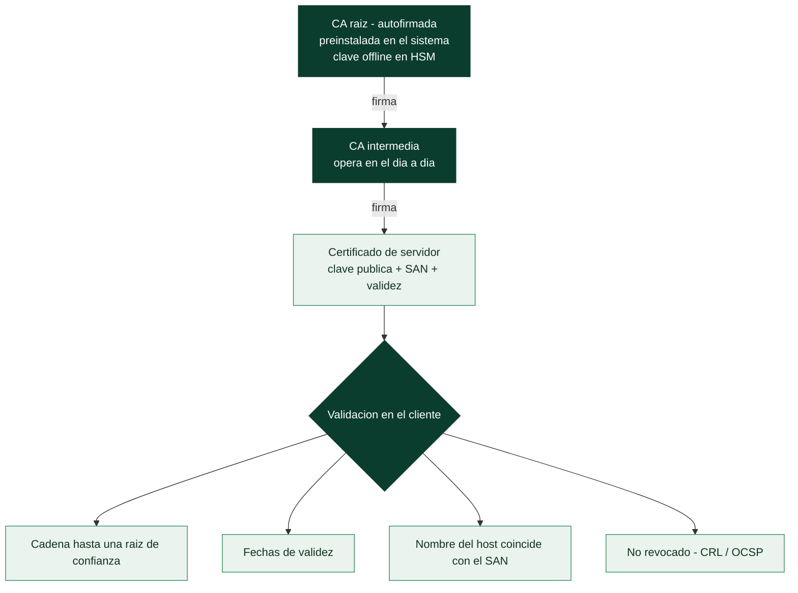

# Clase 055 — PKI, certificados X.509 y autoridades de certificación

> Parte: **2 — Criptografía aplicada** · Fuente: *Real-World Cryptography* (Wong) e IETF RFC 5280
> ⏱️ Duración estimada: **120 min** · Nivel: **Avanzado**

---

## 🎯 Objetivo

Comprender cómo se resuelve el problema de "¿de quién es esta clave pública?" mediante la infraestructura de clave pública (PKI): certificados X.509, autoridades de certificación (CA), cadenas de confianza, y mecanismos de revocación (CRL, OCSP). El alumno construirá su propia CA de laboratorio con OpenSSL, emitirá certificados y comprenderá cómo el navegador valida una cadena hasta una raíz de confianza.

## 📚 Resultados de aprendizaje

Al finalizar, el alumno podrá:

1. **Describir** la estructura de un certificado X.509 y sus campos clave.
2. **Explicar** la cadena de confianza (raíz → intermedia → hoja) y su validación.
3. **Crear** una CA propia, emitir un CSR y firmar un certificado con OpenSSL.
4. **Comparar** mecanismos de revocación (CRL, OCSP, OCSP stapling).
5. **Identificar** riesgos de PKI (CA comprometida, misemisión) y mitigaciones (CT, pinning).

## 🗺️ Temas

| # | Tema | Por qué importa |
|---|------|-----------------|
| 1 | Problema de confianza en claves | Motiva la PKI |
| 2 | Certificado X.509 | Vincula identidad y clave |
| 3 | CA y cadena de confianza | Delegación de confianza |
| 4 | CSR y emisión | Cómo se pide un certificado |
| 5 | Revocación (CRL/OCSP) | Invalidar antes de expirar |
| 6 | Certificate Transparency | Detectar misemisión |
| 7 | Let's Encrypt / ACME | PKI moderna automatizada |

## 🧠 Explicación en profundidad

### La pregunta que la criptografía asimétrica no responde sola

Tener una clave pública no sirve de nada si no sabes **de quién es**. Si un atacante te
entrega su clave diciendo que es la de tu banco, cifrarás para él y verificarás sus firmas
tan felizmente como lo harías con las auténticas. Ese es el **problema de la distribución
de confianza**, y la **PKI** es la respuesta industrial: una jerarquía de autoridades que
avalan, con su propia firma, que una clave pública pertenece a una identidad concreta.

El vehículo de ese aval es el **certificado X.509**: un documento estructurado que contiene
la clave pública, el sujeto al que pertenece (`Subject`, y los nombres alternativos `SAN`,
que son los que de verdad valida un navegador moderno), el emisor, el periodo de validez,
los usos permitidos y, atándolo todo, la **firma digital de la CA**. Un certificado es,
literalmente, una aplicación de la clase 054: una clave pública firmada por alguien en
quien ya confías.

### La cadena de confianza y su punto de apoyo

La confianza se delega en cascada. En la base están las **CA raíz**, cuyos certificados
son autofirmados y vienen preinstalados en el sistema operativo y en el navegador: son el
**anclaje de confianza**, y se confía en ellas por decisión del fabricante, no por
criptografía. Las raíces firman **CA intermedias** —que operan en el día a día, para que
la clave de la raíz pueda guardarse desconectada en un HSM— y estas firman los
certificados de servidor. Verificar un certificado consiste en recorrer esa cadena hacia
arriba comprobando cada firma hasta llegar a una raíz de confianza, y validar además
fechas, nombre y usos.



### El ciclo de vida: emisión y, sobre todo, revocación

Para obtener un certificado se genera un par de claves y se envía una **CSR** (*Certificate
Signing Request*) con la clave **pública** y los datos del sujeto —la privada nunca sale
del servidor—. La CA valida la identidad con distinto rigor según el tipo: **DV** solo
comprueba control del dominio, **OV** verifica la organización y **EV** hace una
validación extendida (los navegadores dejaron de darle tratamiento visual especial, porque
no reducía el fraude).

La parte incómoda es la **revocación**: qué hacer cuando una clave se compromete antes de
que el certificado expire. Las **CRL** son listas de revocados que el cliente debería
descargar, pero crecen y se consultan mal. **OCSP** permite preguntar por un certificado
concreto, a costa de latencia y de filtrar al respondedor qué sitios visita el usuario; el
**OCSP stapling** lo arregla haciendo que sea el propio servidor quien adjunte una
respuesta firmada y reciente. Aun así, la revocación sigue siendo **el eslabón más débil
de la PKI**: históricamente muchos navegadores fallaban en abierto —si no podían
comprobarlo, aceptaban—, y la respuesta práctica ha sido acortar drásticamente la
validez de los certificados, de años a semanas.

### Cuando la confianza falla, y cómo se detecta

El modelo tiene una debilidad estructural: **cualquier CA de confianza puede emitir un
certificado para cualquier dominio**. Los casos de DigiNotar (2011), comprometida y usada
para emitir certificados de Google empleados en vigilancia masiva en Irán, y Symantec
(retirada por emisiones indebidas) lo demostraron. La respuesta fue **Certificate
Transparency**: registros públicos, verificables y de solo-anexado donde toda emisión debe
publicarse, de modo que el dueño de un dominio puede detectar certificados que él no pidió.
No previene la misemisión: la hace **detectable**, que en un sistema con cientos de CA es
la propiedad alcanzable.

En paralelo, **Let's Encrypt** y el protocolo **ACME** cambiaron la economía del cifrado
web: certificados gratuitos, emitidos y renovados automáticamente, que llevaron el HTTPS
de una minoría a la norma. Y su corolario práctico conviene recordarlo: un certificado
válido prueba **control del dominio**, no honradez. Un sitio de *phishing* con candado
verde es perfectamente posible, y de hecho habitual.

## 📖 Definiciones y características

- **PKI**: conjunto de roles, políticas y procedimientos para gestionar certificados de clave pública. Característica: escala la confianza mediante CAs.
- **Certificado X.509**: documento firmado por una CA que vincula una identidad (dominio) con una clave pública, con validez y extensiones (SAN, uso de clave).
- **Autoridad de certificación (CA)**: entidad de confianza que firma certificados. Su clave raíz está preinstalada en sistemas y navegadores.
- **Cadena de confianza**: raíz → intermedia(s) → hoja; se valida cada firma hasta un ancla de confianza.
- **CSR (Certificate Signing Request)**: solicitud que contiene la clave pública y datos del solicitante; la CA la firma.
- **CRL / OCSP**: listas de revocación y consulta en línea del estado de un certificado. **OCSP stapling** adjunta la respuesta al handshake.
- **Certificate Transparency (CT)**: registros públicos y auditables de certificados emitidos, para detectar emisiones fraudulentas.

## 📔 Glosario

| Término | Definición concisa |
|---------|--------------------|
| PKI | Infraestructura que vincula claves públicas con identidades |
| Certificado X.509 | Documento con clave pública, identidad y firma de la CA |
| `Subject` / SAN | Identidad del titular; los SAN son los nombres que se validan |
| CA | Autoridad de certificación que firma certificados |
| CA raíz | Certificado autofirmado preinstalado; anclaje de confianza |
| CA intermedia | Firma los certificados finales; protege la clave raíz |
| Cadena de confianza | Recorrido de firmas desde el certificado hasta una raíz |
| Anclaje de confianza | Raíz en la que se confía por decisión, no por criptografía |
| CSR | Petición de firma con la clave pública y los datos del sujeto |
| DV / OV / EV | Niveles de validación: dominio, organización, extendida |
| CRL | Lista de certificados revocados |
| OCSP | Consulta en línea del estado de un certificado |
| OCSP stapling | El servidor adjunta una respuesta OCSP firmada y reciente |
| Certificate Transparency | Registros públicos que hacen detectable la misemisión |
| DigiNotar | CA comprometida en 2011; caso canónico del fallo del modelo |
| Let's Encrypt / ACME | CA gratuita y protocolo de emisión y renovación automáticas |

## 🧰 Herramientas y preparación

```bash
openssl version
```

Toda la PKI es de laboratorio: son certificados propios que no serán confiados por navegadores reales, y así debe ser.

## 🧪 Laboratorio guiado

1. **Crea tu CA raíz**:

   ```bash
   openssl genpkey -algorithm RSA -pkeyopt rsa_keygen_bits:4096 -out ca.key
   openssl req -x509 -new -key ca.key -sha256 -days 3650 \
       -subj "/CN=Lab Root CA" -out ca.crt
   ```

2. **Genera clave y CSR del servidor**:

   ```bash
   openssl genpkey -algorithm RSA -pkeyopt rsa_keygen_bits:2048 -out srv.key
   openssl req -new -key srv.key -subj "/CN=lab.local" -out srv.csr
   ```

3. **Firma el certificado del servidor con la CA** (con SAN):

   ```bash
   openssl x509 -req -in srv.csr -CA ca.crt -CAkey ca.key -CAcreateserial \
       -days 365 -sha256 -extfile <(printf "subjectAltName=DNS:lab.local") -out srv.crt
   ```

4. **Inspecciona y valida la cadena**:

   ```bash
   openssl x509 -in srv.crt -text -noout | head -n 20
   openssl verify -CAfile ca.crt srv.crt
   ```

5. **Explora Certificate Transparency**. Consulta un registro público (por ejemplo crt.sh en el navegador) para un dominio y observa cuántos certificados se han emitido; discute cómo esto detecta misemisiones.

## ✍️ Ejercicios

1. Enumera y explica cinco campos de un certificado X.509 real (`openssl x509 -text`).
2. Emite un certificado con varias entradas SAN y verifícalo.
3. Compara CRL, OCSP y OCSP stapling en latencia y privacidad.
4. Explica qué ocurre si se compromete la clave de una CA raíz.
5. Investiga el incidente de DigiNotar y sus consecuencias.
6. Describe el flujo ACME de Let's Encrypt paso a paso.

## 📝 Reto verificable

Construye una PKI de dos niveles (raíz + intermedia) y emite un certificado de servidor firmado por la intermedia; configura un servidor TLS de laboratorio que presente la cadena completa. **Criterio de aceptación**: `openssl verify -CAfile ca.crt -untrusted intermedia.crt srv.crt` devuelve OK y un cliente valida la cadena hasta la raíz.

## ⚠️ Errores comunes

| Síntoma / mensaje | Causa y cómo arreglar |
|-------------------|-----------------------|
| `unable to get local issuer certificate` | Falta la intermedia; incluye la cadena completa |
| Navegador rechaza el certificado | CN sin SAN; los navegadores exigen SAN |
| `certificate has expired` | Validez vencida; reemite |
| Confiar en la raíz de laboratorio en producción | Nunca; usa CAs públicas reales |
| No revocar tras compromiso de clave | Publica CRL/OCSP y reemite |

## ❓ Preguntas frecuentes

**❓ ¿Por qué hay CAs intermedias?**
Para proteger la raíz (offline) y limitar el daño si se compromete una intermedia, que puede revocarse.

**❓ ¿Cómo confía mi navegador en un sitio?**
Valida la cadena de firmas hasta una raíz de su almacén de confianza, comprueba validez, SAN y revocación.

**❓ ¿Qué es el certificate pinning?**
Fijar una clave/certificado esperado en la app para no depender solo de la PKI; reduce el riesgo de CA comprometida.

## 🔗 Referencias

- IETF RFC 5280 (X.509) — <https://www.rfc-editor.org/rfc/rfc5280>
- Wong, *Real-World Cryptography*, cap. 9.
- RFC 6962 (Certificate Transparency) — <https://www.rfc-editor.org/rfc/rfc6962>
- Let's Encrypt / ACME (RFC 8555) — <https://letsencrypt.org/how-it-works/>

## 📥 Material descargable

- 📄 [Guía en PDF](./clase-055-guia.pdf) — versión imprimible de esta clase.
- 🎞️ [Presentación (PPTX)](./clase-055-presentacion.pptx) — deck para proyectar en clase.

## ⬅️ Clase anterior

[Clase 054 — Firmas digitales](../054-firmas-digitales/README.md)

## ➡️ Siguiente clase

[Clase 056 — TLS/SSL en profundidad](../056-tls-ssl-en-profundidad/README.md)
