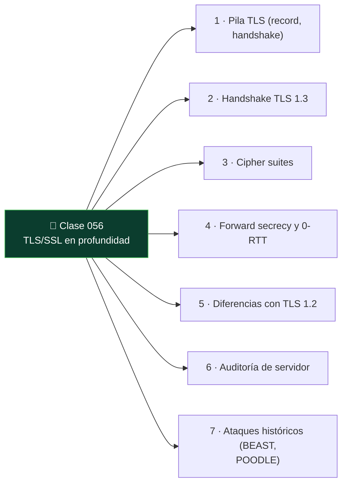

# Clase 056 — TLS/SSL en profundidad

<!-- cabecera:inicio -->

<div align="center">

[](../README.md)
[](../../README.md)
[](../../README.md)
[](../../README.md)

</div>

> 🗂️ Parte: **2 — Criptografía aplicada** · 📖 Fuente: *Real-World Cryptography* (Wong) e IETF RFC 8446 (TLS 1.3)
> ⏱️ Duración estimada: **130 min** · 🎚️ Nivel: **Avanzado**

<!-- cabecera:fin -->

---

## 🎯 Objetivo

Entender cómo TLS combina todo lo aprendido (intercambio de claves, firmas, certificados, AEAD) en el protocolo que asegura la web. El alumno analizará el handshake de TLS 1.3, comparará con TLS 1.2, entenderá las cipher suites, la forward secrecy obligatoria y el 0-RTT, y aprenderá a auditar la configuración TLS de un servidor con herramientas reales.

## 📚 Resultados de aprendizaje

Al finalizar, el alumno podrá:

1. **Describir** el handshake de TLS 1.3 y cómo deriva las claves de sesión.
2. **Comparar** TLS 1.2 y 1.3 (rondas, cipher suites, forward secrecy).
3. **Interpretar** una cipher suite y sus componentes.
4. **Auditar** un servidor TLS con `openssl s_client`, `testssl.sh` y Wireshark.
5. **Detectar** configuraciones débiles (protocolos viejos, cifrados inseguros).

## 🗺️ Temas

<!-- mapa:inicio -->



<!-- mapa:fin -->

| # | Tema | Por qué importa |
|---|------|-----------------|
| 1 | Pila TLS (record, handshake) | Estructura del protocolo |
| 2 | Handshake TLS 1.3 | Núcleo de la seguridad |
| 3 | Cipher suites | Qué algoritmos se negocian |
| 4 | Forward secrecy y 0-RTT | Beneficios y riesgos |
| 5 | Diferencias con TLS 1.2 | Migración y legado |
| 6 | Auditoría de servidor | Práctica de seguridad |
| 7 | Ataques históricos (BEAST, POODLE) | Por qué evolucionó |

## 📖 Definiciones y características

- **TLS (Transport Layer Security)**: protocolo que da confidencialidad, integridad y autenticación sobre TCP. Característica: negocia parámetros en el handshake.
- **Handshake**: fase inicial donde cliente y servidor autentican (certificado), acuerdan claves (ECDHE) y establecen cifrado.
- **Cipher suite**: combinación de algoritmos. En TLS 1.3 se simplifica (p. ej. `TLS_AES_128_GCM_SHA256`): AEAD + hash.
- **Forward secrecy**: obligatoria en TLS 1.3 vía ECDHE efímero; protege sesiones pasadas.
- **0-RTT**: reanudación con datos tempranos; reduce latencia pero es vulnerable a replay si se usa mal.
- **Record layer**: fragmenta y protege los datos de aplicación tras el handshake con AEAD.
- **SNI / ESNI-ECH**: indica el host destino; ECH lo cifra para privacidad.

## 🧰 Herramientas y preparación

```bash
openssl version
# testssl.sh (script de auditoría)
git clone --depth 1 https://github.com/testssl/testssl.sh
```

Audita solo servidores propios o con autorización explícita. Escanear sistemas ajenos puede ser ilegal.

## 🧪 Laboratorio guiado

1. **Inspecciona un handshake** contra tu servidor de laboratorio:

   ```bash
   openssl s_client -connect lab.local:443 -tls1_3 -servername lab.local </dev/null
   ```

   Observa la versión negociada, la cipher suite y la cadena de certificados.

2. **Captura con Wireshark**. Filtra `tls.handshake` y localiza ClientHello, ServerHello y los mensajes cifrados. En TLS 1.3 gran parte del handshake ya va cifrado.

3. **Audita la configuración**:

   ```bash
   ./testssl.sh --protocols --ciphers lab.local:443
   ```

   Identifica si hay SSLv3/TLS1.0 habilitados o cifrados débiles (RC4, 3DES).

4. **Levanta un servidor TLS 1.3 de laboratorio** con los certificados de la clase 055:

   ```bash
   openssl s_server -cert srv.crt -key srv.key -tls1_3 -accept 4443 -www
   ```

5. **Compara 1.2 vs 1.3**. Fuerza `-tls1_2` y observa la diferencia en número de rondas y mensajes visibles.

## ✍️ Ejercicios

1. Descompón la cipher suite `TLS_AES_256_GCM_SHA384` en sus partes.
2. Explica por qué TLS 1.3 hace el handshake en 1-RTT frente a 2-RTT de 1.2.
3. Audita un servidor propio con testssl.sh y lista los hallazgos.
4. Investiga los ataques POODLE y BEAST y qué versiones afectaban.
5. Explica el riesgo de replay del 0-RTT y cómo mitigarlo.
6. Captura un handshake y anota qué mensajes viajan en claro y cuáles cifrados.

## 📝 Reto verificable

Configura un servidor TLS de laboratorio que solo acepte TLS 1.3 con cipher suites AEAD y forward secrecy, presentando la cadena de la clase 055. **Criterio de aceptación**: `testssl.sh` no reporta protocolos ni cifrados inseguros, la conexión negocia TLS 1.3 con ECDHE, y un cliente valida la cadena completa.

## ⚠️ Errores comunes

| Síntoma / mensaje | Causa y cómo arreglar |
|-------------------|-----------------------|
| `sslv3 alert handshake failure` | Cliente/servidor sin cipher suites comunes; alinea configuración |
| Protocolos viejos habilitados | Deshabilita SSLv3/TLS1.0/1.1 |
| `unable to verify the first certificate` | Falta la intermedia en la cadena servida |
| 0-RTT causa duplicados | Datos tempranos no idempotentes; restríngelos |
| Certificado sin SAN o expirado | Reemite con SAN y validez correcta |

## ❓ Preguntas frecuentes

**❓ ¿SSL y TLS son lo mismo?**
SSL es el predecesor (inseguro y retirado). Hoy se usa TLS; "SSL" persiste coloquialmente.

**❓ ¿Debo desactivar TLS 1.2?**
No necesariamente; 1.2 bien configurado es seguro. Prioriza 1.3 y elimina 1.0/1.1 y cifrados débiles.

**❓ ¿Qué hace especial a TLS 1.3?**
Handshake más rápido y cifrado, forward secrecy obligatoria, cipher suites reducidas y sin algoritmos heredados inseguros.

## 🔗 Referencias

- IETF RFC 8446 (TLS 1.3) — <https://www.rfc-editor.org/rfc/rfc8446>
- Wong, *Real-World Cryptography*, cap. 9.
- testssl.sh — <https://testssl.sh/>
- Mozilla SSL Configuration Generator — <https://ssl-config.mozilla.org/>

## 📥 Material descargable

- 📄 [Guía en PDF](./clase-056-guia.pdf) — versión imprimible de esta clase.
- 🎞️ [Presentación (PPTX)](./clase-056-presentacion.pptx) — deck para proyectar en clase.

## ⬅️ Clase anterior

[Clase 055 — PKI, certificados X.509 y autoridades de certificación](../055-pki-certificados-x-509-y-autoridades-de-certificacion/README.md)

## ➡️ Siguiente clase

[Clase 057 — Almacenamiento seguro de contraseñas: bcrypt, scrypt y Argon2](../057-almacenamiento-seguro-de-contrasenas-bcrypt-scrypt-y-argon2/README.md)
