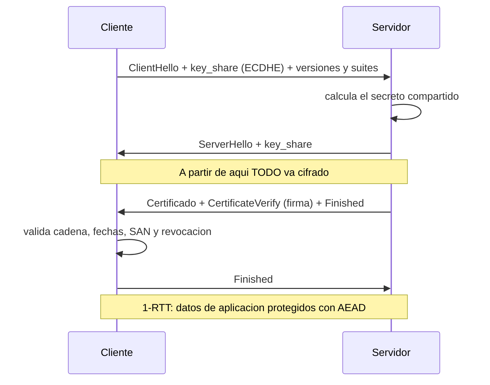

# Clase 056 — TLS/SSL en profundidad

> Parte: **2 — Criptografía aplicada** · Fuente: *Real-World Cryptography* (Wong) e IETF RFC 8446 (TLS 1.3)
> ⏱️ Duración estimada: **130 min** · Nivel: **Avanzado**

---

## 🎯 Objetivo

Entender cómo TLS combina todo lo aprendido (intercambio de claves, firmas, certificados, AEAD) en el protocolo que asegura la web. El alumno analizará el handshake de TLS 1.3, comparará con TLS 1.2, entenderá las cipher suites, la forward secrecy obligatoria y el 0-RTT, y aprenderá a auditar la configuración TLS de un servidor con herramientas reales.

## 📚 Resultados de aprendizaje

Al finalizar, el alumno podrá:

1. **Describir** el handshake de TLS 1.3 y cómo deriva las claves de sesión.
2. **Comparar** TLS 1.2 y 1.3 (rondas, cipher suites, forward secrecy).
3. **Interpretar** una cipher suite y sus componentes.
4. **Auditar** un servidor TLS con `openssl s_client`, `testssl.sh` y Wireshark.
5. **Detectar** configuraciones débiles (protocolos viejos, cifrados inseguros).

## 🗺️ Temas

| # | Tema | Por qué importa |
|---|------|-----------------|
| 1 | Pila TLS (record, handshake) | Estructura del protocolo |
| 2 | Handshake TLS 1.3 | Núcleo de la seguridad |
| 3 | Cipher suites | Qué algoritmos se negocian |
| 4 | Forward secrecy y 0-RTT | Beneficios y riesgos |
| 5 | Diferencias con TLS 1.2 | Migración y legado |
| 6 | Auditoría de servidor | Práctica de seguridad |
| 7 | Ataques históricos (BEAST, POODLE) | Por qué evolucionó |

## 🧠 Explicación en profundidad

### TLS es el sitio donde todo lo anterior se ensambla

TLS no aporta primitivas nuevas: **compone** las de las clases previas para conseguir un
canal con confidencialidad, integridad y autenticación del servidor. Usa **ECDHE** para
acordar la clave con forward secrecy (clase 053), una **firma** y un **certificado X.509**
para autenticar al servidor (clases 054 y 055), **HKDF** para derivar las claves de
sesión, y un **AEAD** —AES-GCM o ChaCha20-Poly1305— para proteger los datos (clase 059).
Estudiar TLS es, en la práctica, comprobar que se entendió todo lo demás.

Estructuralmente son dos capas. El **protocolo de handshake** negocia parámetros,
autentica y establece las claves; el **protocolo de registro** (*record*) trocea y protege
los datos de aplicación con las claves ya establecidas.

### El handshake de TLS 1.3, y por qué cabe en una vuelta

TLS 1.3 (RFC 8446, 2018) es una simplificación radical más que una mejora incremental.
El cliente envía su `ClientHello` **adelantando ya** su parte del intercambio de claves
(`key_share`) para las curvas más probables, en lugar de esperar a negociar cuál se usa.
El servidor responde con su `ServerHello` y su `key_share`, y **a partir de ahí ya cifra
el resto del handshake**, incluido su propio certificado —que en TLS 1.2 viajaba en
claro—. Con eso, el handshake completo cuesta **1-RTT** en lugar de 2.

El diseño se endureció eliminando opciones en lugar de añadirlas: fuera RSA como método
de intercambio de claves (no daba forward secrecy), fuera CBC y RC4, fuera la compresión
(que habilitaba CRIME) y fuera la renegociación. Las **cipher suites** pasaron de nombres
kilométricos que mezclaban cuatro decisiones a solo cinco opciones que especifican
únicamente el AEAD y el hash, porque el resto ya no se negocia. Menos opciones significa
menos combinaciones inseguras y menos superficie para ataques de *downgrade*.



### 0-RTT: velocidad a cambio de una garantía

TLS 1.3 añade **0-RTT**, que permite a un cliente que ya se conectó antes enviar datos
en el primer mensaje usando una clave derivada de la sesión anterior. Es muy rápido y
tiene un coste concreto que hay que decidir a conciencia: esos datos **no tienen forward
secrecy** y son **susceptibles de repetición** (*replay*), porque el servidor no ha
aportado todavía nada fresco a la conversación. La regla operativa es clara: 0-RTT solo
para peticiones **idempotentes** (un `GET` que no cambia estado), nunca para una
transferencia o un cambio de contraseña.

### Por qué TLS es como es: una historia de ataques

Cada rareza del protocolo moderno es la cicatriz de un ataque. **BEAST** explotó los IV
predecibles de CBC en TLS 1.0. **CRIME** y **BREACH** dedujeron secretos observando cómo
variaba el tamaño con la compresión. **POODLE** forzaba un *downgrade* a SSL 3.0 para
explotar su relleno mal especificado. **Lucky13** midió tiempos en la verificación
MAC-then-encrypt. **Heartbleed** no fue un fallo del protocolo sino de OpenSSL: una lectura
fuera de límites que filtraba memoria del servidor, incluidas claves privadas. Y
**FREAK** y **Logjam** revivieron cifrados de exportación deliberadamente debilitados en
los años noventa, la mejor prueba de que **debilitar la criptografía por decreto deja
deuda técnica explotable durante décadas**.

De ahí sale la parte práctica de la clase: auditar un servidor no es opcional. Comprobar
qué versiones acepta (TLS 1.2 y 1.3, nada por debajo), qué suites ofrece, si tiene forward
secrecy, si la cadena de certificados está completa, y si envía HSTS —la cabecera de la
clase 040 que impide el *stripping*—. Herramientas como `testssl.sh`, `sslyze` o SSL Labs
automatizan esa revisión.

## 📖 Definiciones y características

- **TLS (Transport Layer Security)**: protocolo que da confidencialidad, integridad y autenticación sobre TCP. Característica: negocia parámetros en el handshake.
- **Handshake**: fase inicial donde cliente y servidor autentican (certificado), acuerdan claves (ECDHE) y establecen cifrado.
- **Cipher suite**: combinación de algoritmos. En TLS 1.3 se simplifica (p. ej. `TLS_AES_128_GCM_SHA256`): AEAD + hash.
- **Forward secrecy**: obligatoria en TLS 1.3 vía ECDHE efímero; protege sesiones pasadas.
- **0-RTT**: reanudación con datos tempranos; reduce latencia pero es vulnerable a replay si se usa mal.
- **Record layer**: fragmenta y protege los datos de aplicación tras el handshake con AEAD.
- **SNI / ESNI-ECH**: indica el host destino; ECH lo cifra para privacidad.

## 📔 Glosario

| Término | Definición concisa |
|---------|--------------------|
| TLS | Protocolo que da confidencialidad, integridad y autenticación al canal |
| Protocolo de handshake | Negocia parámetros, autentica y establece claves |
| Protocolo de registro | Trocea y protege los datos ya con las claves de sesión |
| `ClientHello` / `ServerHello` | Primeros mensajes del handshake |
| `key_share` | Parte del ECDHE adelantada en TLS 1.3 |
| 1-RTT | Handshake completo en una sola vuelta |
| 0-RTT | Datos en el primer mensaje; sin forward secrecy y con riesgo de replay |
| Cipher suite | Conjunto de algoritmos negociados; en TLS 1.3 solo AEAD y hash |
| Forward secrecy | Obligatoria en TLS 1.3 al exigir intercambio efímero |
| Downgrade | Forzar una versión o suite más débil |
| BEAST / POODLE | Ataques sobre CBC y sobre el relleno de SSL 3.0 |
| CRIME / BREACH | Deducción de secretos mediante la compresión |
| Lucky13 | Ataque de timing sobre MAC-then-encrypt |
| Heartbleed | Fallo de implementación de OpenSSL que filtraba memoria |
| FREAK / Logjam | Explotación de cifrados de exportación debilitados |
| `testssl.sh` / SSL Labs | Herramientas de auditoría de configuración TLS |

## 🧰 Herramientas y preparación

```bash
openssl version
# testssl.sh (script de auditoría)
git clone --depth 1 https://github.com/testssl/testssl.sh
```

Audita solo servidores propios o con autorización explícita. Escanear sistemas ajenos puede ser ilegal.

## 🧪 Laboratorio guiado

1. **Inspecciona un handshake** contra tu servidor de laboratorio:

   ```bash
   openssl s_client -connect lab.local:443 -tls1_3 -servername lab.local </dev/null
   ```

   Observa la versión negociada, la cipher suite y la cadena de certificados.

2. **Captura con Wireshark**. Filtra `tls.handshake` y localiza ClientHello, ServerHello y los mensajes cifrados. En TLS 1.3 gran parte del handshake ya va cifrado.

3. **Audita la configuración**:

   ```bash
   ./testssl.sh --protocols --ciphers lab.local:443
   ```

   Identifica si hay SSLv3/TLS1.0 habilitados o cifrados débiles (RC4, 3DES).

4. **Levanta un servidor TLS 1.3 de laboratorio** con los certificados de la clase 055:

   ```bash
   openssl s_server -cert srv.crt -key srv.key -tls1_3 -accept 4443 -www
   ```

5. **Compara 1.2 vs 1.3**. Fuerza `-tls1_2` y observa la diferencia en número de rondas y mensajes visibles.

## ✍️ Ejercicios

1. Descompón la cipher suite `TLS_AES_256_GCM_SHA384` en sus partes.
2. Explica por qué TLS 1.3 hace el handshake en 1-RTT frente a 2-RTT de 1.2.
3. Audita un servidor propio con testssl.sh y lista los hallazgos.
4. Investiga los ataques POODLE y BEAST y qué versiones afectaban.
5. Explica el riesgo de replay del 0-RTT y cómo mitigarlo.
6. Captura un handshake y anota qué mensajes viajan en claro y cuáles cifrados.

## 📝 Reto verificable

Configura un servidor TLS de laboratorio que solo acepte TLS 1.3 con cipher suites AEAD y forward secrecy, presentando la cadena de la clase 055. **Criterio de aceptación**: `testssl.sh` no reporta protocolos ni cifrados inseguros, la conexión negocia TLS 1.3 con ECDHE, y un cliente valida la cadena completa.

## ⚠️ Errores comunes

| Síntoma / mensaje | Causa y cómo arreglar |
|-------------------|-----------------------|
| `sslv3 alert handshake failure` | Cliente/servidor sin cipher suites comunes; alinea configuración |
| Protocolos viejos habilitados | Deshabilita SSLv3/TLS1.0/1.1 |
| `unable to verify the first certificate` | Falta la intermedia en la cadena servida |
| 0-RTT causa duplicados | Datos tempranos no idempotentes; restríngelos |
| Certificado sin SAN o expirado | Reemite con SAN y validez correcta |

## ❓ Preguntas frecuentes

**❓ ¿SSL y TLS son lo mismo?**
SSL es el predecesor (inseguro y retirado). Hoy se usa TLS; "SSL" persiste coloquialmente.

**❓ ¿Debo desactivar TLS 1.2?**
No necesariamente; 1.2 bien configurado es seguro. Prioriza 1.3 y elimina 1.0/1.1 y cifrados débiles.

**❓ ¿Qué hace especial a TLS 1.3?**
Handshake más rápido y cifrado, forward secrecy obligatoria, cipher suites reducidas y sin algoritmos heredados inseguros.

## 🔗 Referencias

- IETF RFC 8446 (TLS 1.3) — <https://www.rfc-editor.org/rfc/rfc8446>
- Wong, *Real-World Cryptography*, cap. 9.
- testssl.sh — <https://testssl.sh/>
- Mozilla SSL Configuration Generator — <https://ssl-config.mozilla.org/>

## 📥 Material descargable

- 📄 [Guía en PDF](./clase-056-guia.pdf) — versión imprimible de esta clase.
- 🎞️ [Presentación (PPTX)](./clase-056-presentacion.pptx) — deck para proyectar en clase.

## ⬅️ Clase anterior

[Clase 055 — PKI, certificados X.509 y autoridades de certificación](../055-pki-certificados-x-509-y-autoridades-de-certificacion/README.md)

## ➡️ Siguiente clase

[Clase 057 — Almacenamiento seguro de contraseñas: bcrypt, scrypt y Argon2](../057-almacenamiento-seguro-de-contrasenas-bcrypt-scrypt-y-argon2/README.md)
