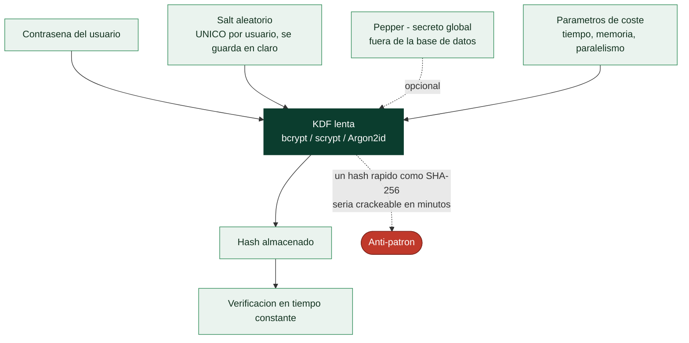

# Clase 057 — Almacenamiento seguro de contraseñas: bcrypt, scrypt y Argon2

> Parte: **2 — Criptografía aplicada** · Fuente: *Real-World Cryptography* (Wong) y OWASP Password Storage Cheat Sheet
> ⏱️ Duración estimada: **100 min** · Nivel: **Intermedio**

---

## 🎯 Objetivo

Aprender a almacenar contraseñas de forma resistente a cracking usando funciones de derivación de clave lentas y con memoria intensiva (bcrypt, scrypt, Argon2), y por qué usar SHA-256 o MD5 para contraseñas es un error grave. El alumno entenderá el papel del salt, el pepper, el factor de coste y estimará el coste real de un ataque con hashcat en un entorno de laboratorio.

> ⚠️ **Nota ética**: el cracking de hashes se practica **solo** sobre contraseñas y volcados propios de laboratorio. Atacar credenciales ajenas sin autorización es ilegal.

## 📚 Resultados de aprendizaje

Al finalizar, el alumno podrá:

1. **Explicar** por qué las contraseñas requieren funciones lentas, no hashes rápidos.
2. **Aplicar** salt (único por usuario) y pepper (secreto global) correctamente.
3. **Configurar** parámetros de coste de bcrypt/scrypt/Argon2.
4. **Almacenar y verificar** contraseñas con Argon2id en Python.
5. **Estimar** el coste de un ataque de diccionario/fuerza bruta con hashcat.

## 🗺️ Temas

| # | Tema | Por qué importa |
|---|------|-----------------|
| 1 | Por qué no SHA-256 para contraseñas | Demasiado rápido de crackear |
| 2 | Salt (por usuario) | Rompe rainbow tables |
| 3 | Pepper (secreto global) | Defensa adicional |
| 4 | bcrypt y factor de coste | Estándar histórico |
| 5 | scrypt y Argon2 (memory-hard) | Resisten GPU/ASIC |
| 6 | Verificación en tiempo constante | Evita timing |
| 7 | Ataques con hashcat (lab) | Medir la resistencia real |

## 🧠 Explicación en profundidad

### La velocidad, que en un hash es una virtud, aquí es el enemigo

SHA-256 está diseñado para ser rapidísimo, y eso es exactamente lo que lo hace inservible
para almacenar contraseñas. Una GPU doméstica calcula del orden de **miles de millones**
de SHA-256 por segundo; contra una base de datos filtrada, eso significa probar todo un
diccionario y sus mutaciones en minutos. La contramedida no es un hash "más fuerte", sino
una función **deliberadamente lenta y costosa**: si verificar una contraseña legítima
tarda 250 ms, al usuario no le molesta, pero al atacante le convierte mil millones de
intentos por segundo en cuatro.

Por eso lo que se usa no son funciones hash sino **funciones de derivación de clave para
contraseñas** (bcrypt, scrypt, Argon2), con un **factor de coste** ajustable que se sube
conforme el hardware mejora.

### Salt y pepper: dos defensas distintas que se confunden

El **salt** es un valor aleatorio **único por usuario**, almacenado en claro junto al
hash. Su función no es ocultar nada, sino garantizar que dos usuarios con la misma
contraseña tengan hashes distintos. Eso destruye dos ataques a la vez: las **rainbow
tables** —tablas precomputadas de contraseña→hash, que dejan de servir porque habría que
recomputarlas para cada salt— y el ataque en paralelo contra toda la base, porque cada
contraseña debe atacarse por separado. Un salt es obligatorio, y las funciones modernas lo
generan y lo empotran en su cadena de salida sin que el programador tenga que pensarlo.

El **pepper** es distinto: un secreto **global** que se añade a todas las contraseñas y
que **no se guarda en la base de datos**, sino en la configuración de la aplicación o en un
HSM. Su valor aparece justo cuando falla todo lo demás: si un atacante roba solo la base
de datos —vía inyección SQL, por ejemplo— y no el secreto de la aplicación, los hashes le
resultan inatacables. Es defensa en profundidad, no un sustituto del salt.



### De bcrypt a Argon2: por qué hizo falta la memoria

**bcrypt** (1999) fue el primero en popularizar el coste ajustable: su parámetro de
trabajo duplica el tiempo con cada incremento. Sigue siendo aceptable, pero tiene dos
límites: su uso de memoria es fijo y pequeño (4 KB), lo que permite a un atacante
paralelizar masivamente en GPU o ASIC; y trunca la entrada a 72 bytes, un detalle que
sorprende a quien concatena un pepper largo.

**scrypt** introdujo la idea decisiva: ser **memory-hard**, es decir, exigir una cantidad
grande de memoria además de tiempo. Una GPU tiene miles de núcleos pero memoria limitada,
así que forzar el uso de cientos de megabytes por intento **anula su ventaja de
paralelismo** y encarece enormemente un ASIC dedicado.

**Argon2**, ganador de la Password Hashing Competition en 2015, es la recomendación actual.
Su variante **Argon2id** combina resistencia a canales laterales y a ataques de
compromiso tiempo-memoria, y expone tres parámetros independientes: memoria, iteraciones y
paralelismo. La guía práctica es calibrarlos en el hardware real hasta que una verificación
tarde entre 100 y 500 ms, y revisar esos parámetros cada pocos años.

### Lo que ninguna KDF puede arreglar

Conviene cerrar con honestidad sobre los límites. Ningún parámetro de coste salva una
contraseña que aparece en la primera línea de un diccionario: si es `123456`, el atacante
la encuentra en el primer intento por muy lento que sea el hash. La KDF compra tiempo
frente a contraseñas mediocres, no frente a las triviales. De ahí que la defensa completa
combine el almacenamiento correcto con **longitud mínima razonable**, **comprobación
contra listas de contraseñas filtradas** (el enfoque que recomienda NIST SP 800-63B, en
lugar de las reglas de composición que solo producen `Password1!`), **limitación de
intentos** y, sobre todo, **MFA**, que hace que conocer la contraseña no baste.

Y una advertencia operativa: al probar la resistencia real con `hashcat` o John the
Ripper —que es el laboratorio de esta clase— hazlo **solo sobre hashes propios o de un
entorno autorizado**. Crackear credenciales ajenas es delito, como fija la clase 025.

## 📖 Definiciones y características

- **Función de derivación de clave (KDF) para contraseñas**: función lenta y ajustable que transforma la contraseña en un hash. Característica: coste configurable para frenar ataques.
- **Salt**: valor aleatorio único por usuario almacenado junto al hash; impide rainbow tables y colisiones entre usuarios con igual contraseña.
- **Pepper**: secreto global no almacenado en la base de datos (en HSM/KMS); añade una capa que el atacante no obtiene con solo el dump.
- **bcrypt**: KDF basada en Blowfish con factor de coste (rondas). Limitada a 72 bytes de entrada.
- **scrypt**: KDF con coste de memoria, dificultando ataques con hardware especializado.
- **Argon2id**: ganador del Password Hashing Competition; recomendado por defecto; combina resistencia a GPU y a side-channels.
- **hashcat**: herramienta de recuperación de contraseñas (para auditar la fortaleza de tus propios hashes).

## 📔 Glosario

| Término | Definición concisa |
|---------|--------------------|
| KDF de contraseñas | Función deliberadamente lenta para almacenar contraseñas |
| Factor de coste | Parámetro que encarece cada intento; se sube con el tiempo |
| Salt | Valor aleatorio único por usuario, almacenado en claro |
| Rainbow table | Tabla precomputada contraseña→hash; el salt la inutiliza |
| Pepper | Secreto global fuera de la base de datos; defensa adicional |
| bcrypt | KDF clásica con coste ajustable; memoria fija y límite de 72 bytes |
| scrypt | Primera KDF *memory-hard* ampliamente usada |
| Memory-hard | Exige mucha memoria; anula la ventaja de las GPU |
| Argon2 / Argon2id | KDF recomendada actual; memoria, iteraciones y paralelismo |
| Password Hashing Competition | Concurso que seleccionó Argon2 en 2015 |
| hashcat / John the Ripper | Herramientas de crackeo usadas para medir resistencia |
| Ataque por diccionario | Prueba de contraseñas frecuentes y sus mutaciones |
| NIST SP 800-63B | Guía moderna: listas de filtradas en vez de reglas de composición |
| Verificación en tiempo constante | Comparación que no filtra información por timing |

## 🧰 Herramientas y preparación

```bash
pip install argon2-cffi bcrypt
# hashcat solo para laboratorio propio
hashcat --version 2>/dev/null || echo "instala hashcat para el lab de auditoría"
```

Usa únicamente hashes y contraseñas de prueba generados por ti.

## 🧪 Laboratorio guiado

1. **Hashea y verifica con Argon2id**:

   ```python
   from argon2 import PasswordHasher
   ph = PasswordHasher(time_cost=3, memory_cost=65536, parallelism=4)
   h = ph.hash("contraseña-de-prueba")
   print(h)                     # incluye salt y parámetros
   ph.verify(h, "contraseña-de-prueba")   # True o excepción
   ```

2. **bcrypt con factor de coste**:

   ```python
   import bcrypt
   h = bcrypt.hashpw(b"prueba", bcrypt.gensalt(rounds=12))
   print(bcrypt.checkpw(b"prueba", h))
   ```

3. **Compara la lentitud**. Mide el tiempo de hashear con SHA-256 vs Argon2id; observa que Argon2 es órdenes de magnitud más lento (por diseño).

4. **Ataque de diccionario en laboratorio**. Genera unos pocos hashes bcrypt de contraseñas débiles propias y córrelos con hashcat contra una wordlist pequeña; mide cuántas caen y en cuánto tiempo. Repite subiendo el factor de coste y observa el encarecimiento del ataque.

5. **Calibra parámetros**. Ajusta `time_cost`/`memory_cost` para que un hash tarde ~250-500 ms en tu hardware de producción objetivo.

## ✍️ Ejercicios

1. Explica por qué un salt único por usuario derrota las rainbow tables.
2. ¿Dónde debe guardarse el pepper y por qué no en la misma base de datos?
3. Compara el tiempo de cracking de SHA-256 vs Argon2id para la misma wordlist.
4. Calibra Argon2id para ~300 ms por hash en tu máquina.
5. Investiga por qué bcrypt trunca a 72 bytes y cómo afecta a contraseñas largas.
6. Diseña una política de migración de hashes SHA-256 heredados a Argon2id.

## 📝 Reto verificable

Implementa un módulo de registro/login que almacene contraseñas con Argon2id (salt automático, parámetros calibrados) y verifique en tiempo constante, más un migrador que rehashee credenciales antiguas al iniciar sesión. **Criterio de aceptación**: dos usuarios con la misma contraseña tienen hashes distintos, la verificación acepta la correcta y rechaza la incorrecta, y las cuentas legacy se actualizan transparentemente.

## ⚠️ Errores comunes

| Síntoma / mensaje | Causa y cómo arreglar |
|-------------------|-----------------------|
| Contraseñas con SHA-256/MD5 | Demasiado rápidas; migra a Argon2id/bcrypt/scrypt |
| Salt reutilizado o global | Debilita; usa salt aleatorio por usuario |
| Factor de coste demasiado bajo | Fácil de crackear; calíbralo a cientos de ms |
| Comparar hashes con `==` | Timing; usa la verificación de la librería |
| bcrypt con contraseña >72 bytes | Se trunca; considera pre-hash o Argon2 |

## ❓ Preguntas frecuentes

**❓ ¿Cuál elijo: bcrypt, scrypt o Argon2?**
Argon2id por defecto en diseños nuevos. bcrypt sigue siendo aceptable; scrypt es válido donde ya se usa.

**❓ ¿El salt debe ser secreto?**
No; el salt puede ser público (se guarda con el hash). Lo secreto es el pepper.

**❓ ¿Puedo "cifrar" contraseñas en vez de hashearlas?**
No; hashea con una KDF. Cifrar implica poder descifrar, un riesgo innecesario para autenticación.

## 🔗 Referencias

- OWASP Password Storage Cheat Sheet — <https://cheatsheetseries.owasp.org/cheatsheets/Password_Storage_Cheat_Sheet.html>
- RFC 9106 (Argon2) — <https://www.rfc-editor.org/rfc/rfc9106>
- Wong, *Real-World Cryptography*, cap. 8.
- hashcat — <https://hashcat.net/hashcat/>

## 📥 Material descargable

- 📄 [Guía en PDF](./clase-057-guia.pdf) — versión imprimible de esta clase.
- 🎞️ [Presentación (PPTX)](./clase-057-presentacion.pptx) — deck para proyectar en clase.

## ⬅️ Clase anterior

[Clase 056 — TLS/SSL en profundidad](../056-tls-ssl-en-profundidad/README.md)

## ➡️ Siguiente clase

[Clase 058 — Generación de aleatoriedad segura (CSPRNG)](../058-generacion-de-aleatoriedad-segura-csprng/README.md)
