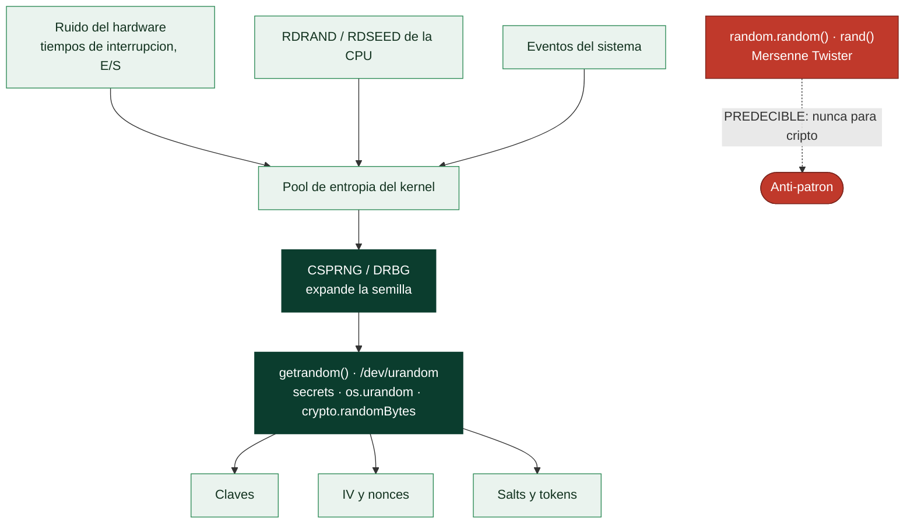

# Clase 058 — Generación de aleatoriedad segura (CSPRNG)

> Parte: **2 — Criptografía aplicada** · Fuente: *Serious Cryptography* (Aumasson) y NIST SP 800-90A
> ⏱️ Duración estimada: **90 min** · Nivel: **Intermedio**

---

## 🎯 Objetivo

Comprender por qué la aleatoriedad es el cimiento silencioso de toda la criptografía: claves, nonces, IVs, salts y tokens dependen de ella. El alumno aprenderá la diferencia entre un PRNG estadístico (predecible) y un CSPRNG (criptográficamente seguro), de dónde viene la entropía del sistema operativo, y por qué fallos de aleatoriedad han roto sistemas reales (Debian OpenSSL 2008, claves RSA con primos compartidos).

## 📚 Resultados de aprendizaje

Al finalizar, el alumno podrá:

1. **Distinguir** PRNG estadístico de CSPRNG y sus garantías.
2. **Identificar** las fuentes de entropía del sistema operativo.
3. **Generar** claves, nonces y tokens con APIs seguras (`secrets`, `os.urandom`).
4. **Reconocer** los fallos históricos por mala aleatoriedad.
5. **Evitar** anti-patrones como sembrar con el tiempo o usar `random` para seguridad.

## 🗺️ Temas

| # | Tema | Por qué importa |
|---|------|-----------------|
| 1 | Entropía y fuentes | Origen de la aleatoriedad |
| 2 | PRNG vs CSPRNG | Predecible vs seguro |
| 3 | /dev/urandom y getrandom() | API del SO |
| 4 | DRBG (SP 800-90A) | Generadores deterministas seguros |
| 5 | APIs seguras (`secrets`) | Uso correcto en código |
| 6 | Fallos famosos | Aprender de desastres |
| 7 | Pruebas de aleatoriedad | Detectar sesgos |

## 🧠 Explicación en profundidad

### El cimiento invisible de todo lo demás

Cada clave, cada IV, cada nonce, cada `salt`, cada token de sesión y cada nonce de ECDSA
sale de un generador de números aleatorios. Si ese generador es predecible, **todo lo
construido encima se derrumba** por muy correcta que sea la criptografía: no hay que
romper AES si se puede adivinar la clave. Es la dependencia menos visible de la parte y la
que más desastres silenciosos ha causado.

La distinción clave es entre **PRNG** y **CSPRNG**. Un PRNG estadístico —el `random` de
cualquier lenguaje, un Mersenne Twister— produce números que *parecen* aleatorios y sirven
para simulaciones o videojuegos, pero es **determinista y reconstruible**: observando unas
cuantas salidas se recupera el estado interno y se predicen todas las siguientes. Un
**CSPRNG** añade dos garantías que lo hacen apto para criptografía:
**impredecibilidad hacia delante** (conocer salidas pasadas no permite predecir las
futuras) y **resistencia al compromiso del estado** (conocer el estado actual no permite
reconstruir las salidas pasadas).



### Usa el del sistema operativo, y punto

La recomendación profesional es casi aburrida y por eso conviene subrayarla: **no
construyas tu propio generador ni siembres uno tú**. El kernel recoge entropía de fuentes
físicas —tiempos de interrupción, ruido de dispositivos, instrucciones de hardware como
RDSEED— y la usa para sembrar un CSPRNG que expone al espacio de usuario. En Linux la
llamada correcta es `getrandom()` o leer `/dev/urandom`; en Windows, `BCryptGenRandom`.
Desde los lenguajes, `secrets` u `os.urandom` en Python, `crypto.randomBytes` en Node,
`crypto/rand` en Go.

Conviene desactivar un mito persistente: **`/dev/random` no es "más seguro" que
`/dev/urandom`**. En los kernels modernos, una vez que el pool está sembrado, ambos
producen material de la misma calidad; la diferencia histórica era que `/dev/random`
bloqueaba, lo que provocaba cuelgues en arranque y llevaba a los desarrolladores a
soluciones peores. El único momento delicado es el **arranque temprano**, cuando aún no se
ha acumulado entropía: por eso `getrandom()` bloquea hasta que el pool esté inicializado y
después no vuelve a hacerlo.

### Los desastres, que son concretos y caros

La lista de fallos es corta pero devastadora y merece conocerse porque el patrón se
repite. **Debian OpenSSL (2006-2008)**: un parche bienintencionado eliminó una fuente de
entropía y redujo el espacio de claves a **32 768 posibilidades**; durante dos años, cada
clave SSH y cada certificado generado en Debian y derivados fue enumerable en segundos.
**Sony PlayStation 3 (2010)**: nonce `k` constante en ECDSA, clave de firma de código
recuperada, consola abierta. **Carteras de Bitcoin en Android (2013)**: un fallo en el
proveedor de aleatoriedad de la plataforma repitió nonces de ECDSA y permitió robar claves
privadas y fondos.

Dos patrones adicionales de la práctica diaria: las **máquinas virtuales restauradas desde
un snapshot** repiten el estado del generador y pueden emitir los mismos nonces dos veces
—especialmente peligroso con AES-GCM—; y los **dispositivos embebidos** que generan claves
en el primer arranque, cuando aún no hay entropía, acaban produciendo claves idénticas en
miles de unidades. La comprobación práctica es el laboratorio de esta clase: distinguir
por pruebas estadísticas una salida de `random` de una de `secrets`, y aprender que
**parecer aleatorio y ser impredecible no son lo mismo**.

## 📖 Definiciones y características

- **Entropía**: medida de imprevisibilidad. El SO la recolecta de eventos físicos (interrupciones, ruido de hardware).
- **PRNG (estadístico)**: genera secuencias que "parecen" aleatorias pero son predecibles si conoces el estado/semilla (p. ej. Mersenne Twister). **No** para seguridad.
- **CSPRNG**: PRNG que, aun conociendo salidas previas, no permite predecir las siguientes ni recuperar el estado. Base de claves y nonces.
- **DRBG**: generador determinista por bits recomendado por NIST (Hash_DRBG, HMAC_DRBG, CTR_DRBG); se re-siembra con entropía.
- **getrandom() / /dev/urandom**: interfaz del kernel que entrega bytes de un CSPRNG bien sembrado.
- **Semilla (seed)**: valor inicial; si es predecible (p. ej. el tiempo), toda la salida lo es.
- **Sesgo**: desviación de la uniformidad; se detecta con pruebas estadísticas (Dieharder, NIST STS).

## 📔 Glosario

| Término | Definición concisa |
|---------|--------------------|
| Entropía | Medida de la incertidumbre real disponible como aleatoriedad |
| PRNG | Generador determinista; parece aleatorio pero es predecible |
| CSPRNG | Generador apto para criptografía: impredecible hacia delante |
| Semilla (*seed*) | Valor inicial del generador; si es adivinable, todo lo es |
| Estado interno | Datos del generador cuyo conocimiento predice las salidas |
| Mersenne Twister | PRNG estadístico común; **nunca** para criptografía |
| `getrandom()` | Llamada al sistema recomendada en Linux |
| `/dev/urandom` | Fuente de aleatoriedad del kernel; equivalente en calidad |
| `BCryptGenRandom` | API equivalente en Windows |
| `secrets` / `os.urandom` | APIs seguras en Python |
| DRBG | Generador determinista normalizado (NIST SP 800-90A) |
| Debian OpenSSL | Fallo que redujo el espacio de claves a 32 768 |
| Nonce repetido | Consecuencia típica de un generador defectuoso |
| Snapshot de VM | Restaurar estado del generador y repetir valores |
| Pruebas de aleatoriedad | Baterías estadísticas que detectan sesgos |

## 🧰 Herramientas y preparación

```bash
python3 -c "import secrets; print('ok')"
# opcional: pruebas estadísticas
which rngtest dieharder 2>/dev/null || echo "opcional"
```

Todo el trabajo es local y de análisis.

## 🧪 Laboratorio guiado

1. **Genera material aleatorio seguro** en Python:

   ```python
   import os, secrets
   clave = os.urandom(32)             # 256 bits para AES
   nonce = os.urandom(12)             # nonce GCM
   token = secrets.token_urlsafe(32)  # token de sesión
   print(clave.hex(), token)
   ```

2. **Contraejemplo predecible**. Muestra que `random.seed(tiempo)` + `random.getrandbits` produce salidas reproducibles si el atacante conoce el instante; concluye que `random` **no** sirve para seguridad.

3. **Analiza sesgos**. Genera 1 MB con un CSPRNG y con un PRNG mal sembrado; corre pruebas estadísticas (o cuenta frecuencias de bits) y compara.

4. **Estudia el fallo Debian 2008**. Investiga cómo un parche que redujo la entropía dejó el espacio de claves en apenas ~32.767 posibilidades y por qué hubo que regenerar millones de claves.

5. **Nonces únicos**. Simula la generación de nonces para AES-GCM y verifica (con un conjunto) que no se repiten en el volumen esperado.

## ✍️ Ejercicios

1. Explica la diferencia entre `random` y `secrets` en Python.
2. Genera un token de recuperación de 256 bits y razona su espacio.
3. Investiga el incidente de claves RSA con primos compartidos (factorización por MCD).
4. Describe cómo el kernel recolecta entropía en el arranque.
5. Demuestra que sembrar con `time()` produce salidas predecibles.
6. Corre una prueba estadística sobre dos fuentes y compara resultados.

## 📝 Reto verificable

Escribe una utilidad que genere claves, nonces y tokens exclusivamente con un CSPRNG, y un test que verifique ausencia de repeticiones en una gran muestra de nonces y una distribución de bits cercana a 50/50. **Criterio de aceptación**: la muestra no presenta nonces repetidos y la proporción de unos/ceros se desvía menos de un umbral razonable; el código no usa ningún PRNG estadístico.

## ⚠️ Errores comunes

| Síntoma / mensaje | Causa y cómo arreglar |
|-------------------|-----------------------|
| Claves reproducibles | Semilla predecible; usa `os.urandom`/`secrets` |
| Uso de `random`/`rand()` para claves | No es CSPRNG; sustitúyelo |
| Nonces repetidos | Generación insegura; usa CSPRNG o contador único |
| Baja entropía en arranque | Bloquea hasta sembrar (`getrandom`) o añade fuente de hardware |
| Reutilizar tokens de sesión | Genera uno nuevo por sesión con suficiente longitud |

## ❓ Preguntas frecuentes

**❓ ¿/dev/urandom o /dev/random?**
En Linux moderno, `urandom`/`getrandom()` es la elección correcta una vez sembrado; `random` puede bloquear innecesariamente.

**❓ ¿Cuántos bits necesito para un token?**
Al menos 128 bits (16 bytes) de aleatoriedad real; 256 bits para márgenes amplios.

**❓ ¿Por qué la mala aleatoriedad es tan peligrosa?**
Porque compromete claves y nonces de golpe; un CSPRNG débil hace inútil el mejor algoritmo.

## 🔗 Referencias

- NIST SP 800-90A Rev.1 (DRBG) — <https://csrc.nist.gov/publications/detail/sp/800-90a/rev-1/final>
- Aumasson, *Serious Cryptography*, cap. 2.
- Heninger et al., "Mining Your Ps and Qs" — <https://factorable.net/>
- Debian OpenSSL predictable PRNG (CVE-2008-0166).

## 📥 Material descargable

- 📄 [Guía en PDF](./clase-058-guia.pdf) — versión imprimible de esta clase.
- 🎞️ [Presentación (PPTX)](./clase-058-presentacion.pptx) — deck para proyectar en clase.

## ⬅️ Clase anterior

[Clase 057 — Almacenamiento seguro de contraseñas: bcrypt, scrypt y Argon2](../057-almacenamiento-seguro-de-contrasenas-bcrypt-scrypt-y-argon2/README.md)

## ➡️ Siguiente clase

[Clase 059 — Cifrado autenticado (AEAD)](../059-cifrado-autenticado-aead/README.md)
