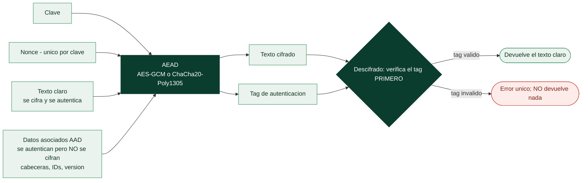

# Clase 059 — Cifrado autenticado (AEAD)

> Parte: **2 — Criptografía aplicada** · Fuente: *Real-World Cryptography* (Wong) e IETF RFC 5116 / RFC 8439
> ⏱️ Duración estimada: **100 min** · Nivel: **Intermedio**

---

## 🎯 Objetivo

Consolidar la lección central de la criptografía aplicada moderna: nunca cifres sin autenticar. El alumno aprenderá qué es el cifrado autenticado con datos asociados (AEAD), cómo AES-GCM y ChaCha20-Poly1305 combinan confidencialidad e integridad en una sola primitiva, qué son los "datos asociados" (AAD), y por qué AEAD es la respuesta directa a los ataques de padding oracle y manipulación de la clase 060.

## 📚 Resultados de aprendizaje

Al finalizar, el alumno podrá:

1. **Explicar** qué garantiza AEAD y por qué reemplaza a "cifrar + MAC manual".
2. **Cifrar y descifrar** con AES-GCM y ChaCha20-Poly1305 usando nonces correctos.
3. **Usar** datos asociados (AAD) para autenticar metadatos no cifrados.
4. **Detectar** manipulación mediante el fallo de verificación del tag.
5. **Elegir** entre AES-GCM y ChaCha20-Poly1305 según el entorno.

## 🗺️ Temas

| # | Tema | Por qué importa |
|---|------|-----------------|
| 1 | Motivación: cifrar + autenticar juntos | Elimina errores de composición |
| 2 | AES-GCM | AEAD dominante con AES-NI |
| 3 | ChaCha20-Poly1305 | AEAD para software/móvil |
| 4 | Nonce y su unicidad | Reutilizarlo rompe GCM |
| 5 | Datos asociados (AAD) | Autenticar metadatos |
| 6 | Tag de autenticación | Detección de manipulación |
| 7 | AEAD vs padding oracle | Por qué previene el ataque |

## 🧠 Explicación en profundidad

### Cifrar sin autenticar es una vulnerabilidad, no media solución

Los modos de la clase 047 dan confidencialidad: impiden **leer**. Ninguno impide
**modificar**. Con CTR o con un cifrado de flujo, un atacante que sepa dónde está un campo
puede voltear bits del texto cifrado y provocar cambios exactos y predecibles en el texto
claro, sin conocer la clave: cambiar `transferir: 100` por `transferir: 900` es
literalmente un XOR bien colocado. Con CBC puede alterar un bloque a costa de corromper el
anterior. La conclusión es dura y merece enunciarse así: **cifrado sin autenticación no es
seguro en ningún escenario realista**.

Durante años la solución fue componer a mano: cifrar y añadir un HMAC con
*encrypt-then-MAC* (clase 052). Funciona, pero exige acertar en el orden, usar **claves
distintas** para cifrado y MAC, y verificar en tiempo constante antes de descifrar. Tres
oportunidades de equivocarse que la industria falló repetidamente. El **AEAD**
(*Authenticated Encryption with Associated Data*) elimina la decisión: una sola primitiva,
una sola clave, cifrado e integridad en una operación, con la composición ya demostrada.



### La pieza que resuelve el padding oracle

El detalle decisivo está en el orden del descifrado: un AEAD **verifica el tag antes de
entregar nada**. Si el tag no cuadra, devuelve un único error genérico y no procesa el
contenido, no interpreta el relleno y no ejecuta lógica alguna sobre datos manipulados.
Con eso **el oráculo desaparece**: el atacante de la clase 060 obtiene siempre la misma
respuesta indistinguible haga lo que haga, y su ataque no tiene de dónde extraer
información. Por eso el consejo de esta parte no es "ten cuidado con el padding", sino
"usa AEAD y el problema no existe".

### AAD: autenticar lo que no se puede cifrar

Los **datos asociados** son la parte del nombre que más se ignora y una de las más útiles.
Hay información que debe viajar en claro para que el sistema funcione —un identificador de
registro, un número de versión, una cabecera de protocolo, el destinatario de un
paquete— pero que no debe poder alterarse. El AAD se incluye en el cálculo del tag sin
cifrarse: sigue siendo legible, pero cualquier modificación invalida el descifrado. Es
también la defensa contra ataques de **sustitución de contexto**: cifrar el registro del
usuario A y colocarlo en la fila del usuario B falla si el identificador de fila va como
AAD.

### Elegir entre los dos, y la regla que no se negocia

**AES-GCM** es el AEAD dominante y es muy rápido donde hay **AES-NI**, es decir, en
prácticamente cualquier servidor o portátil moderno. **ChaCha20-Poly1305** gana donde no la
hay —móviles y dispositivos modestos— y es más fácil de implementar en tiempo constante,
por las razones de la clase 048. TLS 1.3 negocia entre ambos, y los clientes móviles
suelen preferir el segundo.

Y por encima de la elección, una regla absoluta: **nunca repitas el par (clave, nonce)**.
En AES-GCM las consecuencias van más allá de perder confidencialidad: repetir un nonce
permite recuperar la **clave de autenticación** interna y, con ella, **falsificar tags** —
el atacante deja de poder solo leer y pasa a poder escribir mensajes válidos—. Con nonces
de 96 bits, elegirlos al azar es arriesgado en volúmenes altos, así que se usa un contador
que nunca retroceda; si se necesita aleatoriedad, **XChaCha20-Poly1305** con nonce de 192
bits es la opción segura. Todo vuelve, una vez más, al generador de la clase 058.

## 📖 Definiciones y características

- **AEAD**: cifrado que produce texto cifrado + tag de autenticación en una sola operación. Característica: confidencialidad e integridad garantizadas juntas.
- **AES-GCM**: AES en modo Galois/Counter; muy rápido con AES-NI. Sensible a la reutilización de nonce (rompe la autenticación).
- **ChaCha20-Poly1305**: AEAD que combina el cifrado de flujo ChaCha20 con el MAC Poly1305; ideal sin aceleración hardware.
- **Nonce**: único por clave. En GCM/ChaCha20-Poly1305 mide 96 bits; repetirlo es catastrófico.
- **Datos asociados (AAD)**: datos que se autentican pero no se cifran (cabeceras, IDs); su alteración invalida el tag.
- **Tag de autenticación**: valor (128 bits) que el receptor verifica; si no coincide, el descifrado se rechaza sin entregar datos.
- **Fallo cerrado**: ante tag inválido, la primitiva no devuelve texto plano, evitando fugas.

## 📔 Glosario

| Término | Definición concisa |
|---------|--------------------|
| AEAD | Cifrado autenticado con datos asociados |
| Maleabilidad | Poder alterar el texto claro manipulando el cifrado |
| Bit-flipping | Voltear bits del cifrado para cambiar el claro de forma predecible |
| Tag de autenticación | Etiqueta que detecta cualquier manipulación |
| AAD | Datos asociados: se autentican pero no se cifran |
| Sustitución de contexto | Reutilizar un cifrado válido en otro lugar; el AAD lo impide |
| AES-GCM | AEAD dominante; muy rápido con AES-NI |
| ChaCha20-Poly1305 | AEAD para software y móviles sin aceleración AES |
| XChaCha20-Poly1305 | Variante con nonce de 192 bits; seguro al azar |
| Nonce en AEAD | Debe ser único por clave; repetirlo es catastrófico |
| Falsificación de tag | Consecuencia de repetir nonce en GCM: permite escribir |
| Verificar antes de descifrar | Orden que elimina el padding oracle |
| Error genérico | Respuesta única ante fallo, para no dar información |
| Encrypt-then-MAC | Composición manual equivalente; AEAD la trae resuelta |

## 🧰 Herramientas y preparación

```bash
openssl version   # openssl enc -aes-256-gcm o vía API
pip install cryptography
```

Laboratorio local. Los mensajes son de prueba propios.

## 🧪 Laboratorio guiado

1. **AES-GCM con AAD en Python**:

   ```python
   import os
   from cryptography.hazmat.primitives.ciphers.aead import AESGCM
   key = AESGCM.generate_key(bit_length=256)
   aead = AESGCM(key)
   nonce = os.urandom(12)
   aad = b"id=42;tipo=factura"
   ct = aead.encrypt(nonce, b"datos confidenciales", aad)
   pt = aead.decrypt(nonce, ct, aad)      # requiere el mismo AAD
   print(pt)
   ```

2. **Detecta manipulación**. Cambia un byte de `ct` o del `aad` y llama a `decrypt`: se lanza `InvalidTag`. Concluye que AEAD **falla cerrado**.

3. **ChaCha20-Poly1305**: repite el ejercicio con `ChaCha20Poly1305` y compara la API idéntica.

4. **Nonce reutilizado en GCM (concepto y demo controlada)**. Cifra dos mensajes con el **mismo** nonce y clave; explica por qué esto permite recuperar el keystream (XOR de textos) y, peor aún, forjar tags (recuperación de la clave de autenticación H). Nunca lo hagas fuera del laboratorio.

5. **Migra de CBC+HMAC a AEAD**. Toma el ejercicio de la clase 052 y sustitúyelo por AES-GCM; observa la simplificación y menor superficie de error.

## ✍️ Ejercicios

1. Explica qué aporta AEAD frente a "cifrar y luego HMAC" hecho a mano.
2. Cifra con AAD y demuestra que alterar el AAD invalida el descifrado.
3. Investiga por qué la reutilización de nonce rompe GCM más que CTR.
4. Compara el rendimiento de AES-GCM y ChaCha20-Poly1305 en tu CPU.
5. Diseña un formato de mensaje `nonce || ciphertext || tag` autoexplicativo.
6. Explica cómo AEAD previene el padding oracle de la clase 060.

## 📝 Reto verificable

Implementa un contenedor cifrado de archivos con AES-GCM que incluya en el AAD metadatos (nombre y versión) y verifique integridad al abrir. **Criterio de aceptación**: el archivo se descifra solo con el nonce, la clave y el AAD correctos; cualquier alteración del contenido cifrado o de los metadatos provoca rechazo con `InvalidTag`, sin exponer datos.

## ⚠️ Errores comunes

| Síntoma / mensaje | Causa y cómo arreglar |
|-------------------|-----------------------|
| `InvalidTag` inesperado | Nonce/AAD/clave distintos entre cifrado y descifrado |
| Nonce reutilizado en GCM | Rompe confidencialidad e integridad; usa nonce único |
| Ignorar el resultado de `decrypt` | Nunca uses datos sin verificar el tag |
| Cifrar con CBC sin MAC "porque es más simple" | Inseguro; usa AEAD |
| Nonce derivado predeciblemente | Usa CSPRNG o contador estrictamente único |

## ❓ Preguntas frecuentes

**❓ ¿AES-GCM o ChaCha20-Poly1305?**
AES-GCM con AES-NI (servidores modernos); ChaCha20-Poly1305 en móviles/embebidos o sin aceleración. Ambos son AEAD estándar.

**❓ ¿Qué pongo en el AAD?**
Metadatos que deban ser auténticos pero no secretos: cabeceras, versiones, identificadores de contexto.

**❓ ¿Cuántos mensajes puedo cifrar con una clave GCM?**
Limitado por el riesgo de colisión de nonces (con nonces aleatorios de 96 bits, rota la clave antes de ~2³² mensajes). Considera nonces por contador.

## 🔗 Referencias

- IETF RFC 5116 (AEAD) — <https://www.rfc-editor.org/rfc/rfc5116>
- IETF RFC 8439 (ChaCha20-Poly1305) — <https://www.rfc-editor.org/rfc/rfc8439>
- NIST SP 800-38D (GCM) — <https://csrc.nist.gov/publications/detail/sp/800-38d/final>
- Wong, *Real-World Cryptography*, cap. 4.

## 📥 Material descargable

- 📄 [Guía en PDF](./clase-059-guia.pdf) — versión imprimible de esta clase.
- 🎞️ [Presentación (PPTX)](./clase-059-presentacion.pptx) — deck para proyectar en clase.

## ⬅️ Clase anterior

[Clase 058 — Generación de aleatoriedad segura (CSPRNG)](../058-generacion-de-aleatoriedad-segura-csprng/README.md)

## ➡️ Siguiente clase

[Clase 060 — Ataques criptográficos: padding oracle y timing](../060-ataques-criptograficos-padding-oracle-y-timing/README.md)
