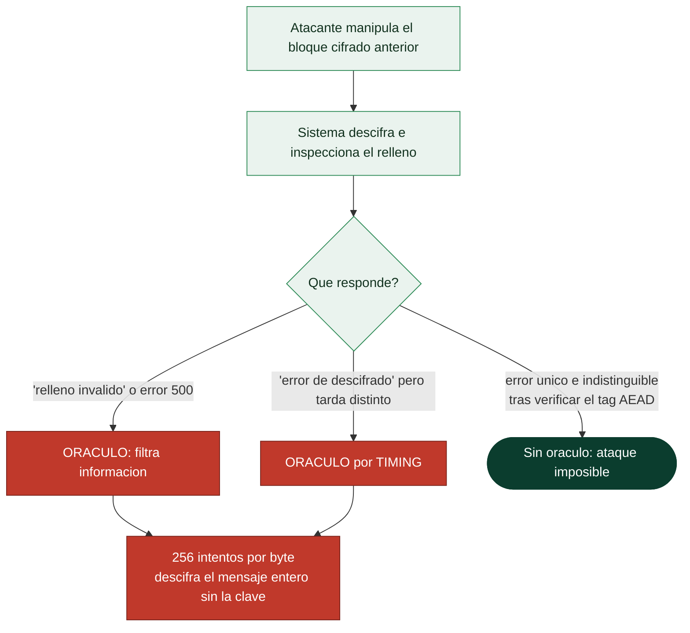

# Clase 060 — Ataques criptográficos: padding oracle y timing

> Parte: **2 — Criptografía aplicada** · Fuente: *Serious Cryptography* (Aumasson) y *Cryptography Engineering* (Ferguson/Schneier/Kohno)
> ⏱️ Duración estimada: **120 min** · Nivel: **Avanzado**

---

## 🎯 Objetivo

Entender que la mayoría de los sistemas criptográficos no se rompen atacando el algoritmo, sino explotando su **implementación**. El alumno estudiará dos familias emblemáticas: el ataque de padding oracle (descifrar sin la clave abusando de mensajes de error de padding en CBC) y los ataques de canal lateral por tiempo (deducir secretos midiendo cuánto tarda una operación). Ambos se practican **solo** en un servicio de laboratorio propio.

> ⚠️ **Nota ética**: estos ataques se ejecutan exclusivamente contra un oráculo/servidor montado por ti en tu laboratorio. Aplicarlos a sistemas de terceros sin autorización explícita es ilegal.

## 📚 Resultados de aprendizaje

Al finalizar, el alumno podrá:

1. **Explicar** cómo un padding oracle permite descifrar CBC byte a byte.
2. **Montar** un oráculo vulnerable de laboratorio y atacarlo de forma controlada.
3. **Describir** ataques de timing sobre comparaciones y operaciones cripto.
4. **Aplicar** mitigaciones: AEAD, verificación en tiempo constante, mensajes de error uniformes.
5. **Reconocer** por qué "fallar cerrado y en tiempo constante" es esencial.

## 🗺️ Temas

| # | Tema | Por qué importa |
|---|------|-----------------|
| 1 | Ataques a la implementación | Donde ocurren las brechas reales |
| 2 | Padding PKCS#7 y su verificación | Origen del oráculo |
| 3 | Padding oracle paso a paso | Descifrado sin clave |
| 4 | Ataques de timing | Canal lateral temporal |
| 5 | Comparación en tiempo constante | Mitigación clave |
| 6 | AEAD como defensa | Elimina el oráculo |
| 7 | Casos reales (POODLE, Lucky13) | Impacto histórico |

## 🧠 Explicación en profundidad

### Las brechas reales no rompen la matemática, rompen la implementación

Nadie ha roto AES. Sin embargo, se descifran mensajes protegidos con AES continuamente, y
la razón es que un sistema criptográfico no es solo un algoritmo: es también el código que
lo ejecuta, los mensajes de error que devuelve y el tiempo que tarda en devolverlos. Un
**canal lateral** es cualquier información que se filtra por esos aspectos no previstos en
el modelo matemático —tiempo, consumo eléctrico, comportamiento de la caché, radiación
electromagnética, o simplemente un mensaje de error distinto—. Esta clase enseña a verlos,
y es la más importante de la parte para escribir código real.

### El padding oracle, paso a paso

La receta necesita dos ingredientes que estuvieron en todas partes durante veinte años:
**CBC con relleno PKCS#7** y **ningún control de integridad**. El descifrado en CBC hace
XOR del bloque descifrado con el bloque cifrado anterior; y como el atacante **controla ese
bloque anterior**, controla directamente el resultado del XOR. Si además el sistema le dice
—con un error distinto, un código HTTP distinto o simplemente tardando distinto— si el
relleno resultante era válido, tiene un **oráculo**.

Con eso, descifra el último byte probando los 256 valores posibles hasta que el relleno
sea válido (lo que revela que ese byte descifrado vale `0x01`, y por tanto revela el byte
intermedio, y por tanto el byte del texto claro real). Repite para el penúltimo forzando
relleno `0x02 0x02`, y así hasta el bloque entero: **256 intentos por byte, sin conocer
jamás la clave**. Vaudenay lo describió en 2002 y en 2010 se convirtió en explotación
masiva contra ASP.NET.



### El tiempo es un canal de salida

Un **ataque de timing** explota que el código tarde distinto según datos secretos. La forma
más común es la comparación de bytes que sale en el primer fallo: si verificar un token
tarda un poco más cuando los tres primeros bytes son correctos, el atacante reconstruye el
token byte a byte con unos miles de peticiones, en lugar de los 2^128 intentos que exigiría
adivinarlo entero. La mitigación es la **comparación en tiempo constante**, que recorre
siempre toda la longitud acumulando diferencias.

El principio se generaliza: **ninguna operación sobre datos secretos debe tener un tiempo
—ni un patrón de acceso a memoria— que dependa de esos datos**. De ahí que las
implementaciones serias eviten ramas condicionales y accesos a tabla indexados por
secretos, y de ahí también que las tablas de AES en software puro sean delicadas
(**Lucky13** midió microsegundos en la verificación MAC-then-encrypt de TLS, y varios
ataques por caché han recuperado claves AES observando qué líneas de caché se tocaban).
La objeción habitual —"la red añade tanto ruido que eso no es explotable"— es falsa: con
suficientes muestras y estadística, diferencias de nanosegundos se distinguen a través de
Internet.

### Cómo se cierra todo esto

Las defensas son concretas y componen entre sí. **Usar AEAD** (clase 059) elimina el
padding oracle porque el tag se verifica antes de tocar el relleno. **Devolver un error
único** para cualquier fallo de descifrado, sin distinguir causa, elimina el oráculo por
mensaje. **Comparar en tiempo constante** con `hmac.compare_digest` o equivalente elimina
el oráculo por tiempo. **Usar bibliotecas maduras** en lugar de implementar primitivas
propias hereda años de endurecimiento contra canales laterales. Y **limitar la tasa** de
intentos encarece un ataque que necesita miles o millones de peticiones.

El caso **POODLE** cierra la lección con una vuelta de tuerca: el ataque no explotaba TLS
sino SSL 3.0, y funcionaba porque el atacante podía **forzar un downgrade** a esa versión
antigua. Mantener protocolos obsoletos "por compatibilidad" es, en criptografía, mantener
sus vulnerabilidades vivas.

## 📖 Definiciones y características

- **Canal lateral (side-channel)**: fuga de información por medios ajenos al algoritmo (tiempo, energía, errores). Característica: rompe cripto teóricamente segura.
- **Padding oracle**: servicio que revela (por error o comportamiento) si el padding de un texto descifrado es válido, permitiendo recuperar el plano.
- **PKCS#7**: esquema de relleno en CBC; su verificación distinta de otros errores crea el oráculo.
- **Ataque de timing**: se infiere un secreto midiendo diferencias de tiempo de ejecución (p. ej. comparación con salida temprana).
- **Tiempo constante**: código cuyo tiempo no depende de datos secretos; imprescindible en comparaciones y operaciones con claves.
- **Fallar cerrado**: rechazar sin distinguir causas ni entregar datos parciales.
- **Lucky 13 / POODLE**: ataques reales que explotaron padding y timing en TLS/CBC.

## 📔 Glosario

| Término | Definición concisa |
|---------|--------------------|
| Canal lateral | Fuga por tiempo, consumo, caché o mensajes de error |
| Oráculo | Cualquier respuesta del sistema que revele algo sobre el secreto |
| Padding oracle | Oráculo que revela si el relleno era válido; descifra sin clave |
| PKCS#7 | Relleno cuya validez se puede comprobar y por tanto filtrar |
| Vaudenay (2002) | Descripción original del ataque de padding oracle |
| Ataque de timing | Explota que el tiempo dependa de datos secretos |
| Comparación en tiempo constante | Recorre toda la longitud sin salir antes |
| Lucky13 | Timing sobre MAC-then-encrypt en TLS |
| Bleichenbacher | Oráculo análogo sobre el relleno PKCS#1 v1.5 de RSA |
| POODLE | Downgrade a SSL 3.0 para explotar su relleno |
| Ataque por caché | Recuperar claves observando accesos a memoria |
| Error genérico | Respuesta única que no distingue la causa del fallo |
| Limitación de tasa | Encarece los ataques que necesitan muchas peticiones |
| Defensa en profundidad | AEAD + error único + tiempo constante + límites |

## 🧰 Herramientas y preparación

```bash
pip install cryptography flask requests
```

Monta el oráculo en `localhost`. No apuntes las herramientas a ningún host externo.

## 🧪 Laboratorio guiado

1. **Monta un oráculo vulnerable** (laboratorio propio). Un pequeño servicio Flask descifra AES-CBC y responde "padding OK" o "padding inválido". Ese comportamiento distinguible es el oráculo.

2. **Ataque de padding oracle**. Implementa el ataque clásico: para cada bloque, manipula el bloque previo byte a byte hasta que el oráculo indique padding válido; despeja el "intermediate value" y recupera el texto plano. Recupera un mensaje completo sin conocer la clave.

3. **Mitígalo con AEAD**. Reescribe el servicio con AES-GCM: ahora cualquier manipulación falla con `InvalidTag` de forma uniforme y el ataque deja de funcionar.

4. **Timing en comparación de tokens**. Implementa una comparación byte a byte con salida temprana y mide (con muchas repeticiones) que un token con más prefijo correcto tarda un poco más. Sustitúyela por `hmac.compare_digest` y comprueba que la diferencia desaparece.

5. **Documenta las mitigaciones**: AEAD, errores uniformes, comparación constante, y no exponer distinciones de fallo.

## ✍️ Ejercicios

1. Explica por qué CBC + verificación de padding revela información.
2. Recupera un bloque con el oráculo de tu laboratorio y describe cada paso.
3. Demuestra empíricamente una diferencia de timing en una comparación ingenua.
4. Reescribe el servicio con AEAD y verifica que el ataque falla.
5. Investiga cómo Lucky 13 explotó timing en el MAC de TLS-CBC.
6. Propón cómo unificar mensajes de error para no filtrar la causa.

## 📝 Reto verificable

Toma un oráculo de padding de laboratorio y recupera un texto plano completo sin la clave; luego aplica una mitigación (migrar a AEAD) y demuestra que el mismo ataque ya no recupera nada. **Criterio de aceptación**: entregas el texto plano recuperado en la versión vulnerable y muestras que, tras migrar a AES-GCM, el atacante solo obtiene `InvalidTag` sin información útil.

## ⚠️ Errores comunes

| Síntoma / mensaje | Causa y cómo arreglar |
|-------------------|-----------------------|
| Mensajes de error distintos para padding vs MAC | Crea un oráculo; unifica errores |
| Comparación de tags con salida temprana | Timing; usa `compare_digest` |
| CBC sin autenticación | Vulnerable a padding oracle; usa AEAD |
| Logs que revelan la causa del fallo | Fuga; registra sin distinguir para el cliente |
| Descifrar antes de verificar integridad | Procesas datos manipulables; verifica primero |

## ❓ Preguntas frecuentes

**❓ ¿Basta con "esconder" los mensajes de error?**
No; el timing u otros canales siguen filtrando. La solución real es AEAD y tiempo constante, no ocultar síntomas.

**❓ ¿Por qué AEAD elimina el padding oracle?**
Porque verifica el tag antes de tocar el padding y falla de forma uniforme, sin revelar validez de relleno.

**❓ ¿Los ataques de timing son realistas por red?**
Sí; con suficientes mediciones y estadística se explotan incluso a través de la red (Lucky 13 lo demostró).

## 🔗 Referencias

- Vaudenay, "Security Flaws Induced by CBC Padding" (padding oracle original).
- AlFardan & Paterson, "Lucky Thirteen" — <http://www.isg.rhul.ac.uk/tls/Lucky13.html>
- Aumasson, *Serious Cryptography*, cap. 4 y 9.
- OWASP, "Padding Oracle Attack".

## 📥 Material descargable

- 📄 [Guía en PDF](./clase-060-guia.pdf) — versión imprimible de esta clase.
- 🎞️ [Presentación (PPTX)](./clase-060-presentacion.pptx) — deck para proyectar en clase.

## ⬅️ Clase anterior

[Clase 059 — Cifrado autenticado (AEAD)](../059-cifrado-autenticado-aead/README.md)

## ➡️ Siguiente clase

[Clase 061 — Introducción al criptoanálisis](../061-introduccion-al-criptoanalisis/README.md)
