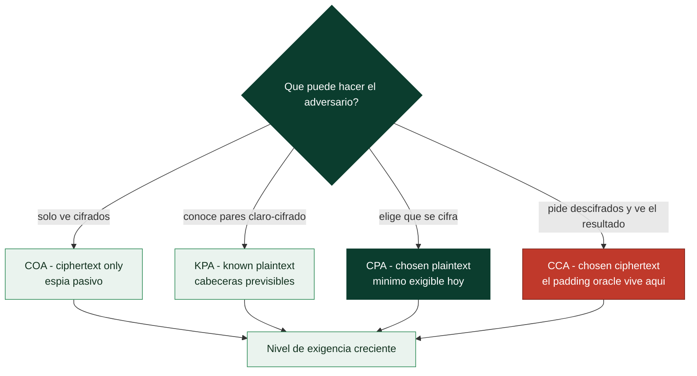

# Clase 061 — Introducción al criptoanálisis

> Parte: **2 — Criptografía aplicada** · Fuente: *Serious Cryptography* (Aumasson) y *Cryptography Engineering* (Ferguson/Schneier/Kohno)
> ⏱️ Duración estimada: **110 min** · Nivel: **Avanzado**

---

## 🎯 Objetivo

Adquirir una visión panorámica del criptoanálisis: el arte y la ciencia de romper cifrados. El alumno conocerá los modelos de ataque (solo texto cifrado, texto plano conocido, texto plano/cifrado elegido), las técnicas clásicas (frecuencias) y modernas (criptoanálisis diferencial y lineal a nivel conceptual), la paradoja del cumpleaños aplicada a colisiones, y cómo se mide la seguridad en "bits". El objetivo no es romper AES, sino entender cómo piensan quienes diseñan y evalúan primitivas.

## 📚 Resultados de aprendizaje

Al finalizar, el alumno podrá:

1. **Clasificar** ataques según el modelo (COA, KPA, CPA, CCA).
2. **Aplicar** análisis de frecuencias y de correlación a cifrados débiles.
3. **Explicar** a alto nivel el criptoanálisis diferencial y lineal.
4. **Calcular** costes de ataque en bits y aplicar la paradoja del cumpleaños.
5. **Evaluar** por qué una primitiva se considera "rota" aunque no sea práctica.

## 🗺️ Temas

| # | Tema | Por qué importa |
|---|------|-----------------|
| 1 | Modelos de ataque (COA/KPA/CPA/CCA) | Definen las capacidades del adversario |
| 2 | Análisis de frecuencias | Base del criptoanálisis clásico |
| 3 | Ataque de fuerza bruta y "bits de seguridad" | Medir la resistencia |
| 4 | Paradoja del cumpleaños | Colisiones y su coste |
| 5 | Criptoanálisis diferencial | Cómo se evalúan cifrados de bloque |
| 6 | Criptoanálisis lineal | Aproximaciones lineales |
| 7 | "Roto" académico vs práctico | Interpretar titulares |

## 🧠 Explicación en profundidad

### Decir "seguro" exige decir contra qué adversario

El criptoanálisis empieza donde acaba la intuición: definiendo con precisión **qué puede
hacer el atacante**. Los cuatro modelos clásicos van de menos a más poder y no son
académicos, describen situaciones reales. En **COA** (*ciphertext-only*) el adversario solo
ve texto cifrado: es el espía pasivo. En **KPA** (*known-plaintext*) conoce algunos pares
claro-cifrado, lo que ocurre siempre que un protocolo tiene cabeceras fijas o saludos
previsibles. En **CPA** (*chosen-plaintext*) puede elegir qué se cifra, que es exactamente
la posición de quien envía un correo a un sistema que lo archiva cifrado. Y en **CCA**
(*chosen-ciphertext*) puede además pedir descifrados y observar el resultado, aunque sea
solo un mensaje de error: **el padding oracle de la clase 060 es un ataque CCA**. Un
cifrado moderno debe resistir CPA como mínimo, y CCA si va a operar en un entorno hostil.

### Cuánto cuesta romperlo: bits de seguridad

Decir que una clave tiene 128 bits significa que el mejor ataque conocido cuesta del orden
de 2^128 operaciones, un número que no se alcanza con toda la energía disponible en el
planeta. Pero **el tamaño de la clave no siempre es el nivel de seguridad**, y esa
distinción evita malentendidos habituales: por la paradoja del cumpleaños (clase 051), un
hash de 256 bits ofrece 128 bits frente a colisiones; RSA de 3072 bits ofrece unos 128
bits porque existen algoritmos de factorización mucho mejores que la fuerza bruta; y ECC
de 256 bits ofrece 128 porque el mejor ataque contra ECDLP cuesta la raíz cuadrada del
espacio. Comparar algoritmos por longitud de clave es comparar peras con manzanas; hay que
comparar **bits de seguridad**.



### Cómo se evalúan de verdad los cifrados de bloque

Más allá de la fuerza bruta, existen dos técnicas que son el estándar con el que se juzga
cualquier cifrado por bloques. El **criptoanálisis diferencial** (Biham y Shamir, público
desde 1990) estudia cómo una diferencia concreta entre dos textos claros se propaga a una
diferencia entre sus cifrados: si ciertas diferencias aparecen con probabilidad mayor de la
esperada, esa desviación se puede convertir en información sobre la clave. El
**criptoanálisis lineal** (Matsui, 1993) busca aproximaciones lineales entre bits de
entrada, salida y clave que se cumplan algo más del 50 % de las veces, y acumula esa
ventaja mínima sobre millones de textos.

Un detalle histórico revelador: cuando se publicó el criptoanálisis diferencial, se supo
que las S-boxes de **DES**, diseñadas en los setenta, ya estaban optimizadas contra él.
IBM y la NSA lo conocían y lo mantuvieron en secreto. Hoy, en cambio, todo diseño serio
—AES incluido— publica sus márgenes de seguridad frente a ambas técnicas, y esa apertura
es la aplicación práctica del principio de Kerckhoffs de la clase 046.

### "Roto" en un titular casi nunca significa "roto" en tu servidor

Esta es la destreza más útil de la clase: interpretar noticias de criptografía. En el
vocabulario académico, un cifrado está **roto** en cuanto existe cualquier ataque mejor que
la fuerza bruta, aunque requiera 2^126 operaciones en lugar de 2^128 —una mejora
irrelevante en la práctica pero significativa teóricamente, porque indica que la estructura
tiene una grieta—. Un ataque **práctico** es otra cosa: recursos alcanzables por un
atacante real.

La distinción se aplica sola con ejemplos: MD5 y SHA-1 están rotos **prácticamente** (hay
colisiones reales, hoy, por unos miles de euros) y deben erradicarse ya; los ataques
teóricos publicados sobre AES reducen su margen en unos pocos bits y no cambian nada
operativo. La regla profesional que se deriva: **las roturas teóricas son la señal
temprana para planificar la migración; las prácticas exigen actuar ahora**. Y también
—lección de RC4 y SHA-1— que el tiempo entre "hay un indicio" y "es explotable" suele
medirse en años, así que quien empieza a migrar con el indicio llega a tiempo y quien
espera al titular, no.

## 📖 Definiciones y características

- **COA (ciphertext-only)**: el atacante solo ve texto cifrado. Modelo más débil para el atacante.
- **KPA (known-plaintext)**: conoce pares plano/cifrado. **CPA (chosen-plaintext)**: elige los planos a cifrar. **CCA (chosen-ciphertext)**: elige cifrados a descifrar (el más fuerte).
- **Bits de seguridad**: log₂ del esfuerzo del mejor ataque conocido. 128 bits ≈ inviable con tecnología actual.
- **Paradoja del cumpleaños**: las colisiones aparecen alrededor de 2^(n/2) intentos, no 2ⁿ; por eso un hash de 256 bits da ~128 bits frente a colisiones.
- **Criptoanálisis diferencial**: estudia cómo diferencias en la entrada se propagan a la salida para distinguir un cifrado de uno aleatorio.
- **Criptoanálisis lineal**: busca aproximaciones lineales entre bits de entrada, salida y clave con sesgo explotable.
- **Ataque "roto"**: cualquier método mejor que la fuerza bruta, aunque siga siendo impracticable; señala margen erosionado.

## 📔 Glosario

| Término | Definición concisa |
|---------|--------------------|
| Criptoanálisis | Estudio de cómo romper sistemas criptográficos |
| COA | El adversario solo ve texto cifrado |
| KPA | Conoce pares de texto claro y su cifrado |
| CPA | Puede elegir qué textos se cifran; exigencia mínima moderna |
| CCA | Puede pedir descifrados y observar el resultado |
| Bits de seguridad | Coste del mejor ataque conocido, como potencia de 2 |
| Fuerza bruta | Probar todas las claves posibles |
| Paradoja del cumpleaños | Colisiones a coste 2^(n/2) |
| Criptoanálisis diferencial | Estudia la propagación de diferencias entre entradas |
| Criptoanálisis lineal | Busca aproximaciones lineales sesgadas |
| S-box | Componente no lineal cuyo diseño resiste ambas técnicas |
| DES | Cifrado de los setenta, endurecido contra diferencial en secreto |
| Roto académicamente | Existe algún ataque mejor que la fuerza bruta |
| Roto prácticamente | El ataque es alcanzable con recursos reales |
| Margen de seguridad | Rondas de sobra frente al mejor ataque conocido |

## 🧰 Herramientas y preparación

```bash
pip install numpy matplotlib
python3 --version
```

Trabajo puramente analítico y local sobre cifrados de juguete y datos propios.

## 🧪 Laboratorio guiado

1. **Análisis de frecuencias automatizado**. Reutiliza el rompedor de sustitución de la clase 046 y mide cuántos caracteres necesitas para recuperar el texto con fiabilidad; grafica la tasa de acierto frente a la longitud.

2. **Fuerza bruta acotada**. Ataca un cifrado con espacio de claves reducido (p. ej. una clave de 24 bits en un cifrado de juguete) y mide el tiempo; extrapola cuánto costaría 56, 128 y 256 bits para interiorizar la inviabilidad.

3. **Paradoja del cumpleaños empírica**. Genera hashes truncados a `n` bits y cuenta cuántos necesitas para una colisión; compara con la predicción 2^(n/2). Grafica los resultados para varios `n`.

4. **Distinguidor diferencial (juguete)**. Sobre un cifrado de bloque didáctico de pocas rondas, mide cómo una diferencia fija en la entrada produce diferencias sesgadas en la salida, ilustrando el criptoanálisis diferencial.

5. **Interpreta un titular**. Analiza un anuncio del tipo "roto un ataque contra AES reducido a 7 rondas" y explica por qué no afecta a AES completo en la práctica.

## ✍️ Ejercicios

1. Clasifica tres escenarios reales según COA/KPA/CPA/CCA.
2. Verifica empíricamente la paradoja del cumpleaños para `n=32` bits.
3. Estima el coste en años de romper 128 bits por fuerza bruta con supuestos razonables.
4. Explica por qué DES (56 bits) es rompible hoy y AES-128 no.
5. Describe en tus palabras el criptoanálisis diferencial.
6. Diferencia "roto académicamente" de "roto en la práctica" con un ejemplo.

## 📝 Reto verificable

Demuestra experimentalmente la paradoja del cumpleaños: para varios tamaños de salida `n`, genera valores aleatorios hasta la primera colisión, repite muchas veces y compara la media con 2^(n/2). **Criterio de aceptación**: tus mediciones se ajustan al orden de 2^(n/2) (dentro de un margen estadístico), y explicas su implicación para el tamaño de los hashes.

## ⚠️ Errores comunes

| Síntoma / mensaje | Causa y cómo arreglar |
|-------------------|-----------------------|
| Suponer que "roto" = "inseguro para todo" | Distingue ataque teórico de práctico |
| Calcular colisiones con 2ⁿ | Es 2^(n/2) por el cumpleaños |
| Confiar en un cifrado propio "porque no lo rompí" | La ausencia de tu ataque no prueba seguridad |
| Ignorar el modelo de ataque | La seguridad depende de las capacidades del adversario |
| Subestimar side-channels frente a ataques matemáticos | En la práctica, la implementación cae antes |

## ❓ Preguntas frecuentes

**❓ ¿Puedo aprender a romper AES?**
No de forma práctica; AES resiste todo el criptoanálisis conocido. El valor está en entender cómo se evalúa y por qué confiamos en él.

**❓ ¿Qué significa "128 bits de seguridad"?**
Que el mejor ataque conocido requiere del orden de 2¹²⁸ operaciones, inviable con recursos actuales.

**❓ ¿Debería preocuparme por el criptoanálisis diferencial en mi app?**
No directamente; usa primitivas estándar bien analizadas. Preocúpate por la implementación y los side-channels.

## 🔗 Referencias

- Aumasson, *Serious Cryptography*, cap. 3 y 6.
- Ferguson, Schneier, Kohno, *Cryptography Engineering*, cap. 2–3.
- Biham & Shamir, "Differential Cryptanalysis of DES" (referencia histórica).
- Matsui, "Linear Cryptanalysis Method for DES Cipher".

## 📥 Material descargable

- 📄 [Guía en PDF](./clase-061-guia.pdf) — versión imprimible de esta clase.
- 🎞️ [Presentación (PPTX)](./clase-061-presentacion.pptx) — deck para proyectar en clase.

## ⬅️ Clase anterior

[Clase 060 — Ataques criptográficos: padding oracle y timing](../060-ataques-criptograficos-padding-oracle-y-timing/README.md)

## ➡️ Siguiente clase

[Clase 062 — Criptografía post-cuántica](../062-criptografia-post-cuantica/README.md)
