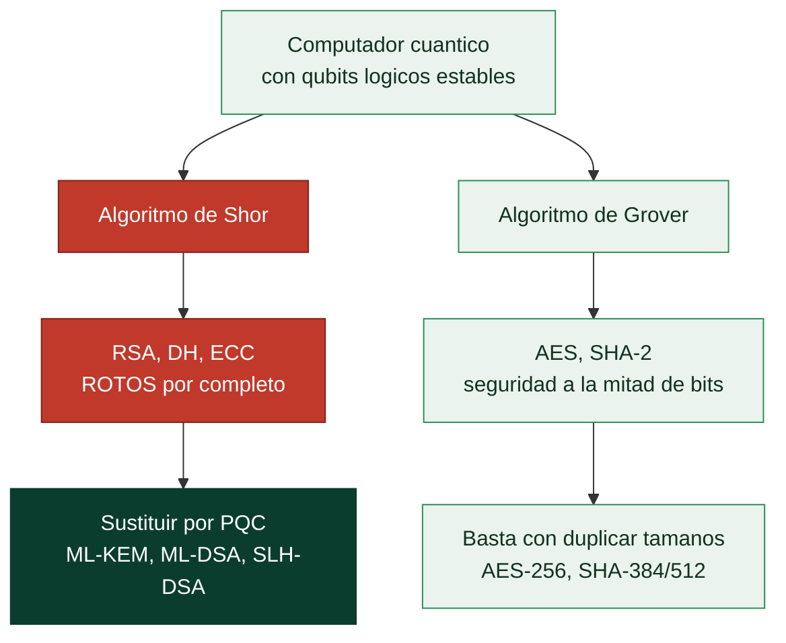

# Clase 062 — Criptografía post-cuántica

> Parte: **2 — Criptografía aplicada** · Fuente: *Real-World Cryptography* (Wong) y NIST PQC (FIPS 203/204/205)
> ⏱️ Duración estimada: **100 min** · Nivel: **Avanzado**

---

## 🎯 Objetivo

Comprender la amenaza que la computación cuántica plantea a la criptografía actual y qué se está haciendo al respecto. El alumno entenderá por qué el algoritmo de Shor rompería RSA, DH y ECC, por qué Grover solo debilita (no rompe) la cripto simétrica, cuáles son las familias post-cuánticas (basadas en retículos, hash, códigos), y los estándares ya publicados por NIST (ML-KEM/Kyber, ML-DSA/Dilithium, SLH-DSA/SPHINCS+). También conocerá el concepto "harvest now, decrypt later".

## 📚 Resultados de aprendizaje

Al finalizar, el alumno podrá:

1. **Explicar** el impacto de Shor y Grover sobre las primitivas actuales.
2. **Identificar** qué cripto está en riesgo y cuál solo necesita claves más largas.
3. **Nombrar** las familias PQC y los estándares NIST recientes.
4. **Describir** la estrategia de migración híbrida (clásico + PQC).
5. **Argumentar** por qué migrar hoy pese a no existir aún computadoras cuánticas prácticas.

## 🗺️ Temas

| # | Tema | Por qué importa |
|---|------|-----------------|
| 1 | Computación cuántica básica | Contexto de la amenaza |
| 2 | Algoritmo de Shor | Rompe RSA/DH/ECC |
| 3 | Algoritmo de Grover | Debilita simétrica (mitad de bits) |
| 4 | Familias PQC (retículos, hash, códigos) | Alternativas resistentes |
| 5 | Estándares NIST (ML-KEM, ML-DSA, SLH-DSA) | Qué usar |
| 6 | Migración híbrida | Transición segura |
| 7 | Harvest now, decrypt later | Urgencia real |

## 🧠 Explicación en profundidad

### Dos algoritmos cuánticos, dos consecuencias muy distintas

Un computador cuántico no es "un ordenador más rápido": explota superposición e
interferencia para resolver ciertos problemas con una estructura algorítmica distinta. De
todos los algoritmos conocidos, solo dos importan aquí, y confundir su alcance es el error
más común del tema.

El **algoritmo de Shor** (1994) factoriza enteros y calcula logaritmos discretos en tiempo
polinómico. Eso significa que **RSA, Diffie-Hellman y toda la criptografía de curva
elíptica quedan completamente rotos** ante un computador cuántico con suficientes qubits
lógicos estables. No debilitados: rotos. Todo lo de las clases 049, 050, 053 y 054 depende
exactamente de los dos problemas que Shor resuelve.

El **algoritmo de Grover** (1996) acelera la búsqueda no estructurada, reduciendo 2^n a
2^(n/2). Su efecto sobre la criptografía simétrica es real pero **modesto**: AES-128
quedaría en unos 64 bits efectivos y AES-256 en 128, que siguen siendo inalcanzables. La
respuesta es tan simple como duplicar longitudes —usar AES-256 y SHA-384 o SHA-512—. Por
eso el titular correcto no es "la criptografía se acaba", sino: **la asimétrica hay que
reemplazarla; la simétrica solo hay que agrandarla**.



### Harvest now, decrypt later: por qué la urgencia es hoy

La objeción evidente —"no existe todavía un computador cuántico capaz"— tiene una
respuesta que cambia por completo la planificación. Un adversario con recursos puede
**capturar hoy tráfico cifrado y almacenarlo** hasta disponer de la capacidad de
descifrarlo. Es la estrategia *harvest now, decrypt later*, y significa que cualquier dato
cuya confidencialidad deba durar diez o veinte años —historiales médicos, secretos
industriales, información de inteligencia, identidades— **ya está en riesgo aunque la
máquina no exista**. La forward secrecy de la clase 053 no salva de esto: protege frente al
robo futuro de la clave del servidor, no frente a romper el propio intercambio.

Las firmas tienen un perfil de riesgo distinto y más benigno: una firma solo necesita ser
inforjable **mientras es válida**, así que el problema es sobre todo para raíces de
confianza y firmware de vida muy larga, donde la migración es lenta y costosa.

### Qué estandarizó NIST y qué hacer ahora

Tras un concurso público que empezó en 2016, NIST publicó en agosto de 2024 los primeros
estándares. **ML-KEM** (FIPS 203, antes CRYSTALS-Kyber) es el mecanismo de encapsulado de
claves, el sustituto de ECDH. **ML-DSA** (FIPS 204, antes CRYSTALS-Dilithium) es el esquema
de firma de propósito general. **SLH-DSA** (FIPS 205, antes SPHINCS+) es una firma basada
solo en hashes: más lenta y con firmas grandes, pero su seguridad depende únicamente de la
resistencia del hash, lo que la hace la apuesta conservadora si un día se encontrara un
fallo en los retículos.

Las familias matemáticas son varias —**retículos** (la base de ML-KEM y ML-DSA, con el
mejor equilibrio), **hash** (SLH-DSA), **códigos correctores** (Classic McEliece, con
claves enormes) e **isogenias**, cuyo principal candidato, SIKE, fue **roto en 2022 con un
portátil**, un recordatorio saludable de que estos esquemas son jóvenes.

Precisamente por esa juventud, la práctica actual es la **migración híbrida**: combinar un
algoritmo clásico y uno post-cuántico de modo que el resultado sea seguro si **cualquiera
de los dos** resiste. Chrome, Cloudflare y OpenSSH ya lo despliegan (X25519 combinado con
ML-KEM). Y el primer paso realista en una organización no es cambiar algoritmos, sino
**inventariar** dónde se usa criptografía asimétrica y con qué vida útil, y adoptar
**criptoagilidad** —diseñar para poder cambiar de algoritmo sin reescribir el sistema—,
que es la recomendación de la clase 065.

## 📖 Definiciones y características

- **Algoritmo de Shor**: factoriza y resuelve logaritmos discretos en tiempo polinómico en una computadora cuántica; rompe RSA, DH y ECC.
- **Algoritmo de Grover**: acelera la búsqueda cuadráticamente; reduce la seguridad simétrica a la mitad (AES-256 → ~128 bits). Se mitiga con claves más largas.
- **Criptografía basada en retículos**: familia PQC (LWE) que sustenta ML-KEM (Kyber) y ML-DSA (Dilithium). Eficiente y bien estudiada.
- **ML-KEM (Kyber)**: mecanismo de encapsulado de claves post-cuántico estandarizado (FIPS 203).
- **ML-DSA (Dilithium) / SLH-DSA (SPHINCS+)**: firmas post-cuánticas (FIPS 204/205); SPHINCS+ se basa solo en hashes.
- **Migración híbrida**: combinar un esquema clásico (X25519) con uno PQC (ML-KEM) para no perder seguridad si uno falla.
- **Harvest now, decrypt later**: capturar tráfico cifrado hoy para descifrarlo cuando existan cuánticas; amenaza los datos de larga vida.

## 📔 Glosario

| Término | Definición concisa |
|---------|--------------------|
| Qubit | Unidad cuántica que puede estar en superposición de estados |
| Qubit lógico | Qubit corregido de errores; hacen falta muchos físicos por cada uno |
| Algoritmo de Shor | Factoriza y resuelve logaritmos discretos; rompe RSA, DH y ECC |
| Algoritmo de Grover | Acelera búsqueda; reduce la simétrica a la mitad de bits |
| PQC | Criptografía post-cuántica: resistente a ambos algoritmos |
| Harvest now, decrypt later | Capturar hoy para descifrar cuando exista la máquina |
| ML-KEM (FIPS 203) | Encapsulado de claves post-cuántico; sustituto de ECDH |
| ML-DSA (FIPS 204) | Firma post-cuántica de propósito general |
| SLH-DSA (FIPS 205) | Firma basada solo en hashes; opción conservadora |
| Retículos | Familia matemática base de ML-KEM y ML-DSA |
| Classic McEliece | Esquema basado en códigos; claves muy grandes |
| SIKE | Candidato de isogenias roto en 2022 con un portátil |
| Migración híbrida | Combinar clásico y PQC; seguro si uno de los dos resiste |
| Criptoagilidad | Diseñar para poder cambiar de algoritmo sin rehacer el sistema |

## 🧰 Herramientas y preparación

```bash
# OpenSSL 3.5+ incorpora ML-KEM/ML-DSA; alternativamente Open Quantum Safe
openssl list -kem-algorithms 2>/dev/null | grep -i mlkem || echo "usa liboqs/oqsprovider"
pip install liboqs-python 2>/dev/null || echo "opcional: bindings de liboqs"
```

Laboratorio local. Uso experimental de primitivas PQC.

## 🧪 Laboratorio guiado

1. **Explora los algoritmos PQC disponibles**. Con OpenSSL 3.5+ (o el proveedor OQS), lista los KEM y firmas post-cuánticas soportadas.

2. **Encapsulado de clave con ML-KEM** (si está disponible): genera un par, encapsula un secreto compartido y decapsúlalo; verifica que ambas partes obtienen el mismo secreto, análogo a un ECDH pero resistente a cuántica.

3. **Firma con ML-DSA**: firma un documento y verifícalo; compara el tamaño de la firma y de las claves con Ed25519 (las PQC son notablemente mayores).

4. **Handshake híbrido (concepto y demo)**. Deriva la clave de sesión combinando el secreto de X25519 con el de ML-KEM mediante HKDF; explica por qué el canal es seguro salvo que **ambos** se rompan.

5. **Analiza el impacto operativo**: tamaños de clave/firma mayores, coste en ancho de banda y CPU, y compatibilidad. Discute qué datos priorizar por su vida útil.

## ✍️ Ejercicios

1. Explica por qué Shor rompe ECC pero Grover no rompe AES.
2. Ajusta parámetros simétricos para conservar 128 bits post-Grover.
3. Compara tamaños de clave/firma de ML-DSA frente a Ed25519.
4. Describe un handshake híbrido X25519 + ML-KEM.
5. Investiga qué datos de tu organización son sensibles a "harvest now, decrypt later".
6. Resume el estado de los estándares FIPS 203/204/205.

## 📝 Reto verificable

Implementa (o simula con las librerías disponibles) un intercambio de claves **híbrido** que derive la clave de sesión de X25519 y de un KEM post-cuántico mediante HKDF, y cifre un mensaje con AES-GCM. **Criterio de aceptación**: ambas partes descifran el mensaje, y documentas por qué el esquema sigue siendo seguro aunque una de las dos familias (clásica o PQC) resultara comprometida.

## ⚠️ Errores comunes

| Síntoma / mensaje | Causa y cómo arreglar |
|-------------------|-----------------------|
| "Aún no hay cuánticas, no me afecta" | Ignora harvest-now-decrypt-later; migra datos de larga vida |
| Sustituir clásico por PQC sin híbrido | PQC es joven; usa esquemas híbridos durante la transición |
| Ignorar el mayor tamaño de claves/firmas | Impacta ancho de banda y almacenamiento; planifícalo |
| Reforzar RSA aumentando bits contra Shor | No sirve; migra a PQC |
| Usar implementaciones PQC no auditadas en producción | Prefiere librerías estandarizadas y revisadas |

## ❓ Preguntas frecuentes

**❓ ¿Cuándo llegará una computadora cuántica que rompa RSA?**
Es incierto; podrían faltar muchos años. Pero los datos con vida útil larga ya están en riesgo por harvest-now-decrypt-later.

**❓ ¿Debo dejar de usar AES?**
No; con AES-256 conservas ~128 bits frente a Grover. La urgencia está en la cripto asimétrica.

**❓ ¿Qué uso ya mismo?**
Empieza por handshakes híbridos (X25519 + ML-KEM) donde tu stack lo soporte y planifica la firma con ML-DSA/SLH-DSA.

## 🔗 Referencias

- NIST PQC: FIPS 203 (ML-KEM), 204 (ML-DSA), 205 (SLH-DSA) — <https://csrc.nist.gov/projects/post-quantum-cryptography>
- Wong, *Real-World Cryptography*, cap. 14.
- Open Quantum Safe — <https://openquantumsafe.org/>
- Shor, "Polynomial-Time Algorithms for Prime Factorization" (1994).

## 📥 Material descargable

- 📄 [Guía en PDF](./clase-062-guia.pdf) — versión imprimible de esta clase.
- 🎞️ [Presentación (PPTX)](./clase-062-presentacion.pptx) — deck para proyectar en clase.

## ⬅️ Clase anterior

[Clase 061 — Introducción al criptoanálisis](../061-introduccion-al-criptoanalisis/README.md)

## ➡️ Siguiente clase

[Clase 063 — Gestión de secretos: Vault y KMS](../063-gestion-de-secretos-vault-y-kms/README.md)
