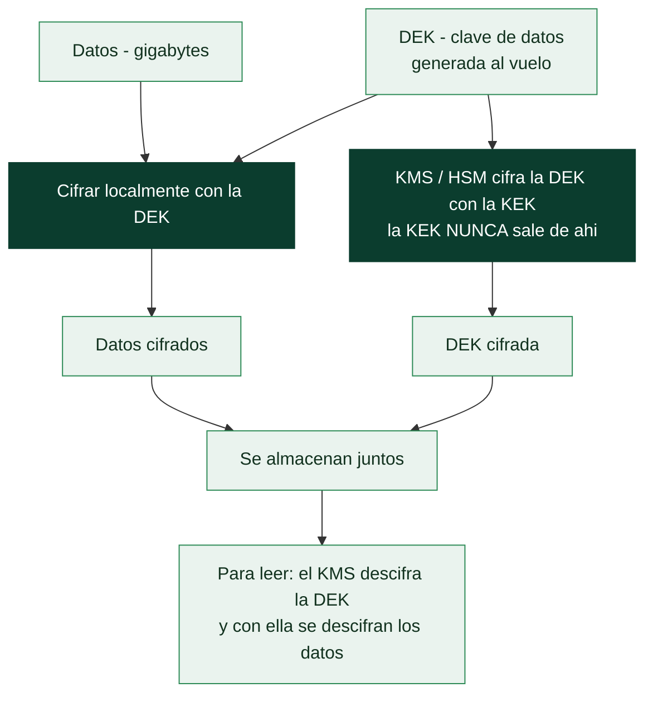

# Clase 063 — Gestión de secretos: Vault y KMS

> Parte: **2 — Criptografía aplicada** · Fuente: *Real-World Cryptography* (Wong) y documentación de HashiCorp Vault / AWS KMS
> ⏱️ Duración estimada: **110 min** · Nivel: **Intermedio**

---

## 🎯 Objetivo

Aprender a gestionar el ciclo de vida de las claves y secretos en sistemas reales: dónde guardarlos, cómo rotarlos, cómo evitar hardcodearlos en el código, y qué papel juegan los HSM, los servicios KMS (AWS/GCP/Azure) y HashiCorp Vault. El alumno entenderá conceptos como envelope encryption, cifrado como servicio, secretos dinámicos y el principio de mínimo privilegio aplicado a las claves.

## 📚 Resultados de aprendizaje

Al finalizar, el alumno podrá:

1. **Explicar** por qué los secretos no deben vivir en el código ni en el control de versiones.
2. **Describir** envelope encryption y la jerarquía de claves (KEK/DEK).
3. **Diferenciar** un KMS, un HSM y un gestor de secretos como Vault.
4. **Operar** un Vault de laboratorio: almacenar, leer y rotar secretos.
5. **Aplicar** rotación de claves, versionado y mínimo privilegio.

## 🗺️ Temas

| # | Tema | Por qué importa |
|---|------|-----------------|
| 1 | Secretos en el código: anti-patrón | Origen de fugas masivas |
| 2 | HSM y raíz de confianza | Protección física de claves |
| 3 | KMS y cifrado como servicio | Claves gestionadas |
| 4 | Envelope encryption (KEK/DEK) | Escala el cifrado de datos |
| 5 | HashiCorp Vault | Gestor de secretos completo |
| 6 | Secretos dinámicos | Credenciales efímeras |
| 7 | Rotación y mínimo privilegio | Reducir la ventana de compromiso |

## 🧠 Explicación en profundidad

### El problema que ninguna primitiva resuelve: ¿dónde vive la clave?

Toda la parte ha construido mecanismos que dependen de una clave secreta. Queda la
pregunta incómoda: **¿dónde se guarda esa clave?** Es un problema recursivo —cifrar la
clave exige otra clave— y su mala resolución es responsable de más brechas que cualquier
debilidad algorítmica.

El anti-patrón universal es el **secreto en el código**. Una credencial escrita en el
repositorio se replica en cada clon, viaja a cada CI, sobrevive en el historial de Git
—borrar el fichero **no** la elimina, como fija la clase 018— y se filtra en cuanto el
repositorio se hace público o alguien con acceso se marcha. Los rastreadores automáticos
que escanean GitHub encuentran claves de AWS en **segundos** desde su publicación. Y el
segundo anti-patrón, menos evidente, es la **variable de entorno**: mejor que el código,
pero visible en el listado de procesos, en los volcados de memoria, en los logs de
depuración y en la inspección de un contenedor.

### La cadena de confianza física: HSM y KMS

La respuesta profesional invierte el planteamiento: en lugar de proteger la clave donde
está, se hace que **la clave nunca salga de un sitio protegido**. Un **HSM** (*Hardware
Security Module*) es un dispositivo que genera y guarda claves internamente y solo expone
operaciones —firma esto, descifra aquello—, con resistencia física a la manipulación. La
clave privada no se puede extraer ni siquiera con acceso administrativo, y eso es lo que
sostiene las CA raíz de la clase 055.

Un **KMS** en la nube (AWS KMS, Azure Key Vault, Google Cloud KMS) lleva ese modelo a
servicio gestionado: pides "descifra este blob" y el KMS responde, con la operación
registrada y sometida a control de acceso. La técnica que hace esto viable a escala es el
**envelope encryption**: en vez de mandar gigabytes al KMS, se genera una clave de datos
(**DEK**) local que cifra el contenido, y solo esa DEK se cifra con la clave maestra
(**KEK**) que vive en el KMS. Se guarda la DEK cifrada junto al dato. Rotar la KEK es
entonces barato —basta con recifrar las DEK, no los datos— y cada dato puede tener su
propia DEK.



### Vault y la idea que cambia el modelo: secretos efímeros

**HashiCorp Vault** cubre el problema completo: almacena secretos cifrados, autentica a
quien los pide (por identidad de máquina, token de Kubernetes, rol de nube), aplica
políticas de mínimo privilegio y **registra cada acceso**, lo que convierte los secretos en
algo auditable. Arranca *sellado* y necesita varias claves de desellado repartidas entre
personas distintas, aplicando control dual a la raíz de confianza.

Su aportación más transformadora son los **secretos dinámicos**. En lugar de una
credencial de base de datos estática que vive años y que todo el equipo conoce, Vault
**crea una credencial nueva por cada consumidor** con un TTL corto y la revoca al
expirar. Eso cambia la naturaleza del riesgo: una credencial filtrada caduca sola en una
hora, la rotación deja de ser un proyecto trimestral doloroso y cada acceso queda atribuido
a un solicitante concreto, lo que da la trazabilidad de la clase 001.

### Lo que hay que hacer, en orden

La práctica se resume en pocas reglas, todas verificables. **Nunca** comprometas secretos
en el repositorio, y usa escáneres (`gitleaks`, `detect-secrets`) en el gancho de
pre-commit y en CI para que sea el sistema quien lo impida. **Rota** periódicamente, y
sobre todo **automatiza la rotación**: un procedimiento manual y doloroso no se ejecuta.
Aplica **mínimo privilegio** —cada servicio con su propia credencial y solo los permisos
que necesita, nunca una credencial compartida—. Y prepara de antemano el procedimiento de
**respuesta a una filtración**: revocar primero, investigar después, y asumir que todo lo
accesible con esa credencial estuvo expuesto desde el momento en que se filtró, no desde
que te enteraste.

## 📖 Definiciones y características

- **Gestión de secretos**: prácticas y herramientas para almacenar, distribuir y rotar claves, tokens y credenciales. Característica: centraliza y audita el acceso.
- **HSM (Hardware Security Module)**: dispositivo que genera y custodia claves sin exportarlas; ancla de confianza física.
- **KMS**: servicio gestionado que crea y usa claves; a menudo respaldado por HSM. Ofrece cifrado como servicio (la clave nunca sale).
- **Envelope encryption**: se cifra el dato con una DEK (clave de datos) y la DEK se cifra con una KEK (clave maestra) del KMS. Escala y limita el uso directo de la KEK.
- **HashiCorp Vault**: sistema para almacenar secretos, emitir credenciales dinámicas y actuar como motor de cifrado (transit).
- **Secreto dinámico**: credencial de vida corta generada bajo demanda (p. ej. acceso temporal a una base de datos), reduciendo el riesgo.
- **Mínimo privilegio / rotación**: cada identidad accede solo a lo necesario y las claves se renuevan periódicamente.

## 📔 Glosario

| Término | Definición concisa |
|---------|--------------------|
| Secreto en el código | Credencial en el repositorio; anti-patrón que persiste en el historial |
| Variable de entorno | Mejor que el código, pero visible en procesos y volcados |
| HSM | Dispositivo que guarda claves y solo expone operaciones |
| Resistencia a manipulación | Propiedad física del HSM frente a extracción |
| KMS | Servicio gestionado de claves en la nube |
| KEK | Clave maestra que cifra otras claves; vive en el KMS/HSM |
| DEK | Clave de datos que cifra el contenido; se guarda cifrada |
| Envelope encryption | Cifrar datos con la DEK y la DEK con la KEK |
| Vault | Gestor de secretos con autenticación, políticas y auditoría |
| Sellado / desellado | Arranque de Vault con claves repartidas entre personas |
| Secreto dinámico | Credencial creada al vuelo, con TTL corto y revocación |
| TTL | Tiempo de vida de una credencial efímera |
| Rotación | Renovar secretos periódicamente; debe ser automática |
| gitleaks / detect-secrets | Escáneres de secretos en repositorios y CI |
| Mínimo privilegio | Cada servicio con su credencial y solo sus permisos |

## 🧰 Herramientas y preparación

```bash
# Vault en modo desarrollo (solo laboratorio, NO producción)
vault --version 2>/dev/null || echo "instala HashiCorp Vault para el lab"
```

> El modo `-dev` de Vault es exclusivamente para aprendizaje: guarda datos en memoria y desactiva TLS. Nunca lo uses con secretos reales.

## 🧪 Laboratorio guiado

1. **Arranca un Vault de laboratorio**:

   ```bash
   vault server -dev
   export VAULT_ADDR='http://127.0.0.1:8200'
   ```

2. **Guarda y lee un secreto (KV)**:

   ```bash
   vault kv put secret/miapp db_password="prueba-lab-123"
   vault kv get secret/miapp
   ```

3. **Cifrado como servicio (transit)**. Habilita el motor `transit`, crea una clave y cifra/descifra datos sin que la aplicación vea nunca la clave:

   ```bash
   vault secrets enable transit
   vault write -f transit/keys/miclave
   vault write transit/encrypt/miclave plaintext=$(echo -n "dato" | base64)
   ```

4. **Envelope encryption (concepto)**. Explica el flujo: la app pide al KMS/Vault que cifre una DEK; almacena el dato cifrado con la DEK y la DEK cifrada junto a él; para leer, pide descifrar la DEK.

5. **Rotación**. Rota la clave transit (`vault write -f transit/keys/miclave/rotate`) y verifica que los datos antiguos siguen descifrándose por versión.

## ✍️ Ejercicios

1. Explica tres razones para no guardar secretos en Git.
2. Diseña una jerarquía KEK/DEK para cifrar una base de datos.
3. Configura un secreto en Vault y léelo desde un script.
4. Compara HSM, KMS y Vault en propósito y garantías.
5. Investiga cómo se detecta un secreto filtrado (git-secrets, gitleaks).
6. Propón una política de rotación y expiración para claves de API.

## 📝 Reto verificable

Implementa envelope encryption en una pequeña app: genera una DEK por objeto, cifra los datos con AES-GCM y protege la DEK con el motor transit de Vault (o un KMS de laboratorio); guarda solo el dato cifrado y la DEK cifrada. **Criterio de aceptación**: los datos se recuperan pidiendo a Vault que descifre la DEK, la DEK en claro nunca se persiste, y rotar la clave maestra no impide leer datos antiguos.

## ⚠️ Errores comunes

| Síntoma / mensaje | Causa y cómo arreglar |
|-------------------|-----------------------|
| Secretos hardcodeados en el repo | Fuga; usa un gestor de secretos y escanea el histórico |
| Misma clave para todo y sin rotación | Compromiso total; usa KEK/DEK y rota |
| Vault `-dev` en producción | Inseguro; despliega con almacenamiento y TLS reales |
| Permisos excesivos (todos leen todo) | Aplica mínimo privilegio con políticas |
| DEK almacenada en claro | Cífrala con la KEK del KMS/Vault |

## ❓ Preguntas frecuentes

**❓ ¿KMS o Vault?**
KMS gestiona claves (a menudo con HSM) y ofrece cifrado como servicio; Vault añade secretos dinámicos, KV y motores múltiples. Suelen complementarse.

**❓ ¿Qué es envelope encryption y por qué usarla?**
Cifrar datos con DEKs y proteger esas DEKs con una KEK del KMS; escala, limita el uso de la clave maestra y facilita la rotación.

**❓ ¿Cada cuánto rotar claves?**
Según política y sensibilidad; adopta rotación automatizada y rota de inmediato ante sospecha de compromiso.

## 🔗 Referencias

- HashiCorp Vault docs — <https://developer.hashicorp.com/vault/docs>
- AWS KMS Developer Guide — <https://docs.aws.amazon.com/kms/>
- Wong, *Real-World Cryptography*, cap. 8 y 13.
- OWASP Secrets Management Cheat Sheet — <https://cheatsheetseries.owasp.org/cheatsheets/Secrets_Management_Cheat_Sheet.html>

## 📥 Material descargable

- 📄 [Guía en PDF](./clase-063-guia.pdf) — versión imprimible de esta clase.
- 🎞️ [Presentación (PPTX)](./clase-063-presentacion.pptx) — deck para proyectar en clase.

## ⬅️ Clase anterior

[Clase 062 — Criptografía post-cuántica](../062-criptografia-post-cuantica/README.md)

## ➡️ Siguiente clase

[Clase 064 — Esteganografía y ocultación de datos](../064-esteganografia-y-ocultacion-de-datos/README.md)
