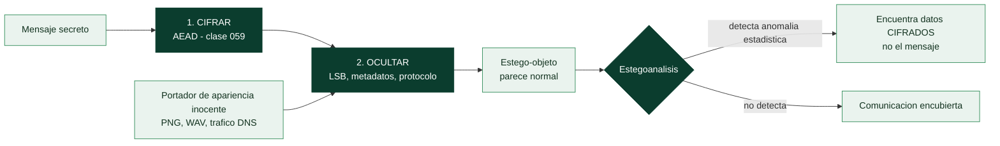

# Clase 064 — Esteganografía y ocultación de datos

> Parte: **2 — Criptografía aplicada** · Fuente: *Serious Cryptography* (Aumasson) y literatura de esteganografía/estegoanálisis
> ⏱️ Duración estimada: **90 min** · Nivel: **Intermedio**

---

## 🎯 Objetivo

Distinguir esteganografía (ocultar la **existencia** de un mensaje) de criptografía (ocultar su **contenido**), y entender cómo se combinan. El alumno aprenderá técnicas clásicas (LSB en imágenes, ocultación en metadatos), el estegoanálisis (detección), y usos legítimos (marcas de agua, watermarking) frente a usos maliciosos (exfiltración, C2 encubierto). Todo se practica sobre archivos propios de laboratorio.

> ⚠️ **Nota ética**: las técnicas de ocultación se practican **solo** con archivos propios y con fines de aprendizaje/defensa. Usarlas para exfiltrar datos o evadir controles sin autorización es ilícito.

## 📚 Resultados de aprendizaje

Al finalizar, el alumno podrá:

1. **Diferenciar** esteganografía de criptografía y explicar cuándo combinarlas.
2. **Ocultar y extraer** datos con LSB en imágenes.
3. **Usar** herramientas de esteganografía y estegoanálisis.
4. **Detectar** indicios de contenido oculto en archivos.
5. **Explicar** usos legítimos (watermarking) y riesgos (exfiltración, C2).

## 🗺️ Temas

| # | Tema | Por qué importa |
|---|------|-----------------|
| 1 | Estego vs cripto | Ocultar existencia vs contenido |
| 2 | LSB en imágenes | Técnica clásica |
| 3 | Ocultación en metadatos/otros formatos | Superficie amplia |
| 4 | Cifrar antes de ocultar | Defensa en profundidad |
| 5 | Estegoanálisis | Detección |
| 6 | Watermarking | Uso legítimo |
| 7 | Exfiltración y C2 encubierto | Amenaza defensiva |

## 🧠 Explicación en profundidad

### Ocultar el contenido frente a ocultar la existencia

La criptografía y la esteganografía resuelven problemas distintos, y confundirlos lleva a
decisiones malas. La criptografía hace que un mensaje sea **ilegible**, pero no oculta que
existe: quien observe el canal ve un bloque de datos cifrado y sabe que hubo una
comunicación protegida. La esteganografía hace que el mensaje sea **invisible**,
escondiéndolo dentro de un portador de apariencia inocente, pero no lo protege si alguien
descubre dónde está.

De ahí que su valor real aparezca cuando el propio hecho de cifrar es peligroso o
sospechoso —regímenes que penalizan el cifrado, redes donde el tráfico cifrado anómalo
dispara alertas, exfiltración que debe pasar desapercibida—. Y de ahí también la regla de
oro de la clase: **cifrar primero y ocultar después**. Combinadas, son defensa en
profundidad: si el estegoanálisis detecta el portador, el atacante encuentra datos
cifrados y no el mensaje. Además, un contenido cifrado tiene una distribución
prácticamente uniforme, lo que en muchos portadores se camufla mejor.

### LSB: la técnica clásica y por qué funciona

La técnica canónica es la **sustitución del bit menos significativo (LSB)**. En una imagen
sin compresión con pérdida, cada píxel tiene componentes de rojo, verde y azul de 8 bits;
cambiar el último bit de cada componente altera el valor en una unidad como mucho, un
cambio **imperceptible para el ojo humano**. Con tres bits ocultos por píxel, una imagen de
un megapíxel transporta unos 375 KB de datos.

Sus límites definen dónde se puede aplicar. Solo funciona en formatos **sin pérdida** —PNG,
BMP, WAV—: guardar la imagen como JPEG destruye el mensaje, porque su compresión descarta
justamente los detalles imperceptibles. Y es frágil ante cualquier reprocesado: escalar,
recortar, recomprimir o aplicar un filtro borra la carga. Por eso la esteganografía real
va más allá del LSB e incluye ocultación en **metadatos** (campos EXIF, comentarios ID3),
en el *slack space* de un sistema de archivos, en campos no usados de cabeceras de
protocolo, en la temporización de los paquetes, o en el propio DNS —el *tunneling* de la
clase 041 es, en esencia, esteganografía sobre un protocolo—.



### Detectarla: estegoanálisis

El **estegoanálisis** busca las huellas estadísticas que deja la ocultación. Los bits
menos significativos de una imagen natural no son perfectamente aleatorios: siguen
patrones derivados del sensor y del contenido. Sustituirlos por datos cifrados —que sí son
uniformes— **aumenta la entropía** de ese plano de bits y rompe correlaciones esperadas.
El **análisis chi-cuadrado** y el **RS analysis** detectan justamente eso. Señales más
groseras también sirven: un fichero anormalmente grande para sus dimensiones, un PNG donde
todo el mundo usa JPEG, o metadatos con campos inusualmente largos.

Para el defensor hay además una vía práctica muy eficaz que no requiere detectar nada:
**la sanitización**. Recomprimir toda imagen entrante, escalarla ligeramente o eliminar
sus metadatos destruye la carga oculta sin necesidad de saber si existía.

### Por qué esto importa en defensa

Aunque suene a curiosidad, la esteganografía es una amenaza operativa concreta. El malware
la usa como canal encubierto: se han documentado familias que reciben órdenes ocultas en
imágenes publicadas en redes sociales o en servicios de imágenes públicos —un canal de C2
que atraviesa cualquier firewall porque el tráfico es indistinguible de navegar—, y
también campañas que exfiltran datos dentro de ficheros aparentemente normales adjuntos en
correos. Su uso legítimo más extendido es el **watermarking**: marcas de agua robustas,
diseñadas para sobrevivir al reprocesado, que sirven para trazar la procedencia de
contenido con derechos.

Como todo en esta parte, el uso ético manda: practicar la ocultación y su detección en el
laboratorio propio es formación; emplearla para sacar información de una organización sin
autorización es exfiltración, con las consecuencias que fija la clase 025.

## 📖 Definiciones y características

- **Esteganografía**: ocultar información dentro de otro medio (imagen, audio, texto) para que su existencia pase inadvertida. Característica: la seguridad depende de que nadie sospeche.
- **LSB (Least Significant Bit)**: sustituir el bit menos significativo de cada píxel/byte por bits del mensaje; imperceptible a la vista pero detectable estadísticamente.
- **Estegoanálisis**: conjunto de técnicas para detectar la presencia de datos ocultos (análisis estadístico, chi-cuadrado, herramientas como stegdetect).
- **Cover / stego object**: el medio portador original y el resultante con datos ocultos.
- **Watermarking**: marca embebida (visible o no) para autenticar propiedad o rastrear filtraciones; prioriza robustez sobre capacidad.
- **Capacidad vs imperceptibilidad vs robustez**: trade-off fundamental de toda técnica de ocultación.
- **Cifrar-luego-ocultar**: cifrar el mensaje antes de esconderlo protege el contenido aunque se detecte el portador.

## 📔 Glosario

| Término | Definición concisa |
|---------|--------------------|
| Esteganografía | Ocultar la **existencia** del mensaje |
| Criptografía | Ocultar el **contenido** del mensaje |
| Portador (*cover*) | Fichero o canal de apariencia inocente que aloja el mensaje |
| Estego-objeto | Portador con la carga ya oculta dentro |
| LSB | Sustitución del bit menos significativo |
| Formato sin pérdida | PNG, BMP, WAV; necesarios para que el LSB sobreviva |
| Capacidad | Cantidad de datos que un portador puede ocultar |
| Metadatos EXIF / ID3 | Campos de imagen y audio usados para ocultar |
| Slack space | Espacio sobrante de un bloque de disco |
| Canal encubierto | Vía de comunicación no prevista por el diseño |
| Estegoanálisis | Detección de contenido oculto |
| Chi-cuadrado / RS analysis | Pruebas estadísticas que detectan LSB |
| Entropía anómala | Indicio de que un plano de bits contiene datos cifrados |
| Sanitización | Recomprimir o escalar para destruir la carga oculta |
| Watermarking | Marca de agua robusta para trazar procedencia |

## 🧰 Herramientas y preparación

```bash
pip install pillow numpy
# herramientas dedicadas (opcional)
which steghide zsteg stegseek 2>/dev/null || echo "opcional para el lab"
```

Usa imágenes y archivos generados por ti. No manipules material ajeno.

## 🧪 Laboratorio guiado

1. **Oculta un mensaje con LSB en Python**:

   ```python
   from PIL import Image
   img = Image.open("cover.png").convert("RGB")
   px = img.load()
   msg = "secreto".encode() + b"\x00"
   bits = ''.join(f"{b:08b}" for b in msg)
   i = 0
   for y in range(img.height):
       for x in range(img.width):
           if i < len(bits):
               r, g, b = px[x, y]
               r = (r & ~1) | int(bits[i]); i += 1
               px[x, y] = (r, g, b)
   img.save("stego.png")
   ```

2. **Extrae el mensaje** leyendo el LSB del canal rojo hasta el terminador `\x00`.

3. **Cifra antes de ocultar**. Cifra el mensaje con AES-GCM (clase 059) y luego escóndelo; ahora, aunque se detecte el portador, el contenido permanece protegido.

4. **Estegoanálisis**. Compara histogramas o aplica una prueba chi-cuadrado entre `cover.png` y `stego.png`; observa las anomalías que delatan la manipulación LSB. Prueba herramientas como `zsteg`/`stegseek` sobre tus propios archivos.

5. **Discusión defensiva**. Analiza cómo un atacante podría usar imágenes en un foro para C2 encubierto y qué señales buscaría un defensor (tamaños anómalos, entropía, tráfico a imágenes).

## ✍️ Ejercicios

1. Explica la diferencia entre esteganografía y cifrado con un ejemplo.
2. Oculta y recupera un mensaje LSB en una imagen propia.
3. Aplica una prueba estadística para detectar tu propio stego object.
4. Cifra un mensaje y ocúltalo; razona qué protege cada capa.
5. Investiga un caso real de malware que usó esteganografía.
6. Compara capacidad e imperceptibilidad de LSB en PNG vs JPEG.

## 📝 Reto verificable

Implementa una herramienta que cifre un mensaje con AES-GCM y lo oculte por LSB en una imagen, más un extractor que recupere y descifre el mensaje. **Criterio de aceptación**: el mensaje se recupera intacto solo con la clave correcta, la imagen resultante es visualmente idéntica al portador, y describes qué señal estadística podría delatar la ocultación.

## ⚠️ Errores comunes

| Síntoma / mensaje | Causa y cómo arreglar |
|-------------------|-----------------------|
| El mensaje oculto se pierde | Recompresión JPEG destruye LSB; usa formatos sin pérdida (PNG) |
| Confiar solo en la ocultación | Si se detecta, se lee; cifra antes de ocultar |
| Portador visiblemente alterado | Demasiada carga; reduce la capacidad |
| Estego detectable trivialmente | Patrón LSB uniforme; distribuye o usa técnicas robustas |
| Usar estego para evadir controles sin permiso | Ilegal; limítate a laboratorio propio |

## ❓ Preguntas frecuentes

**❓ ¿La esteganografía sustituye al cifrado?**
No; oculta la existencia, no el contenido. Combínala con cifrado para defensa en profundidad.

**❓ ¿Es fácil detectar LSB?**
Sí, con análisis estadístico. La esteganografía robusta es un campo activo; LSB simple es didáctico pero detectable.

**❓ ¿Para qué sirve legítimamente?**
Marcas de agua, trazabilidad de filtraciones, autenticación de contenido y ocultación de metadatos sensibles.

## 🔗 Referencias

- Aumasson, *Serious Cryptography* (contexto de ocultación y aleatoriedad).
- Fridrich, *Steganography in Digital Media* (referencia académica).
- Provos & Honeyman, "Hide and Seek: An Introduction to Steganography".
- Herramientas: steghide, zsteg, stegseek (documentación oficial).

## 📥 Material descargable

- 📄 [Guía en PDF](./clase-064-guia.pdf) — versión imprimible de esta clase.
- 🎞️ [Presentación (PPTX)](./clase-064-presentacion.pptx) — deck para proyectar en clase.

## ⬅️ Clase anterior

[Clase 063 — Gestión de secretos: Vault y KMS](../063-gestion-de-secretos-vault-y-kms/README.md)

## ➡️ Siguiente clase

[Clase 065 — Implementaciones seguras y errores criptográficos comunes](../065-implementaciones-seguras-y-errores-criptograficos-comunes/README.md)
