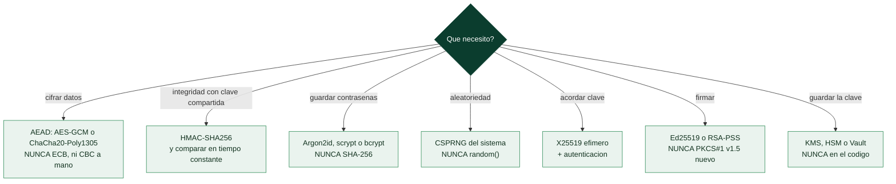

# Clase 065 — Implementaciones seguras y errores criptográficos comunes

> Parte: **2 — Criptografía aplicada** · Fuente: *Cryptography Engineering* (Ferguson/Schneier/Kohno) y *Real-World Cryptography* (Wong)
> ⏱️ Duración estimada: **120 min** · Nivel: **Avanzado**

---

## 🎯 Objetivo

Cerrar la parte con la lección que unifica todo lo anterior: la criptografía se rompe en la implementación, no en las matemáticas. El alumno recopilará el catálogo de errores criptográficos comunes (los del OWASP A02 "Cryptographic Failures"), aprenderá a auditarlos y evitarlos, y consolidará las reglas de oro: usa librerías auditadas, AEAD por defecto, nonces únicos, aleatoriedad segura, comparación en tiempo constante y no inventes tu propia cripto.

## 📚 Resultados de aprendizaje

Al finalizar, el alumno podrá:

1. **Enumerar** los fallos criptográficos más comunes y su causa raíz.
2. **Auditar** un fragmento de código en busca de anti-patrones cripto.
3. **Aplicar** las reglas de oro de implementación segura.
4. **Elegir** las primitivas por defecto correctas para cada necesidad.
5. **Usar** herramientas de detección (linters cripto, escáneres de secretos).

## 🗺️ Temas

| # | Tema | Por qué importa |
|---|------|-----------------|
| 1 | OWASP A02 Cryptographic Failures | Marco de referencia |
| 2 | Primitivas obsoletas (DES, MD5, ECB, RC4) | Erradicarlas |
| 3 | Nonces/IV mal gestionados | Fuente recurrente de brechas |
| 4 | Aleatoriedad y claves hardcodeadas | Fallos silenciosos |
| 5 | Falta de autenticación (sin AEAD/MAC) | Manipulación |
| 6 | Comparaciones no constantes | Timing |
| 7 | Reglas de oro y "criptoagilidad" | Diseño robusto y migrable |

## 🧠 Explicación en profundidad

### La regla que resume la parte: no inventes criptografía

Las vulnerabilidades criptográficas reales casi nunca vienen de romper AES o RSA. Vienen de
**usarlos mal**, y por eso OWASP colocó *Cryptographic Failures* en el segundo puesto de su
Top 10. Esta clase recoge los patrones de fallo que se repiten y los convierte en una lista
de comprobación aplicable.

El principio rector es incómodo para el ego pero salva sistemas: **no diseñes ni
implementes primitivas propias**. Usa bibliotecas maduras y, mejor todavía, **bibliotecas
de alto nivel con pocas decisiones** —libsodium, Tink, `cryptography` de Python en su capa
*recipes*, o la `age` para ficheros— que no te dejan elegir el modo, ni el relleno, ni el
IV, porque cada elección es una oportunidad de fallar. La API correcta de criptografía es
aquella en la que **el camino fácil es el seguro**.



### El catálogo de fallos, y de dónde viene cada uno

**Primitivas obsoletas.** DES y 3DES por tamaño de bloque y de clave; MD5 y SHA-1 por
colisiones prácticas (clase 051); RC4 por sus sesgos (clase 048); ECB por filtrar la
estructura (clase 047). Todas siguen apareciendo en sistemas en producción, casi siempre
por copiar un ejemplo antiguo de Internet.

**IV y nonces mal gestionados.** Un IV fijo o predecible en CBC; un nonce repetido en GCM o
ChaCha20, que además de romper la confidencialidad permite falsificar tags (clases 048 y
059); contadores que se reinician al restaurar una máquina desde snapshot.

**Aleatoriedad y claves.** Usar el PRNG estadístico del lenguaje en vez del CSPRNG (clase
058); derivar una clave de algo con poca entropía; y sobre todo **claves incrustadas en el
código**, que la clase 063 desmonta.

**Falta de autenticación.** Cifrar sin AEAD ni MAC, dejando el mensaje maleable; o componer
mal, con MAC-then-encrypt en lugar de encrypt-then-MAC (clase 052).

**Fugas por tiempo.** Comparar etiquetas, tokens o contraseñas con `==`, entregando un
oráculo byte a byte (clase 060).

**Validación insuficiente.** Aceptar cualquier certificado por comodidad —el
`verify=False` que aparece "provisionalmente" y se queda para siempre— destruye TLS por
completo, porque anula la autenticación que impide el MitM de la clase 040. Y en JWT, el
clásico aceptar el algoritmo que declara el propio token, incluido `none`.

### Criptoagilidad: diseñar para el día que haya que cambiar

La historia de esta parte —DES, MD5, SHA-1, RC4, y ahora RSA y ECC ante la amenaza
cuántica— demuestra que **toda primitiva acaba caducando**. Un sistema bien diseñado lo
asume: no incrusta el algoritmo en la lógica, sino que **versiona sus datos cifrados**
guardando junto a ellos qué algoritmo y qué parámetros se usaron. Eso permite descifrar lo
antiguo mientras se escribe lo nuevo con el algoritmo actual, y migrar sin una parada.
Aplicado a contraseñas, es lo que permite recalcular el hash con parámetros más fuertes en
el siguiente inicio de sesión de cada usuario.

Cierra la parte una comprobación honesta: revisar código real —el propio, o un ejemplo
preparado— buscando estos patrones es el mejor ejercicio de criptografía aplicada que
existe, porque enseña que la distancia entre "usa AES-256" y "es seguro" es exactamente
todo lo que se ha estudiado en estas veinte clases.

## 📖 Definiciones y características

- **Cryptographic Failures (OWASP A02)**: categoría que agrupa el uso de cripto débil, mal configurada o ausente que expone datos sensibles.
- **Criptoagilidad**: capacidad de un sistema para cambiar algoritmos y claves sin rediseñarse; clave para la migración PQC.
- **Anti-patrón cripto**: práctica insegura recurrente (ECB, IV fijo, clave en código, hash rápido para contraseñas, comparación con `==`).
- **Defaults seguros**: elegir de fábrica AEAD, KDFs lentas y curvas modernas para que el camino fácil sea el correcto.
- **Superficie de implementación**: todo el código que rodea la primitiva (padding, parsing, manejo de errores) donde suelen estar los bugs.
- **Fail closed**: ante error, denegar sin exponer datos ni detalles.
- **Gestión del ciclo de vida de claves**: generación, distribución, rotación y destrucción seguras.

## 📔 Glosario

| Término | Definición concisa |
|---------|--------------------|
| OWASP A02 | *Cryptographic Failures*: categoría del Top 10 |
| No inventes criptografía | Usar bibliotecas maduras en vez de implementaciones propias |
| API de alto nivel | Biblioteca que no deja elegir modo, relleno ni IV |
| libsodium / Tink / age | Bibliotecas con el camino fácil ya seguro |
| Primitiva obsoleta | DES, 3DES, MD5, SHA-1, RC4, ECB |
| IV predecible | Vector de inicialización fijo o adivinable en CBC |
| Nonce repetido | Fallo catastrófico en GCM y en cifrados de flujo |
| Clave incrustada | Credencial escrita en el código fuente |
| Cifrado sin autenticar | Deja el mensaje maleable; usar AEAD |
| Comparación con `==` | Fuga por timing en etiquetas y tokens |
| `verify=False` | Desactivar la validación de certificados; anula TLS |
| JWT `alg: none` | Aceptar el algoritmo que declara el propio token |
| Criptoagilidad | Poder cambiar de algoritmo sin rehacer el sistema |
| Versionado del cifrado | Guardar algoritmo y parámetros junto al dato |
| Rehash en login | Recalcular el hash de contraseña con parámetros más fuertes |

## 🧰 Herramientas y preparación

```bash
pip install cryptography bandit
which gitleaks semgrep 2>/dev/null || echo "opcional: escáneres estáticos"
```

Auditoría sobre código propio o autorizado.

## 🧪 Laboratorio guiado

1. **Auditoría de código guiada**. Toma este fragmento vulnerable y detecta todos los fallos:

   ```python
   import hashlib, random
   KEY = b"1234567890123456"           # clave hardcodeada
   def cifrar(m):
       from cryptography.hazmat.primitives.ciphers import Cipher, algorithms, modes
       iv = b"\x00" * 16                # IV fijo
       c = Cipher(algorithms.AES(KEY), modes.ECB())  # ECB, sin auth
       return c.encryptor().update(m)
   def token():
       return str(random.random())     # PRNG no seguro
   def check(a, b):
       return a == b                   # comparación no constante
   def pwd_hash(p):
       return hashlib.md5(p).hexdigest()  # MD5 para contraseña
   ```

   Identifica: clave en código, ECB, sin autenticación, IV fijo, PRNG inseguro, comparación no constante y MD5 para contraseñas.

2. **Reescríbelo de forma segura**: clave desde KMS/Vault o variable de entorno, AES-GCM (AEAD) con nonce del CSPRNG, `secrets` para tokens, `hmac.compare_digest`, Argon2id para contraseñas.

3. **Escáneres estáticos**. Corre `bandit` sobre el archivo y `gitleaks`/`semgrep` para detectar la clave hardcodeada; compara hallazgos con tu revisión manual.

4. **Checklist de criptoagilidad**. Verifica que tu diseño permite cambiar algoritmo/clave por configuración y versiona el formato de los mensajes cifrados.

5. **Revisión de dependencias**. Comprueba que usas librerías mantenidas (`cryptography`, libsodium) y no implementaciones caseras de primitivas.

## ✍️ Ejercicios

1. Lista siete anti-patrones cripto y su corrección.
2. Reescribe el fragmento vulnerable del laboratorio de forma segura.
3. Ejecuta `bandit` y explica cada advertencia relevante.
4. Diseña un formato de mensaje cifrado con versión para criptoagilidad.
5. Audita una configuración TLS y una de almacenamiento de contraseñas juntas.
6. Redacta una guía interna de "reglas de oro cripto" para tu equipo.

## 📝 Reto verificable

Toma un módulo con al menos cinco fallos criptográficos (el del laboratorio u otro que construyas) y entrégalo corregido: AEAD, nonces del CSPRNG, claves fuera del código, Argon2id para contraseñas y comparaciones en tiempo constante, con versión de formato para criptoagilidad. **Criterio de aceptación**: `bandit` no reporta fallos cripto de severidad media/alta en el módulo corregido, los tests de cifrado/descifrado y de autenticación pasan, y ninguna clave o secreto aparece en el código.

## ⚠️ Errores comunes

| Síntoma / mensaje | Causa y cómo arreglar |
|-------------------|-----------------------|
| Clave/secreto en el repositorio | Muévelo a KMS/Vault/variables; escanea el histórico |
| ECB o cifrado sin autenticar | Usa AEAD (GCM/ChaCha20-Poly1305) |
| IV/nonce fijo o reutilizado | Genera con CSPRNG; garantiza unicidad |
| MD5/SHA-1/DES/RC4 en uso | Sustituye por SHA-256/3, AES-GCM, Argon2id |
| Comparaciones con `==` de secretos | Usa `compare_digest`/verificadores de la librería |
| "Cripto propia" sin auditar | Usa librerías estándar bien mantenidas |

## ❓ Preguntas frecuentes

**❓ ¿Cuál es la regla más importante?**
No inventes tu propia cripto: usa primitivas y librerías auditadas con defaults seguros (AEAD, KDFs lentas, curvas modernas).

**❓ ¿Cómo detecto estos fallos a escala?**
Combina revisión manual con escáneres (bandit, semgrep, gitleaks) integrados en CI, y auditorías periódicas de TLS y almacenamiento.

**❓ ¿Qué es la criptoagilidad y por qué me importa ahora?**
Poder cambiar algoritmos y claves sin rediseñar; será imprescindible en la migración post-cuántica y ante cualquier primitiva que se debilite.

## 🔗 Referencias

- OWASP Top 10 A02:2021 Cryptographic Failures — <https://owasp.org/Top10/A02_2021-Cryptographic_Failures/>
- Ferguson, Schneier, Kohno, *Cryptography Engineering* (todo el libro).
- Wong, *Real-World Cryptography*, cap. 8, 13 y 16.
- OWASP Cryptographic Storage Cheat Sheet — <https://cheatsheetseries.owasp.org/cheatsheets/Cryptographic_Storage_Cheat_Sheet.html>

## 📥 Material descargable

- 📄 [Guía en PDF](./clase-065-guia.pdf) — versión imprimible de esta clase.
- 🎞️ [Presentación (PPTX)](./clase-065-presentacion.pptx) — deck para proyectar en clase.

## ⬅️ Clase anterior

[Clase 064 — Esteganografía y ocultación de datos](../064-esteganografia-y-ocultacion-de-datos/README.md)

## ➡️ Siguiente clase

[Clase 066 — Metodología de pentesting: PTES y OSSTMM](../../parte-3-hacking-etico-y-pentesting-metodologia/066-metodologia-de-pentesting-ptes-y-osstmm/README.md)
