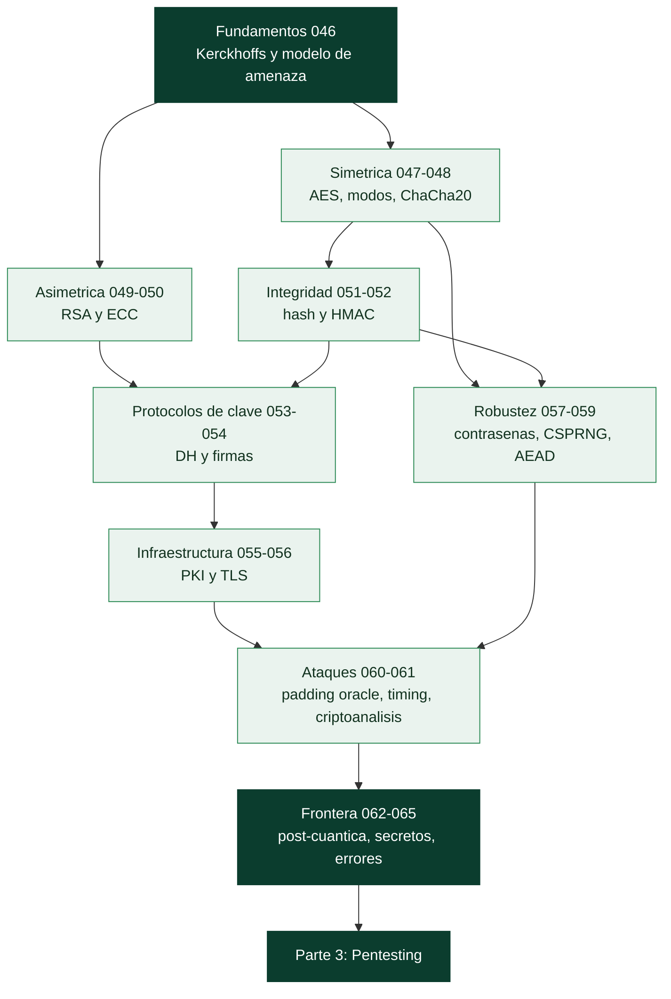

# Parte 2 — Criptografía aplicada

> [⬅️ Volver al programa](../../README.md) · [📚 Índice completo](../README.md) · [⏭️ Parte siguiente](../parte-3-hacking-etico-y-pentesting-metodologia/README.md)

**20 clases** · rango 046–065 · Simétrica, asimétrica, hashing, PKI, TLS y criptoanálisis

**Fuentes de referencia de esta parte:**

- Jean-Philippe Aumasson, *Serious Cryptography* (2ª ed., No Starch Press).
- David Wong, *Real-World Cryptography* (Manning).
- Niels Ferguson, Bruce Schneier y Tadayoshi Kohno, *Cryptography Engineering* (Wiley).
- Dan Boneh y Victor Shoup, *A Graduate Course in Applied Cryptography* (borrador libre en línea).
- NIST FIPS 197 (AES), FIPS 186-5 (firmas), SP 800-38 (modos), SP 800-90A (DRBG).
- IETF RFC 8446 (TLS 1.3), RFC 5116 (AEAD), RFC 8439 (ChaCha20-Poly1305).

---

## 🎯 ¿De qué trata esta parte?

La criptografía es el pilar sobre el que descansan la confidencialidad, la integridad y la autenticidad de casi todo lo que hacemos en redes: HTTPS, VPN, firma de software, mensajería cifrada, blockchains y almacenamiento de contraseñas. Esta parte te lleva desde los fundamentos históricos hasta las primitivas modernas que usan los sistemas reales, con un enfoque de **ingeniería**: no solo qué es AES o RSA, sino cómo se usan bien, cómo se rompen cuando se usan mal y qué herramientas reales manejar (OpenSSL, la librería `cryptography` de Python, hashcat).

El objetivo no es convertirte en criptógrafo teórico —eso requiere años de matemáticas— sino en un **usuario competente y crítico** de la criptografía. La mayoría de las brechas relacionadas con cripto no provienen de romper AES por fuerza bruta (imposible), sino de errores de implementación: nonces reutilizados, modos inseguros como ECB, padding oracles, comparaciones no constantes en tiempo, generadores de aleatoriedad predecibles y almacenamiento de contraseñas con hashes rápidos. Aprenderás a reconocer y evitar esas trampas.

Esta parte sirve a desarrolladores que integran cripto en sus aplicaciones, a pentesters que auditan implementaciones, a analistas de seguridad que evalúan configuraciones TLS y a cualquiera que quiera entender de verdad por qué "no hagas tu propia cripto" es un consejo tan repetido.

## 🧩 Problemas que resuelve

- Elegir la primitiva correcta para cada objetivo (confidencialidad, integridad, autenticación, intercambio de claves).
- Evitar los errores clásicos: ECB, nonce reutilizado, MAC-then-encrypt mal hecho, hashes rápidos para contraseñas.
- Configurar y auditar TLS moderno (cipher suites, forward secrecy, certificados).
- Entender PKI: cómo se emiten, validan y revocan los certificados X.509.
- Almacenar contraseñas de forma resistente a cracking con Argon2/bcrypt/scrypt.
- Reconocer ataques prácticos (padding oracle, timing) y por qué AEAD los previene.
- Prepararse para la transición post-cuántica y la gestión centralizada de secretos.

## 🎓 Resultados de aprendizaje

Al terminar la parte, podrás:

- Explicar y aplicar cifrado simétrico (AES-GCM, ChaCha20-Poly1305) y de flujo con nonces correctos.
- Usar RSA y ECC para cifrado, firma e intercambio de claves, entendiendo sus límites.
- Elegir y usar funciones hash (SHA-2, SHA-3, BLAKE2) y MAC (HMAC) según el caso.
- Diseñar un esquema de intercambio de claves con Diffie-Hellman y forward secrecy.
- Construir y validar una PKI de laboratorio con OpenSSL, incluyendo revocación.
- Auditar un handshake TLS 1.3 y detectar configuraciones débiles.
- Almacenar contraseñas de forma segura y estimar el coste de un ataque con hashcat.
- Identificar y explicar padding oracle, ataques de timing y por qué AEAD es el estándar.

## 🧱 Prerrequisitos

Se asume haber cursado la **[Parte 1 — Redes y seguridad de redes](../parte-1-redes-y-seguridad-de-redes/README.md)** (modelo TCP/IP, TLS a nivel de red, captura con Wireshark). Conviene manejar la línea de comandos de Linux, Python básico y aritmética modular a nivel intuitivo. No se requieren matemáticas avanzadas: los conceptos numéricos se introducen con analogías y ejemplos ejecutables.

Estas son las nociones previas concretas que más se usan y dónde repasarlas:

| Necesitas tener claro… | Dónde se cubre |
|---|---|
| Hashing frente a cifrado frente a codificación | [Clase 020](../parte-0-fundamentos-y-prerrequisitos/020-sistemas-de-numeracion-y-encoding-binario-hex-base64-y-url/README.md) |
| Intuición de simétrico, asimétrico y firma | [Clase 021](../parte-0-fundamentos-y-prerrequisitos/021-criptografia-conceptos-fundamentales-e-intuicion/README.md) |
| Qué añade TLS al canal y cómo verlo en la red | [Clase 013](../parte-0-fundamentos-y-prerrequisitos/013-http-https-y-la-arquitectura-de-la-web-moderna/README.md) · [Clase 036](../parte-1-redes-y-seguridad-de-redes/036-vpn-y-tuneles-ipsec-wireguard-y-openvpn/README.md) |
| Man-in-the-middle y por qué hay que autenticar | [Clase 040](../parte-1-redes-y-seguridad-de-redes/040-man-in-the-middle-tecnicas-y-defensa/README.md) |
| Python básico para los laboratorios | [Clase 015](../parte-0-fundamentos-y-prerrequisitos/015-python-para-seguridad-fundamentos-del-lenguaje/README.md) |

## 🧭 Cómo recorrer esta parte

**El orden importa aquí más que en la Parte 1.** Esta parte se construye acumulativamente: TLS (056) solo se entiende con Diffie-Hellman (053), firmas (054) y PKI (055) ya vistos; AEAD (059) responde a un problema planteado en 047 y 052; y el padding oracle (060) explota exactamente el relleno de 047. Si vas a saltar, salta bloques completos, no clases sueltas.

**El ritmo.** La parte suma unas **35 h 10 min** de trabajo guiado. A dos horas al día entre semana son unas **tres semanas y media**; a una hora, unas siete.

**Un aviso sobre las matemáticas.** Habrá exponenciación modular, curvas y funciones de Euler, y es normal no seguir cada paso algebraico la primera vez. Lo que sí hay que llevarse de cada clase es **qué problema difícil sostiene la seguridad** (factorizar, logaritmo discreto, ECDLP) y **qué garantiza y qué no garantiza cada primitiva**. Con eso se toman decisiones correctas; el álgebra es para quien quiera profundizar.

**El método, clase a clase.**

1. Lee **🎯 Objetivo** y **📚 Resultados de aprendizaje**.
2. Lee **🧠 Explicación en profundidad** entera antes de escribir código. Es donde está el porqué y los diagramas del mecanismo.
3. Prepara lo que pida **🧰 Herramientas y preparación** (aquí casi siempre OpenSSL y Python).
4. Haz el **🧪 Laboratorio guiado**. En esta parte el laboratorio suele ser *romper algo*: descifrar un ECB, explotar un padding oracle, medir un timing. Es la forma más rápida de que el concepto se quede.
5. Resuelve **✍️ Ejercicios** y el **📝 Reto verificable**.
6. Repasa el **📔 Glosario**. Aquí la densidad de siglas es máxima (AEAD, HKDF, OAEP, PSS, ECDHE, CSPRNG, KEK/DEK, ML-KEM): si no sabrías explicar una, vuelve a su sección.

> ⚠️ **Uso ético y legal.** Las clases 057 y 060 usan herramientas de crackeo y de explotación (hashcat, oráculos de relleno). Úsalas **solo** sobre hashes y servicios propios o de un entorno autorizado. Crackear credenciales ajenas o atacar un servicio de terceros es delito; repasa la [Clase 025](../parte-0-fundamentos-y-prerrequisitos/025-etica-legalidad-alcance-y-divulgacion-responsable/README.md).

## 🧱 Anatomía de una clase

Las 20 clases siguen el **estándar pedagógico profundo** del programa:

| Sección | Qué contiene | Para qué la usas |
|---|---|---|
| 🎯 Objetivo | Qué sabrás hacer al terminar y por qué importa | Decidir si necesitas la clase |
| 📚 Resultados de aprendizaje | Lista verificable de capacidades concretas | Autoevaluarte al final |
| 🗺️ Temas | Cada tema con el porqué de su inclusión | Ubicarte antes de leer |
| 🧠 Explicación en profundidad | El mecanismo explicado y conectado con el resto, con diagramas | Entender, no memorizar |
| 📖 Definiciones y características | Cada término desarrollado con su relevancia en seguridad | Consulta puntual |
| 📔 Glosario | Términos y siglas de la clase, en tabla | Repaso rápido |
| 🧰 Herramientas y preparación | Qué instalar y tener a mano | Antes del laboratorio |
| 🧪 Laboratorio guiado | Práctica paso a paso con herramientas reales | Donde de verdad se aprende |
| ✍️ Ejercicios · 📝 Reto verificable | Problemas propios y un entregable con criterio de aceptación | Consolidar y demostrar |
| ⚠️ Errores comunes · ❓ Preguntas frecuentes | Tropiezos reales y dudas auténticas | Cuando algo falla |
| 🔗 Referencias | Fuentes primarias y estándares (NIST, RFC) | Profundizar |

El CI del repositorio verifica que ninguna clase de esta parte pierda las secciones **🧠 Explicación en profundidad** ni **📔 Glosario**.

## 🗺️ Estructura temática

| Bloque | Clases | Contenido | Tiempo |
|--------|--------|-----------|--------|
| Fundamentos | 046 | Historia, principios (Kerckhoffs), modelo de amenaza | ≈ 1 h 30 |
| Cifrado simétrico | 047–048 | AES y modos, cifrado de flujo (ChaCha20), por qué no RC4 | ≈ 3 h 30 |
| Cifrado asimétrico | 049–050 | RSA y ECC | ≈ 4 h |
| Integridad y autenticación | 051–052 | Funciones hash (SHA-2/3), HMAC | ≈ 3 h |
| Protocolos de clave | 053–054 | Diffie-Hellman, firmas digitales | ≈ 3 h 20 |
| Infraestructura | 055–056 | PKI y X.509, TLS/SSL en profundidad | ≈ 4 h 10 |
| Robustez práctica | 057–059 | Hash de contraseñas, CSPRNG, AEAD | ≈ 4 h 50 |
| Ataques y análisis | 060–061 | Padding oracle y timing, criptoanálisis | ≈ 3 h 50 |
| Frontera y operación | 062–065 | Post-cuántica, secretos, esteganografía, errores comunes | ≈ 6 h 40 |

## 📖 Guía capítulo a capítulo

Qué hace cada clase, por qué está donde está y para qué te sirve después.

### 🏛️ Bloque 1 · Fundamentos — clase 046

- **[046 · Historia y fundamentos de la criptografía](046-historia-y-fundamentos-de-la-criptografia/README.md)** · 90 min — Las dos operaciones (sustitución y transposición) y cómo el análisis de frecuencias y Kasiski las rompieron, con la lección que atraviesa toda la parte: **la repetición y el determinismo filtran información**. El principio de Kerckhoffs, el modelo de amenaza, y el mapa simétrico/asimétrico/híbrido que ordena las 19 clases siguientes.

### 🔒 Bloque 2 · Cifrado simétrico — clases 047 a 048

- **[047 · Cifrado simétrico: AES y modos de operación](047-cifrado-simetrico-aes-y-modos-de-operacion/README.md)** · 120 min — AES cifra 16 bytes; **el modo decide todo lo demás**. Por qué ECB filtra la estructura (el pingüino sigue siendo visible), qué exige un IV en CBC, cómo CTR convierte un cifrado de bloque en uno de flujo, y por qué el relleno PKCS#7 abrirá la puerta al ataque de la clase 060.
- **[048 · Cifrado de flujo: ChaCha20 y por qué evitar RC4](048-cifrado-de-flujo-chacha20-y-por-que-evitar-rc4/README.md)** · 90 min — El keystream y el XOR, y el razonamiento de una línea que explica por qué **reutilizar un nonce destruye la confidencialidad**. RC4 como caso de estudio de que un sesgo diminuto acaba siendo explotable, y ChaCha20 como el diseño que lo reemplaza siendo además fácil de implementar en tiempo constante.

### 🔑 Bloque 3 · Cifrado asimétrico — clases 049 a 050

- **[049 · Cifrado asimétrico: RSA](049-cifrado-asimetrico-rsa/README.md)** · 120 min — La función unidireccional con trampilla, la matemática de `n`, `e`, `d` y φ(n), y por qué el RSA "de libro de texto" es inseguro por determinista y maleable. OAEP para cifrar, PSS para firmar, y el esquema **híbrido** que es como RSA se usa realmente.
- **[050 · Criptografía de curva elíptica (ECC)](050-criptografia-de-curva-eliptica-ecc/README.md)** · 120 min — La misma seguridad con claves diez veces más cortas (ECC 256 ≈ RSA 3072), el ECDLP como problema base, y la discusión de confianza entre curvas NIST y Curve25519. Con el fallo del nonce en ECDSA que abrió la PlayStation 3 y cómo Ed25519 lo elimina.

### 🧾 Bloque 4 · Integridad y autenticación — clases 051 a 052

- **[051 · Funciones hash: SHA-2, SHA-3 y sus propiedades](051-funciones-hash-sha-2-sha-3-y-sus-propiedades/README.md)** · 90 min — Qué es un hash y, sobre todo, **qué no es** (no es cifrado y no se invierte). Las tres resistencias, la paradoja del cumpleaños que explica por qué las colisiones cuestan 2^(n/2), y la trampa de extensión de longitud de Merkle-Damgård que motiva la clase siguiente.
- **[052 · HMAC y autenticación de mensajes](052-hmac-y-autenticacion-de-mensajes/README.md)** · 90 min — Un hash prueba integridad; **solo una clave prueba origen**. Por qué `H(clave ‖ mensaje)` es un error y HMAC no, el orden correcto de composición (**encrypt-then-MAC**), y por qué la comparación de la etiqueta también es criptografía.

### 🤝 Bloque 5 · Protocolos de clave — clases 053 a 054

- **[053 · Intercambio de claves: Diffie-Hellman](053-intercambio-de-claves-diffie-hellman/README.md)** · 100 min — Acordar un secreto hablando en público, y la carencia que obliga a combinarlo siempre con autenticación: **DH no autentica a nadie**. Efímero frente a estático y la **forward secrecy** que de ahí se deriva, HKDF para derivar claves usables, y Logjam como lección sobre parámetros compartidos.
- **[054 · Firmas digitales](054-firmas-digitales/README.md)** · 100 min — Lo que una firma añade sobre un MAC: **no repudio** y verificación pública. Hash-then-sign y por qué una colisión rompe la firma, los tres esquemas (RSA-PSS, ECDSA, Ed25519) y el riesgo del nonce, y los límites: una firma válida solo prueba quién tenía la clave.

### 🏢 Bloque 6 · Infraestructura — clases 055 a 056

- **[055 · PKI, certificados X.509 y autoridades de certificación](055-pki-certificados-x-509-y-autoridades-de-certificacion/README.md)** · 120 min — La pregunta que la clave pública no responde sola: **¿de quién es esta clave?**. La cadena de confianza y su anclaje, el ciclo CSR→emisión→revocación con el punto débil que es la revocación, y Certificate Transparency como respuesta a que cualquier CA puede emitir para cualquier dominio.
- **[056 · TLS/SSL en profundidad](056-tls-ssl-en-profundidad/README.md)** · 130 min — El sitio donde **todo lo anterior se ensambla**: ECDHE + certificado + firma + HKDF + AEAD. El handshake de TLS 1.3 en 1-RTT, el compromiso de 0-RTT, y por qué el protocolo es como es: cada rareza es la cicatriz de un ataque (BEAST, CRIME, POODLE, Lucky13, Heartbleed, FREAK).

### 🛠️ Bloque 7 · Robustez práctica — clases 057 a 059

- **[057 · Almacenamiento seguro de contraseñas](057-almacenamiento-seguro-de-contrasenas-bcrypt-scrypt-y-argon2/README.md)** · 100 min — Por qué la velocidad de SHA-256 es aquí el enemigo, la diferencia real entre **salt** (por usuario, público) y **pepper** (global, fuera de la base de datos), y la evolución bcrypt → scrypt → Argon2id con la idea de *memory-hard* que anula las GPU. Con lo que ninguna KDF puede arreglar.
- **[058 · Generación de aleatoriedad segura (CSPRNG)](058-generacion-de-aleatoriedad-segura-csprng/README.md)** · 90 min — El cimiento invisible: si el generador es predecible, **todo lo demás se derrumba**. PRNG frente a CSPRNG, por qué se usa el del sistema operativo y el mito de `/dev/random`, y los desastres concretos (Debian OpenSSL, PS3, carteras Android) que enseñan el patrón.
- **[059 · Cifrado autenticado (AEAD)](059-cifrado-autenticado-aead/README.md)** · 100 min — **Cifrar sin autenticar es una vulnerabilidad**, no media solución: el bit-flipping lo demuestra. Cómo el AEAD elimina el padding oracle al verificar el tag antes de descifrar, para qué sirve el AAD, y la regla absoluta del nonce en GCM (repetirlo permite **falsificar tags**, no solo leer).

### 🔬 Bloque 8 · Ataques y análisis — clases 060 a 061

- **[060 · Ataques criptográficos: padding oracle y timing](060-ataques-criptograficos-padding-oracle-y-timing/README.md)** · 120 min — Las brechas reales no rompen la matemática, rompen la implementación. El padding oracle paso a paso (**256 intentos por byte, sin la clave**), el tiempo como canal de salida, y las cuatro defensas que lo cierran: AEAD, error único, comparación en tiempo constante y bibliotecas maduras.
- **[061 · Introducción al criptoanálisis](061-introduccion-al-criptoanalisis/README.md)** · 110 min — Los modelos de adversario (COA/KPA/CPA/CCA) que dan sentido a la palabra "seguro", los **bits de seguridad** que permiten comparar algoritmos de forma honesta, y la destreza más útil: distinguir "roto académicamente" de "roto prácticamente" al leer un titular.

### 🧭 Bloque 9 · Frontera y operación — clases 062 a 065

- **[062 · Criptografía post-cuántica](062-criptografia-post-cuantica/README.md)** · 100 min — Shor rompe RSA, DH y ECC; Grover solo **debilita** la simétrica a la mitad de bits. Por qué la urgencia es hoy (*harvest now, decrypt later*), qué estandarizó NIST en 2024 (ML-KEM, ML-DSA, SLH-DSA) y por qué la práctica actual es la migración **híbrida**.
- **[063 · Gestión de secretos: Vault y KMS](063-gestion-de-secretos-vault-y-kms/README.md)** · 110 min — La pregunta que ninguna primitiva resuelve: **¿dónde vive la clave?**. Los dos anti-patrones (código y variables de entorno), HSM y KMS con *envelope encryption* (KEK/DEK), y los secretos dinámicos de Vault que convierten una credencial filtrada en un problema de una hora.
- **[064 · Esteganografía y ocultación de datos](064-esteganografia-y-ocultacion-de-datos/README.md)** · 90 min — Ocultar el **contenido** frente a ocultar la **existencia**, la regla de cifrar antes de ocultar, el LSB con sus límites reales, y el estegoanálisis. Con su lado defensivo: canales encubiertos de C2 en imágenes públicas y la sanitización como contramedida barata.
- **[065 · Implementaciones seguras y errores criptográficos comunes](065-implementaciones-seguras-y-errores-criptograficos-comunes/README.md)** · 120 min — El cierre práctico: un árbol de decisión de "qué usar para qué", el catálogo de fallos de OWASP A02 con el origen de cada uno en las clases previas, y la **criptoagilidad** —versionar el cifrado— para el día en que la primitiva actual caduque, porque todas caducan.

## 🧰 Qué tendrás al terminar

- Criterio para **elegir la primitiva correcta** para cada objetivo, y para rechazar las obsoletas al verlas en un código.
- Una **PKI de laboratorio** construida con OpenSSL: raíz, intermedia, emisión, validación y revocación.
- Un **servidor TLS auditado** por ti, con el informe de versiones, suites, forward secrecy y HSTS.
- Un **padding oracle explotado** en laboratorio, que es la mejor vacuna contra volver a cifrar sin autenticar.
- Una estimación medida con `hashcat` del **coste real** de crackear tus propios hashes según los parámetros de la KDF.
- El hábito de **no incrustar secretos** y de escanear el repositorio para que sea el sistema quien lo impida.

## 🚦 ¿Puedo saltarme clases?

Esta es la parte más acumulativa del programa; conviene saltar poco. Sáltate una clase solo si respondes de memoria a su pregunta de control:

| Si dominas… | Pregunta de control | Si titubeas |
|---|---|---|
| Simétrica (047–048) | ¿Qué pasa si repites un nonce en CTR o en GCM? | Haz 048 |
| Asimétrica (049–050) | ¿Por qué el RSA sin relleno es inseguro? | Haz 049 |
| Hash y MAC (051–052) | ¿Por qué `H(clave ‖ mensaje)` no es un MAC seguro? | Haz 052 |
| PKI y TLS (055–056) | ¿Qué valida exactamente un navegador en un certificado? | Haz 055 |
| Contraseñas (057) | ¿Qué diferencia hay entre salt y pepper? | Haz 057 |
| Implementación (059–060) | ¿Por qué AEAD elimina el padding oracle? | Haz 059 y 060 |

## 🔗 Referencias de la parte

- Aumasson, *Serious Cryptography*, No Starch Press — <https://nostarch.com/serious-cryptography-2nd-edition>
- Wong, *Real-World Cryptography*, Manning — <https://www.manning.com/books/real-world-cryptography>
- Ferguson, Schneier, Kohno, *Cryptography Engineering* — <https://www.schneier.com/books/cryptography-engineering/>
- Boneh & Shoup, *A Graduate Course in Applied Cryptography* — <https://toc.cryptobook.us/>
- NIST Cryptographic Standards — <https://csrc.nist.gov/projects/cryptographic-standards-and-guidelines>
- IETF RFC 8446 (TLS 1.3) — <https://www.rfc-editor.org/rfc/rfc8446>

## ▶️ Empezar

[Clase 046 — Historia y fundamentos de la criptografía](046-historia-y-fundamentos-de-la-criptografia/README.md)
