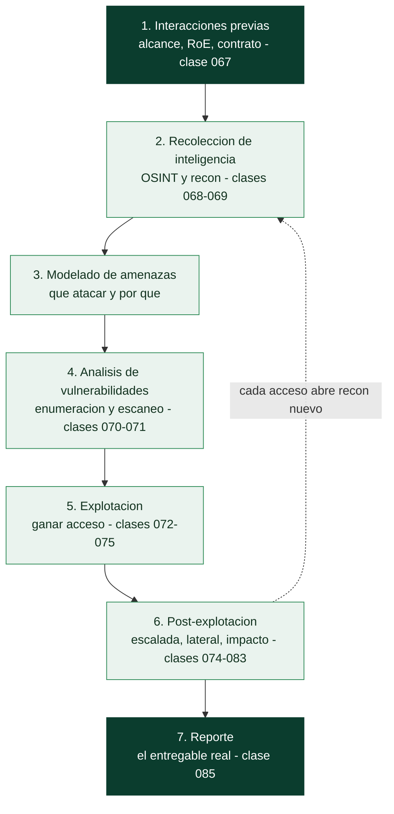

# Clase 066 — Metodología de pentesting: PTES y OSSTMM

> Parte: **3 — Hacking ético y pentesting: metodología** · Fuente: *Penetration Testing Execution Standard (PTES)* y *OSSTMM 3 (ISECOM)*
> ⏱️ Duración estimada: **90 min** · Nivel: **Fundamentos**

---

## 🎯 Objetivo

Entender por qué un pentest necesita una metodología formal y dominar las dos referencias más usadas de la industria: el **PTES** (siete fases de ejecución) y el **OSSTMM** (medición de la superficie de ataque y controles). Al final, el alumno sabrá encuadrar cualquier trabajo ofensivo dentro de un proceso auditable, repetible y comparable entre engagements.

## 📚 Resultados de aprendizaje

Al finalizar, el alumno podrá:

1. **Enumerar** las siete fases del PTES y describir el propósito de cada una.
2. **Distinguir** el enfoque de proceso del PTES del enfoque de medición del OSSTMM.
3. **Seleccionar** la metodología adecuada según el objetivo del cliente (cumplimiento, red team, madurez).
4. **Mapear** un trabajo real a una metodología, produciendo un plan de fases con entregables.
5. **Justificar** ante un cliente por qué la metodología reduce riesgo y mejora la calidad del informe.

## 🗺️ Temas

| # | Tema | Por qué importa |
|---|------|-----------------|
| 1 | Qué es una metodología y por qué no basta con "hackear" | Sin proceso no hay repetibilidad ni defensa legal |
| 2 | Las 7 fases del PTES | Es el estándar de facto para estructurar el trabajo |
| 3 | OSSTMM y el concepto de superficie de ataque medible | Aporta métricas (RAV) y rigor científico |
| 4 | NIST SP 800-115 y OWASP WSTG como complementos | Marcos oficiales para cumplimiento y web |
| 5 | Tipos de test: black/gray/white box | Definen cuánta información recibe el equipo |
| 6 | Red team vs. pentest vs. análisis de vulnerabilidades | Confundirlos genera expectativas erróneas |
| 7 | Entregables por fase | El cliente paga por evidencia y remediación, no por "acceso" |
| 8 | Madurez del programa de seguridad (CMM aplicado a seguridad) | Determina si conviene un pentest puntual o un programa continuo |
| 9 | El rol del defensor durante el pentest | Un equipo azul que sabe qué esperar detecta antes y mejora sus alertas |

## 🧠 Explicación en profundidad

### Sin método, "hackear" no es una profesión

La diferencia entre un pentester y alguien que simplemente sabe usar herramientas es el
**método**. Un proceso repetible da tres cosas que el acceso aislado no da: **cobertura**
(la garantía de no dejar zonas sin mirar por ir a lo llamativo), **defensa jurídica** (un
registro de qué se hizo, cuándo y con qué autorización) y **valor para el cliente**, que no
paga por un "estoy dentro" sino por un mapa de su riesgo y una ruta de remediación. Un
hallazgo espectacular sin proceso alrededor es una anécdota; el mismo hallazgo dentro de
una metodología es un informe accionable.

Por eso existen marcos estandarizados. El **PTES** (*Penetration Testing Execution
Standard*) es el más usado para estructurar el trabajo de principio a fin; el **OSSTMM**
aporta rigor científico y métricas; **NIST SP 800-115** es la referencia para cumplimiento
en el ámbito público; y **OWASP WSTG** es el equivalente detallado para aplicaciones web
(la Parte 4). No compiten: se combinan según el encargo.

### Las siete fases del PTES

El PTES ordena el trabajo en una secuencia que va de lo administrativo a lo entregable, y
cada fase alimenta a la siguiente. Recorrerlas fija el mapa de toda la parte.

El bucle entre post-explotación y recolección es lo que distingue un pentest real de una
lista de comprobación: cada host comprometido abre una red nueva que reconocer, y el
proceso itera hasta agotar el alcance. La fase que más se infravalora es la última:
**el informe es el producto**, y un acceso perfecto mal documentado no vale nada.

### Tres cosas que no son lo mismo

Confundir servicios distintos genera expectativas equivocadas y contratos mal escritos.
Un **análisis de vulnerabilidades** identifica y cataloga debilidades, normalmente con un
escáner, sin explotarlas: da amplitud, no profundidad. Un **pentest** explota esas
debilidades para demostrar impacto real y encadenar hallazgos, con un alcance y un tiempo
acotados. Un **red team** es un ejercicio distinto en propósito: no busca cobertura sino
emular a un adversario concreto contra objetivos concretos ("llegar a los datos de
nóminas") **poniendo a prueba también la detección y respuesta** del equipo azul, con
sigilo y sin avisar de cuándo ni cómo. Un cliente que pide un pentest cuando necesita un
análisis de vulnerabilidades —o al revés— recibe algo que no le sirve.

El tipo de acceso previo también cambia el trabajo: **black box** (sin información,
simula un externo), **white box** (acceso total a código y arquitectura, maximiza
cobertura por unidad de tiempo) y **gray box** (un punto intermedio, el más común, con
credenciales de usuario estándar). No hay uno mejor; hay uno adecuado a la pregunta que el
cliente quiere responder.

### El defensor también está en la ecuación

Un detalle que la metodología moderna subraya: el pentest no ocurre contra un vacío, sino
contra un equipo azul. Decidir si el SOC sabe o no que hay un test en marcha (*announced*
vs. *unannounced*) es una decisión de la metodología, no un detalle. Un test anunciado
mejora la cobertura y evita incidentes; uno no anunciado mide de verdad la capacidad de
detección. Y en cualquier caso, el mejor pentest deja al defensor con **alertas nuevas y
mejores**, no solo con una lista de agujeros. Esa conexión con la detección es la que
enlaza esta parte con las Partes 7 y 8.

## 📖 Definiciones y características

- **PTES (Penetration Testing Execution Standard):** marco de proceso en siete fases (pre-engagement, intelligence gathering, threat modeling, vulnerability analysis, exploitation, post-exploitation, reporting). Característica clave: describe *qué hacer* en cada fase, no *cómo* con herramientas concretas.
- **OSSTMM (Open Source Security Testing Methodology Manual):** metodología de ISECOM centrada en **medir** operacionalmente la seguridad. Característica clave: define el **RAV** (Risk Assessment Value), una métrica cuantitativa de la superficie de ataque.
- **Superficie de ataque:** conjunto de puntos donde un atacante puede interactuar con el sistema. Característica clave: se reduce controlando visibilidad, acceso y confianza.
- **Scope (alcance):** frontera explícita de lo autorizado (IPs, dominios, horarios, técnicas permitidas). Característica clave: todo lo no incluido está prohibido por defecto.
- **Black/Gray/White box:** niveles de conocimiento previo entregado al equipo. Característica clave: a menos información, más se parece a un atacante externo real, pero menos cobertura por tiempo.
- **RAV:** puntuación OSSTMM que combina porosidad, controles y limitaciones. Característica clave: permite comparar el estado antes/después de remediar.
- **Threat modeling (modelado de amenazas):** fase del PTES donde se identifican los activos críticos y los actores que podrían atacarlos. Característica clave: prioriza el esfuerzo de explotación hacia lo que más le importa al negocio, no hacia lo primero que se encuentra.
- **Purple teaming:** práctica de coordinar red team y blue team durante el ejercicio. Característica clave: convierte cada técnica ofensiva en una oportunidad de calibrar detección en tiempo real, en vez de esperar al informe final.

## 📔 Glosario

| Término | Definición concisa |
|---------|--------------------|
| Metodología | Proceso repetible que da cobertura, defensa legal y valor |
| PTES | Estándar de facto en siete fases para estructurar un pentest |
| OSSTMM | Metodología con métricas (RAV) y enfoque científico |
| NIST SP 800-115 | Guía oficial de pruebas de seguridad para cumplimiento |
| OWASP WSTG | Guía de pruebas de seguridad para aplicaciones web |
| Análisis de vulnerabilidades | Identificar debilidades sin explotarlas; amplitud |
| Pentest | Explotar debilidades para demostrar impacto; profundidad acotada |
| Red team | Emular a un adversario y poner a prueba la detección |
| Black box | El equipo no recibe información previa |
| White box | Acceso total a código y arquitectura |
| Gray box | Información parcial, como un usuario estándar |
| Announced / unannounced | Si el equipo azul sabe o no del test |
| Entregable | Producto de cada fase; el informe es el final |
| Modelado de amenazas | Decidir qué atacar y por qué antes de atacar |

## 🧰 Herramientas y preparación

Esta clase es **metodológica**, no ofensiva: no se ataca ningún sistema. Prepara:

- Los documentos de referencia: PTES (pentest-standard.org), OSSTMM 3 (PDF de ISECOM), NIST SP 800-115 y OWASP WSTG.
- Una plantilla de plan de engagement (hoja de cálculo o documento) con columnas: fase, actividades, herramientas previstas, entregable, duración.
- Un gestor de notas para pentest (CherryTree, Obsidian o un repositorio Markdown) que usarás durante toda la parte.
- Un "playbook interno" propio: una carpeta versionada donde acumules plantillas de RoE, checklists de fases y modelos de informe, para no reinventar el proceso en cada clase.

> ⚠️ **Nota ética:** aunque esta clase no incluye explotación, sienta la base de que **todo** lo que viene después se realiza únicamente sobre sistemas propios o con autorización explícita y por escrito. La metodología existe, en parte, para dejar constancia de esa autorización.

## 🧪 Laboratorio guiado (ejercicio aplicado)

Como esta clase es conceptual, el laboratorio es un **ejercicio de planificación**.

1. Toma un caso ficticio: "Pyme de e-commerce, 2 servidores web públicos, 1 rango interno /24, quieren saber si un atacante externo llega a la base de datos de clientes".
2. Crea una tabla con las **siete fases del PTES** y rellena, para cada una, dos actividades concretas que harías en este caso.
3. Define el **tipo de test** (black/gray/white box) y justifica tu elección en 3 líneas.
4. Especifica el **alcance**: qué IPs/dominios entran, qué queda excluido, ventana horaria y técnicas prohibidas (por ejemplo, denegación de servicio).
5. Para el mismo caso, describe **una métrica OSSTMM** que reportarías (por ejemplo, número de servicios expuestos vs. controlados).
6. Redacta el **entregable final esperado** por el cliente en una frase.
7. Guarda el plan en tu gestor de notas: será la plantilla que reutilizarás en las clases 067–085.
8. Añade una sección de "supuestos de madurez": ¿la pyme tiene un SOC? ¿ha tenido incidentes previos? Esto condiciona si el enfoque será black box (validación externa) o gray box (eficiencia de tiempo).

## ✍️ Ejercicios

1. Escribe con tus palabras la diferencia entre PTES y OSSTMM en menos de 80 palabras.
2. Clasifica estas tareas por fase PTES: "buscar correos en LinkedIn", "lanzar un exploit SMB", "escribir el resumen ejecutivo".
3. Diseña un plan de fases para un test **white box** de una API interna.
4. Explica cuándo recomendarías un red team en lugar de un pentest tradicional.
5. Construye una tabla comparativa de PTES, OSSTMM, NIST 800-115 y OWASP WSTG con al menos tres criterios.
6. Redacta el argumento de una diapositiva que convenza a un cliente escéptico de pagar por metodología.
7. Investiga qué es el CMM (Capability Maturity Model) aplicado a seguridad y relaciona un nivel de madurez con el tipo de test recomendado.
8. Desde la perspectiva defensiva, redacta tres alertas que un SOC debería configurar sabiendo que se ejecutará un pentest con esta metodología (por ejemplo, múltiples intentos de autenticación fallidos en horario del engagement).

## 📝 Reto verificable

Produce un **documento de plan de engagement** de una página para un caso a tu elección que incluya: las 7 fases PTES con actividades, el tipo de test, el alcance con exclusiones, una métrica OSSTMM y el entregable.

**Criterio de aceptación:** el documento contiene las siete fases nombradas correctamente, un alcance con al menos una exclusión explícita y una métrica cuantitativa; otra persona podría leerlo y saber qué se hará y qué no.

## ⚠️ Errores comunes

| Síntoma / mensaje | Causa y cómo arreglar |
|-------------------|-----------------------|
| "Empecé a escanear sin plan y me perdí" | Falta de fase de threat modeling; define objetivos antes de tocar teclas |
| Cliente enfadado por un servicio caído | No se documentaron técnicas prohibidas; añade DoS a exclusiones del RoE |
| Informe sin priorización | Se saltó la fase de análisis; correlaciona hallazgos con impacto de negocio |
| "El test no es comparable con el del año pasado" | No se usó una métrica; adopta el RAV de OSSTMM para tener línea base |
| Confundir pentest con escaneo de vulnerabilidades | No hubo explotación ni prueba de impacto; aclara el tipo de servicio en el contrato |
| Plan copiado de otro cliente sin adaptar | Se saltó el modelado de amenazas específico; identifica activos y actores propios de cada organización |
| El equipo defensivo se entera del test por el informe final | No hubo coordinación purple team; define de antemano si el SOC será informado en tiempo real o a ciegas |

## ❓ Preguntas frecuentes

**❓ ¿PTES y OSSTMM son excluyentes?**
No. PTES te da el *proceso* y OSSTMM te da las *métricas*. Muchos equipos usan PTES como columna vertebral y toman de OSSTMM la forma de cuantificar la superficie de ataque.

**❓ ¿Necesito seguir una metodología si es solo un lab personal?**
Sí, por hábito. Practicar el proceso en el laboratorio hace que en un engagement real no improvises. Además te obliga a documentar, que es donde muchos principiantes fallan.

**❓ ¿Qué metodología pide un cliente que busca cumplimiento PCI-DSS?**
Suele bastar con alinear el trabajo a NIST SP 800-115 y documentar cobertura; PTES organiza la ejecución. Confirma siempre el marco exigido antes de empezar.

**❓ ¿El black box es "más realista" y por tanto mejor?**
Es más parecido a un atacante externo, pero por tiempo limitado cubre menos. Para madurez interna, el gray/white box suele dar más valor por hora.

**❓ ¿Cómo elijo entre PTES/OSSTMM y un framework de cumplimiento como PCI-DSS?**
No son excluyentes: PCI-DSS exige que exista un test periódico, pero no dicta cómo ejecutarlo técnicamente. Usa PTES/OSSTMM para la ejecución y cita el marco de cumplimiento en el alcance y en el informe final.

**❓ ¿Vale la pena avisar al equipo de detección antes del pentest?**
Depende del objetivo: si quieres medir la capacidad de detección real (purple teaming), no avisas al SOC y comparas después qué detectaron. Si el objetivo es solo validar vulnerabilidades técnicas, avisar reduce fricción operativa y evita respuestas de incidente innecesarias.

## 🔗 Referencias

- PTES — <http://www.pentest-standard.org/index.php/Main_Page>
- OSSTMM 3 (ISECOM) — <https://www.isecom.org/OSSTMM.3.pdf>
- NIST SP 800-115 — <https://csrc.nist.gov/publications/detail/sp/800-115/final>
- OWASP Web Security Testing Guide — <https://owasp.org/www-project-web-security-testing-guide/>
- Weidman, G. *Penetration Testing*, cap. 1 (No Starch Press, 2014).
- ISECOM — Institute for Security and Open Methodologies — <https://www.isecom.org>
- MITRE ATT&CK — matriz de tácticas y técnicas para alinear el modelado de amenazas — <https://attack.mitre.org>

## 📥 Material descargable

- 📄 [Guía en PDF](./clase-066-guia.pdf) — versión imprimible de esta clase.
- 🎞️ [Presentación (PPTX)](./clase-066-presentacion.pptx) — deck para proyectar en clase.

## ⬅️ Clase anterior

[Clase 065 — Implementaciones seguras y errores criptográficos comunes](../../parte-2-criptografia-aplicada/065-implementaciones-seguras-y-errores-criptograficos-comunes/README.md)

## ➡️ Siguiente clase

[Clase 067 — Reglas de engagement, alcance y contratos](../067-reglas-de-engagement-alcance-y-contratos/README.md)
