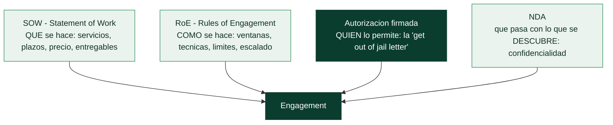

# Clase 067 — Reglas de engagement, alcance y contratos

> Parte: **3 — Hacking ético y pentesting: metodología** · Fuente: *PTES (Pre-engagement Interactions)* y *Penetration Testing* (G. Weidman)
> ⏱️ Duración estimada: **90 min** · Nivel: **Fundamentos**

---

## 🎯 Objetivo

Aprender a preparar la fase legal y contractual de un pentest: reglas de engagement (RoE), definición precisa del alcance, autorizaciones y documentos que protegen tanto al cliente como al probador. Sin estos papeles, un pentest es indistinguible de un delito.

## 📚 Resultados de aprendizaje

Al finalizar, el alumno podrá:

1. **Redactar** unas reglas de engagement con horarios, técnicas permitidas y prohibidas.
2. **Delimitar** un alcance con activos incluidos y explícitamente excluidos.
3. **Identificar** los documentos legales necesarios: autorización, NDA, SOW y "get out of jail" letter.
4. **Definir** los contactos de emergencia y el procedimiento de escalado ante incidentes.
5. **Reconocer** las implicaciones legales (leyes de intrusión informática) de operar fuera de alcance.

## 🗺️ Temas

| # | Tema | Por qué importa |
|---|------|-----------------|
| 1 | Autorización escrita | Es la línea que separa el pentest del delito |
| 2 | Alcance: incluido vs. excluido | Todo lo no autorizado está prohibido |
| 3 | Reglas de engagement (RoE) | Definen ventanas, técnicas y límites operativos |
| 4 | SOW y NDA | Formalizan servicio y confidencialidad |
| 5 | Contactos de emergencia y escalado | Un servicio caído a las 3am necesita un teléfono |
| 6 | Marco legal (delitos informáticos) | Operar fuera de alcance tiene consecuencias penales |
| 7 | Manejo de datos sensibles hallados | Qué hacer si encuentras datos personales reales |
| 8 | Cláusulas de indemnización y seguro de responsabilidad civil | Protegen al probador ante daños accidentales durante el test |
| 9 | Retención y destrucción de evidencia tras el cierre | Evita que capturas y credenciales queden expuestas indefinidamente |

## 🧠 Explicación en profundidad

### La autorización es la única línea entre el pentest y el delito

Técnicamente, un pentest y un ataque real son la misma actividad: escanear, explotar,
extraer datos. Lo único que separa a un profesional de un delincuente es un **documento de
autorización firmado por alguien con potestad para concederla**. Sin ese papel, las mismas
acciones que se facturan como servicio son un delito informático perseguible penalmente
(la [Clase 025](../../parte-0-fundamentos-y-prerrequisitos/025-etica-legalidad-alcance-y-divulgacion-responsable/README.md)). No es una formalidad burocrática que se resuelve
"luego": es el requisito previo absoluto, y ningún hallazgo, por valioso que sea, justifica
haber operado sin él.

Un matiz que importa: quien firma debe **poder** autorizar. Si el objetivo está alojado en
la nube de un tercero, en un SaaS ajeno o en infraestructura compartida, el dueño del
sistema puede no tener derecho a autorizar pruebas sobre él, y hace falta el permiso del
proveedor. Atacar un activo "del cliente" que en realidad es de AWS sin el consentimiento
de AWS es operar fuera de alcance aunque el cliente lo firmara.

### Los documentos que enmarcan el trabajo

Un engagement serio se apoya en cuatro documentos que cumplen funciones distintas y
complementarias:

La **autorización** —a veces llamada informalmente *get out of jail free letter*— identifica
sistemas, fechas y firmante, y es el documento que el pentester **lleva encima** durante el
trabajo por si alguien (un administrador que detecta el ataque, la policía) pregunta. El
**SOW** fija el servicio, el precio y los entregables. Las **RoE** son el detalle
operativo: ventanas horarias, técnicas permitidas y prohibidas, si se admite ingeniería
social, si hay pruebas de denegación de servicio, y la lista de **contactos de emergencia**
—porque cuando un servicio se cae a las tres de la madrugada, hace falta un teléfono al que
llamar—. El **NDA** protege la confidencialidad de todo lo que se descubra.

### El alcance: dentro está permitido, todo lo demás está prohibido

El principio que rige el alcance es de negación por defecto: **solo lo listado
explícitamente como incluido está autorizado; cualquier otra cosa está prohibida**, aunque
sea del mismo cliente, aunque parezca trivial, aunque se llegue a ella por accidente. El
*scope creep* —ir ampliando el alcance sobre la marcha porque "ya que estamos"— es una de
las formas más comunes de meterse en problemas legales sin mala intención.

Ese principio tiene consecuencias prácticas incómodas que hay que decidir de antemano. Si
durante el test se descubre un pivote hacia una red **no** incluida en el alcance, no se
cruza: se documenta y se consulta. Si se encuentran **datos personales reales** —una base
de datos de clientes, historiales—, no se descargan "de prueba": se anota su existencia y
el nivel de exposición, y se detiene ahí. Y si aparece evidencia de una **brecha previa**
—que el sistema ya estaba comprometido antes de llegar—, hay un procedimiento de escalado
inmediato al contacto del cliente, porque eso deja de ser un pentest y pasa a ser una
respuesta a incidentes.

### Después del test: el trabajo no acaba en el informe

Dos aspectos que los pentesters noveles olvidan y que las cláusulas del contrato cubren.
El primero es la **retención y destrucción de evidencia**: durante el trabajo se acumulan
capturas, hashes, credenciales en claro y volcados que son, literalmente, las llaves del
reino del cliente. Dejarlos en un portátil indefinidamente convierte al pentester en el
nuevo eslabón débil; el contrato fija cuánto se guardan y cómo se destruyen. El segundo son
las cláusulas de **indemnización y seguro de responsabilidad civil**, que reparten quién
responde si una prueba autorizada causa un daño accidental —un servicio frágil que se cae
al escanearlo—. Operar sin ese paraguas es un riesgo personal que ningún profesional
asume.

## 📖 Definiciones y características

- **Reglas de engagement (RoE):** documento que fija cómo, cuándo y con qué límites se realiza el test. Característica clave: incluye ventanas horarias, técnicas prohibidas (DoS, ingeniería social) y activos frágiles.
- **Statement of Work (SOW):** contrato que describe el servicio, entregables, plazos y precio. Característica clave: es la referencia contractual ante disputas.
- **NDA (acuerdo de confidencialidad):** obliga a no divulgar la información hallada. Característica clave: protege datos del cliente incluso tras terminar el trabajo.
- **Authorization letter ("get out of jail"):** carta firmada por alguien con autoridad que autoriza explícitamente las pruebas. Característica clave: se lleva encima durante el test físico o de red.
- **Alcance (scope):** conjunto de activos autorizados. Característica clave: se expresa con precisión (CIDR, dominios, cuentas) y con exclusiones.
- **Contacto de emergencia:** persona del cliente disponible durante la ventana. Característica clave: permite detener el test o coordinar ante un incidente.
- **Seguro de responsabilidad civil profesional:** póliza que cubre daños accidentales causados durante el pentest. Característica clave: muchas empresas exigen su comprobante antes de firmar el contrato.
- **Cadena de custodia de evidencia:** registro de quién accedió a qué evidencia (capturas, credenciales, dumps) y cuándo. Característica clave: sostiene la credibilidad del informe si se disputa un hallazgo.
- **Cambio de alcance sobre la marcha:** ampliación o reducción del alcance ya iniciado el test. Característica clave: siempre debe documentarse por escrito y con la misma autoridad que firmó el alcance original, nunca de palabra.

## 📔 Glosario

| Término | Definición concisa |
|---------|--------------------|
| Autorización escrita | Permiso firmado; la línea que separa el pentest del delito |
| *Get out of jail letter* | Autorización que el pentester lleva encima durante el test |
| Potestad para autorizar | Quien firma debe poder consentir sobre el activo (nube, SaaS) |
| Alcance (*scope*) | Lista de sistemas y acciones permitidos; negación por defecto |
| Scope creep | Ampliar el alcance sobre la marcha; riesgo legal |
| RoE | Reglas de engagement: ventanas, técnicas y límites operativos |
| SOW | *Statement of Work*: servicio, plazos, precio y entregables |
| NDA | Acuerdo de confidencialidad sobre lo descubierto |
| Contacto de emergencia | Persona a la que escalar un incidente durante el test |
| Ventana de pruebas | Franja horaria autorizada para operar |
| Datos sensibles hallados | Se documentan, no se descargan |
| Brecha previa | Indicio de compromiso anterior; se escala de inmediato |
| Retención y destrucción | Cómo se custodia y elimina la evidencia tras el cierre |
| Indemnización / seguro | Reparto de responsabilidad ante daños accidentales |

## 🧰 Herramientas y preparación

Esta clase produce **documentos**, no ataques. Prepara plantillas de:

- Autorización de pruebas firmada por un responsable con capacidad legal.
- RoE con tabla de técnicas permitidas/prohibidas.
- SOW y NDA (puedes basarte en plantillas públicas del SANS o de despachos, adaptadas por un abogado).
- Un formulario de "hallazgo crítico" para escalar de inmediato (por ejemplo, credenciales de dominio expuestas).
- Una política interna de retención de evidencia: cuánto tiempo se conservan capturas y credenciales tras el cierre y cómo se destruyen de forma segura.

> ⚠️ **Nota ética y legal:** ningún comando de las clases siguientes debe ejecutarse sin estos documentos firmados o, en su defecto, sobre un laboratorio **propio**. Operar contra sistemas de terceros sin autorización es un delito en prácticamente toda jurisdicción.

## 🧪 Laboratorio guiado (ejercicio aplicado)

1. Retoma el caso ficticio de la clase 066 (pyme de e-commerce).
2. Redacta una **carta de autorización** de 5–8 líneas: quién autoriza, qué autoriza, sobre qué activos y en qué fechas.
3. Construye una **tabla de RoE** con al menos 6 técnicas, marcando permitido/prohibido (ej.: escaneo de puertos = permitido; DoS = prohibido; ingeniería social telefónica = prohibido).
4. Define el **alcance** en notación CIDR y dominios, con una sección "Fuera de alcance" que incluya al menos un sistema de terceros (proveedor de pagos).
5. Escribe el **procedimiento de escalado**: qué haces si encuentras una brecha ya explotada por un tercero.
6. Añade una cláusula de **manejo de datos**: cómo tratas capturas que contengan datos personales reales.
7. Redacta una cláusula de **retención y destrucción de evidencia**: plazo máximo de conservación tras el cierre y método de borrado seguro.
8. Guarda todo junto al plan de la clase anterior.

## ✍️ Ejercicios

1. Enumera cinco técnicas que casi siempre deberían quedar prohibidas por defecto y explica por qué.
2. Redacta una cláusula de ventana horaria para un e-commerce que no puede caerse en horario comercial.
3. Explica la diferencia entre SOW y NDA con un ejemplo.
4. ¿Qué harías si durante el test descubres evidencia de un compromiso real y activo? Escribe el paso a paso.
5. Diseña un formulario de hallazgo crítico con los campos mínimos.
6. Redacta una cláusula de seguro de responsabilidad civil que cubra un incidente accidental durante el test (por ejemplo, una caída de servicio).
7. Justifica por qué la autorización debe firmarla alguien con autoridad y no cualquier empleado.
8. Desde la óptica defensiva, redacta el procedimiento que seguiría un SOC si detecta actividad del pentest fuera de la ventana horaria pactada en el RoE.

## 📝 Reto verificable

Ensambla un **paquete de pre-engagement** de dos páginas para tu caso: autorización, RoE (tabla), alcance con exclusiones y procedimiento de escalado.

**Criterio de aceptación:** el paquete incluye una autorización con firmante identificado, una tabla de RoE con técnicas prohibidas explícitas, un alcance con al menos una exclusión de terceros y un procedimiento de escalado accionable. Un tercero podría ejecutar el test sin ambigüedad legal.

## ⚠️ Errores comunes

| Síntoma / mensaje | Causa y cómo arreglar |
|-------------------|-----------------------|
| "Escaneé una IP que no era del cliente" | Alcance mal delimitado; usa CIDR exactos y valida propiedad antes de tocar |
| Cliente reclama daños por un servicio caído | No se prohibió DoS en el RoE; añádelo siempre por defecto |
| No hay a quién llamar cuando algo falla | Falta contacto de emergencia; exige uno disponible en la ventana |
| Datos personales reales en tus notas | Falta cláusula de manejo; anonimiza y borra según lo pactado |
| "Firmó el becario" | Autorización sin autoridad legal; exige firmante con capacidad |
| Evidencia del test sigue en un disco años después | No hubo cláusula de retención; define plazo de destrucción y verifícalo al cierre |
| Disputa sobre quién autorizó qué técnica | No se firmó una cadena de custodia de decisiones; registra por escrito cada cambio de alcance durante el test |

## ❓ Preguntas frecuentes

**❓ ¿Vale un correo diciendo "adelante" como autorización?**
No es recomendable. Un correo puede servir de indicio, pero necesitas una autorización formal firmada por alguien con capacidad para comprometer a la organización.

**❓ ¿Qué pasa si un activo en el alcance en realidad pertenece a un proveedor cloud?**
Muchos proveedores exigen su propia autorización para pruebas. Verifica las políticas del proveedor (AWS, Azure, GCP) antes de escanear infraestructura alojada.

**❓ ¿Puedo hacer ingeniería social si no está en el RoE?**
No. Cualquier técnica no autorizada explícitamente está prohibida. La ingeniería social suele requerir cláusulas y consentimientos adicionales.

**❓ ¿Debo reportar de inmediato un hallazgo crítico o esperar al informe final?**
Reporta de inmediato los hallazgos críticos (credenciales de dominio, brechas activas) por el canal de escalado pactado; no esperes al informe.

**❓ ¿Quién debería quedarse con la evidencia una vez cerrado el contrato?**
Normalmente el cliente, o ambas partes bajo cláusulas de confidencialidad y plazos de destrucción pactados en el SOW. El probador no debería conservar capturas ni credenciales indefinidamente.

**❓ ¿Qué hago si durante el test el cliente pide ampliar el alcance por teléfono?**
Nunca ejecutes el cambio solo con una llamada. Pide confirmación por escrito de la misma persona (o con la misma autoridad) que firmó el alcance original antes de tocar el nuevo activo.

## 🔗 Referencias

- PTES — Pre-engagement Interactions — <http://www.pentest-standard.org/index.php/Pre-engagement>
- Weidman, G. *Penetration Testing*, cap. 1 (No Starch Press, 2014).
- SANS — Rules of Engagement worksheet — <https://www.sans.org>
- NIST SP 800-115 — <https://csrc.nist.gov/publications/detail/sp/800-115/final>
- OSSTMM 3 (ISECOM), sección de reglas de compromiso — <https://www.isecom.org/OSSTMM.3.pdf>
- MITRE ATT&CK — referencia para acotar técnicas explícitamente permitidas en el RoE — <https://attack.mitre.org>

## 📥 Material descargable

- 📄 [Guía en PDF](./clase-067-guia.pdf) — versión imprimible de esta clase.
- 🎞️ [Presentación (PPTX)](./clase-067-presentacion.pptx) — deck para proyectar en clase.

## ⬅️ Clase anterior

[Clase 066 — Metodología de pentesting: PTES y OSSTMM](../066-metodologia-de-pentesting-ptes-y-osstmm/README.md)

## ➡️ Siguiente clase

[Clase 068 — Reconocimiento pasivo e inteligencia de fuentes abiertas](../068-reconocimiento-pasivo-e-inteligencia-de-fuentes-abiertas/README.md)
