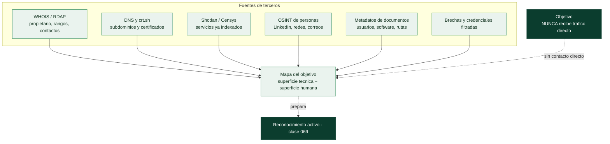

# Clase 068 — Reconocimiento pasivo e inteligencia de fuentes abiertas

> Parte: **3 — Hacking ético y pentesting: metodología** · Fuente: *The Hacker Playbook 3* (P. Kim) y *OSINT Techniques* (M. Bazzell)
> ⏱️ Duración estimada: **100 min** · Nivel: **Intermedio**

---

## 🎯 Objetivo

Recolectar información sobre un objetivo **sin tocarlo directamente**, usando fuentes públicas (OSINT): dominios, subdominios, empleados, tecnologías, filtraciones y metadatos. El reconocimiento pasivo construye el mapa antes de que el escáner activo levante alarmas.

## 📚 Resultados de aprendizaje

Al finalizar, el alumno podrá:

1. **Recolectar** dominios, subdominios y correos con herramientas pasivas.
2. **Consultar** registros WHOIS, DNS y certificados (crt.sh) para ampliar la superficie.
3. **Identificar** tecnologías y activos expuestos con Shodan y buscadores.
4. **Detectar** credenciales filtradas en brechas públicas para el modelado de amenazas.
5. **Documentar** los hallazgos OSINT de forma estructurada y trazable.

## 🗺️ Temas

| # | Tema | Por qué importa |
|---|------|-----------------|
| 1 | Diferencia pasivo vs. activo | El pasivo no genera tráfico contra el objetivo |
| 2 | WHOIS y DNS | Revelan propietario, rangos y registros |
| 3 | Certificate transparency (crt.sh) | Descubre subdominios sin escanear |
| 4 | Shodan y Censys | Muestran servicios ya indexados de Internet |
| 5 | OSINT de personas | Empleados = superficie de ingeniería social |
| 6 | Metadatos de documentos | Filtran usuarios, software y rutas internas |
| 7 | Brechas y credenciales filtradas | Reutilización de contraseñas es acceso inicial |

## 🧠 Explicación en profundidad

### Ver sin ser visto

El reconocimiento pasivo reúne información sobre el objetivo **sin enviarle un solo
paquete**. Toda la recolección se hace contra terceros —registros públicos, buscadores,
bases de datos indexadas, redes sociales—, de modo que el objetivo no tiene forma de saber
que está siendo estudiado. Esa invisibilidad es su valor: en un ejercicio con requisitos de
sigilo, o simplemente para no alertar antes de tiempo, el recon pasivo construye un mapa
sorprendentemente completo antes de tocar nada. La frontera es nítida y conviene tenerla
clara: en cuanto una consulta llega **al servidor del objetivo** (una petición a su web, una
resolución contra su DNS autoritativo), ya es reconocimiento activo.



### La técnica que más sorprende: certificate transparency

Descubrir subdominios solía requerir fuerza bruta contra el DNS —ruidosa y activa—. Los
registros de **Certificate Transparency** de la [Clase 055](../../parte-2-criptografia-aplicada/055-pki-certificados-x-509-y-autoridades-de-certificacion/README.md) lo cambiaron: como toda
CA debe publicar cada certificado que emite en un registro público y auditable, consultar
**crt.sh** por un dominio devuelve la lista de todos los subdominios para los que alguien
pidió un certificado —incluidos `dev.`, `staging.`, `vpn.` o `interno.` que nadie pensaba
que fueran visibles—. Es información entregada **sin tocar al objetivo**, y es uno de los
mejores ejemplos de cómo un mecanismo de seguridad (CT, pensado para detectar misemisión)
se convierte en fuente de reconocimiento.

En la misma línea, **Shodan** y **Censys** escanean Internet de forma continua e indexan lo
que encuentran: consultarlos revela qué servicios, versiones y puertos del objetivo ya
están catalogados —a veces con capturas de paneles de administración expuestos— sin que
salga un paquete del pentester. **WHOIS/RDAP** da el propietario y los rangos de IP; los
registros DNS públicos (MX, TXT, SPF) dibujan la infraestructura de correo y los servicios
en la nube.

### La superficie humana es la mitad del mapa

El reconocimiento no es solo técnico. Los **empleados** son superficie de ataque:
LinkedIn revela el organigrama, quién trabaja en TI y con qué tecnologías (por sus
certificaciones y ofertas de empleo, que enumeran el *stack* interno), y los patrones de
correo corporativo (`nombre.apellido@`) permiten construir listas de usuarios para el
*spraying* de la [Clase 081](../081-ataques-a-credenciales-fuerza-bruta-y-password-spraying/README.md) y el
*phishing* de la Parte 12. Los **metadatos de documentos** publicados (un PDF, un Word en la
web corporativa) filtran nombres de usuario, versiones de software y rutas internas en sus
propiedades. Y las **brechas de datos** previas son oro: como la gente reutiliza
contraseñas, una credencial filtrada de un empleado en un volcado antiguo es, con
frecuencia, acceso inicial directo.

### Del dato a la ventaja, sin olvidar la ética

Toda esta recolección alimenta las fases siguientes: los subdominios se convierten en
objetivos de escaneo, los empleados en objetivos de ingeniería social, las versiones en
búsquedas de exploits. Conviene cerrar con dos apuntes. El primero, de método: el recon es
**iterativo**, cada dato abre consultas nuevas, y conviene documentarlo desde el principio
porque el informe necesitará mostrar qué era descubrible públicamente. El segundo, de
límites: aunque el recon pasivo sea "solo mirar", **compilar información personal de
empleados tiene implicaciones legales y de privacidad** (RGPD incluido), debe ceñirse al
alcance y no justifica acosar, contactar ni engañar a nadie fuera de lo autorizado.

## 📖 Definiciones y características

- **OSINT:** inteligencia obtenida de fuentes abiertas y legales. Característica clave: no requiere interactuar con la infraestructura del objetivo.
- **Certificate Transparency:** registros públicos de certificados TLS emitidos. Característica clave: exponen subdominios que el objetivo no publicita.
- **Shodan:** buscador de dispositivos conectados a Internet. Característica clave: indexa banners de servicios, versiones y puertos ya conocidos.
- **Google dorking:** uso de operadores avanzados de búsqueda (`site:`, `filetype:`, `intitle:`). Característica clave: encuentra documentos y paneles expuestos por error.
- **Metadatos:** información incrustada en documentos (autor, software, rutas). Característica clave: revelan nombres de usuario y estructura interna.
- **Reconocimiento pasivo:** fase que no genera tráfico dirigido al objetivo. Característica clave: minimiza la probabilidad de detección temprana.

## 📔 Glosario

| Término | Definición concisa |
|---------|--------------------|
| Reconocimiento pasivo | Recolección sin enviar tráfico al objetivo |
| OSINT | Inteligencia a partir de fuentes abiertas |
| WHOIS / RDAP | Propietario, contactos y rangos de un dominio o IP |
| Registros DNS públicos | MX, TXT, SPF que revelan infraestructura |
| Certificate Transparency | Registros públicos de certificados emitidos |
| crt.sh | Buscador de CT usado para enumerar subdominios |
| Shodan / Censys | Buscadores de servicios expuestos en Internet |
| Superficie humana | Empleados como vector de ingeniería social |
| Patrón de correo | Formato `nombre.apellido@` para construir listas de usuarios |
| Metadatos de documento | Usuarios, software y rutas filtrados en las propiedades |
| Brecha de datos | Volcado de credenciales previo reutilizable |
| Reutilización de contraseñas | Motivo por el que una filtración da acceso |
| Recon iterativo | Cada dato hallado abre nuevas consultas |
| Frontera pasivo/activo | Cruzarla es enviar la primera consulta al objetivo |

## 🧰 Herramientas y preparación

En Kali Linux:

```bash
sudo apt update && sudo apt install -y theharvester whois dnsutils amass
pip install shodan && shodan init <API_KEY>   # cuenta gratuita
```

- `theHarvester` para correos, subdominios y hosts.
- `whois`, `dig`, `host` para DNS.
- `amass enum -passive` para enumeración pasiva de subdominios.
- `crt.sh` (web) para certificados; Shodan/Censys para servicios expuestos.

> ⚠️ **Nota ética:** el OSINT es legal porque usa fuentes públicas, pero solo debes recopilar sobre objetivos **autorizados**. No compiles perfiles de personas fuera del alcance ni uses datos filtrados para acceder a cuentas reales fuera del laboratorio.

## 🧪 Laboratorio guiado

Usa un dominio **propio** o uno autorizado (por ejemplo, `example.com` para practicar comandos sin impacto).

1. WHOIS del dominio para ver registrador y fechas:

   ```bash
   whois example.com
   ```

2. Registros DNS básicos:

   ```bash
   dig example.com ANY +noall +answer
   dig MX example.com +short
   ```

3. Subdominios pasivos con crt.sh (vía web o API):

   ```bash
   curl -s "https://crt.sh/?q=%25.example.com&output=json" | jq -r '.[].name_value' | sort -u
   ```

4. Enumeración pasiva con amass:

   ```bash
   amass enum -passive -d example.com -o subs.txt
   ```

5. Correos y hosts con theHarvester:

   ```bash
   theHarvester -d example.com -b bing,crtsh -l 200
   ```

6. Consulta Shodan sobre una IP propia:

   ```bash
   shodan host <TU_IP_PUBLICA>
   ```

7. Consolida todo en una tabla de activos: dominio, subdominio, IP, servicio, fuente.

## ✍️ Ejercicios

1. Encuentra tres subdominios de un dominio propio usando solo crt.sh.
2. Escribe tres Google dorks para localizar documentos PDF de una organización.
3. Extrae los registros MX y explica qué proveedor de correo usan.
4. Compara el resultado de `amass -passive` con `theHarvester`: ¿qué aporta cada uno?
5. Documenta qué metadatos podrías extraer de un PDF público (autor, software).
6. Explica cómo un correo filtrado en una brecha se convierte en vector de acceso.

## 📝 Reto verificable

Genera un **informe de reconocimiento pasivo** de un dominio propio con: registros WHOIS/DNS, al menos cinco subdominios con su fuente, servicios expuestos y una lista de correos/usuarios candidatos.

**Criterio de aceptación:** el informe lista ≥5 subdominios con la fuente de cada uno, incluye al menos un servicio expuesto identificado por Shodan/Censys y **no** contiene ninguna acción que haya generado tráfico dirigido al objetivo.

## ⚠️ Errores comunes

| Síntoma / mensaje | Causa y cómo arreglar |
|-------------------|-----------------------|
| `theHarvester` no devuelve nada | Fuente saturada o sin API key; cambia `-b` a otra fuente |
| crt.sh sin resultados | Comodín mal escrito; usa `%25.dominio.com` (URL-encoded) |
| Subdominios que no resuelven | Registros históricos; valida con `dig` antes de darlos por vivos |
| Shodan sin datos | IP tras NAT/CDN; consulta el rango real o el CNAME |
| Perfilar personas de más | Fuera de alcance; limita OSINT a lo autorizado |

## ❓ Preguntas frecuentes

**❓ ¿El reconocimiento pasivo es 100% indetectable?**
Casi. No genera tráfico contra el objetivo, pero consultas a terceros (Shodan, brechas) pueden dejar rastro en esos servicios, no en el objetivo. Aun así es mucho más sigiloso que el escaneo activo.

**❓ ¿Es legal usar bases de datos de contraseñas filtradas?**
Consultar si un correo aparece en una brecha (p. ej. Have I Been Pwned) es legal e informativo. Usar esas contraseñas para acceder a cuentas reales fuera de tu laboratorio no lo es.

**❓ ¿Qué diferencia hay entre amass pasivo y activo?**
`-passive` solo consulta fuentes de terceros; el modo activo resuelve y puede hacer brute force de DNS, generando tráfico. Para esta clase, quédate en pasivo.

**❓ ¿Por qué importan los metadatos de documentos?**
Revelan nombres de usuario (que suelen coincidir con logins), versiones de software vulnerables y rutas internas útiles para fases posteriores.

## 🔗 Referencias

- Kim, P. *The Hacker Playbook 3*, sección de recon (2018).
- crt.sh — <https://crt.sh>
- Shodan — <https://www.shodan.io>
- theHarvester — <https://github.com/laramies/theHarvester>
- OWASP — Information Gathering — <https://owasp.org/www-project-web-security-testing-guide/>

## 📥 Material descargable

- 📄 [Guía en PDF](./clase-068-guia.pdf) — versión imprimible de esta clase.
- 🎞️ [Presentación (PPTX)](./clase-068-presentacion.pptx) — deck para proyectar en clase.

## ⬅️ Clase anterior

[Clase 067 — Reglas de engagement, alcance y contratos](../067-reglas-de-engagement-alcance-y-contratos/README.md)

## ➡️ Siguiente clase

[Clase 069 — Reconocimiento activo](../069-reconocimiento-activo/README.md)
