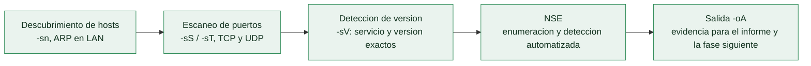

# Clase 069 — Reconocimiento activo

> Parte: **3 — Hacking ético y pentesting: metodología** · Fuente: *Nmap Network Scanning* (G. Lyon) y *Penetration Testing* (G. Weidman)
> ⏱️ Duración estimada: **110 min** · Nivel: **Intermedio**

---

## 🎯 Objetivo

Descubrir hosts vivos, puertos abiertos, servicios y versiones interactuando directamente con el objetivo mediante escaneo. El reconocimiento activo, sobre todo con **nmap**, convierte el mapa OSINT en una lista precisa de superficies atacables.

## 📚 Resultados de aprendizaje

Al finalizar, el alumno podrá:

1. **Descubrir** hosts vivos con barridos ICMP/ARP y `nmap -sn`.
2. **Escanear** puertos TCP/UDP con distintas técnicas (SYN, connect, UDP).
3. **Detectar** servicios y versiones con `-sV` y sistema operativo con `-O`.
4. **Ejecutar** scripts NSE para enumeración específica.
5. **Ajustar** el timing y la evasión para equilibrar sigilo y velocidad.

## 🗺️ Temas

| # | Tema | Por qué importa |
|---|------|-----------------|
| 1 | Descubrimiento de hosts | Reduce el ruido escaneando solo lo vivo |
| 2 | SYN scan vs. connect scan | Sigilo y privilegios distintos |
| 3 | Escaneo UDP | Servicios críticos (DNS, SNMP) viven en UDP |
| 4 | Detección de versión `-sV` | La versión determina qué exploits aplican |
| 5 | Nmap Scripting Engine (NSE) | Automatiza enumeración y detección |
| 6 | Timing y evasión (`-T`, `--scan-delay`) | Evitar IDS o no tumbar servicios frágiles |
| 7 | Guardado de resultados (`-oA`) | Trazabilidad para el informe |

## 🧠 Explicación en profundidad

### Cruzar la línea: ahora el objetivo puede verte

El reconocimiento activo empieza en el instante en que se envía el primer paquete **al
objetivo**. A cambio de esa exposición se obtiene lo que el recon pasivo no puede dar: el
estado **real y actual** de la infraestructura —qué hosts están vivos ahora, qué puertos
están abiertos en este momento, qué versiones exactas corren—. Todo lo de la [Clase 029 a
la 033](../../parte-1-redes-y-seguridad-de-redes/029-nmap-descubrimiento-de-hosts-y-tecnicas-de-ping/README.md)
se aplica aquí, pero con una diferencia de mentalidad importante: en un pentest **cada
paquete cuenta como evidencia y puede disparar una alerta**, así que el recon activo se hace
con intención y con registro, no a lo bruto.

El flujo canónico va de lo ancho a lo fino, sin saltarse pasos: primero descubrir qué está
vivo para no malgastar tiempo escaneando direcciones vacías, luego qué puertos están
abiertos en lo vivo, después qué servicio y versión hay detrás de cada puerto, y por último
lanzar scripts de enumeración sobre lo interesante.



### Sigilo, velocidad y no romper nada: el mismo triángulo de siempre

La temporización de Nmap (`-T0` a `-T5`, `--scan-delay`, `--max-rate`) reaparece aquí con
una motivación doble. Por un lado, **evadir detección**: un escaneo lento y espaciado tiene
más probabilidad de pasar por debajo de los umbrales de un IDS que un barrido a máxima
velocidad. Por otro, y a menudo más importante en un pentest real, **no tumbar servicios
frágiles**: impresoras de red, dispositivos IoT, controladores industriales y equipos
antiguos pueden colgarse ante un escaneo agresivo, y un servicio caído durante el test es un
incidente que el cliente factura en confianza. La regla profesional es empezar suave y
subir el ritmo solo donde se sabe que la infraestructura lo aguanta.

Aquí conecta directamente con la Parte 8: **el recon activo genera la telemetría que un SOC
detecta**. Entender esto sirve al pentester para calibrar su ruido y al defensor para
reconocer un escaneo. En un test no anunciado, medir cuánto tarda el equipo azul en
reaccionar a un escaneo deliberadamente visible es, en sí mismo, un hallazgo.

### La versión es lo que convierte un puerto en un objetivo

El paso decisivo del recon activo es la **detección de versión** (`-sV`). Un puerto 445
abierto no dice nada útil; un "Samba 3.0.20" abre la puerta a un exploit concreto y
conocido. La versión exacta es lo que permite cruzar con las bases de vulnerabilidades por
CPE (la mecánica de la [Clase 031](../../parte-1-redes-y-seguridad-de-redes/031-nmap-deteccion-de-servicios-y-fingerprinting-de-os/README.md)) y decidir qué de la fase de explotación
tiene sentido intentar. Y el **NSE** automatiza el siguiente escalón: enumera recursos,
comprueba configuraciones por defecto y sondea vulnerabilidades, siempre con la advertencia
de que sus categorías `vuln` e `intrusive` pueden afectar al objetivo y no deben lanzarse
sin cubrir esa autorización en las RoE.

Todo se guarda con `-oA`, que emite los tres formatos a la vez. Esto no es una comodidad:
es un requisito del método. El XML alimenta a Metasploit (`db_import`, [Clase 072](../072-metasploit-framework-arquitectura-y-uso/README.md)) y a los informes; el grepable deja sacar en una
línea la lista de hosts con un puerto concreto para la fase siguiente; y todo junto es la
**evidencia con marca de tiempo** que el informe necesita y que la [Clase 067](../067-reglas-de-engagement-alcance-y-contratos/README.md) exige conservar.

## 📖 Definiciones y características

- **SYN scan (`-sS`):** envía SYN y no completa el handshake. Característica clave: rápido y relativamente sigiloso; requiere privilegios de root.
- **Connect scan (`-sT`):** completa el three-way handshake vía la pila del SO. Característica clave: no necesita root pero es más ruidoso y lento.
- **Detección de versión (`-sV`):** interroga banners para identificar producto y versión. Característica clave: base para mapear CVEs.
- **NSE:** motor de scripts Lua de nmap. Característica clave: categorías como `default`, `safe`, `vuln`, `auth` para tareas concretas.
- **Escaneo UDP (`-sU`):** sondea puertos UDP. Característica clave: lento por la ausencia de respuestas; imprescindible para SNMP/DNS.
- **Timing templates (`-T0`–`-T5`):** presets de velocidad. Característica clave: `-T4` es un buen equilibrio; `-T0/-T1` para evasión.

## 📔 Glosario

| Término | Definición concisa |
|---------|--------------------|
| Reconocimiento activo | Recolección enviando tráfico directo al objetivo |
| Descubrimiento de hosts | Determinar qué direcciones están vivas (`-sn`) |
| SYN scan (`-sS`) | Escaneo semiabierto; rápido, requiere privilegios |
| Connect scan (`-sT`) | Usa `connect()`; sin privilegios pero visible |
| Escaneo UDP (`-sU`) | Cubre DNS, SNMP, NTP; lento y ambiguo |
| Detección de versión (`-sV`) | Identifica servicio y versión exactos |
| NSE | Motor de scripts de Nmap para enumeración y detección |
| Temporización (`-T`) | Equilibrio entre velocidad, sigilo y estabilidad |
| `--scan-delay` | Espaciado entre sondas para evadir umbrales |
| Servicio frágil | Dispositivo que un escaneo agresivo puede tumbar |
| Telemetría | Rastro que el recon activo deja para un SOC |
| CPE | Identificador de plataforma que enlaza versión con CVE |
| `-oA` | Guardado simultáneo en los tres formatos de Nmap |
| Evidencia con marca de tiempo | Registro del recon exigido por el método |

## 🧰 Herramientas y preparación

```bash
sudo apt install -y nmap masscan
nmap --version
```

Monta un laboratorio aislado: Kali como atacante y **Metasploitable 2/3** o una VM propia como objetivo, en una red host-only sin salida a Internet.

> ⚠️ **Nota ética:** el escaneo activo **sí** genera tráfico y puede ser detectado o considerado hostil. Ejecútalo únicamente contra tus propias máquinas de laboratorio o dentro de un alcance autorizado por escrito. Escanear IPs de terceros sin permiso puede ser ilegal.

## 🧪 Laboratorio guiado

Sustituye `TARGET` por la IP de tu VM vulnerable (por ejemplo `192.168.56.101`).

1. Descubre hosts vivos en el segmento:

   ```bash
   sudo nmap -sn 192.168.56.0/24
   ```

2. Escaneo SYN rápido de los 1000 puertos comunes:

   ```bash
   sudo nmap -sS -T4 TARGET
   ```

3. Escaneo completo de todos los puertos TCP:

   ```bash
   sudo nmap -sS -p- -T4 TARGET -oA full_tcp
   ```

4. Detección de versión y SO sobre los puertos abiertos:

   ```bash
   sudo nmap -sV -O -p 21,22,80,139,445 TARGET
   ```

5. Escaneo UDP de servicios clave:

   ```bash
   sudo nmap -sU -p 53,161,137 TARGET
   ```

6. Enumeración con NSE (`-sC` = categoría `default`, es decir `--script=default`):

   ```bash
   sudo nmap -sC -p 21,80,445 TARGET
   ```

7. Guarda todo en los tres formatos para el informe:

   ```bash
   sudo nmap -sS -sV -p- -oA recon_TARGET TARGET
   ```

## ✍️ Ejercicios

1. Explica por qué `-sS` requiere root y `-sT` no.
2. Compara el tiempo de un escaneo `-T2` frente a `-T4` sobre el mismo objetivo.
3. Usa NSE para obtener el título HTTP de un servidor web (`--script http-title`).
4. Escanea solo los puertos UDP 53 y 161 e interpreta los estados `open|filtered`.
5. Genera salida `-oA` y localiza el archivo `.gnmap`: ¿para qué sirve?
6. Diseña un comando de escaneo sigiloso con `--scan-delay` y `-T1`.

## 📝 Reto verificable

Produce un **inventario de servicios** de tu VM objetivo: lista de puertos abiertos TCP y UDP, servicio, versión y sistema operativo estimado, guardado con `-oA`.

**Criterio de aceptación:** el inventario incluye al menos cinco puertos abiertos con su versión (`-sV`), un intento de detección de SO y los ficheros de salida `.nmap`, `.gnmap` y `.xml` presentes en disco.

## ⚠️ Errores comunes

| Síntoma / mensaje | Causa y cómo arreglar |
|-------------------|-----------------------|
| "You requested a scan type which requires root" | Usa `sudo` o cambia a `-sT` |
| Todos los puertos aparecen `filtered` | Firewall o host equivocado; verifica ruta y estado del host |
| Escaneo UDP eterno | Es normal; limita puertos con `-p` y usa `--host-timeout` |
| `-O` no acierta el SO | Pocos puertos abiertos; añade `-sV` y `--osscan-guess` |
| Detectan el escaneo al instante | `-T5` es muy ruidoso; baja a `-T2` y usa `--scan-delay` |

## ❓ Preguntas frecuentes

**❓ ¿masscan reemplaza a nmap?**
No. `masscan` es ultrarrápido para descubrir puertos abiertos en rangos enormes, pero nmap es superior en detección de versión y NSE. Se combinan: masscan para descubrir, nmap para profundizar.

**❓ ¿Por qué a veces un puerto sale `open|filtered`?**
Es típico en UDP: nmap no recibe respuesta y no puede distinguir si está abierto o filtrado. Usa scripts o `-sV` para confirmar.

**❓ ¿El escaneo puede tumbar un servicio?**
Sí, servicios frágiles (impresoras, SCADA, dispositivos IoT) pueden caer con escaneos agresivos. Baja el timing y coordínalo con el cliente si están en alcance.

**❓ ¿Qué scripts NSE son seguros?**
Las categorías `safe` y `default` evitan acciones intrusivas. Evita `intrusive`, `exploit` o `brute` salvo que el RoE lo permita.

## 🔗 Referencias

- Lyon, G. *Nmap Network Scanning* — <https://nmap.org/book/>
- Nmap NSE — <https://nmap.org/nsedoc/>
- Weidman, G. *Penetration Testing*, cap. de escaneo (No Starch Press, 2014).
- masscan — <https://github.com/robertdavidgraham/masscan>

## 📥 Material descargable

- 📄 [Guía en PDF](./clase-069-guia.pdf) — versión imprimible de esta clase.
- 🎞️ [Presentación (PPTX)](./clase-069-presentacion.pptx) — deck para proyectar en clase.

## ⬅️ Clase anterior

[Clase 068 — Reconocimiento pasivo e inteligencia de fuentes abiertas](../068-reconocimiento-pasivo-e-inteligencia-de-fuentes-abiertas/README.md)

## ➡️ Siguiente clase

[Clase 070 — Enumeración: SMB, SNMP, SMTP y LDAP](../070-enumeracion-smb-snmp-smtp-y-ldap/README.md)
