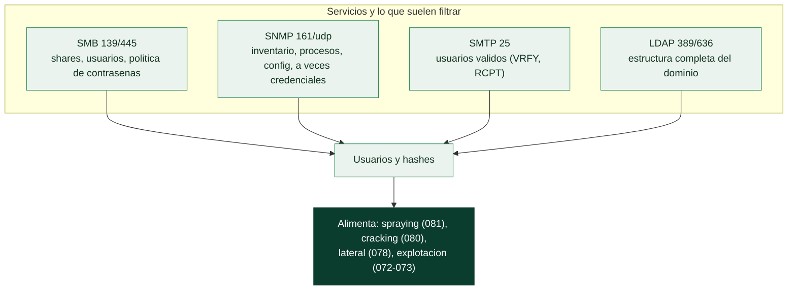

# Clase 070 — Enumeración: SMB, SNMP, SMTP y LDAP

> Parte: **3 — Hacking ético y pentesting: metodología** · Fuente: *The Hacker Playbook 3* (P. Kim) y *Penetration Testing* (G. Weidman)
> ⏱️ Duración estimada: **110 min** · Nivel: **Intermedio**

---

## 🎯 Objetivo

Extraer información detallada de los servicios más jugosos de una red corporativa: recursos compartidos y usuarios por **SMB**, dispositivos y comunidades por **SNMP**, cuentas válidas por **SMTP** y estructura del directorio por **LDAP**. La enumeración convierte "hay un puerto 445 abierto" en "hay estos usuarios y estos shares".

## 📚 Resultados de aprendizaje

Al finalizar, el alumno podrá:

1. **Enumerar** shares, usuarios y políticas por SMB con herramientas específicas.
2. **Extraer** información de dispositivos vía SNMP con comunidades por defecto.
3. **Validar** usuarios de correo con comandos SMTP (VRFY/RCPT).
4. **Consultar** un directorio LDAP anónimo para mapear la organización.
5. **Correlacionar** los datos enumerados con vectores de ataque posteriores.

## 🗺️ Temas

| # | Tema | Por qué importa |
|---|------|-----------------|
| 1 | SMB: shares y sesiones nulas | Fuente de archivos, usuarios y a veces credenciales |
| 2 | enum4linux / smbclient / crackmapexec | Automatizan la enumeración SMB |
| 3 | SNMP y comunidades por defecto | `public`/`private` filtran toda la config |
| 4 | SMTP VRFY/RCPT | Descubre usuarios válidos para spraying |
| 5 | LDAP anónimo | Estructura de AD sin autenticarse |
| 6 | Correlación con ataques | Cada dato alimenta la siguiente fase |
| 7 | Documentación de la enumeración | El informe necesita evidencia |

## 🧠 Explicación en profundidad

### Enumerar es exprimir cada servicio hasta que confiese

El escaneo dice qué servicios hay; la **enumeración** interroga a cada uno para sacarle
todo lo que revela sin autenticación o con credenciales mínimas. Es la fase que más
determina el resultado de un pentest y la que peor se hace por prisa, porque su valor no
está en una herramienta espectacular sino en la disciplina de preguntarle a cada servicio
exactamente lo que ese servicio suele filtrar. Cuatro protocolos concentran la mayor parte
del botín en una red típica, y cada uno tiene su repertorio.



### SMB: el más generoso en redes Windows

**SMB** (puertos 139/445) es la joya de la enumeración en entornos Windows porque
comparte, por diseño, mucha información. Las **sesiones nulas** —conexiones sin
credenciales, habilitadas en sistemas antiguos o mal configurados— pueden entregar la lista
de usuarios del dominio, los grupos, la política de contraseñas (crítica: dice cuántos
intentos hay antes del bloqueo, dato que decide la estrategia de la [Clase 081](../081-ataques-a-credenciales-fuerza-bruta-y-password-spraying/README.md)) y las
comparticiones disponibles. Un *share* legible puede contener scripts con credenciales,
copias de seguridad o ficheros de configuración. Las herramientas del oficio son
**enum4linux** (que orquesta varias consultas de golpe), **smbclient** (para navegar los
shares) y **crackmapexec / NetExec** (para validar credenciales y privilegios a escala en
toda una subred). Y un hallazgo por sí mismo: si el servicio acepta **SMBv1**, eso ya es un
problema reportable, por su historial de vulnerabilidades como EternalBlue.

### SNMP, SMTP y LDAP: tres fuentes que casi nadie asegura

**SNMP** (161/udp) es el clásico infravalorado. Diseñado para gestionar dispositivos, con
la **cadena de comunidad** por defecto —`public` para lectura, `private` para escritura, y
sorprendentemente frecuentes— entrega el inventario completo: interfaces de red, tabla de
procesos, software instalado, tabla de rutas y, en equipos de red, a veces la configuración
entera con credenciales incluidas. Al ir sobre UDP se olvida en los escaneos que solo miran
TCP, y por eso pasa desapercibido tanto para el defensor como, si no se tiene cuidado, para
el pentester.

**SMTP** (25) permite validar qué usuarios existen antes de atacarlos: las órdenes `VRFY` y
`EXPN`, o simplemente observar cómo responde el servidor a distintos `RCPT TO`, distinguen
las cuentas válidas de las inexistentes, convirtiendo una lista de nombres de LinkedIn en
una lista de usuarios confirmados. **LDAP** (389/636) es, en un dominio, el directorio
mismo: si permite consultas **anónimas**, devuelve la estructura completa de Active
Directory —usuarios, grupos, unidades organizativas, equipos— sin necesidad de credenciales,
que es precisamente el mapa que después explotan BloodHound y el movimiento lateral de la
[Clase 078](../078-movimiento-lateral-en-la-red/README.md).

### La disciplina que convierte datos en acceso

Dos hábitos separan la enumeración eficaz de la que solo genera ruido. El primero es la
**correlación**: cada dato alimenta al siguiente. Los usuarios de SMB se prueban por
spraying; los hashes se llevan a cracking; la política de contraseñas fija cuántos intentos
son seguros; los nombres de host de LDAP se convierten en objetivos de escaneo. La
enumeración no es una lista de comprobación estática sino un grafo que se recorre. El
segundo es la **documentación**: cada usuario, cada share, cada versión se anota con la
orden exacta que lo produjo, porque el informe final (la [Clase 085](../085-reporte-profesional-de-pentest/README.md)) necesita evidencia
reproducible, no afirmaciones. Y la frontera ética sigue vigente: enumerar es consultar lo
que el servicio ofrece; probar credenciales, escribir en un share o volcar datos personales
ya es otra fase que exige estar dentro del alcance autorizado.

## 📖 Definiciones y características

- **SMB (Server Message Block):** protocolo de compartición de archivos de Windows. Característica clave: las sesiones nulas pueden listar shares y usuarios sin credenciales.
- **Sesión nula:** conexión SMB anónima. Característica clave: en sistemas antiguos revela usuarios, grupos y políticas.
- **SNMP (Simple Network Management Protocol):** gestión de dispositivos vía UDP/161. Característica clave: las comunidades `public`/`private` suelen quedar por defecto y exponen la MIB completa.
- **SMTP VRFY/RCPT:** comandos que verifican existencia de buzones. Característica clave: permiten enumerar usuarios válidos si el servidor no lo bloquea.
- **LDAP anónimo:** consulta al directorio sin autenticación. Característica clave: puede revelar OUs, usuarios y atributos de Active Directory.
- **CrackMapExec:** navaja suiza para redes Windows/AD. Característica clave: enumera y valida credenciales SMB/LDAP a escala.

## 📔 Glosario

| Término | Definición concisa |
|---------|--------------------|
| Enumeración | Interrogar cada servicio para extraer todo lo que revela |
| SMB (139/445) | Protocolo de compartición de Windows; muy rico en datos |
| Sesión nula | Conexión SMB sin credenciales que puede filtrar usuarios y shares |
| Compartición (*share*) | Recurso publicado por SMB; puede contener secretos |
| Política de contraseñas | Umbral de bloqueo; decide la estrategia de spraying |
| enum4linux / smbclient | Herramientas de enumeración y navegación SMB |
| crackmapexec / NetExec | Validación de credenciales y privilegios a escala |
| SMBv1 | Dialecto obsoleto; su presencia es un hallazgo |
| SNMP (161/udp) | Gestión de dispositivos; filtra inventario y configuración |
| Cadena de comunidad | "Contraseña" de SNMP; `public`/`private` por defecto |
| VRFY / EXPN | Órdenes SMTP para validar usuarios |
| LDAP anónimo | Consulta al directorio sin autenticar; expone todo AD |
| Correlación | Cada dato enumerado alimenta la fase siguiente |
| Evidencia reproducible | Registro de la orden exacta que produjo cada hallazgo |

## 🧰 Herramientas y preparación

```bash
sudo apt install -y enum4linux smbclient snmp snmp-mibs-downloader ldap-utils crackmapexec
```

Objetivo: **Metasploitable** o un Windows/AD de laboratorio propio en red aislada.

> ⚠️ **Nota ética:** la enumeración interroga servicios reales y puede quedar registrada. Practícala solo en tu laboratorio o dentro del alcance autorizado. Nunca uses credenciales o comunidades encontradas para acceder a sistemas fuera del engagement.

## 🧪 Laboratorio guiado

Sustituye `TARGET` por la IP de tu objetivo de laboratorio.

1. Enumeración SMB integral:

   ```bash
   enum4linux -a TARGET
   ```

2. Listar shares con smbclient (sesión nula):

   ```bash
   smbclient -L //TARGET -N
   ```

3. Enumerar con CrackMapExec (shares y usuarios):

   ```bash
   crackmapexec smb TARGET --shares
   crackmapexec smb TARGET --users
   ```

4. SNMP con comunidad por defecto:

   ```bash
   snmpwalk -v2c -c public TARGET
   snmpwalk -v2c -c public TARGET 1.3.6.1.2.1.25.4.2.1.2   # procesos
   ```

5. Enumeración de usuarios por SMTP:

   ```bash
   nmap -p25 --script smtp-enum-users TARGET
   ```

6. Consulta LDAP anónima:

   ```bash
   ldapsearch -x -H ldap://TARGET -b "dc=ejemplo,dc=local"
   ```

7. Consolida usuarios, shares y hosts descubiertos en tu tabla de hallazgos.

## ✍️ Ejercicios

1. Lista todos los shares de tu objetivo e identifica cuáles permiten lectura anónima.
2. Extrae de SNMP la lista de procesos en ejecución del objetivo.
3. Enumera tres usuarios válidos por SMTP y explica qué comando los reveló.
4. Consulta por LDAP la unidad organizativa (OU) de usuarios.
5. Correlaciona un usuario SMB con un buzón SMTP: ¿coinciden los nombres?
6. Documenta qué harías con un share de lectura que contenga un script con credenciales.

## 📝 Reto verificable

Genera un **dossier de enumeración** del objetivo: lista de shares con permisos, al menos cinco usuarios, datos SNMP relevantes (SO, procesos o interfaces) y estructura LDAP si aplica.

**Criterio de aceptación:** el dossier contiene ≥5 usuarios enumerados con la técnica que los reveló, al menos un share accesible identificado y un dato SNMP concreto (versión de SO o proceso), todo con evidencia (comando + salida).

## ⚠️ Errores comunes

| Síntoma / mensaje | Causa y cómo arreglar |
|-------------------|-----------------------|
| `enum4linux` sin usuarios | Sesiones nulas deshabilitadas; prueba con credenciales de bajo privilegio |
| `snmpwalk` "Timeout" | Comunidad incorrecta o puerto filtrado; prueba `private` o `-v1` |
| SMTP no responde a VRFY | El servidor lo deshabilitó; usa `RCPT TO` como alternativa |
| `ldapsearch` "Operations error" | Falta base DN; especifica `-b` con el dominio correcto |
| MIBs numéricas ilegibles | Instala `snmp-mibs-downloader` y descomenta `mibs` en snmp.conf |

## ❓ Preguntas frecuentes

**❓ ¿Por qué SMB es tan valioso en un pentest?**
Porque concentra archivos, usuarios y, a menudo, credenciales en scripts o configuraciones. Además, es la puerta a ataques de AD como Pass-the-Hash o relay.

**❓ ¿SNMP sigue siendo relevante hoy?**
Sí, sobre todo en impresoras, routers y switches donde `public` nunca se cambió. SNMPv3 con autenticación es lo recomendable, pero muchos equipos siguen en v1/v2c.

**❓ ¿La enumeración SMTP funciona siempre?**
No. Muchos servidores modernos deshabilitan VRFY y devuelven la misma respuesta para usuarios válidos e inválidos, frustrando la enumeración.

**❓ ¿Qué hago si LDAP permite bind anónimo?**
Documenta la exposición: es un hallazgo. Con bind anónimo puedes mapear casi todo el directorio, lo que facilita el password spraying posterior.

## 🔗 Referencias

- Kim, P. *The Hacker Playbook 3* (2018).
- CrackMapExec — <https://www.crackmapexec.wiki/>
- enum4linux — <https://labs.portcullis.co.uk/tools/enum4linux/>
- MITRE ATT&CK — T1087 Account Discovery — <https://attack.mitre.org/techniques/T1087/>

## 📥 Material descargable

- 📄 [Guía en PDF](./clase-070-guia.pdf) — versión imprimible de esta clase.
- 🎞️ [Presentación (PPTX)](./clase-070-presentacion.pptx) — deck para proyectar en clase.

## ⬅️ Clase anterior

[Clase 069 — Reconocimiento activo](../069-reconocimiento-activo/README.md)

## ➡️ Siguiente clase

[Clase 071 — Análisis de vulnerabilidades con Nessus y OpenVAS](../071-analisis-de-vulnerabilidades-con-nessus-y-openvas/README.md)
