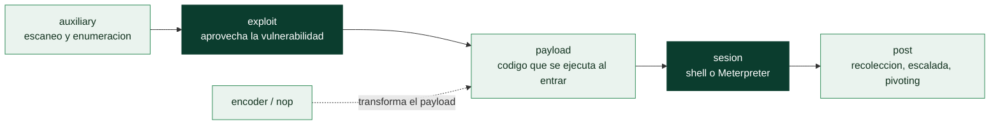

# Clase 072 — Metasploit Framework: arquitectura y uso

> Parte: **3 — Hacking ético y pentesting: metodología** · Fuente: *Kennedy et al. - "Metasploit: The Penetration Tester's Guide"; documentación oficial de Rapid7/Metasploit*
> ⏱️ Duración estimada: **110 min** · Nivel: **Intermedio**

---

## 🎯 Objetivo

El alumno comprenderá la arquitectura interna de Metasploit Framework —módulos, datastore, base de datos y workspaces— y adquirirá soltura operando `msfconsole`: buscar módulos, leer su documentación, configurar opciones y encadenar reconocimiento con explotación. Esta clase es la base técnica sobre la que se apoyan las tres clases siguientes del curso (explotación, Meterpreter y msfvenom).

## 📚 Resultados de aprendizaje

Al finalizar, el alumno podrá:

1. Describir los seis tipos de módulos de Metasploit (exploit, payload, auxiliary, post, encoder, nop) y su función en la cadena de ataque.
2. Inicializar la base de datos de Metasploit y organizar el trabajo en workspaces separados por objetivo.
3. Buscar, seleccionar y configurar módulos usando `search`, `use`, `set`, `setg` y `options`.
4. Importar resultados de Nmap dentro de Metasploit para poblar hosts y servicios automáticamente.
5. Ejecutar módulos auxiliares de escaneo y enumeración sin necesidad de un exploit.
6. Explicar por qué separar el datastore global del local evita errores de configuración en engagements con múltiples objetivos.

## 🗺️ Temas

| # | Tema | Por qué importa |
|---|------|------------------|
| 1 | Arquitectura: exploit, payload, auxiliary, post, encoder, nop | Cada tipo de módulo cumple un rol distinto en la cadena de ataque |
| 2 | msfconsole y comandos base | Es la interfaz principal de trabajo del framework |
| 3 | Base de datos PostgreSQL y `msfdb` | Persiste hosts, servicios, credenciales y loot entre sesiones |
| 4 | Workspaces | Aísla los datos de distintos clientes o fases de un mismo engagement |
| 5 | Datastore: `set` vs `setg` | Evita reescribir RHOSTS/LHOST en cada módulo nuevo |
| 6 | Importación de Nmap (`db_nmap`, `db_import`) | Une la fase de reconocimiento con la de explotación sin trabajo manual |
| 7 | Módulos auxiliares | Permiten escaneo y enumeración detallada sin lanzar un exploit |
| 8 | Sesiones, jobs y background | Gestiona múltiples objetivos y handlers en paralelo |

## 🧠 Explicación en profundidad

### Un framework, no un botón de "hackear"

Metasploit es el marco de explotación más usado del mundo, y su valor no está en tener
muchos exploits sino en **estandarizar la cadena de ataque**: descubrir, explotar, cargar un
payload, mantener acceso y hacer post-explotación, todo con una interfaz común y una base de
datos que recuerda lo aprendido. Entender su arquitectura de **módulos** es lo que separa
usarlo con criterio de copiar comandos.

Hay seis tipos de módulo, y cada uno cumple un rol distinto en la cadena. Los **exploits**
aprovechan una vulnerabilidad concreta para conseguir ejecución. Los **payloads** son el
código que se ejecuta *después* de que el exploit tenga éxito (la [Clase 073](../073-metasploit-explotacion-y-payloads/README.md) los
detalla). Los **auxiliary** hacen escaneo, enumeración y fuzzing sin explotar nada. Los
**post** operan sobre una sesión ya establecida (recolección, escalada, pivoting). Los
**encoders** transforman payloads, y los **nops** los rellenan. La distinción clave que hay
que interiorizar es **exploit ≠ payload**: el exploit abre la puerta, el payload es lo que
entra por ella, y se eligen por separado.



### La consola y el datastore: menos tecleo, menos errores

**msfconsole** es la interfaz principal. Su flujo básico —`search` para encontrar un
módulo, `use` para seleccionarlo, `show options` para ver qué necesita, `set` para
rellenarlo, `run`/`exploit` para lanzarlo— es el mismo para cualquier módulo, y esa
uniformidad es justamente lo que hace productivo al framework. El **datastore** guarda los
parámetros, y aquí hay un detalle que ahorra errores: `set` fija una variable **solo para
el módulo actual**, mientras que `setg` la fija **globalmente** para toda la sesión. Definir
`LHOST` y `RHOSTS` con `setg` una vez evita reescribirlos en cada módulo y, sobre todo,
evita el error clásico de lanzar un exploit con el `LHOST` de otro objetivo.

### La base de datos es lo que lo convierte en una herramienta de trabajo

Metasploit se apoya en **PostgreSQL** (inicializada con `msfdb init`), y este es el
componente que a menudo se ignora y que más rendimiento da en un pentest real. La base de
datos **persiste** hosts, servicios, credenciales y *loot* entre sesiones, de modo que el
conocimiento no se pierde al cerrar la consola. Se integra con el reconocimiento: `db_nmap`
lanza Nmap y guarda el resultado directamente, y `db_import` carga el XML de un escaneo
previo (el `-oA` de la [Clase 069](../069-reconocimiento-activo/README.md)). A partir de ahí, comandos como `hosts`,
`services` y `creds` consultan lo recopilado, y `vulns` correlaciona.

Los **workspaces** son la pieza que hace esto usable con varios clientes: cada workspace
aísla los datos de un engagement, de modo que los hosts, credenciales y loot de un cliente
nunca se mezclan con los de otro. Empezar cada trabajo con `workspace -a cliente` no es
manía organizativa: es higiene profesional y, con datos sensibles de por medio, una
obligación de la [Clase 067](../067-reglas-de-engagement-alcance-y-contratos/README.md).

### Sesiones y jobs: operar a escala

Un pentest real rara vez es un objetivo a la vez. Metasploit gestiona múltiples **sesiones**
(cada acceso obtenido) y **jobs** (tareas en segundo plano, como los *handlers* que esperan
conexiones entrantes). `background` deja una sesión en espera para seguir trabajando,
`sessions -l` las lista y `sessions -i N` retoma una. Esta capacidad de manejar varios
accesos y varios *listeners* en paralelo, con todo persistido en la base de datos, es lo que
convierte a Metasploit en la plataforma sobre la que se articula la fase de explotación y
post-explotación de las clases siguientes.

## 📖 Definiciones y características

- **Exploit**: módulo que aprovecha una vulnerabilidad específica de un servicio o software. Característica clave: siempre se combina con un payload para lograr ejecución de código en el objetivo.
- **Payload**: código que se ejecuta tras una explotación exitosa (ej. shell de comandos, Meterpreter). Característica clave: puede ser staged (se envía en etapas) o stageless (se envía completo de una vez).
- **Auxiliary**: módulo sin payload asociado, usado para escaneo, fuzzing o fuerza bruta. Característica clave: es la herramienta principal para enumeración profunda dentro del propio framework.
- **Post**: módulo que se ejecuta sobre una sesión ya establecida. Característica clave: automatiza tareas de post-explotación como recolección de credenciales o información del sistema.
- **Datastore**: almacén interno de variables de configuración (RHOSTS, LHOST, LPORT, etc.). Característica clave: `setg` fija un valor global visible para todos los módulos, mientras `set` lo fija solo para el módulo activo.
- **Workspace**: contenedor lógico dentro de la base de datos de Metasploit que agrupa hosts, servicios y hallazgos de un mismo engagement. Característica clave: separa físicamente los datos de distintos clientes o VMs de laboratorio.
- **msfdb**: utilidad de inicialización y gestión de la base de datos PostgreSQL que respalda a Metasploit. Característica clave: sin ella, Metasploit funciona pero pierde persistencia entre sesiones.

## 📔 Glosario

| Término | Definición concisa |
|---------|--------------------|
| Metasploit Framework | Marco de explotación que estandariza la cadena de ataque |
| Módulo | Unidad funcional del framework |
| Exploit | Módulo que aprovecha una vulnerabilidad para lograr ejecución |
| Payload | Código que se ejecuta tras el éxito del exploit |
| Auxiliary | Módulo de escaneo, enumeración o fuzzing sin explotar |
| Post | Módulo que opera sobre una sesión ya establecida |
| Encoder / nop | Transforma y rellena payloads |
| msfconsole | Interfaz principal del framework |
| Datastore | Almacén de parámetros del módulo |
| `set` vs `setg` | Variable local del módulo vs global de la sesión |
| `msfdb` / PostgreSQL | Base de datos que persiste hosts, servicios y loot |
| `db_nmap` / `db_import` | Integran el reconocimiento con la base de datos |
| Workspace | Aislamiento de los datos por cliente o fase |
| Sesión | Cada acceso obtenido a un objetivo |
| Job / handler | Tarea en segundo plano que espera conexiones |

## 🧰 Herramientas y preparación

- Kali Linux o Parrot OS con Metasploit Framework preinstalado (`msfconsole --version` para confirmar).
- PostgreSQL como backend de base de datos, gestionado por `msfdb`.
- Metasploitable2 desplegada en una red interna aislada (host-only) como objetivo de laboratorio.
- Nmap para el reconocimiento previo que luego se importará a Metasploit.

Inicialización recomendada:

```bash
sudo msfdb init
msfconsole -q
msf6 > db_status
# Debe responder algo como: "Connected to msf. Connection type: postgresql."
```

> ⚠️ **Nota ética:** Metasploit es una herramienta ofensiva real y potente. Todos los módulos que se usan en esta clase y en las tres siguientes se ejecutan **exclusivamente** contra máquinas de laboratorio propias (VMs propias, Metasploitable, rangos tipo HackTheBox/TryHackMe) o dentro de un alcance autorizado por escrito mediante contrato de pentesting con reglas de engagement (RoE) firmadas. El acceso no autorizado a sistemas de terceros es ilegal, independientemente de la intención o del resultado obtenido.

## 🧪 Laboratorio guiado

1. Arranca la consola y confirma el estado de la base de datos: `msfconsole -q` seguido de `db_status`.
2. Crea y selecciona un workspace dedicado al laboratorio: `workspace -a lab_parte3` y luego `workspace lab_parte3`.
3. Ejecuta un escaneo de Nmap directamente desde Metasploit para poblar la base de datos: `db_nmap -sV -p- 192.168.56.101`.
4. Revisa los datos importados con `hosts` y `services`; confirma que aparecen los puertos y versiones detectados.
5. Busca módulos relacionados con un servicio identificado, por ejemplo vsftpd: `search vsftpd`.
6. Selecciona el módulo correspondiente y revisa su documentación: `use exploit/unix/ftp/vsftpd_234_backdoor` seguido de `info`.
7. Revisa las opciones requeridas con `options` y fíjalas: `set RHOSTS 192.168.56.101`.
8. Fija el mismo valor como variable global para reutilizarlo en otros módulos: `setg RHOSTS 192.168.56.101`.
9. Ejecuta un módulo auxiliar de enumeración sin explotar nada: `use auxiliary/scanner/smb/smb_version`, `set RHOSTS 192.168.56.101`, `run`.
10. Revisa los datos acumulados en la base de datos del workspace: `hosts`, `services`, `vulns`, `notes`.
11. Crea un segundo workspace (`workspace -a lab_verificacion`) y repite un escaneo, confirmando que los datos no se mezclan entre workspaces.

## ✍️ Ejercicios

1. Explica la diferencia entre `set` y `setg` con un ejemplo concreto de RHOSTS y LHOST.
2. Enumera los seis tipos de módulos de Metasploit y da un caso de uso real de cada uno.
3. Importa un archivo XML de Nmap generado previamente con `db_import` y verifica los hosts cargados.
4. Usa un módulo auxiliar para detectar la versión de SSH del objetivo de laboratorio.
5. Crea dos workspaces distintos y demuestra, mostrando `hosts` en cada uno, que los datos no se mezclan.
6. Filtra módulos con `search` combinando `type:exploit` y `platform:unix` y explica qué representa cada filtro.

## 📝 Reto verificable

**Reto:** Dejar un workspace de laboratorio completamente poblado: hosts descubiertos, servicios con versión importados desde Nmap, y al menos un módulo auxiliar ejecutado con su resultado documentado.

**Criterio de aceptación:** el comando `hosts` muestra el objetivo de laboratorio, `services` lista al menos tres servicios con su versión, y existe al menos una entrada generada por un módulo auxiliar visible en `notes` o `vulns`. Todo debe estar contenido dentro de un workspace nombrado explícitamente (no en `default`).

## ⚠️ Errores comunes

| Síntoma / mensaje | Causa y cómo arreglar |
|---|---|
| `db_status` responde "No connection" | PostgreSQL detenido o `msfdb` no inicializada; ejecutar `sudo systemctl start postgresql` y luego `msfdb init` |
| `search` devuelve cientos de resultados | Búsqueda sin filtros; usar `type:`, `platform:` o `cve:` para acotar |
| Las opciones no persisten al cambiar de módulo | Se usó `set` en lugar de `setg` para variables comunes como RHOSTS/LHOST |
| `db_nmap` corre pero no aparece nada en `hosts` | No hay workspace activo o la base de datos no está conectada; verificar con `db_status` y `workspace` |
| El módulo buscado no existe | Ruta escrita a mano con errores; copiar el path exacto que devuelve `search` |
| `msfconsole` tarda mucho en arrancar | Está reconstruyendo la caché de módulos tras una actualización; es normal la primera vez, esperar |

## ❓ Preguntas frecuentes

**❓ ¿Necesito obligatoriamente la base de datos para usar Metasploit?**
No es obligatoria para lanzar un único exploit, pero es muy recomendable en cualquier engagement real: persiste hosts, servicios, credenciales y loot entre sesiones, algo esencial cuando hay múltiples objetivos.

**❓ ¿Cuál es la diferencia real entre un módulo auxiliary y un exploit?**
Los módulos auxiliary no entregan un payload ni buscan ejecución de código; sirven para escaneo, enumeración o fuerza bruta. Los exploit sí buscan ejecutar código en el objetivo y siempre se combinan con un payload.

**❓ ¿Metasploit Pro aporta mucho valor sobre el Framework gratuito?**
Pro añade automatización de flujos, generación de informes y una interfaz gráfica, pero el Framework gratuito cubre la enorme mayoría del contenido técnico necesario para aprender y para ejecutar engagements reales.

**❓ ¿Puedo agregar mis propios módulos a Metasploit?**
Sí. El framework está escrito en Ruby y es completamente modular; los módulos personalizados pueden colocarse en `~/.msf4/modules` respetando la estructura de carpetas (`exploits/`, `auxiliary/`, etc.) del framework oficial.

**❓ ¿Por qué usar workspaces si solo tengo una VM de laboratorio?**
Aunque el laboratorio tenga un solo objetivo, practicar con workspaces prepara al alumno para engagements reales donde se manejan decenas de clientes y es fácil confundir datos si todo vive en el workspace `default`.

## 🔗 Referencias

- Kennedy, D. et al. "Metasploit: The Penetration Tester's Guide" (No Starch Press) — referencia histórica de arquitectura del framework.
- Rapid7, documentación oficial de Metasploit: <https://docs.metasploit.com/>
- Offensive Security, Metasploit Unleashed: <https://www.offsec.com/metasploit-unleashed/>
- PTES (Penetration Testing Execution Standard), fase de Exploitation: <http://www.pentest-standard.org>
- MITRE ATT&CK, técnica T1595 (Active Scanning) como contexto de la fase previa a la explotación: <https://attack.mitre.org/techniques/T1595/>

## 📥 Material descargable

- 📄 [Guía en PDF](./clase-072-guia.pdf) — versión imprimible de esta clase.
- 🎞️ [Presentación (PPTX)](./clase-072-presentacion.pptx) — deck para proyectar en clase.

## ⬅️ Clase anterior

[Clase 071 — Análisis de vulnerabilidades con Nessus y OpenVAS](../071-analisis-de-vulnerabilidades-con-nessus-y-openvas/README.md)

## ➡️ Siguiente clase

[Clase 073 — Metasploit: explotación y payloads](../073-metasploit-explotacion-y-payloads/README.md)
