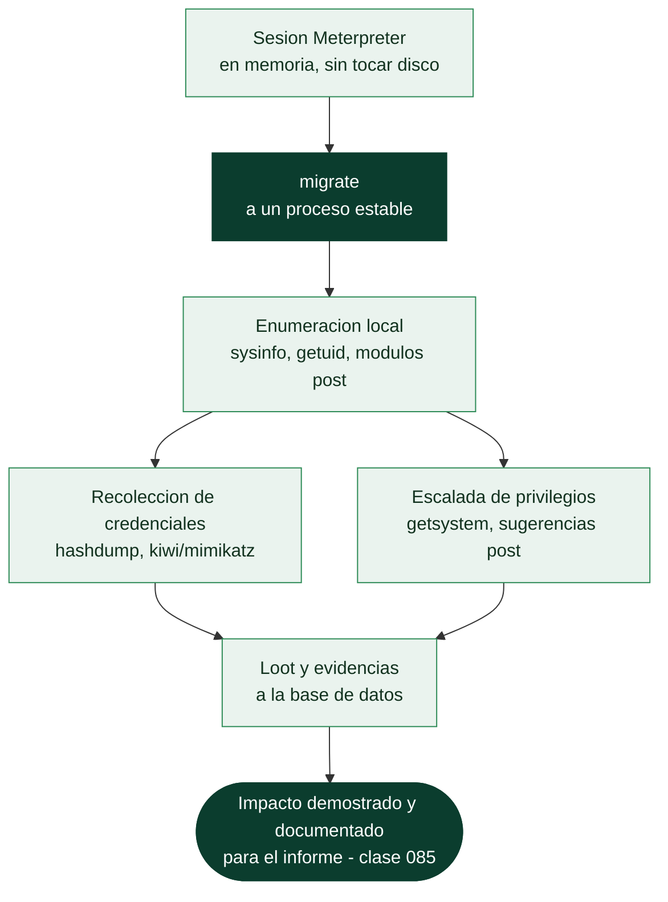

# Clase 074 — Meterpreter y post-explotación

> Parte: **3 — Hacking ético y pentesting: metodología** · Fuente: *Kennedy et al. - "Metasploit: The Penetration Tester's Guide"; Peter Kim - "The Hacker Playbook 3"*
> ⏱️ Duración estimada: **120 min** · Nivel: **Avanzado**

---

## 🎯 Objetivo

El alumno dominará Meterpreter, el payload avanzado de Metasploit que se ejecuta en memoria, y las tareas fundamentales de post-explotación: reconocimiento del sistema comprometido, migración de proceso, recolección de credenciales y uso de módulos `post` para automatizar enumeración interna. La post-explotación es la fase donde se demuestra el impacto real de una vulnerabilidad ante un cliente o evaluador.

## 📚 Resultados de aprendizaje

Al finalizar, el alumno podrá:

1. Operar los comandos esenciales de Meterpreter sobre sistema de archivos, procesos y red.
2. Migrar Meterpreter a un proceso más estable para sobrevivir al cierre del proceso explotado originalmente.
3. Recolectar información del sistema comprometido y credenciales mediante módulos `post`.
4. Intentar elevar privilegios con `getsystem` y evaluar honestamente cuándo esta técnica funciona y cuándo no.
5. Documentar el loot obtenido (hashes, archivos, capturas) como evidencia reproducible para un informe de pentesting.
6. Justificar el tratamiento seguro y confidencial de las credenciales extraídas durante un engagement.

## 🗺️ Temas

| # | Tema | Por qué importa |
|---|------|------------------|
| 1 | Arquitectura de Meterpreter (ejecución en memoria) | No escribe en disco por defecto, lo que reduce su huella forense |
| 2 | Comandos de sistema, archivos y procesos | Permiten navegar y extraer información sin subir herramientas externas |
| 3 | `migrate` y estabilidad de la sesión | La sesión puede perderse si el proceso vulnerable se cierra |
| 4 | Recolección de credenciales (`hashdump`, `kiwi`) | Es el hallazgo de mayor impacto que se documenta en un informe |
| 5 | Módulos post | Automatizan enumeración local y sugerencias de escalada |
| 6 | `getsystem` y elevación de privilegios | Determina el alcance real que se puede reportar como impacto |
| 7 | Loot y evidencias en la base de datos | El informe final necesita pruebas verificables, no solo afirmaciones |
| 8 | Manejo responsable de datos sensibles extraídos | Las credenciales de un cliente exigen custodia y destrucción controlada |

## 🧠 Explicación en profundidad

### La sesión es el principio, no el final

Conseguir una shell es donde muchos aficionados celebran y donde el pentester profesional
**empieza**. El objetivo de un pentest no es "entrar", sino demostrar **hasta dónde** puede
llegar un atacante y qué impacto real tendría: qué datos, qué privilegios, qué alcance en la
red. Esa es la fase de post-explotación, y **Meterpreter** es la herramienta con la que
Metasploit la ejecuta.

Meterpreter es un payload avanzado con una propiedad que define su valor: **se ejecuta
enteramente en memoria y no escribe en disco por defecto**, inyectándose en el espacio de un
proceso existente. Eso reduce su huella forense —no deja el binario que un antivirus
escanearía ni el artefacto que un analista encontraría— y le da un canal cifrado y una API
rica que evita subir herramientas externas que delatarían la intrusión. Entender esto
también sirve al defensor: buscar Meterpreter es buscar anomalías **en memoria y en red**,
no ficheros en disco.

### Estabilizar antes de actuar: migrate

La primera preocupación tras obtener la sesión es la **estabilidad**. Meterpreter vive
dentro de un proceso, y si ese proceso era el servicio vulnerable que se explotó, puede
cerrarse, colgarse o ser reiniciado —y la sesión se pierde con él—. El comando `migrate`
traslada la sesión a un proceso más estable y de vida larga (uno del sistema, por ejemplo),
lo que la hace resistente al cierre del proceso original. Como efecto secundario, migrar a
un proceso que corre con otros privilegios o en otra sesión de usuario puede cambiar el
contexto de ejecución, algo que se usa con criterio.

### El botín de mayor impacto: credenciales

De todo lo que se recolecta, las **credenciales** son lo que más pesa en un informe, porque
son la llave que abre el movimiento lateral (la [Clase 078](../078-movimiento-lateral-en-la-red/README.md)). `hashdump` extrae los
hashes de las cuentas locales de Windows (de la base SAM); la extensión `kiwi` —la versión
integrada de **Mimikatz**— va más allá y puede recuperar credenciales de la memoria del
proceso LSASS, a veces **en claro**. Esos hashes se llevan a cracking (la [Clase 080](../080-cracking-de-contrasenas-con-john-y-hashcat/README.md)) o se
reutilizan directamente con Pass-the-Hash sin necesidad de romperlos. Los **módulos post**
automatizan el resto: enumeran el sistema, listan software y parches, y algunos —como los
*exploit suggesters*— proponen rutas de escalada concretas para el objetivo.

### getsystem, loot y la responsabilidad que no se delega

`getsystem` intenta elevar de administrador local a **SYSTEM**, el máximo privilegio en
Windows, mediante varias técnicas de manipulación de tokens (la base de los ataques
"Potato" de la [Clase 077](../077-escalada-de-privilegios-en-windows/README.md)). Alcanzar SYSTEM determina el **impacto real** que se puede
reportar: no es lo mismo "obtuve una shell de usuario" que "obtuve control total del
servidor". Todo lo hallado —credenciales, ficheros sensibles, capturas— se guarda como
**loot** en la base de datos, porque el informe necesita **pruebas verificables**, no
afirmaciones.

Y aquí la clase cierra con lo que ninguna herramienta automatiza: la **responsabilidad**.
Las credenciales, los volcados y los datos personales que se extraen son, literalmente, las
llaves del cliente. Su custodia durante el engagement y su destrucción al terminar (la
[Clase 067](../067-reglas-de-engagement-alcance-y-contratos/README.md)) son parte del trabajo profesional. Un pentester que filtra por descuido lo que
extrajo se convierte en la brecha que vino a prevenir.

## 📖 Definiciones y características

- **Meterpreter**: payload avanzado que se inyecta en memoria y expone un intérprete de comandos extensible mediante extensiones (`stdapi`, `priv`, `kiwi`). Característica clave: no escribe en disco por defecto, lo que dificulta su detección por antivirus tradicionales basados en archivos.
- **`migrate`**: comando que mueve la sesión de Meterpreter a otro proceso en ejecución. Característica clave: aporta estabilidad y en ocasiones permite heredar el contexto de privilegios de un proceso más privilegiado.
- **`hashdump`**: comando que vuelca los hashes de contraseñas almacenados localmente (SAM en Windows, `/etc/shadow` equivalente en Linux vía módulos). Característica clave: requiere privilegios elevados (SYSTEM o root) para ejecutarse con éxito.
- **kiwi (integración de Mimikatz)**: extensión de Meterpreter que extrae credenciales en texto claro y tickets Kerberos de la memoria de procesos Windows. Característica clave: solo funciona si la arquitectura del proceso migrado coincide con la del payload cargado.
- **Módulo post**: script que se ejecuta sobre una sesión ya establecida para automatizar tareas de post-explotación. Característica clave: `post/multi/recon/local_exploit_suggester` analiza el sistema y sugiere rutas de escalada de privilegios conocidas.
- **Loot**: conjunto de datos extraídos del objetivo (hashes, archivos, capturas de pantalla) almacenados y catalogados por Metasploit. Característica clave: queda registrado en la base de datos del workspace y sirve como evidencia verificable para el informe final.

## 📔 Glosario

| Término | Definición concisa |
|---------|--------------------|
| Post-explotación | Fase que demuestra el alcance real tras obtener acceso |
| Meterpreter | Payload avanzado que se ejecuta en memoria |
| Ejecución en memoria | No escribe en disco; reduce la huella forense |
| `migrate` | Traslada la sesión a un proceso estable |
| Estabilidad de sesión | Evitar perder el acceso si el proceso original muere |
| `hashdump` | Extrae los hashes de cuentas locales (SAM) |
| kiwi / Mimikatz | Recupera credenciales de la memoria de LSASS |
| LSASS | Proceso de Windows que custodia credenciales en memoria |
| Módulo post | Automatiza enumeración local y sugerencias de escalada |
| Exploit suggester | Módulo que propone rutas de escalada para el objetivo |
| `getsystem` | Eleva de administrador local a SYSTEM |
| SYSTEM | Máximo privilegio en Windows |
| Loot | Evidencia recolectada, guardada en la base de datos |
| Custodia de credenciales | Responsabilidad de proteger y destruir lo extraído |

## 🧰 Herramientas y preparación

- Una sesión de Meterpreter activa, obtenida en la clase anterior contra Metasploitable2/3 o, idealmente, contra una VM Windows de laboratorio propia con un servicio deliberadamente vulnerable (para poder practicar `hashdump` y `kiwi`, que son específicos de Windows).
- Confirmar que la sesión sigue activa con `sessions -l` antes de iniciar el laboratorio.
- Espacio en disco local (`loot/`) para almacenar los archivos descargados durante la práctica.

> ⚠️ **Nota ética — lectura obligatoria:** volcar credenciales, extraer contraseñas en memoria y recolectar información de un sistema comprometido son acciones altamente intrusivas y sensibles. Se ejecutan **exclusivamente** sobre sistemas de laboratorio propios (VMs propias, Metasploitable, rangos controlados) o dentro del alcance de un contrato de pentesting con reglas de engagement firmadas. Las credenciales o datos obtenidos en un engagement real se tratan como información estrictamente confidencial: se almacenan cifradas, se usan únicamente dentro del alcance autorizado y se destruyen de forma verificable al finalizar el compromiso, según lo acordado contractualmente con el cliente. Extraer o conservar credenciales de sistemas sin autorización es ilegal y además constituye una falta grave de ética profesional.

## 🧪 Laboratorio guiado

Con una sesión Meterpreter activa (confirmada con `sessions -i 1`):

1. Reconoce el sistema comprometido: `sysinfo`, `getuid`, `ps`.
2. Explora el sistema de archivos remoto: `pwd`, `ls`, y descarga un archivo de interés: `download /etc/passwd loot/passwd` (o su equivalente en Windows).
3. Migra la sesión a un proceso más estable para evitar perderla si el servicio original se cierra: `migrate -N explorer.exe` (Windows) o al PID de un proceso persistente en Linux.
4. Ejecuta un módulo post de reconocimiento desde `msfconsole` (con la sesión en background, `background` primero): `run post/multi/recon/local_exploit_suggester`.
5. Ejecuta un módulo post de enumeración de usuarios conectados (Windows): `run post/windows/gather/enum_logged_on_users`.
6. Intenta elevar privilegios: `getsystem`, y si tiene éxito, vuelca los hashes locales: `hashdump`.
7. Carga la extensión kiwi para credenciales en memoria (Windows): `load kiwi` seguido de `creds_all`.
8. Revisa desde `msfconsole` todo el loot y credenciales acumulados en el workspace: `loot` y `creds`.
9. Documenta en un archivo de notas propio qué evidencia se obtuvo, con qué privilegio y en qué proceso migrado.
10. Toma una captura de pantalla del escritorio remoto (Windows) con el comando `screenshot` y guárdala junto al resto de evidencia recolectada.

## ✍️ Ejercicios

1. Explica por qué Meterpreter es considerado más sigiloso que una shell de comandos tradicional.
2. Migra la sesión a otro proceso y demuestra que sobrevive al cierre del proceso originalmente explotado.
3. Ejecuta `local_exploit_suggester` y elige una de las rutas de escalada sugeridas, explicando por qué aplicaría en ese sistema.
4. Descarga un archivo del objetivo con `download` y verifica su integridad comparándolo en tu máquina Kali.
5. Explica qué privilegios necesita específicamente `hashdump` para funcionar y qué ocurre si se ejecuta sin ellos.
6. Documenta tres artefactos de loot distintos (por ejemplo, hash, archivo de configuración, captura de pantalla) que incluirías como evidencia en un informe real.
7. Desde la perspectiva de un equipo de respuesta a incidentes, describe qué artefacto forense (proceso inyectado, conexión de red, clave de registro) permitiría detectar una sesión Meterpreter activa en el sistema comprometido.

## 📝 Reto verificable

**Reto:** Desde una sesión Meterpreter activa en el laboratorio propio, recolectar evidencia verificable de impacto: información del sistema, al menos un archivo descargado, y, si el nivel de privilegio obtenido lo permite, un volcado de hashes o credenciales.

**Criterio de aceptación:** se presenta la salida de `sysinfo`/`getuid` del objetivo, un archivo efectivamente descargado a la máquina atacante, y al menos una entrada visible en `loot` o `creds` dentro del workspace de Metasploit. Se documenta explícitamente si hubo elevación exitosa con `getsystem` y, si no la hubo, se explica por qué. Todo el ejercicio se realiza en un entorno propio o autorizado.

## ⚠️ Errores comunes

| Síntoma / mensaje | Causa y cómo arreglar |
|---|---|
| `getsystem` falla en todos los intentos | No existe una ruta de escalada conocida disponible; ejecutar `local_exploit_suggester` para identificar alternativas |
| `hashdump` devuelve "Insufficient privileges" | La sesión no corre como SYSTEM/root; intentar elevar primero con `getsystem` o un exploit local |
| La sesión Meterpreter se cae al detener el servicio explotado | No se realizó `migrate`; migrar a un proceso estable apenas se obtiene la sesión |
| `load kiwi` falla con error de arquitectura | El proceso migrado no coincide en arquitectura (x86 vs x64) con el payload cargado; migrar a un proceso de la arquitectura correcta |
| No aparece nada en `loot` tras ejecutar un módulo post | El módulo no guarda loot por diseño, o guardó en `notes`; revisar ambos comandos desde `msfconsole` |
| `download` falla con permisos denegados | El usuario actual no tiene acceso al archivo; intentar migrar a un proceso con más privilegios primero |
| La sesión se vuelve inestable tras `migrate` | Se migró a un proceso de corta duración (ej. un `notepad.exe` recién abierto); elegir un proceso del sistema estable y de larga vida |

## ❓ Preguntas frecuentes

**❓ ¿Meterpreter está siempre disponible tras cualquier exploit?**
No. Depende del exploit y de la plataforma objetivo. En Linux, en ocasiones solo se obtiene una shell de comandos simple, que puede intentar actualizarse a Meterpreter con `sessions -u <id>`.

**❓ ¿Por qué es tan importante migrar de proceso?**
Porque el proceso explotado inicialmente puede cerrarse (perdiendo la sesión) o pertenecer a un contexto de poco valor. Migrar a un proceso estable como `explorer.exe` en Windows mantiene el acceso durante toda la evaluación.

**❓ ¿`getsystem` es en sí mismo un exploit?**
No exactamente; usa varias técnicas conocidas de elevación local (impersonación de named pipes, duplicación de tokens) que funcionan solo si el sistema es susceptible a ellas. Si fallan, se requiere un exploit local específico sugerido por `local_exploit_suggester`.

**❓ ¿Cómo debo tratar las credenciales que extraigo durante un pentest real?**
Como información altamente confidencial: se almacenan cifradas, se usan exclusivamente dentro del alcance autorizado del contrato, y se destruyen de forma verificable al cierre del engagement, tal como se especifique en las reglas de engagement acordadas con el cliente.

**❓ ¿Es necesario documentar cada comando ejecutado durante la post-explotación?**
Sí. Un informe de pentesting profesional debe permitir reproducir cada hallazgo; documentar comandos exactos, marcas de tiempo y evidencia (loot) es lo que da credibilidad al reporte final.

**❓ ¿Qué debería vigilar un equipo defensivo (EDR/SOC) para detectar Meterpreter?**
Meterpreter vive en memoria y suele inyectarse en procesos legítimos, por lo que las firmas basadas en archivo fallan. Un EDR moderno detecta este comportamiento por inyección de código en procesos como `explorer.exe`, llamadas a la API de Windows típicas de reflective DLL injection, y patrones de tráfico de red cifrado hacia un handler externo con beacons periódicos.

**❓ ¿`hashdump` deja algún rastro forense en el sistema objetivo?**
Sí. Acceder a la SAM (Windows) o a los archivos equivalentes de credenciales suele generar eventos de acceso a proceso (`lsass.exe`) y de lectura de registro que un SIEM bien configurado puede correlacionar como actividad de credential dumping, incluso si Meterpreter no escribe archivos en disco.

## 🔗 Referencias

- Kennedy, D. et al. "Metasploit: The Penetration Tester's Guide" (No Starch Press) — capítulo dedicado a Meterpreter y post-explotación.
- Rapid7, documentación oficial de Meterpreter: <https://docs.metasploit.com/docs/using-metasploit/advanced/meterpreter/meterpreter.html>
- MITRE ATT&CK, táctica TA0006 (Credential Access): <https://attack.mitre.org/tactics/TA0006/>
- MITRE ATT&CK, táctica TA0004 (Privilege Escalation): <https://attack.mitre.org/tactics/TA0004/>
- Kim, P. "The Hacker Playbook 3" (2018) — metodología de post-explotación en engagements reales.
- MITRE ATT&CK, técnica T1055 (Process Injection), relevante para detección de Meterpreter: <https://attack.mitre.org/techniques/T1055/>
- MITRE ATT&CK, técnica T1003 (OS Credential Dumping), relevante para `hashdump` y `kiwi`: <https://attack.mitre.org/techniques/T1003/>

## 📥 Material descargable

- 📄 [Guía en PDF](./clase-074-guia.pdf) — versión imprimible de esta clase.
- 🎞️ [Presentación (PPTX)](./clase-074-presentacion.pptx) — deck para proyectar en clase.

## ⬅️ Clase anterior

[Clase 073 — Metasploit: explotación y payloads](../073-metasploit-explotacion-y-payloads/README.md)

## ➡️ Siguiente clase

[Clase 075 — msfvenom: generación de payloads](../075-msfvenom-generacion-de-payloads/README.md)
