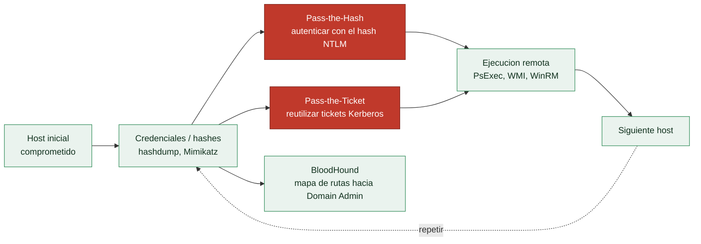

# Clase 078 — Movimiento lateral en la red

> Parte: **3 — Hacking ético y pentesting: metodología** · Fuente: *MITRE ATT&CK, tácticas de Lateral Movement (TA0008); Peter Kim - "The Hacker Playbook 3"*
> ⏱️ Duración estimada: **130 min** · Nivel: **Avanzado**

---

## 🎯 Objetivo

El alumno aprenderá a extender el acceso desde un primer host comprometido hacia otros sistemas de una red interna o de un dominio Active Directory, reutilizando credenciales y hashes obtenidos de forma responsable, usando PsExec, WMI/WinRM y técnicas de Pass-the-Hash, y a mapear conceptualmente esas rutas con BloodHound, entendiendo el valor defensivo de detectar estos movimientos.

## 📚 Resultados de aprendizaje

Al finalizar, el alumno podrá:

1. Explicar por qué Pass-the-Hash funciona sobre el protocolo de autenticación NTLM.
2. Ejecutar comandos remotos en hosts Windows usando PsExec, wmiexec y evil-winrm.
3. Validar credenciales contra un rango de hosts con CrackMapExec.
4. Describir conceptualmente cómo BloodHound mapea rutas de ataque en Active Directory.
5. Relacionar cada técnica con las tácticas y técnicas correspondientes de MITRE ATT&CK.
6. Documentar una cadena de movimiento lateral con la evidencia necesaria para un informe de pentest.

## 🗺️ Temas

| # | Tema | Por qué importa |
|---|------|------------------|
| 1 | NTLM y Pass-the-Hash | El hash es suficiente para autenticarse, no se necesita la contraseña en claro |
| 2 | PsExec (Sysinternals / impacket) | Ejecución remota clásica vía SMB creando un servicio temporal |
| 3 | WMI y WinRM | Alternativas de ejecución remota más sigilosas que PsExec |
| 4 | CrackMapExec | Valida credenciales y privilegios a escala en toda una subred |
| 5 | BloodHound (concepto) | Visualiza rutas de escalada hacia Domain Admin en Active Directory |
| 6 | Pass-the-Ticket (Kerberos) | Reutiliza tickets robados en lugar de hashes NTLM |
| 7 | MITRE ATT&CK - Lateral Movement | Estandariza el vocabulario y facilita la detección estructurada |

## 🧠 Explicación en profundidad

### Un host no es el objetivo; la red lo es

Comprometer una máquina rara vez es el fin. El objetivo real suele estar en otro sitio —el
controlador de dominio, el servidor de bases de datos, los datos de negocio—, y llegar allí
requiere **movimiento lateral**: usar el acceso y las credenciales de un host para
autenticarse en el siguiente, y así sucesivamente. En un entorno Windows con Active
Directory, esto es la esencia del ataque, y su combustible son las **credenciales**
recolectadas en la post-explotación (la [Clase 074](../074-meterpreter-y-post-explotacion/README.md)).

### Pass-the-Hash: por qué no hace falta la contraseña

El concepto que hay que interiorizar antes que ningún comando es que en Windows, con el
protocolo **NTLM**, **el hash de la contraseña es funcionalmente equivalente a la contraseña
misma**. Para autenticarse, el sistema no compara contraseñas en claro: usa el hash NTLM. Eso
significa que un atacante que obtenga el hash (con `hashdump` o Mimikatz) puede autenticarse
**sin romperlo**, presentándolo directamente. Es el **Pass-the-Hash** (PtH), y desmonta la
intuición de que robar un hash "solo sirve si lo crackeas": para NTLM, tener el hash **es**
tener la credencial. Si además ese hash es de un usuario administrador reutilizado en muchas
máquinas —el pecado clásico de la cuenta de administrador local compartida—, un solo hash
abre media red.

### Las vías de ejecución remota, de la más ruidosa a la más sigilosa

Con una credencial válida (o su hash), hay varias formas de ejecutar código en otra máquina.
**PsExec** —el original de Sysinternals o la versión de impacket— es la clásica: usa SMB para
copiar un servicio temporal en el objetivo y ejecutarlo, lo que es fiable pero **ruidoso**
(crea un servicio, deja rastro en los logs). **WMI** y **WinRM** son alternativas más
sigilosas: aprovechan mecanismos de gestión legítimos de Windows, lo que hace su tráfico más
difícil de distinguir de la administración normal. **CrackMapExec / NetExec** es la navaja
suiza que valida un conjunto de credenciales contra **toda una subred** de una vez, diciendo
en qué máquinas funcionan y con qué privilegios —lo que convierte un hash en un mapa de por
dónde se puede mover el atacante—.

### Kerberos, BloodHound y el vocabulario de ATT&CK

En Active Directory moderno el movimiento también usa **Kerberos**: el **Pass-the-Ticket**
reutiliza tickets robados (TGT o TGS) en lugar de hashes NTLM, y variantes como Golden/Silver
Ticket forjan tickets con material de clave comprometido (se profundiza en la Parte 7). La
herramienta que ordena todo este caos es **BloodHound**: recolecta la estructura de AD
—usuarios, grupos, sesiones, permisos— y la representa como un **grafo** en el que se pueden
calcular automáticamente las **rutas más cortas hacia Domain Admin**. Convierte una pregunta
que costaría días de análisis manual ("¿cómo llego desde este usuario cualquiera a controlar
el dominio?") en una consulta de segundos, y es igual de valiosa para el defensor, que la usa
para encontrar y cortar esas rutas antes de que las use un atacante.

Todo esto se cataloga en la táctica **Lateral Movement** de **MITRE ATT&CK**, y usar ese
vocabulario no es pedantería: estandariza el hallazgo para que el equipo azul sepa
exactamente qué técnica detectar y el informe hable el mismo idioma que las defensas. La
contramedida de fondo, que enlaza con la [Clase 042](../../parte-1-redes-y-seguridad-de-redes/042-segmentacion-de-red-y-arquitectura-zero-trust/README.md), es la **segmentación** y no reutilizar
credenciales de administrador: si cada máquina tiene su propia contraseña de administrador
local (LAPS) y las redes están segmentadas, un hash robado deja de abrir el reino entero.

## 📖 Definiciones y características

- **Pass-the-Hash (PtH)**: técnica de autenticación que usa el hash NTLM de una contraseña en lugar de la contraseña en texto claro. Característica clave: NTLM valida el hash, no exige el secreto original, por lo que robar el hash basta para autenticarse.
  - *Enfoque defensivo*: deshabilitar NTLM donde sea posible en favor de Kerberos, y aplicar LAPS para rotar contraseñas locales, limita drásticamente el impacto de un hash robado.
- **PsExec**: utilidad (originalmente de Sysinternals, reimplementada en impacket como `psexec.py`) que ejecuta comandos remotos vía SMB creando un servicio temporal en el host destino. Característica clave: es efectiva pero ruidosa, ya que deja artefactos de creación de servicio en el Event Log.
  - *Enfoque defensivo*: alertar sobre el Event ID 7045 (instalación de nuevo servicio) en hosts que no son servidores de administración es una detección de alto valor y bajo costo.
- **WMI (Windows Management Instrumentation)**: infraestructura de administración remota de Windows; `wmiexec.py` de impacket la usa para ejecución de comandos sin crear un servicio persistente. Característica clave: más sigilosa que PsExec porque no deja un binario ni un servicio en disco.
  - *Enfoque defensivo*: registrar y auditar el tráfico WMI (puerto 135 + RPC dinámico) entre estaciones de trabajo, algo poco común en tráfico legítimo día a día, ayuda a detectar este vector.
- **WinRM (Windows Remote Management)**: protocolo de gestión remota sobre HTTP(S) (puertos 5985/5986); `evil-winrm` ofrece una shell interactiva cómoda. Característica clave: requiere que el servicio WinRM esté habilitado y accesible en el destino.
  - *Enfoque defensivo*: restringir qué hosts pueden alcanzar el puerto 5985/5986 mediante firewall de host y solo habilitar WinRM donde sea estrictamente necesario reduce la superficie de ataque.
- **CrackMapExec**: herramienta que automatiza la validación de credenciales (contraseña o hash) contra múltiples hosts simultáneamente e indica en cuáles el usuario tiene privilegios administrativos. Característica clave: la marca `Pwn3d!` señala admin local confirmado en ese host.
  - *Enfoque defensivo*: un blue team puede correr la misma herramienta contra su propia red para detectar reutilización de credenciales de administrador local antes que un atacante.
- **BloodHound**: herramienta de análisis de grafos que ingiere datos de Active Directory (usuarios, grupos, sesiones, ACLs) y calcula rutas de ataque hacia cuentas privilegiadas. Característica clave: convierte relaciones de confianza invisibles en un mapa visual explotable, y es igual de valiosa para el equipo defensivo que audita esas mismas rutas.
  - *Enfoque defensivo*: ejecutar BloodHound periódicamente contra el propio AD ("purple teaming") revela rutas de escalada que la organización desconocía y permite priorizar remediaciones.
- **Pass-the-Ticket**: variante de Kerberos donde se reutiliza un ticket (TGT o TGS) robado de la memoria de un proceso, en lugar de un hash NTLM. Característica clave: evita depender de NTLM, pero requiere que el ticket robado siga siendo válido (no haya expirado).
  - *Enfoque defensivo*: reducir el tiempo de vida de los tickets Kerberos y monitorizar solicitudes TGS anómalas (Event ID 4769) limita la ventana de explotación.

## 📔 Glosario

| Término | Definición concisa |
|---------|--------------------|
| Movimiento lateral | Usar un host comprometido para autenticarse en el siguiente |
| NTLM | Protocolo de autenticación de Windows basado en hash |
| Pass-the-Hash | Autenticarse con el hash NTLM sin la contraseña en claro |
| Reutilización de credenciales | Un administrador compartido abre muchas máquinas |
| PsExec | Ejecución remota vía SMB creando un servicio temporal |
| impacket | Suite de Python con implementaciones de PsExec, WMI, etc. |
| WMI / WinRM | Ejecución remota más sigilosa, sobre gestión legítima |
| CrackMapExec / NetExec | Valida credenciales y privilegios a escala en una subred |
| Kerberos | Protocolo de autenticación de AD basado en tickets |
| Pass-the-Ticket | Reutilizar tickets Kerberos robados |
| TGT / TGS | Tickets de Kerberos (concesión y servicio) |
| BloodHound | Grafo de AD que calcula rutas hacia Domain Admin |
| MITRE ATT&CK | Taxonomía de técnicas; táctica Lateral Movement |
| LAPS | Contraseña de administrador local única por máquina |

## 🧰 Herramientas y preparación

- **Entorno de laboratorio**: un mini-dominio Active Directory propio (un controlador de dominio y al menos dos estaciones de trabajo), montado en VMs propias o en un rango de laboratorio como los de HackTheBox Pro Labs o TryHackMe.
- **Impacket**: `pip install impacket` o `pipx install impacket`; incluye `psexec.py`, `wmiexec.py`, `smbexec.py` y `secretsdump.py`.
- **CrackMapExec** (o su fork mantenido, NetExec): `pip install crackmapexec` o `pip install netexec`.
- **evil-winrm**: `gem install evil-winrm`, requiere Ruby instalado.
- Credenciales o hashes obtenidos de forma legítima en clases previas (por ejemplo, mediante `secretsdump.py` tras una escalada de privilegios autorizada).
- **BloodHound + SharpHound/bloodhound-python**: recolector de datos de AD (`bloodhound-python -u user -p pass -d dominio.local -ns 10.10.10.5 -c all`) y su interfaz de análisis en Neo4j.
- **Wireshark o tcpdump** (opcional): útil para observar en el laboratorio el tráfico SMB/WMI/WinRM generado por cada técnica y entender su huella en la red.

## 🧪 Laboratorio guiado

> Todas las técnicas de esta clase reutilizan credenciales reales para acceder a más sistemas. Practica esto exclusivamente dentro de tu laboratorio propio o del alcance autorizado por un contrato de pentesting con reglas de engagement firmadas. Usar estas técnicas fuera de ese alcance es acceso no autorizado y constituye delito.

1. Con un hash NTLM obtenido (formato `LM:NT`), valida en qué hosts de la subred la credencial es admin local: `crackmapexec smb 192.168.56.0/24 -u administrador -H <hash_NT>`.
2. Los hosts marcados con `Pwn3d!` confirman privilegios administrativos; anótalos como objetivos de movimiento lateral.
3. Ejecuta un comando remoto de forma sigilosa con wmiexec: `wmiexec.py -hashes :<hash_NT> dominio/administrador@192.168.56.20`.
4. Alternativamente, usa PsExec (más ruidoso, deja un servicio): `psexec.py dominio/administrador@192.168.56.20 -hashes :<hash_NT>`.
5. Si el puerto 5985 está abierto, obtén una shell interactiva con evil-winrm: `evil-winrm -i 192.168.56.20 -u administrador -H <hash_NT>`.
6. Vuelca credenciales adicionales del nuevo host: `secretsdump.py dominio/administrador@192.168.56.20 -hashes :<hash_NT>`.
7. Con las credenciales recién obtenidas, repite el proceso hacia un tercer host para construir una cadena de al menos dos saltos.
8. Si dispones de datos de BloodHound recolectados con `bloodhound-python` o SharpHound (en tu laboratorio), analiza el grafo para identificar visualmente la ruta más corta hacia Domain Admin.
9. Recolecta datos con bloodhound-python: `bloodhound-python -u administrador -p 'Password123' -d dominio.local -ns 10.10.10.5 -c all`, importa el resultado en la interfaz de BloodHound y ejecuta la consulta prediseñada "Shortest Paths to Domain Admins".
10. Captura tráfico con Wireshark durante uno de los ataques (por ejemplo wmiexec) para observar los artefactos de red que genera cada técnica.
11. Documenta cada salto: host origen, credencial usada, técnica (PtH/PsExec/WMI/WinRM) y host destino alcanzado.

## ✍️ Ejercicios

1. Explica con tus propias palabras por qué NTLM permite Pass-the-Hash y qué diferencia tiene frente a Kerberos en este aspecto.
2. Compara PsExec y wmiexec en cuanto a artefactos forenses que dejan en el host destino.
3. Usa CrackMapExec para determinar en qué hosts de tu laboratorio una cuenta específica es administrador local.
4. Obtén una shell con evil-winrm y ejecuta `whoami /priv` para verificar los privilegios disponibles.
5. Ejecuta `secretsdump.py` contra un host de laboratorio y explica qué contenidos obtienes (SAM, LSA secrets, cached domain credentials).
6. Dibuja (a mano o con una herramienta de diagramas) una cadena de movimiento lateral de tres saltos y señala en qué punto un blue team podría detectarla.

## 📝 Reto verificable

Reto: en tu laboratorio de Active Directory propio, demuestra una cadena de movimiento lateral de al menos dos saltos partiendo de un host inicial comprometido.

Criterio de aceptación: el alumno documenta los dos (o más) hosts alcanzados, la técnica exacta usada en cada salto (Pass-the-Hash con PsExec/WMI/WinRM), la credencial que permitió el salto, y una salida de verificación (`whoami`/`hostname`) capturada en cada host de la cadena.

## ⚠️ Errores comunes

| Síntoma / mensaje | Causa y cómo arreglar |
|---|---|
| CrackMapExec no muestra `Pwn3d!` en ningún host | La cuenta no tiene privilegios administrativos ahí; prueba con otra credencial u otro host |
| `STATUS_LOGON_FAILURE` al usar el hash | Formato de hash o dominio incorrecto; verifica el formato `:hash_NT` y el nombre exacto del dominio |
| PsExec es bloqueado por el antivirus/EDR | Comportamiento esperado; usa wmiexec, que es más sigiloso al no crear un servicio persistente |
| evil-winrm no conecta | El puerto 5985 está cerrado o WinRM no está habilitado; confírmalo con un escaneo de puertos antes de intentar |
| `secretsdump.py` devuelve una salida vacía | La cuenta no tiene privilegios administrativos suficientes en el host remoto; escala privilegios primero |
| BloodHound no muestra ninguna ruta hacia Domain Admin | Los datos de recolección (SharpHound) están incompletos; vuelve a ejecutar la recolección con todos los métodos habilitados |

## ❓ Preguntas frecuentes

**❓ ¿Por qué NTLM permite Pass-the-Hash y Kerberos no de la misma forma?**
Porque NTLM valida directamente el hash en un intercambio reto-respuesta, mientras que Kerberos usa tickets con tiempos de expiración y cifrado distinto; aun así, Kerberos tiene su propio equivalente llamado Pass-the-Ticket u Overpass-the-Hash.

**❓ ¿Cuándo debo preferir wmiexec sobre PsExec?**
Cuando el sigilo importa: wmiexec no crea un servicio ni deja un binario en disco, mientras que PsExec sí, lo que lo hace mucho más visible para un EDR o para un analista revisando el Event Log.

**❓ ¿Qué aporta BloodHound que CrackMapExec no da?**
CrackMapExec valida credenciales host por host; BloodHound construye el grafo completo de relaciones (sesiones, membresías de grupo, ACLs) para mostrar la ruta óptima de escalada dentro de todo el dominio, no solo host a host.

**❓ ¿Cómo detecta un equipo defensivo el movimiento lateral?**
Correlacionando eventos de autenticación (Event ID 4624/4672), creación de servicios remotos (7045), uso inusual de WMI, y desviaciones respecto al patrón habitual de logons entre hosts; herramientas EDR y SIEM son clave para esta detección.

**❓ ¿Por qué mi organización debería ejecutar BloodHound contra su propio dominio?**
Porque revela rutas de escalada reales (grupos anidados, ACLs delegadas, sesiones cacheadas) que un administrador de AD normalmente no puede ver a simple vista, permitiendo priorizar remediaciones antes de que un atacante las use.

## 🔗 Referencias

- MITRE ATT&CK, TA0008 Lateral Movement — <https://attack.mitre.org/tactics/TA0008/>
- Peter Kim, *The Hacker Playbook 3*, Secure Planet LLC.
- Impacket (Fortra) — <https://github.com/fortra/impacket>
- BloodHound (SpecterOps) — <https://bloodhound.specterops.io/>
- CrackMapExec / NetExec — <https://www.netexec.wiki/>

## 📥 Material descargable

- 📄 [Guía en PDF](./clase-078-guia.pdf) — versión imprimible de esta clase.
- 🎞️ [Presentación (PPTX)](./clase-078-presentacion.pptx) — deck para proyectar en clase.

## ⬅️ Clase anterior

[Clase 077 — Escalada de privilegios en Windows](../077-escalada-de-privilegios-en-windows/README.md)

## ➡️ Siguiente clase

[Clase 079 — Pivoting y reenvío de puertos](../079-pivoting-y-reenvio-de-puertos/README.md)
