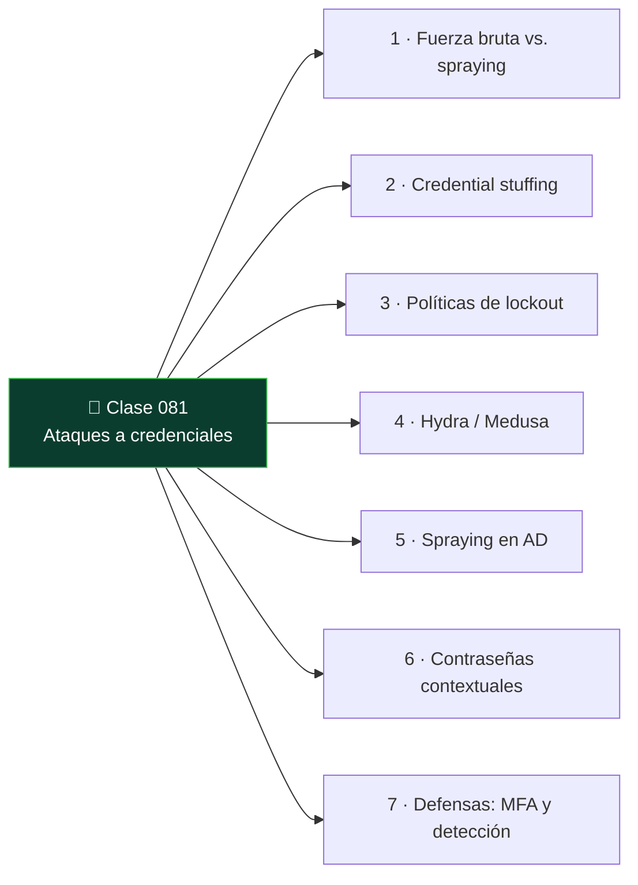

# Clase 081 — Ataques a credenciales: fuerza bruta y password spraying

<!-- cabecera:inicio -->

<div align="center">

[](../README.md)
[](../../README.md)
[](../../README.md)
[](../../README.md)

</div>

> 🗂️ Parte: **3 — Hacking ético y pentesting** · 📖 Fuente: *The Hacker Playbook 3* (P. Kim) y *MITRE ATT&CK (Credential Access)*
> ⏱️ Duración estimada: **110 min** · 🎚️ Nivel: **Avanzado**

<!-- cabecera:fin -->

---

## 🎯 Objetivo

Atacar la autenticación en línea de servicios reales (SSH, RDP, SMB, web, correo) diferenciando **fuerza bruta**, **credential stuffing** y **password spraying**, y entendiendo cómo evitar bloqueos de cuenta. El foco es la eficacia con sigilo: probar pocas contraseñas muy probables contra muchos usuarios.

## 📚 Resultados de aprendizaje

Al finalizar, el alumno podrá:

1. **Distinguir** fuerza bruta, stuffing y spraying y cuándo usar cada uno.
2. **Ejecutar** ataques con Hydra, Medusa y CrackMapExec contra servicios de laboratorio.
3. **Diseñar** un password spraying que evite bloqueos por política de lockout.
4. **Construir** listas de usuarios y contraseñas contextuales.
5. **Recomendar** controles defensivos (MFA, lockout, detección).

## 🗺️ Temas

<!-- mapa:inicio -->



<!-- mapa:fin -->

| # | Tema | Por qué importa |
|---|------|-----------------|
| 1 | Fuerza bruta vs. spraying | Spraying evita bloqueos por cuenta |
| 2 | Credential stuffing | Reutilización de credenciales filtradas |
| 3 | Políticas de lockout | Determinan la ventana segura de intentos |
| 4 | Hydra / Medusa | Ataque a múltiples protocolos |
| 5 | Spraying en AD | Contra Kerberos/SMB/OWA |
| 6 | Contraseñas contextuales | `Empresa2024!` es sorprendentemente común |
| 7 | Defensas: MFA y detección | Lo que realmente frena el ataque |

## 📖 Definiciones y características

- **Fuerza bruta:** muchas contraseñas contra un usuario. Característica clave: dispara bloqueos de cuenta rápidamente.
- **Password spraying:** una o pocas contraseñas contra muchos usuarios. Característica clave: evita el lockout al no acumular fallos por cuenta.
- **Credential stuffing:** reutilizar pares usuario:contraseña filtrados. Característica clave: explota la reutilización de contraseñas entre servicios.
- **Lockout policy:** umbral de fallos que bloquea una cuenta. Característica clave: define cuántos intentos y en qué ventana son seguros.
- **Contraseña contextual:** basada en la organización/temporada (`Verano2024`). Característica clave: alta tasa de acierto en spraying.
- **MFA:** segundo factor de autenticación. Característica clave: neutraliza la mayoría de estos ataques aunque la contraseña sea correcta.

## 🧰 Herramientas y preparación

```bash
sudo apt install -y hydra medusa crackmapexec
```

Prepara listas: usuarios enumerados (clases 068/070) y contraseñas contextuales (nombre de empresa + año + símbolo). Objetivo: servicios de laboratorio propios (un SSH, un SMB, una web de prueba).

> ⚠️ **Nota ética:** los ataques a credenciales pueden **bloquear cuentas reales** y causar denegación de servicio. Ejecútalos **solo** en laboratorio o con autorización explícita, coordinando con el cliente para no dejar a usuarios fuera. Nunca uses credenciales filtradas contra servicios reales fuera del alcance.

## 🧪 Laboratorio guiado

1. Fuerza bruta controlada de SSH (un usuario, lista corta):

   ```bash
   hydra -l admin -P passwords.txt ssh://192.168.56.101 -t 4 -f
   ```

2. Password spraying en SMB con CrackMapExec (una contraseña, muchos usuarios):

   ```bash
   crackmapexec smb 192.168.56.20 -u usuarios.txt -p 'Empresa2024!' --continue-on-success
   ```

3. Ataque a formulario web con Hydra (http-post-form de laboratorio):

   ```bash
   hydra -L usuarios.txt -p 'Primavera2024!' 192.168.56.30 http-post-form "/login:user=^USER^&pass=^PASS^:Invalid"
   ```

4. Respeta el lockout: calcula intentos seguros (p. ej. 1 intento cada 30 min si el umbral es 5/30min).
5. Marca los éxitos y valida el acceso manualmente con las credenciales obtenidas.
6. Documenta usuarios comprometidos y la contraseña que funcionó.
7. Redacta la recomendación defensiva (MFA + lockout + alertas).

## ✍️ Ejercicios

1. Explica por qué el spraying evita bloqueos que la fuerza bruta provoca.
2. Diseña una lista de 10 contraseñas contextuales para una empresa ficticia.
3. Calcula una cadencia de spraying segura dada una política de 5 fallos por 15 minutos.
4. Ejecuta un stuffing con un par filtrado (de laboratorio) y explica el riesgo.
5. Compara Hydra y CrackMapExec para spraying en AD.
6. Enumera tres controles que hacen inviable el spraying.

## 📝 Reto verificable

Realiza un **password spraying** controlado en tu laboratorio que comprometa al menos una cuenta sin bloquear ninguna.

**Criterio de aceptación:** documentas la lista de usuarios, la(s) contraseña(s) probada(s), la cadencia respetando el lockout, al menos una credencial válida encontrada y verificada, y cero cuentas bloqueadas. Cierras con recomendaciones defensivas. Todo en entorno propio.

## ⚠️ Errores comunes

| Síntoma / mensaje | Causa y cómo arreglar |
|-------------------|-----------------------|
| Cuentas bloqueadas masivamente | Ataste demasiados intentos; usa spraying con cadencia |
| Hydra "child died" | Demasiados hilos (`-t`) para el servicio; reduce a 1-4 |
| http-post-form nunca acierta | Cadena de fallo (`Invalid`) mal elegida; inspecciona la respuesta real |
| CrackMapExec sin éxitos | Contraseña no contextual; ajusta a patrones de la organización |
| Bloqueado por MFA | La contraseña es correcta pero hay 2FA; documenta como control efectivo |

## ❓ Preguntas frecuentes

**❓ ¿Por qué el spraying es tan efectivo?**
Porque en cualquier organización grande, con una sola contraseña muy común (`Empresa2024!`) es probable que al menos un usuario la use. Al probar una contraseña contra todos, evitas bloqueos y consigues acceso.

**❓ ¿Cómo sé cuántos intentos son seguros?**
Necesitas conocer (o estimar) la política de lockout: umbral de fallos y ventana de observación. Mantente por debajo del umbral por cuenta y espaciando en el tiempo.

**❓ ¿MFA detiene estos ataques?**
En gran medida sí: aunque adivines la contraseña, el segundo factor bloquea el acceso. Por eso MFA es la recomendación número uno en el informe.

**❓ ¿Credential stuffing es legal en un pentest?**
Solo si las credenciales y los objetivos están dentro del alcance autorizado. Usar credenciales filtradas contra sistemas no autorizados es acceso ilícito.

## 🔗 Referencias

- Kim, P. *The Hacker Playbook 3* (2018).
- MITRE ATT&CK — T1110 Brute Force — <https://attack.mitre.org/techniques/T1110/>
- Hydra — <https://github.com/vanhauser-thc/thc-hydra>
- OWASP — Credential Stuffing Prevention — <https://cheatsheetseries.owasp.org/>

## 📥 Material descargable

- 📄 [Guía en PDF](./clase-081-guia.pdf) — versión imprimible de esta clase.
- 🎞️ [Presentación (PPTX)](./clase-081-presentacion.pptx) — deck para proyectar en clase.

## ⬅️ Clase anterior

[Clase 080 — Cracking de contraseñas con John y Hashcat](../080-cracking-de-contrasenas-con-john-y-hashcat/README.md)

## ➡️ Siguiente clase

[Clase 082 — Persistencia en sistemas comprometidos](../082-persistencia-en-sistemas-comprometidos/README.md)
