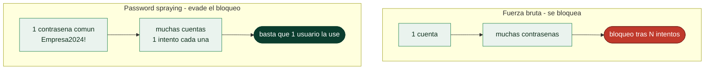

# Clase 081 — Ataques a credenciales: fuerza bruta y password spraying

> Parte: **3 — Hacking ético y pentesting** · Fuente: *The Hacker Playbook 3* (P. Kim) y *MITRE ATT&CK (Credential Access)*
> ⏱️ Duración estimada: **110 min** · Nivel: **Avanzado**

---

## 🎯 Objetivo

Atacar la autenticación en línea de servicios reales (SSH, RDP, SMB, web, correo) diferenciando **fuerza bruta**, **credential stuffing** y **password spraying**, y entendiendo cómo evitar bloqueos de cuenta. El foco es la eficacia con sigilo: probar pocas contraseñas muy probables contra muchos usuarios.

## 📚 Resultados de aprendizaje

Al finalizar, el alumno podrá:

1. **Distinguir** fuerza bruta, stuffing y spraying y cuándo usar cada uno.
2. **Ejecutar** ataques con Hydra, Medusa y CrackMapExec contra servicios de laboratorio.
3. **Diseñar** un password spraying que evite bloqueos por política de lockout.
4. **Construir** listas de usuarios y contraseñas contextuales.
5. **Recomendar** controles defensivos (MFA, lockout, detección).

## 🗺️ Temas

| # | Tema | Por qué importa |
|---|------|-----------------|
| 1 | Fuerza bruta vs. spraying | Spraying evita bloqueos por cuenta |
| 2 | Credential stuffing | Reutilización de credenciales filtradas |
| 3 | Políticas de lockout | Determinan la ventana segura de intentos |
| 4 | Hydra / Medusa | Ataque a múltiples protocolos |
| 5 | Spraying en AD | Contra Kerberos/SMB/OWA |
| 6 | Contraseñas contextuales | `Empresa2024!` es sorprendentemente común |
| 7 | Defensas: MFA y detección | Lo que realmente frena el ataque |

## 🧠 Explicación en profundidad

### El bloqueo de cuentas lo cambia todo

Atacar credenciales en línea —contra un portal, un servicio SMB, un Kerberos— choca con una
defensa sencilla y muy extendida: el **bloqueo por intentos fallidos**. Probar mil
contraseñas contra **una** cuenta la bloquea a los pocos intentos, genera alertas y no
consigue nada. Por eso la estrategia profesional invierte el problema, y esa inversión es el
concepto central de la clase.

La **fuerza bruta** clásica prueba muchas contraseñas contra **una** cuenta: rápida de
bloquear, ruidosa, poco útil en línea. El **password spraying** hace lo contrario: prueba
**una sola contraseña** (o muy pocas), plausible y común, contra **muchísimas** cuentas.
Como cada cuenta recibe un único intento, **no se dispara el bloqueo**, y basta con que
**una** persona de la organización use `Empresa2024!` para conseguir acceso. Es el ataque
que de verdad funciona contra directorios grandes, y el que explota la lista de usuarios
recolectada en la enumeración ([Clase 070](../070-enumeracion-smb-snmp-smtp-y-ldap/README.md)) y el OSINT ([Clase 068](../068-reconocimiento-pasivo-e-inteligencia-de-fuentes-abiertas/README.md)).



### Spraying, stuffing y contraseñas contextuales

Conviene distinguir tres ataques que se confunden. El **spraying** usa contraseñas
**adivinadas** por ser comunes o contextuales. El **credential stuffing** usa
credenciales **filtradas** de otras brechas (usuario y contraseña completos), apostando a
que la persona las **reutilizó** —de ahí el valor del recon de brechas de la [Clase 068](../068-reconocimiento-pasivo-e-inteligencia-de-fuentes-abiertas/README.md)—. Y
la **fuerza bruta** prueba combinaciones exhaustivamente. La eficacia del spraying descansa
en un hecho incómodo: las contraseñas **contextuales** son sorprendentemente comunes.
`Empresa2024!`, `Nombreciudad1`, el nombre de la compañía seguido del año y un signo,
`Bienvenido1` en cuentas recién creadas: cumplen las reglas de complejidad y por eso pasan la
política, pero son de las primeras que un atacante prueba. El *timing* también importa: el
spraying se hace **despacio**, respetando las ventanas de bloqueo (unos pocos intentos por
cuenta cada varias horas), para no acumular fallos que disparen la detección.

Las herramientas dependen del objetivo: **Hydra** y **Medusa** atacan multitud de protocolos
en línea (SSH, FTP, HTTP, RDP); contra Active Directory se usan herramientas específicas de
spraying sobre Kerberos, SMB u OWA, que además consultan la **política de contraseñas**
enumerada para calcular cuántos intentos son seguros antes de arriesgar un bloqueo.

### Lo que de verdad frena el ataque

La clase cierra por el lado defensivo, que es lo que el informe debe recomendar, porque las
contramedidas correctas son contraintuitivas. Endurecer la **política de complejidad** apenas
sirve: solo produce más `Password1!`, que el atacante ya prueba. Lo que funciona es distinto.
La **MFA** es la defensa decisiva: aunque el atacante acierte la contraseña, sin el segundo
factor no entra —convierte un spraying exitoso en un intento fallido—. La **detección de
patrones** de autenticación (muchos fallos de una misma IP contra muchas cuentas, o accesos
imposibles por geografía) caza el spraying que el bloqueo por cuenta no ve. Y comprobar las
contraseñas contra **listas de filtradas** en el momento de crearlas (el enfoque de NIST SP
800-63B) impide de raíz las que el atacante probaría primero. La conclusión que el pentester
lleva al cliente: la contraseña dejó de ser una defensa suficiente por sí sola, y el hallazgo
de esta clase casi siempre desemboca en "activad MFA".

## 📖 Definiciones y características

- **Fuerza bruta:** muchas contraseñas contra un usuario. Característica clave: dispara bloqueos de cuenta rápidamente.
- **Password spraying:** una o pocas contraseñas contra muchos usuarios. Característica clave: evita el lockout al no acumular fallos por cuenta.
- **Credential stuffing:** reutilizar pares usuario:contraseña filtrados. Característica clave: explota la reutilización de contraseñas entre servicios.
- **Lockout policy:** umbral de fallos que bloquea una cuenta. Característica clave: define cuántos intentos y en qué ventana son seguros.
- **Contraseña contextual:** basada en la organización/temporada (`Verano2024`). Característica clave: alta tasa de acierto en spraying.
- **MFA:** segundo factor de autenticación. Característica clave: neutraliza la mayoría de estos ataques aunque la contraseña sea correcta.

## 📔 Glosario

| Término | Definición concisa |
|---------|--------------------|
| Fuerza bruta en línea | Muchas contraseñas contra una cuenta; se bloquea |
| Bloqueo de cuenta | Defensa que congela la cuenta tras N fallos |
| Password spraying | Una contraseña común contra muchas cuentas; evade el bloqueo |
| Credential stuffing | Reutilizar credenciales filtradas de otras brechas |
| Contraseña contextual | `Empresa2024!` y similares; cumplen la política pero son obvias |
| Política de contraseñas | Umbral de bloqueo que dicta el ritmo del spraying |
| Low and slow | Atacar despacio para no disparar la detección |
| Hydra / Medusa | Herramientas de ataque a credenciales multiprotocolo |
| Spraying en AD | Contra Kerberos, SMB u OWA |
| MFA | Segundo factor; la defensa decisiva |
| Detección de patrones | Fallos masivos por IP o accesos geográficamente imposibles |
| Lista de filtradas | Rechazar contraseñas ya comprometidas al crearlas |
| NIST SP 800-63B | Guía que prioriza filtradas sobre reglas de composición |
| Complejidad inútil | Endurecer reglas solo produce variantes predecibles |

## 🧰 Herramientas y preparación

```bash
sudo apt install -y hydra medusa crackmapexec
```

Prepara listas: usuarios enumerados (clases 068/070) y contraseñas contextuales (nombre de empresa + año + símbolo). Objetivo: servicios de laboratorio propios (un SSH, un SMB, una web de prueba).

> ⚠️ **Nota ética:** los ataques a credenciales pueden **bloquear cuentas reales** y causar denegación de servicio. Ejecútalos **solo** en laboratorio o con autorización explícita, coordinando con el cliente para no dejar a usuarios fuera. Nunca uses credenciales filtradas contra servicios reales fuera del alcance.

## 🧪 Laboratorio guiado

1. Fuerza bruta controlada de SSH (un usuario, lista corta):

   ```bash
   hydra -l admin -P passwords.txt ssh://192.168.56.101 -t 4 -f
   ```

2. Password spraying en SMB con CrackMapExec (una contraseña, muchos usuarios):

   ```bash
   crackmapexec smb 192.168.56.20 -u usuarios.txt -p 'Empresa2024!' --continue-on-success
   ```

3. Ataque a formulario web con Hydra (http-post-form de laboratorio):

   ```bash
   hydra -L usuarios.txt -p 'Primavera2024!' 192.168.56.30 http-post-form "/login:user=^USER^&pass=^PASS^:Invalid"
   ```

4. Respeta el lockout: calcula intentos seguros (p. ej. 1 intento cada 30 min si el umbral es 5/30min).
5. Marca los éxitos y valida el acceso manualmente con las credenciales obtenidas.
6. Documenta usuarios comprometidos y la contraseña que funcionó.
7. Redacta la recomendación defensiva (MFA + lockout + alertas).

## ✍️ Ejercicios

1. Explica por qué el spraying evita bloqueos que la fuerza bruta provoca.
2. Diseña una lista de 10 contraseñas contextuales para una empresa ficticia.
3. Calcula una cadencia de spraying segura dada una política de 5 fallos por 15 minutos.
4. Ejecuta un stuffing con un par filtrado (de laboratorio) y explica el riesgo.
5. Compara Hydra y CrackMapExec para spraying en AD.
6. Enumera tres controles que hacen inviable el spraying.

## 📝 Reto verificable

Realiza un **password spraying** controlado en tu laboratorio que comprometa al menos una cuenta sin bloquear ninguna.

**Criterio de aceptación:** documentas la lista de usuarios, la(s) contraseña(s) probada(s), la cadencia respetando el lockout, al menos una credencial válida encontrada y verificada, y cero cuentas bloqueadas. Cierras con recomendaciones defensivas. Todo en entorno propio.

## ⚠️ Errores comunes

| Síntoma / mensaje | Causa y cómo arreglar |
|-------------------|-----------------------|
| Cuentas bloqueadas masivamente | Ataste demasiados intentos; usa spraying con cadencia |
| Hydra "child died" | Demasiados hilos (`-t`) para el servicio; reduce a 1-4 |
| http-post-form nunca acierta | Cadena de fallo (`Invalid`) mal elegida; inspecciona la respuesta real |
| CrackMapExec sin éxitos | Contraseña no contextual; ajusta a patrones de la organización |
| Bloqueado por MFA | La contraseña es correcta pero hay 2FA; documenta como control efectivo |

## ❓ Preguntas frecuentes

**❓ ¿Por qué el spraying es tan efectivo?**
Porque en cualquier organización grande, con una sola contraseña muy común (`Empresa2024!`) es probable que al menos un usuario la use. Al probar una contraseña contra todos, evitas bloqueos y consigues acceso.

**❓ ¿Cómo sé cuántos intentos son seguros?**
Necesitas conocer (o estimar) la política de lockout: umbral de fallos y ventana de observación. Mantente por debajo del umbral por cuenta y espaciando en el tiempo.

**❓ ¿MFA detiene estos ataques?**
En gran medida sí: aunque adivines la contraseña, el segundo factor bloquea el acceso. Por eso MFA es la recomendación número uno en el informe.

**❓ ¿Credential stuffing es legal en un pentest?**
Solo si las credenciales y los objetivos están dentro del alcance autorizado. Usar credenciales filtradas contra sistemas no autorizados es acceso ilícito.

## 🔗 Referencias

- Kim, P. *The Hacker Playbook 3* (2018).
- MITRE ATT&CK — T1110 Brute Force — <https://attack.mitre.org/techniques/T1110/>
- Hydra — <https://github.com/vanhauser-thc/thc-hydra>
- OWASP — Credential Stuffing Prevention — <https://cheatsheetseries.owasp.org/>

## 📥 Material descargable

- 📄 [Guía en PDF](./clase-081-guia.pdf) — versión imprimible de esta clase.
- 🎞️ [Presentación (PPTX)](./clase-081-presentacion.pptx) — deck para proyectar en clase.

## ⬅️ Clase anterior

[Clase 080 — Cracking de contraseñas con John y Hashcat](../080-cracking-de-contrasenas-con-john-y-hashcat/README.md)

## ➡️ Siguiente clase

[Clase 082 — Persistencia en sistemas comprometidos](../082-persistencia-en-sistemas-comprometidos/README.md)
