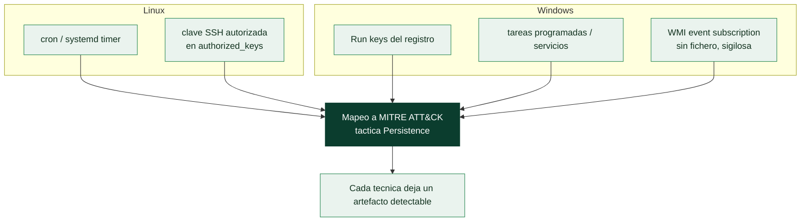

# Clase 082 — Persistencia en sistemas comprometidos

> Parte: **3 — Hacking ético y pentesting** · Fuente: *The Hacker Playbook 3* (P. Kim) y *MITRE ATT&CK (Persistence)*
> ⏱️ Duración estimada: **110 min** · Nivel: **Avanzado**

---

## 🎯 Objetivo

Establecer y documentar mecanismos de **persistencia** —mantener el acceso tras reinicios o cambios de credenciales— tanto en Linux como en Windows, entendiendo cómo los usan los atacantes reales y, sobre todo, cómo detectarlos. En un pentest, la persistencia se demuestra de forma controlada y se limpia al terminar.

## 📚 Resultados de aprendizaje

Al finalizar, el alumno podrá:

1. **Implementar** persistencia en Linux (cron, servicios, claves SSH, .bashrc).
2. **Implementar** persistencia en Windows (Run keys, tareas programadas, servicios).
3. **Reconocer** técnicas avanzadas (WMI event subscription, DLL hijacking) a nivel conceptual.
4. **Mapear** cada técnica a MITRE ATT&CK y a su método de detección.
5. **Limpiar** los mecanismos instalados al cerrar el engagement.

## 🗺️ Temas

| # | Tema | Por qué importa |
|---|------|-----------------|
| 1 | Persistencia Linux: cron y systemd | Reejecuta el acceso tras reinicio |
| 2 | Claves SSH autorizadas | Acceso sin contraseña, difícil de notar |
| 3 | Persistencia Windows: Run keys | Vector clásico y muy común |
| 4 | Tareas programadas y servicios | Ejecución con privilegios al arranque |
| 5 | WMI event subscription | Persistencia sigilosa y "fileless" |
| 6 | Mapeo a ATT&CK | Estandariza hallazgos y detección |
| 7 | Limpieza y responsabilidad | Un pentest no deja puertas abiertas |

## 🧠 Explicación en profundidad

### Mantener el acceso: por qué y con qué límites

Un acceso se puede perder: la máquina se reinicia, el proceso vulnerable se cierra, la
credencial usada caduca. La **persistencia** son las técnicas para **recuperar el acceso
automáticamente** sin volver a explotar desde cero. En un pentest tiene un doble propósito:
demostrar que un atacante real podría afianzarse (parte del impacto que se reporta) y, sobre
todo, **enseñar al equipo azul qué buscar**, porque cada técnica de persistencia deja un
artefacto detectable. La persistencia mapea a la táctica **Persistence** de MITRE ATT&CK, y
usar ese vocabulario conecta el hallazgo con la detección.



### Las técnicas, de la más ruidosa a la más sigilosa

En **Linux**, los mecanismos de arranque legítimos son el vehículo natural. Un **cron job** o
un **timer de systemd** reejecuta el acceso a intervalos o tras cada reinicio. Añadir una
**clave pública en `~/.ssh/authorized_keys`** es especialmente insidioso: da acceso remoto
sin contraseña, no genera fallos de autenticación y se confunde con una configuración
legítima, por lo que pasa desapercibido con facilidad. En **Windows**, las **Run keys** del
registro (`...\CurrentVersion\Run`) son el vector clásico —ejecutan un programa en cada
inicio de sesión— y por su ubicuidad son de lo primero que revisa Autoruns. Las **tareas
programadas** y los **servicios** ejecutan con privilegios en el arranque. Y la técnica más
sigilosa es la **suscripción a eventos WMI**: dispara código en respuesta a un evento del
sistema (por ejemplo, cada vez que arranca) **sin dejar un fichero en disco** —persistencia
*fileless*—, lo que la hace difícil de encontrar para quien busca binarios en vez de anomalías
en la configuración de WMI.

### La responsabilidad que define al profesional

Aquí la clase pone el acento en algo que no es técnico: **un pentest no deja puertas
abiertas**. Cada mecanismo de persistencia instalado durante el engagement debe quedar
**inventariado y eliminado** al terminar, y el informe debe documentar qué se puso, dónde y
cuándo se retiró. Dejar una clave SSH, una tarea programada o una suscripción WMI "olvidada"
tras el test es, en la práctica, dejar comprometido al cliente —y convierte al pentester en la
amenaza que vino a evaluar—. Por eso la persistencia se maneja con registro escrupuloso desde
el primer momento: no se instala nada de lo que no se lleve la cuenta.

El valor real de esta clase para el cliente es el **catálogo de dónde mirar**. Cada técnica se
entrega con su detección: revisar `authorized_keys` y crontabs en Linux; Autoruns, tareas
programadas y suscripciones WMI en Windows; y, transversalmente, vigilar la creación de
mecanismos de arranque como un evento de seguridad. La persistencia es, vista desde el azul, un
conjunto de lugares concretos que un EDR y un analista deben monitorizar, y ese mapa es el
entregable.

## 📖 Definiciones y características

- **Persistencia:** capacidad de recuperar el acceso tras reinicios o rotación de credenciales. Característica clave: convierte un acceso efímero en duradero.
- **Cron/systemd timer:** ejecución programada en Linux. Característica clave: reejecuta un payload periódicamente o al arranque.
- **authorized_keys:** clave pública que permite login SSH sin contraseña. Característica clave: sobrevive a cambios de contraseña.
- **Run key (registro):** valor en `HKCU/HKLM\...\Run` que se ejecuta al iniciar sesión. Característica clave: vector de persistencia Windows más habitual.
- **WMI event subscription:** persistencia basada en eventos WMI. Característica clave: no deja archivos ("fileless"), difícil de detectar.
- **Limpieza (cleanup):** eliminación de artefactos al finalizar. Característica clave: obligación ética y contractual del pentester.

## 📔 Glosario

| Término | Definición concisa |
|---------|--------------------|
| Persistencia | Recuperar el acceso automáticamente sin reexplotar |
| MITRE ATT&CK Persistence | Táctica que cataloga estas técnicas |
| cron / systemd timer | Reejecución programada en Linux |
| authorized_keys | Clave SSH que da acceso sin contraseña |
| Run keys | Claves del registro que ejecutan en el inicio de sesión |
| Tarea programada | Ejecución con privilegios al arranque en Windows |
| Servicio | Proceso privilegiado que arranca con el sistema |
| WMI event subscription | Persistencia fileless disparada por eventos |
| Fileless | Sin artefacto en disco; se busca en memoria y configuración |
| Autoruns | Herramienta de Sysinternals que lista puntos de auto-arranque |
| Artefacto detectable | Rastro que cada técnica deja para el defensor |
| Inventario de persistencia | Registro de lo instalado para poder retirarlo |
| Limpieza | Eliminar toda persistencia al cerrar el engagement |
| Catálogo de detección | El mapa de dónde mirar que se entrega al cliente |

## 🧰 Herramientas y preparación

- Metasploit (`post/*/manage/persistence*`), scripts nativos, y para Windows: `schtasks`, `reg`, `sc`.
- Un registro (log) donde apuntes **cada** artefacto que instalas para poder revertirlo.

> ⚠️ **Nota ética:** la persistencia deja mecanismos de acceso en un sistema. Instálala **solo** en laboratorio propio o con autorización explícita, documenta cada cambio y **elimínalo todo** al cerrar el engagement. Dejar persistencia sin limpiar es negligencia grave y potencialmente ilegal.

## 🧪 Laboratorio guiado

Registra cada acción en un "cleanup log" para revertirla después.

1. Persistencia Linux con cron:

   ```bash
   (crontab -l 2>/dev/null; echo "*/10 * * * * /tmp/.beacon.sh") | crontab -
   ```

2. Clave SSH autorizada:

   ```bash
   echo "ssh-ed25519 AAAA... atacante" >> ~/.ssh/authorized_keys
   ```

3. Persistencia Windows con Run key:

   ```text
   reg add HKCU\Software\Microsoft\Windows\CurrentVersion\Run /v Updater /t REG_SZ /d "C:\Users\Public\upd.exe" /f
   ```

4. Tarea programada Windows:

   ```text
   schtasks /create /tn "Sync" /tr "C:\Users\Public\upd.exe" /sc onlogon /f
   ```

5. Mapea cada técnica a su ID de ATT&CK (T1053 tareas, T1547 autostart, T1098 cuentas).
6. Verifica que la persistencia funciona reiniciando la VM de laboratorio.
7. **Limpieza:** elimina cron, clave SSH, Run key y tarea, y confirma que no queda nada:

   ```bash
   crontab -r
   ```

   ```text
   reg delete HKCU\...\Run /v Updater /f
   schtasks /delete /tn "Sync" /f
   ```

## ✍️ Ejercicios

1. Instala y luego elimina una persistencia por cron, documentando ambos pasos.
2. Añade una clave SSH autorizada y explica por qué es difícil de detectar.
3. Crea una tarea programada Windows `onlogon` y verifícala con `schtasks /query`.
4. Mapea cinco técnicas de persistencia a sus IDs de MITRE ATT&CK.
5. Explica cómo un defensor detecta cambios en las Run keys.
6. Redacta un "cleanup log" modelo con columnas: técnica, artefacto, comando de reversión.

## 📝 Reto verificable

Implementa **una persistencia por sistema operativo** (Linux y Windows) en tu laboratorio, verifica que sobreviven a un reinicio y **límpialas** por completo.

**Criterio de aceptación:** demuestras que ambas persistencias reactivan el acceso tras reiniciar; presentas un cleanup log con el comando de reversión de cada una; tras la limpieza, una comprobación muestra que no queda ningún artefacto. Todo en entorno propio.

## ⚠️ Errores comunes

| Síntoma / mensaje | Causa y cómo arreglar |
|-------------------|-----------------------|
| La persistencia no reactiva | Ruta o permisos del payload; verifica que exista y sea ejecutable |
| `crontab -r` borra todo el crontab | Cuidado: elimina TODAS las tareas; edita en vez de borrar si hay legítimas |
| Run key ejecuta pero sin sesión | LHOST/handler no disponibles; ten el listener activo |
| Tarea no corre `onlogon` | Trigger o usuario incorrectos; revisa con `schtasks /query /v` |
| Olvidas limpiar un artefacto | Sin cleanup log; documenta SIEMPRE cada cambio |

## ❓ Preguntas frecuentes

**❓ ¿Por qué demostrar persistencia en un pentest?**
Porque muestra al cliente el impacto real: un atacante no solo entra, se queda. Ayuda a justificar inversiones en detección y respuesta. Pero se hace de forma controlada y reversible.

**❓ ¿Cuál es la técnica de persistencia más común?**
En Windows, las Run keys y las tareas programadas; en Linux, cron y claves SSH. Son fáciles de implementar y, si no se monitorizan, pasan desapercibidas.

**❓ ¿Qué es una persistencia "fileless"?**
Una que no deja archivos en disco, como las suscripciones a eventos WMI o el uso del registro para almacenar payloads. Son más difíciles de detectar por antivirus tradicionales.

**❓ ¿Qué pasa si olvido limpiar una persistencia?**
Es una falta grave: dejas una puerta trasera real. Por eso se lleva un cleanup log riguroso y se verifica la eliminación antes de cerrar el engagement.

## 🔗 Referencias

- Kim, P. *The Hacker Playbook 3* (2018).
- MITRE ATT&CK — TA0003 Persistence — <https://attack.mitre.org/tactics/TA0003/>
- MITRE ATT&CK — T1547 Boot or Logon Autostart — <https://attack.mitre.org/techniques/T1547/>
- Microsoft — Autoruns (Sysinternals) — <https://learn.microsoft.com/sysinternals/downloads/autoruns>

## 📥 Material descargable

- 📄 [Guía en PDF](./clase-082-guia.pdf) — versión imprimible de esta clase.
- 🎞️ [Presentación (PPTX)](./clase-082-presentacion.pptx) — deck para proyectar en clase.

## ⬅️ Clase anterior

[Clase 081 — Ataques a credenciales: fuerza bruta y password spraying](../081-ataques-a-credenciales-fuerza-bruta-y-password-spraying/README.md)

## ➡️ Siguiente clase

[Clase 083 — Exfiltración de datos](../083-exfiltracion-de-datos/README.md)
