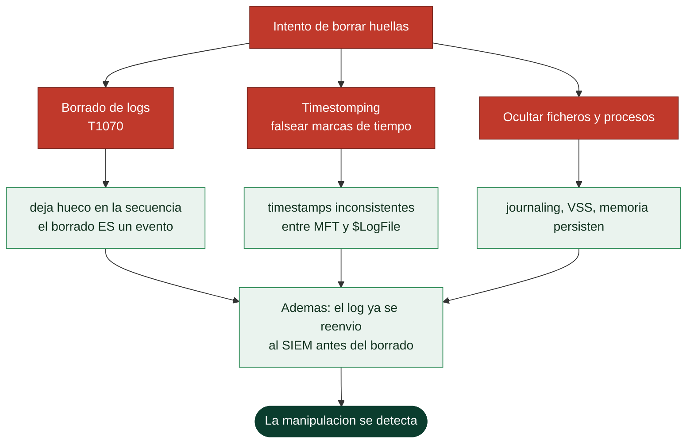

# Clase 084 — Anti-forense y borrado de huellas (concepto y límites)

> Parte: **3 — Hacking ético y pentesting: metodología** · Fuente: MITRE ATT&CK — táctica *Defense Evasion* (TA0005) · *The Art of Memory Forensics* (Ligh et al.) para la perspectiva defensiva
> ⏱️ Duración estimada: **110 min** · Nivel: **Avanzado**

---

> ⚠️ **Enfoque defensivo y ético.** Esta clase explica el **concepto** de anti-forense para que un analista de DFIR y un pentester honesto entiendan *qué buscar* y *por qué la evidencia a veces está incompleta*. **No** es una guía para destruir evidencia. En un pentest ético, el consultor **no borra logs ni oculta su actividad**: al contrario, coordina con el cliente y documenta todo. Manipular o destruir registros en un sistema ajeno, o para obstruir una investigación, es delito.

## 🎯 Objetivo

Entender las técnicas anti-forense (borrado de logs, timestomping, cifrado, wiping, ocultación) **desde el punto de vista del defensor**: reconocer sus indicios, comprender sus límites (qué casi nunca se puede borrar del todo) y usar ese conocimiento para diseñar telemetría resistente a manipulación. El mensaje central: en un engagement legítimo, la transparencia es un requisito contractual, no una debilidad.

## 📚 Resultados de aprendizaje

Al finalizar, el alumno podrá:

1. **Enumerar** las categorías de técnicas anti-forense y ubicarlas en MITRE ATT&CK (Defense Evasion, Indicator Removal T1070).
2. **Reconocer** los indicios que dejan (gaps en logs, timestamps inconsistentes, entradas faltantes) durante una investigación.
3. **Explicar** por qué el borrado rara vez es completo (copias, journaling, memoria, telemetría centralizada).
4. **Diseñar** controles que hacen la evidencia resistente: reenvío de logs, WORM, monitoreo de integridad.
5. **Argumentar** por qué el pentester ético documenta y preserva, en lugar de ocultar, su actividad.

## 🗺️ Temas

| # | Tema | Por qué importa |
|---|---|---|
| 1 | Categorías anti-forense | Da un mapa mental para la detección. |
| 2 | Borrado de logs (T1070) y sus rastros | El propio borrado es un evento detectable. |
| 3 | Timestomping | Timestamps inconsistentes delatan manipulación. |
| 4 | Por qué el borrado es incompleto | Journaling, $LogFile, VSS, memoria, SIEM. |
| 5 | Telemetría resistente a manipulación | Reenvío inmediato + almacenamiento inmutable. |
| 6 | Ética del engagement | El consultor preserva evidencia, no la destruye. |

## 🧠 Explicación en profundidad

### Por qué se estudia esto, y con qué honestidad

El anti-forense agrupa las técnicas para **borrar o falsear las huellas** de una intrusión.
Se estudia en un curso de seguridad defensiva por una razón precisa: **entender cómo se
intenta borrar el rastro es lo que enseña a diseñar telemetría que no se pueda borrar**. La
clase se aborda desde esa óptica —conocer el ataque para construir la defensa— y con una tesis
que la recorre entera: **el borrado casi nunca es completo, y el propio intento de borrar es un
evento detectable**.

MITRE ATT&CK cataloga esto bajo *Defense Evasion*, y da un mapa mental útil de las categorías:
destruir datos (borrar logs), ocultarlos (esconder ficheros y procesos), falsearlos
(manipular marcas de tiempo) y minimizar la huella desde el principio (operar en memoria, sin
tocar disco). Tener ese mapa organiza tanto el ataque como su detección.



### Borrar y falsear: por qué siempre queda rastro

El **borrado de logs** (T1070) es lo primero que intenta un atacante, y es también uno de los
indicadores más fuertes de compromiso, por una paradoja: **el borrado deja un hueco**. Una
secuencia de eventos que salta números, un log que se vacía de golpe, un `wevtutil cl` o un
`> /var/log/auth.log` son en sí mismos eventos que un sistema de detección registra. El
**timestomping** —falsear las marcas de tiempo de un fichero para que parezca antiguo o
legítimo— falla de forma parecida: los sistemas de ficheros modernos guardan los tiempos en
**varios sitios** (en NTFS, tanto en la entrada `$STANDARD_INFORMATION` como en
`$FILE_NAME` de la MFT), y la incoherencia entre ellos delata la manipulación.

La razón de fondo por la que el borrado es incompleto es que los datos persisten en lugares
que el atacante no controla fácilmente: el **journaling** del sistema de ficheros (`$LogFile`
en NTFS, el journal de ext4), las **instantáneas de volumen** (VSS en Windows), la **memoria**
—que un volcado captura, con procesos, conexiones y claves que ya no están en disco— y, sobre
todo, **cualquier log que ya se haya reenviado fuera del sistema**. Ese es el punto decisivo.

### La defensa que gana la partida: telemetría fuera del alcance del atacante

Todo lo anterior converge en una conclusión de diseño defensivo: **si los logs se reenvían de
inmediato a un sistema central e inmutable, borrarlos en el host ya no sirve de nada**. El
atacante que compromete una máquina puede vaciar sus logs locales, pero no puede tocar los que
ya llegaron al SIEM. Por eso el reenvío inmediato de logs, el almacenamiento *append-only* (que
no permite modificar ni borrar lo escrito) y la separación de privilegios entre el host y el
recolector son las contramedidas reales contra todo el anti-forense. La lección para el
arquitecto es clara: no confíes la evidencia al sistema que estás vigilando.

Y el cierre es ético, y marca la diferencia de un consultor profesional. En un pentest
autorizado, el consultor **preserva la evidencia, no la destruye**: documenta lo que hizo, no
borra sus propias huellas, y si en el transcurso del trabajo descubre indicios de una intrusión
**real y previa**, los conserva y los escala, porque destruir esa evidencia sería sabotear una
posible investigación. El anti-forense se estudia para defenderse de él, no para practicarlo
sobre el cliente.

## 📖 Definiciones y características

**Anti-forense**
: Conjunto de técnicas orientadas a dificultar el análisis forense. Característica clave para el defensor: casi todas dejan *su propio* rastro (una ausencia sospechosa es, en sí, un indicador).

**Indicator Removal (T1070)**
: Técnica ATT&CK de eliminación de artefactos (logs, historiales, archivos). En Windows, borrar el *Security Event Log* genera el propio Event ID 1102 ("audit log cleared").

**Timestomping**
: Modificación de las marcas de tiempo (MACE) de un archivo para despistar. Se detecta comparando los timestamps de `$STANDARD_INFORMATION` con `$FILE_NAME` en NTFS, que suelen divergir tras la manipulación.

**Log forwarding (reenvío de logs)**
: Envío inmediato de los eventos a un colector central (SIEM/syslog). Contramedida clave: aunque el atacante borre el log local, la copia central ya salió.

**WORM / almacenamiento inmutable**
: *Write Once, Read Many*. Medio donde los registros no pueden alterarse una vez escritos; hace inútil el borrado local.

## 📔 Glosario

| Término | Definición concisa |
|---------|--------------------|
| Anti-forense | Técnicas para borrar o falsear las huellas de una intrusión |
| MITRE ATT&CK Defense Evasion | Táctica que cataloga estas técnicas |
| Borrado de logs (T1070) | Eliminar registros; deja un hueco detectable |
| Timestomping | Falsear las marcas de tiempo de un fichero |
| MFT | Tabla maestra de ficheros de NTFS; guarda varios timestamps |
| $STANDARD_INFORMATION / $FILE_NAME | Atributos NTFS cuya incoherencia delata manipulación |
| Journaling | Registro del sistema de ficheros que persiste cambios |
| VSS | Instantáneas de volumen de Windows |
| Volcado de memoria | Captura de RAM con datos ausentes del disco |
| Reenvío inmediato de logs | Enviar los registros fuera antes de que se borren |
| Almacenamiento append-only | Inmutable: no permite modificar ni borrar |
| SIEM | Sistema central de eventos, fuera del alcance del atacante |
| Telemetría resistente | Registro que la manipulación local no puede alterar |
| Preservación de evidencia | Deber ético del consultor; no destruir huellas |

## 🧰 Herramientas y preparación

Enfoque de análisis, en tu laboratorio: un colector de logs (rsyslog/Wazuh/Elastic) recibiendo eventos de una VM propia, y herramientas forenses de lectura (Autopsy, análisis de `$MFT`, `Get-WinEvent`). No se practican técnicas destructivas; se **observa** cómo un colector central preserva la evidencia que un borrado local intentaría eliminar.

## 🧪 Laboratorio guiado (defensivo)

> Objetivo: comprobar que una arquitectura de logging bien diseñada resiste el borrado local. Todo en VMs tuyas.

1. **Montar reenvío de logs.** Configura una VM Linux propia para enviar sus logs en tiempo real a un colector central (otra VM tuya):

   ```bash
   # /etc/rsyslog.d/90-forward.conf (VM origen)
   *.*  @@<IP_colector>:514      # TCP a tu colector de laboratorio
   ```

2. **Generar actividad.** Realiza acciones normales (login, sudo) para poblar `/var/log/auth.log` y confirma que llegan al colector.
3. **Simular el borrado local.** En la VM origen (tuya), trunca el log local para ver el efecto:

   ```bash
   sudo truncate -s 0 /var/log/auth.log    # solo en tu VM de estudio
   ```

4. **Verificar la resiliencia.** Comprueba en el **colector** que los eventos previos siguen presentes: el borrado local no los alcanzó. Ese es el control que quieres en producción.
5. **Detección en Windows.** En una VM Windows propia, revisa cómo el propio acto de limpiar el log deja rastro:

   ```powershell
   Get-WinEvent -FilterHashtable @{LogName='Security'; Id=1102} | Format-List
   ```

6. **Timestomping — detección.** Analiza el `$MFT` de un archivo cuyo timestamp fue modificado y observa la divergencia `$SI` vs `$FN`. Documenta la firma.
7. **Redactar recomendaciones.** Egress de logs, almacenamiento inmutable, alertas sobre Event ID 1102 y sobre gaps de logging.

## ✍️ Ejercicios

1. Explica por qué borrar el Security log de Windows es contraproducente para un atacante sigiloso.
2. Enumera tres lugares donde la evidencia "borrada" suele sobrevivir (journaling, VSS, memoria, SIEM).
3. Diseña una alerta que dispare cuando un host **deja** de enviar logs (silencio anómalo).
4. Describe cómo detectar timestomping en NTFS.
5. Argumenta, para un contrato de pentest, por qué el consultor **no** debe borrar sus huellas y qué cláusula lo regula.

## 📝 Reto verificable

Demuestra que tu arquitectura de logging preserva evidencia pese a un borrado local.

**Criterio de aceptación:** entregas (a) la config de reenvío, (b) evidencia en el colector de eventos anteriores al truncado local, y (c) una regla/alerta que detecta el Event ID 1102 o el silencio de un host. Sin ejecutar técnicas destructivas fuera de tu VM.

## ⚠️ Errores comunes

| Síntoma / mensaje | Causa y cómo arreglar |
|---|---|
| Creer que `truncate`/`wevtutil cl` elimina toda la evidencia | Falso: el reenvío central y el journaling conservan copias. Diseña logging centralizado. |
| No alertar sobre el Event ID 1102 | Es una señal de oro. Añádelo a tu SIEM como detección de alta prioridad. |
| Pentester que "limpia" logs en un engagement | Viola el contrato y la ley. El consultor documenta y preserva; coordina cualquier limpieza con el cliente. |
| Confiar solo en logs locales | Manipulables. Reenvía a almacenamiento inmutable (WORM). |
| Ignorar los gaps de logging | Una ausencia inexplicable de eventos es, en sí, un indicador de compromiso. |

## ❓ Preguntas frecuentes

**❓ ¿El anti-forense hace la evidencia irrecuperable?**
Casi nunca por completo. Journaling del sistema de archivos, Volume Shadow Copies, memoria RAM y, sobre todo, la telemetría ya enviada al SIEM suelen conservar rastros.

**❓ ¿Un pentester ético borra sus huellas?**
No. El engagement exige transparencia y trazabilidad; borrar registros obstruiría la capacidad del cliente de auditar y aprendería nada. Toda acción se registra en el informe.

**❓ ¿Cuál es la mejor defensa contra la manipulación de logs?**
Reenvío inmediato a un colector central con almacenamiento inmutable y alertas sobre eventos de limpieza y sobre silencios anómalos.

## 🔗 Referencias

- MITRE ATT&CK — [Indicator Removal (T1070)](https://attack.mitre.org/techniques/T1070/) · [Defense Evasion (TA0005)](https://attack.mitre.org/tactics/TA0005/)
- Ligh, Case, Levy, Walters — *The Art of Memory Forensics*.
- Carrier, B. — *File System Forensic Analysis* (journaling y $MFT).
- Microsoft — documentación del Event ID 1102 (audit log cleared).

## 📥 Material descargable

- 📄 [Guía en PDF](./clase-084-guia.pdf) — versión imprimible de esta clase.
- 🎞️ [Presentación (PPTX)](./clase-084-presentacion.pptx) — deck para proyectar en clase.

## ⬅️ Clase anterior

[Clase 083 — Exfiltración de datos](../083-exfiltracion-de-datos/README.md)

## ➡️ Siguiente clase

[Clase 085 — Reporte profesional de pentest](../085-reporte-profesional-de-pentest/README.md)
