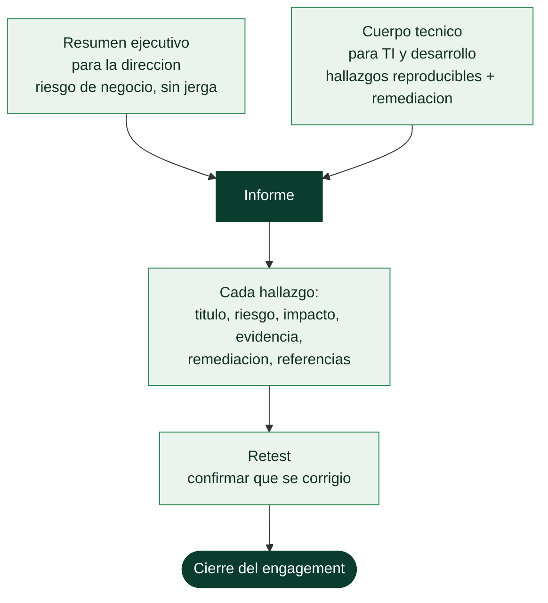

# Clase 085 — Reporte profesional de pentest

> Parte: **3 — Hacking ético y pentesting: metodología** · Fuente: *Penetration Testing* (Weidman) · PTES — *Reporting* · CVSS v3.1/v4.0 (FIRST)
> ⏱️ Duración estimada: **120 min** · Nivel: **Intermedio**

---

## 🎯 Objetivo

Aprender a convertir un engagement técnico en un **entregable de valor**: un informe que la dirección entiende y el equipo técnico puede accionar. El reporte es el producto final por el que paga el cliente; un hallazgo brillante mal comunicado no se arregla nunca. Cubrimos estructura, priorización por riesgo (CVSS + contexto de negocio), evidencia reproducible y recomendaciones accionables.

## 📚 Resultados de aprendizaje

Al finalizar, el alumno podrá:

1. **Estructurar** un informe profesional con resumen ejecutivo, metodología, hallazgos y anexos.
2. **Escribir** un resumen ejecutivo orientado a negocio, sin jerga, en menos de una página.
3. **Puntuar** vulnerabilidades con CVSS y **ajustar** la prioridad al contexto del cliente (activo crítico vs entorno de pruebas).
4. **Documentar** cada hallazgo con impacto, evidencia reproducible, y remediación priorizada.
5. **Evitar** los errores que restan credibilidad: falsos positivos, capturas ilegibles, recomendaciones genéricas.

## 🗺️ Temas

| # | Tema | Por qué importa |
|---|---|---|
| 1 | Anatomía del informe | Cada sección tiene un lector distinto. |
| 2 | Resumen ejecutivo | Es lo único que leerá la dirección. |
| 3 | Puntuación de riesgo (CVSS + negocio) | Priorizar mal desperdicia el presupuesto de remediación. |
| 4 | Estructura de un hallazgo | Título, riesgo, impacto, evidencia, remediación, referencias. |
| 5 | Evidencia reproducible | Sin pasos claros, el cliente no puede verificar ni corregir. |
| 6 | Remediación accionable | El objetivo real del pentest es que se arregle. |
| 7 | Retest y cierre | Confirmar que las correcciones funcionan. |

## 🧠 Explicación en profundidad

### El informe es el producto, no el resto

Un pentester profesional no vende accesos: vende un **informe**. Todo lo anterior —el recon,
la explotación, la escalada, el pivoting— es materia prima que solo adquiere valor cuando se
convierte en un documento que el cliente puede **usar para reducir su riesgo**. Un acceso a
Domain Admin perfectamente logrado pero mal documentado no vale nada; un hallazgo medio bien
explicado, con su evidencia y su remediación, sí. Esta es la clase que cierra la parte porque
es donde el trabajo se transforma en resultado, y donde muchos técnicos brillantes fallan.

La clave que organiza todo el informe es que tiene **lectores distintos con necesidades
distintas**, y una sola redacción no sirve para todos.

### El resumen ejecutivo: lo único que leerá la dirección

La primera sección, el **resumen ejecutivo**, es la más importante y la que peor se suele
escribir. Va dirigida a la dirección —gente que decide presupuestos, no que aplica parches— y
por tanto **no lleva jerga técnica**: no dice "SMBv1 con MS17-010", dice "un atacante en la red
podría tomar el control de todos los equipos de la empresa en menos de una hora, con impacto
directo sobre la continuidad del negocio y los datos de clientes". Traduce el riesgo técnico a
**riesgo de negocio** —dinero, reputación, cumplimiento, continuidad— porque es lo único que
la dirección puede accionar. Si esta página no convence a quien firma el presupuesto de
remediación, el resto del informe no se financia.

### La anatomía de un hallazgo, y la puntuación honesta

El cuerpo técnico se compone de **hallazgos**, cada uno con una estructura fija que hace el
informe utilizable: **título** claro, **puntuación de riesgo**, **impacto** (qué permite
realmente), **evidencia reproducible**, **remediación** y **referencias**. Dos piezas merecen
énfasis. La **puntuación de riesgo** no es solo el CVSS (la [Clase 071](../071-analisis-de-vulnerabilidades-con-nessus-y-openvas/README.md)): el CVSS base da la
severidad técnica, pero el riesgo real combina eso con el **contexto de negocio** —una crítica
en un sistema aislado sin datos puede importar menos que una media en el servidor de
facturación—. Priorizar mal desperdicia el presupuesto de remediación del cliente en lo que no
importa. La **evidencia reproducible** es lo que distingue un informe profesional de una lista
de afirmaciones: los pasos exactos, los comandos y las capturas que permiten al cliente
**verificar** el hallazgo y confirmar que su corrección funcionó. Sin reproducibilidad, el
cliente no puede ni creer ni arreglar.

### Remediación y retest: el objetivo real

Un pentest cuyo informe no lleva a que se **arregle** algo ha fracasado, por brillante que
fuera técnicamente. Por eso cada hallazgo termina en una **remediación accionable**: no "aplique
las mejores prácticas", sino "deshabilite SMBv1 mediante esta política, aplique el parche
MS17-010, y segmente el servidor X de la red Y". Cuanto más concreta y realista sea —teniendo en
cuenta lo que el cliente puede hacer—, más probable es que se ejecute. Y el ciclo se cierra con
el **retest**: volver, tras un plazo, a comprobar que las correcciones funcionan de verdad y no
introdujeron nuevos problemas. Ese cierre es lo que convierte el pentest de un ejercicio
puntual en una mejora medible de la seguridad, y lo que fideliza al cliente. El informe, en
suma, no es el trámite final del trabajo: es el trabajo, y las diecinueve clases anteriores solo
existen para llenarlo de contenido verificable.

## 📖 Definiciones y características

**Resumen ejecutivo**
: Sección de 1 página para la dirección: postura general de riesgo, hallazgos clave en lenguaje de negocio y recomendación estratégica. Característica clave: **sin jerga técnica** ni comandos.

**CVSS (Common Vulnerability Scoring System)**
: Estándar de la FIRST para puntuar la severidad (0–10). Da una base objetiva, pero debe **ajustarse** con el contexto (exposición real, valor del activo, controles compensatorios).

**Hallazgo (finding)**
: Unidad del informe que describe una debilidad concreta. Característica clave: es *autocontenido* — se entiende sin leer el resto del documento.

**Evidencia reproducible**
: Pasos, comandos y capturas que permiten al cliente **reproducir y verificar** el hallazgo. Sin ella, un hallazgo es una afirmación no comprobable.

**Retest**
: Verificación posterior de que las remediaciones aplicadas cierran efectivamente los hallazgos reportados.

## 📔 Glosario

| Término | Definición concisa |
|---------|--------------------|
| Informe | El producto real del pentest; lo que el cliente compra |
| Resumen ejecutivo | Sección para la dirección; riesgo de negocio, sin jerga |
| Cuerpo técnico | Sección para TI y desarrollo; hallazgos y remediación |
| Riesgo de negocio | Impacto en dinero, reputación, cumplimiento, continuidad |
| Hallazgo | Unidad del informe con estructura fija |
| Puntuación de riesgo | CVSS combinado con el contexto de negocio |
| Impacto | Lo que el hallazgo permite hacer realmente |
| Evidencia reproducible | Pasos y pruebas que permiten verificar el hallazgo |
| Remediación accionable | Corrección concreta y realista, no genérica |
| Referencias | Fuentes que respaldan hallazgo y remediación |
| Priorización | Ordenar por riesgo real para no malgastar recursos |
| Retest | Volver a comprobar que las correcciones funcionan |
| Cierre del engagement | Fin formal: informe entregado y correcciones verificadas |
| Trazabilidad | Cada afirmación respaldada por evidencia registrada |

## 🧰 Herramientas y preparación

Una plantilla de informe (Markdown/LaTeX/Word), un sistema para gestionar hallazgos (incluso una hoja de cálculo con CVSS), la calculadora CVSS de FIRST y las capturas/logs recopilados durante el engagement. Opcional: herramientas de reporting como Dradis o PlexTrac para equipos.

## 🧪 Laboratorio guiado

> Ejercicio de redacción a partir de un hallazgo de laboratorio (p. ej., una SQLi encontrada en tu propia instancia de DVWA en clases previas).

1. **Redacta el resumen ejecutivo.** Una página, sin jerga: ¿cuál es el riesgo para el negocio? ¿qué tres cosas debe hacer la dirección?
2. **Describe la metodología.** Alcance, ventana temporal, enfoque (caja negra/gris/blanca), limitaciones.
3. **Documenta un hallazgo completo** usando esta estructura:
   - **Título** claro (p. ej. "Inyección SQL en el login permite acceso no autenticado").
   - **Severidad**: calcula el vector CVSS y ajústalo (¿el activo es crítico? ¿está expuesto a internet?).
   - **Impacto de negocio**: qué pasaría si se explota (fuga de datos de clientes, etc.).
   - **Evidencia reproducible**: petición/comando exacto + captura legible.
   - **Remediación**: consultas parametrizadas, WAF como mitigación temporal, referencia OWASP.
   - **Referencias**: OWASP, CWE.
4. **Prioriza.** Ordena una lista de 5 hallazgos ficticios por riesgo real (no solo por CVSS bruto).
5. **Define el retest.** Especifica cómo se verificará que cada corrección funcionó.
6. **Revisa la calidad.** Verifica que no queden falsos positivos, que las capturas sean legibles y que cada recomendación sea específica.

## ✍️ Ejercicios

1. Escribe un resumen ejecutivo de 200 palabras para una audiencia no técnica a partir de 3 hallazgos.
2. Calcula el CVSS v3.1 de una SQLi no autenticada expuesta a internet y justifica cada métrica.
3. Reescribe una recomendación genérica ("mejorar la seguridad") en una accionable y específica.
4. Toma una captura de pantalla de una prueba y anótala (resaltar el dato clave) para que sea autoexplicativa.
5. Diseña la tabla resumen de hallazgos (título, severidad, estado) para la primera página técnica.

## 📝 Reto verificable

Redacta un mini-informe (resumen ejecutivo + 2 hallazgos completos + tabla de priorización) sobre vulnerabilidades encontradas en tu propio laboratorio.

**Criterio de aceptación:** el resumen ejecutivo no contiene jerga técnica; cada hallazgo tiene CVSS justificado, evidencia reproducible y remediación específica con referencia; la priorización considera contexto de negocio, no solo el número CVSS.

## ⚠️ Errores comunes

| Síntoma / mensaje | Causa y cómo arreglar |
|---|---|
| Resumen ejecutivo lleno de comandos y CVEs | La dirección no lo entiende. Reescríbelo en lenguaje de impacto de negocio. |
| Pegar la salida cruda de un escáner como "hallazgos" | Genera falsos positivos y desconfianza. Valida y contextualiza cada uno manualmente. |
| Capturas ilegibles o sin anotar | El cliente no ve el punto. Recorta, resalta y explica cada evidencia. |
| Recomendaciones genéricas | "Aplicar parches" no ayuda. Sé específico: qué versión, qué configuración, qué línea. |
| Priorizar solo por CVSS bruto | Un CVSS 9 en un entorno aislado importa menos que un 6 en el core expuesto. Ajusta al contexto. |
| No planificar el retest | Sin verificación, no sabes si el riesgo se cerró. Inclúyelo en el alcance. |

## ❓ Preguntas frecuentes

**❓ ¿Qué es lo más importante del informe?**
El resumen ejecutivo y la calidad/priorización de los hallazgos. Es lo que decide si la organización actúa.

**❓ ¿CVSS es suficiente para priorizar?**
No. Es una base objetiva, pero hay que ajustarla con exposición real, valor del activo y controles compensatorios del cliente.

**❓ ¿Debo incluir los hallazgos "informativos" o de bajo riesgo?**
Sí, en un anexo. Aportan valor sin inflar la lista crítica, y muestran la profundidad del trabajo.

**❓ ¿El informe es el final del engagement?**
Casi. Suele haber una reunión de presentación y, tras la remediación, un **retest** para confirmar el cierre de los hallazgos.

## 🔗 Referencias

- PTES — [Reporting](http://www.pentest-standard.org/index.php/Reporting)
- FIRST — [CVSS Specification & Calculator](https://www.first.org/cvss/)
- Weidman, G. — *Penetration Testing*, capítulo de reporting.
- OWASP — [Web Security Testing Guide (WSTG) — Reporting](https://owasp.org/www-project-web-security-testing-guide/)

## 📥 Material descargable

- 📄 [Guía en PDF](./clase-085-guia.pdf) — versión imprimible de esta clase.
- 🎞️ [Presentación (PPTX)](./clase-085-presentacion.pptx) — deck para proyectar en clase.

## ⬅️ Clase anterior

[Clase 084 — Anti-forense y borrado de huellas (concepto y límites)](../084-anti-forense-y-borrado-de-huellas-concepto-y-limites/README.md)

## ➡️ Siguiente clase

[Clase 086 — Arquitectura web moderna y superficie de ataque](../../parte-4-seguridad-de-aplicaciones-web/086-arquitectura-web-moderna-y-superficie-de-ataque/README.md)
