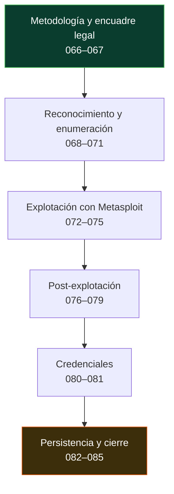

# 🎯 Parte 3 — Hacking ético y pentesting: metodología

> [⬅️ Volver al programa](../../README.md) · [📚 Índice completo](../README.md) · [⏭️ Parte siguiente](../parte-4-seguridad-de-aplicaciones-web/README.md)

PTES, recon, enumeración, explotación, post-explotación y reporte

**Fuentes de referencia de esta parte:**

- **Peter Kim** — *The Hacker Playbook 3: Practical Guide to Penetration Testing* (2018).
- **Georgia Weidman** — *Penetration Testing: A Hands-On Introduction to Hacking* (No Starch Press, 2014).
- **OccupyTheWeb** — *Linux Basics for Hackers* (No Starch Press, 2018).
- **PTES** — *Penetration Testing Execution Standard* (<http://www.pentest-standard.org>).
- **OWASP** — *Web Security Testing Guide* y *Penetration Testing Methodologies*.
- **MITRE ATT&CK** — matriz de tácticas y técnicas adversarias (<https://attack.mitre.org>).

---

## 🎯 ¿De qué trata esta parte?

Esta parte enseña a realizar una prueba de intrusión (pentest) completa siguiendo una **metodología profesional y repetible**, no como una colección de trucos sueltos. Recorreremos las siete fases del PTES —pre-engagement, inteligencia, modelado de amenazas, análisis de vulnerabilidades, explotación, post-explotación y reporte— y las traduciremos a comandos y herramientas reales: `nmap`, Metasploit, `msfvenom`, `hashcat`, John the Ripper, `linpeas`, Responder, entre otras.

El pentesting es la disciplina que valida, de forma controlada y autorizada, si los controles de seguridad de una organización resisten a un atacante real. Importa porque un informe de auditoría teórico no demuestra impacto: solo demostrando la cadena completa —desde el reconocimiento hasta el acceso a datos sensibles— se convence a la dirección de invertir en remediación. Aprender la metodología también forma defensores: quien entiende cómo se explota un sistema sabe dónde poner los sensores.

Sirve a futuros pentesters, analistas de red team, ingenieros de seguridad ofensiva y también a los equipos azules (blue team) que necesitan entender al adversario para detectarlo. Todo el contenido ofensivo de esta parte se practica **exclusivamente en laboratorios propios o con autorización explícita por escrito**.

## 🧩 Problemas que resuelve

- Cómo estructurar un pentest para que sea auditable, repetible y defendible ante el cliente.
- Cómo definir un alcance y unas reglas de engagement que protejan legalmente a ambas partes.
- Cómo pasar de "encontré un puerto abierto" a "demostré impacto de negocio con evidencia".
- Cómo priorizar vulnerabilidades por explotabilidad real y no solo por su puntuación CVSS.
- Cómo encadenar acceso inicial, escalada de privilegios y movimiento lateral hasta el objetivo.
- Cómo obtener, crackear y reutilizar credenciales de forma controlada.
- Cómo redactar un informe que un CISO y un administrador de sistemas puedan accionar.

## 🎓 Resultados de aprendizaje

Al terminar la parte, el alumno podrá:

- Planificar un engagement conforme a PTES y OSSTMM con alcance y RoE documentados.
- Ejecutar reconocimiento pasivo (OSINT) y activo sin salirse del alcance autorizado.
- Enumerar servicios (SMB, SNMP, SMTP, LDAP) y correlacionarlos con vulnerabilidades.
- Operar Metasploit Framework: módulos, payloads, `msfvenom` y Meterpreter.
- Escalar privilegios en Linux y Windows a partir de configuraciones inseguras reales.
- Realizar movimiento lateral, pivoting y reenvío de puertos en una red segmentada.
- Crackear hashes con John y Hashcat y ejecutar ataques de credenciales controlados.
- Documentar persistencia, exfiltración y anti-forense a nivel conceptual y con límites legales.
- Redactar un informe de pentest profesional con hallazgos, riesgo y remediación.

## 🧱 Prerrequisitos

- **Parte 1** — Fundamentos de ciberseguridad y modelos de amenaza.
- **Parte 2** — Criptografía aplicada (hashes, KDF, TLS), imprescindible para las clases de cracking.
- Manejo sólido de línea de comandos Linux y conceptos de redes TCP/IP (puertos, NAT, enrutamiento).
- Un laboratorio virtualizado propio: Kali Linux + máquinas vulnerables (Metasploitable, VulnHub, rangos propios).

## 🗺️ Estructura temática

<!-- arco:inicio -->

<!-- arco:fin -->

| Bloque | Clases | Contenido |
|--------|--------|-----------|
| Metodología y encuadre legal | 066–067 | PTES/OSSTMM, reglas de engagement, alcance, contratos |
| Reconocimiento y enumeración | 068–071 | OSINT, recon activo, enumeración de servicios, análisis de vulnerabilidades |
| Explotación con Metasploit | 072–075 | Arquitectura, explotación, payloads, Meterpreter, msfvenom |
| Post-explotación | 076–079 | Escalada Linux/Windows, movimiento lateral, pivoting |
| Credenciales | 080–081 | Cracking con John/Hashcat, fuerza bruta y password spraying |
| Persistencia y cierre | 082–085 | Persistencia, exfiltración, anti-forense, reporte profesional |

## 🔗 Referencias de la parte

- PTES — Penetration Testing Execution Standard — <http://www.pentest-standard.org>
- OSSTMM — Open Source Security Testing Methodology Manual — <https://www.isecom.org/OSSTMM.3.pdf>
- MITRE ATT&CK — <https://attack.mitre.org>
- OWASP Web Security Testing Guide — <https://owasp.org/www-project-web-security-testing-guide/>
- Kim, P. *The Hacker Playbook 3* (2018).
- Weidman, G. *Penetration Testing* (No Starch Press, 2014).
- OccupyTheWeb. *Linux Basics for Hackers* (No Starch Press, 2018).

## ▶️ Empezar

[Clase 066 — Metodología de pentesting: PTES y OSSTMM](066-metodologia-de-pentesting-ptes-y-osstmm/README.md)
