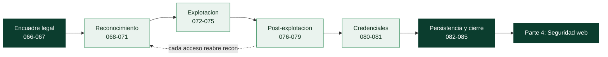

# Parte 3 — Hacking ético y pentesting: metodología

> [⬅️ Volver al programa](../../README.md) · [📚 Índice completo](../README.md) · [⏭️ Parte siguiente](../parte-4-seguridad-de-aplicaciones-web/README.md)

**20 clases** · rango 066–085 · PTES, recon, enumeración, explotación, post-explotación y reporte

**Fuentes de referencia de esta parte:**

- **Peter Kim** — *The Hacker Playbook 3: Practical Guide to Penetration Testing* (2018).
- **Georgia Weidman** — *Penetration Testing: A Hands-On Introduction to Hacking* (No Starch Press, 2014).
- **OccupyTheWeb** — *Linux Basics for Hackers* (No Starch Press, 2018).
- **PTES** — *Penetration Testing Execution Standard* (<http://www.pentest-standard.org>).
- **OWASP** — *Web Security Testing Guide* y *Penetration Testing Methodologies*.
- **MITRE ATT&CK** — matriz de tácticas y técnicas adversarias (<https://attack.mitre.org>).

---

## 🎯 ¿De qué trata esta parte?

Esta parte enseña a realizar una prueba de intrusión (pentest) completa siguiendo una **metodología profesional y repetible**, no como una colección de trucos sueltos. Recorreremos las siete fases del PTES —pre-engagement, inteligencia, modelado de amenazas, análisis de vulnerabilidades, explotación, post-explotación y reporte— y las traduciremos a comandos y herramientas reales: `nmap`, Metasploit, `msfvenom`, `hashcat`, John the Ripper, `linpeas`, Responder, entre otras.

El pentesting es la disciplina que valida, de forma controlada y autorizada, si los controles de seguridad de una organización resisten a un atacante real. Importa porque un informe de auditoría teórico no demuestra impacto: solo demostrando la cadena completa —desde el reconocimiento hasta el acceso a datos sensibles— se convence a la dirección de invertir en remediación. Aprender la metodología también forma defensores: quien entiende cómo se explota un sistema sabe dónde poner los sensores.

Sirve a futuros pentesters, analistas de red team, ingenieros de seguridad ofensiva y también a los equipos azules (blue team) que necesitan entender al adversario para detectarlo. Todo el contenido ofensivo de esta parte se practica **exclusivamente en laboratorios propios o con autorización explícita por escrito**.

## 🧩 Problemas que resuelve

- Cómo estructurar un pentest para que sea auditable, repetible y defendible ante el cliente.
- Cómo definir un alcance y unas reglas de engagement que protejan legalmente a ambas partes.
- Cómo pasar de "encontré un puerto abierto" a "demostré impacto de negocio con evidencia".
- Cómo priorizar vulnerabilidades por explotabilidad real y no solo por su puntuación CVSS.
- Cómo encadenar acceso inicial, escalada de privilegios y movimiento lateral hasta el objetivo.
- Cómo obtener, crackear y reutilizar credenciales de forma controlada.
- Cómo redactar un informe que un CISO y un administrador de sistemas puedan accionar.

## 🎓 Resultados de aprendizaje

Al terminar la parte, el alumno podrá:

- Planificar un engagement conforme a PTES y OSSTMM con alcance y RoE documentados.
- Ejecutar reconocimiento pasivo (OSINT) y activo sin salirse del alcance autorizado.
- Enumerar servicios (SMB, SNMP, SMTP, LDAP) y correlacionarlos con vulnerabilidades.
- Operar Metasploit Framework: módulos, payloads, `msfvenom` y Meterpreter.
- Escalar privilegios en Linux y Windows a partir de configuraciones inseguras reales.
- Realizar movimiento lateral, pivoting y reenvío de puertos en una red segmentada.
- Crackear hashes con John y Hashcat y ejecutar ataques de credenciales controlados.
- Documentar persistencia, exfiltración y anti-forense a nivel conceptual y con límites legales.
- Redactar un informe de pentest profesional con hallazgos, riesgo y remediación.

## 🧱 Prerrequisitos

Esta parte pone en práctica ofensiva todo lo anterior, así que conviene traerlo fresco:

| Necesitas… | Dónde se cubre |
|---|---|
| Escaneo Nmap: descubrimiento, puertos, versión, NSE | [Clases 029–033](../parte-1-redes-y-seguridad-de-redes/029-nmap-descubrimiento-de-hosts-y-tecnicas-de-ping/README.md) |
| Enumeración de SMB, SNMP, DNS y LDAP | [Clase 033](../parte-1-redes-y-seguridad-de-redes/033-enumeracion-de-servicios-de-red/README.md) |
| Pivoting y túneles (NAT, SSH `-L`/`-R`/`-D`) | [Clase 037](../parte-1-redes-y-seguridad-de-redes/037-proxies-nat-y-pivoting-de-red/README.md) |
| Hashes, KDF y por qué se crackean | [Clase 057](../parte-2-criptografia-aplicada/057-almacenamiento-seguro-de-contrasenas-bcrypt-scrypt-y-argon2/README.md) |
| Ética, alcance y autorización | [Clase 025](../parte-0-fundamentos-y-prerrequisitos/025-etica-legalidad-alcance-y-divulgacion-responsable/README.md) |
| Linux, Windows y Python de la Parte 0 | [Clases 005–009, 015](../parte-0-fundamentos-y-prerrequisitos/005-linux-esencial-para-seguridad-filesystem-permisos-y-usuarios/README.md) |

Y un requisito material: un **laboratorio virtualizado propio** con Kali Linux y máquinas vulnerables deliberadas (Metasploitable, VulnHub, rangos como HackTheBox o TryHackMe). Nunca practiques estas técnicas fuera de él.

## 🧭 Cómo recorrer esta parte

**El orden es el de un pentest real, y por eso conviene seguirlo.** Las clases están dispuestas como las fases de un engagement —encuadre legal → reconocimiento → explotación → post-explotación → cierre—, de modo que recorrerlas en orden es ensayar el flujo de trabajo completo. Saltar bloques rompe esa lógica: la escalada (076–077) no tiene sentido sin el acceso inicial (072–075), y el informe (085) solo se entiende cuando hay hallazgos que reportar.

**El ritmo.** La parte suma unas **43 h 20 min** de trabajo guiado, sin contar el tiempo de laboratorio libre, que en esta parte es mucho (montar máquinas vulnerables, repetir explotaciones). A dos horas al día son unas **cuatro semanas y media**.

**El método, clase a clase.**

1. Lee **🎯 Objetivo** y **📚 Resultados de aprendizaje**.
2. Lee **🧠 Explicación en profundidad** antes de teclear. Aquí es donde está el *por qué funciona* un ataque, no solo el comando; sin eso, se copian recetas que fallan al primer cambio de versión.
3. Prepara el laboratorio que pida **🧰 Herramientas y preparación**.
4. Haz el **🧪 Laboratorio guiado** contra tus propias máquinas. Repite hasta que salga sin mirar.
5. Resuelve **✍️ Ejercicios** y el **📝 Reto verificable**.
6. Repasa el **📔 Glosario**: esta parte tiene la mayor densidad de siglas y nombres de herramienta del programa (PtH, NSE, SUID, GTFOBins, LSASS, PtT).

> ⚠️ **Uso ético y legal — la clase más importante de la parte es la 067.** Todo lo que se enseña aquí es, sin autorización, un delito informático. La única diferencia entre un pentester y un atacante es un **documento firmado**. Practica solo en tu laboratorio o dentro de un alcance autorizado por escrito, y lee la [Clase 067](067-reglas-de-engagement-alcance-y-contratos/README.md) y la [Clase 025](../parte-0-fundamentos-y-prerrequisitos/025-etica-legalidad-alcance-y-divulgacion-responsable/README.md) antes de tocar ninguna herramienta contra nada que no sea tuyo.

## 🧱 Anatomía de una clase

Las 20 clases siguen el **estándar pedagógico profundo** del programa:

| Sección | Qué contiene | Para qué la usas |
|---|---|---|
| 🎯 Objetivo | Qué sabrás hacer al terminar y por qué importa | Decidir si necesitas la clase |
| 📚 Resultados de aprendizaje | Lista verificable de capacidades concretas | Autoevaluarte al final |
| 🗺️ Temas | Cada tema con el porqué de su inclusión | Ubicarte antes de leer |
| 🧠 Explicación en profundidad | El mecanismo del ataque y cómo se conecta con el resto, con diagramas | Entender, no memorizar comandos |
| 📖 Definiciones y características | Cada término desarrollado con su relevancia | Consulta puntual |
| 📔 Glosario | Términos, siglas y herramientas de la clase | Repaso rápido |
| 🧰 Herramientas y preparación | Qué instalar y qué laboratorio montar | Antes del laboratorio |
| 🧪 Laboratorio guiado | Ataque paso a paso contra máquinas propias | Donde de verdad se aprende |
| ✍️ Ejercicios · 📝 Reto verificable | Práctica propia y un entregable con criterio | Consolidar y demostrar |
| ⚠️ Errores comunes · ❓ Preguntas frecuentes | Fallos reales (casi siempre de configuración) y dudas | Cuando algo no conecta |
| 🔗 Referencias | Libros del oficio, PTES, MITRE ATT&CK | Profundizar |

El CI del repositorio verifica que ninguna clase de esta parte pierda las secciones **🧠 Explicación en profundidad** ni **📔 Glosario**.

## 🗺️ Estructura temática

| Bloque | Clases | Contenido | Tiempo |
|--------|--------|-----------|--------|
| Metodología y encuadre legal | 066–067 | PTES/OSSTMM, reglas de engagement, alcance, contratos | ≈ 3 h |
| Reconocimiento y enumeración | 068–071 | OSINT, recon activo, enumeración, análisis de vulnerabilidades | ≈ 7 h 20 |
| Explotación con Metasploit | 072–075 | Arquitectura, explotación, payloads, Meterpreter, msfvenom | ≈ 7 h 50 |
| Post-explotación | 076–079 | Escalada Linux/Windows, movimiento lateral, pivoting | ≈ 8 h 40 |
| Credenciales | 080–081 | Cracking con John/Hashcat, fuerza bruta y spraying | ≈ 3 h 40 |
| Persistencia y cierre | 082–085 | Persistencia, exfiltración, anti-forense, reporte | ≈ 8 h 40 |

## 📖 Guía capítulo a capítulo

Qué hace cada clase, por qué está donde está y para qué te sirve después.

### ⚖️ Bloque 1 · Metodología y encuadre legal — clases 066 a 067

- **[066 · Metodología de pentesting: PTES y OSSTMM](066-metodologia-de-pentesting-ptes-y-osstmm/README.md)** · 90 min — Por qué sin método "hackear" no es una profesión: cobertura, defensa jurídica y valor para el cliente. Las siete fases del PTES, la diferencia entre análisis de vulnerabilidades, pentest y red team, y los tipos de acceso (black/gray/white box). El informe es el producto.
- **[067 · Reglas de engagement, alcance y contratos](067-reglas-de-engagement-alcance-y-contratos/README.md)** · 90 min — **La clase que separa el pentest del delito.** La autorización escrita como requisito absoluto, quién puede firmarla, los cuatro documentos (SOW, RoE, autorización, NDA), el alcance con negación por defecto, y qué hacer al encontrar datos personales o una brecha previa.

### 🔍 Bloque 2 · Reconocimiento y enumeración — clases 068 a 071

- **[068 · Reconocimiento pasivo e inteligencia de fuentes abiertas](068-reconocimiento-pasivo-e-inteligencia-de-fuentes-abiertas/README.md)** · 100 min — Ver sin ser visto: construir un mapa completo sin enviar un paquete. WHOIS, Certificate Transparency para enumerar subdominios, Shodan/Censys, y la superficie humana (empleados, metadatos, brechas filtradas) que alimenta el spraying y el phishing.
- **[069 · Reconocimiento activo](069-reconocimiento-activo/README.md)** · 110 min — Cruzar la línea: ahora el objetivo puede verte. El flujo de host → puertos → versión → NSE, el triángulo velocidad/sigilo/no-romper-nada, y por qué la versión exacta es lo que convierte un puerto en un objetivo. Con `-oA` como requisito del método, no comodidad.
- **[070 · Enumeración: SMB, SNMP, SMTP y LDAP](070-enumeracion-smb-snmp-smtp-y-ldap/README.md)** · 110 min — Exprimir cada servicio hasta que confiese. Qué filtra cada protocolo (SMB usuarios y política de contraseñas, SNMP la config, SMTP usuarios válidos, LDAP todo AD), la correlación que convierte datos en acceso, y la documentación como evidencia.
- **[071 · Análisis de vulnerabilidades con Nessus y OpenVAS](071-analisis-de-vulnerabilidades-con-nessus-y-openvas/README.md)** · 120 min — Un escáner amplía, no profundiza, y no confirma explotabilidad. Autenticado frente a no autenticado, CVSS con sus tres métricas (y por qué casi todos ignoran la ambiental), y la disciplina de verificar, descartar falsos positivos y priorizar por negocio.

### 💣 Bloque 3 · Explotación con Metasploit — clases 072 a 075

- **[072 · Metasploit Framework: arquitectura y uso](072-metasploit-framework-arquitectura-y-uso/README.md)** · 110 min — Un framework, no un botón. Los seis tipos de módulo y la distinción exploit ≠ payload, el datastore (`set` vs `setg`), y la base de datos con workspaces que persiste todo y lo aísla por cliente.
- **[073 · Metasploit: explotación y payloads](073-metasploit-explotacion-y-payloads/README.md)** · 120 min — Emparejar exploit y vulnerabilidad y `check` antes de disparar. Reverse frente a bind (quién llama a quién y por qué atraviesa NAT), staged frente a stageless, y los handlers para trabajar con varios objetivos en paralelo.
- **[074 · Meterpreter y post-explotación](074-meterpreter-y-post-explotacion/README.md)** · 120 min — La sesión es el principio, no el final. Meterpreter en memoria, `migrate` para estabilizar, la recolección de credenciales (hashdump, kiwi/Mimikatz) como el botín de mayor impacto, `getsystem`, y la custodia responsable de lo extraído.
- **[075 · msfvenom: generación de payloads](075-msfvenom-generacion-de-payloads/README.md)** · 120 min — Cuando no hay exploit remoto, se lleva el payload. La sintaxis base, el formato que debe encajar con el objetivo, y el malentendido más caro: los encoders **no** ofuscan contra el AV moderno; su función real es eliminar bad characters.

### 🧗 Bloque 4 · Post-explotación — clases 076 a 079

- **[076 · Escalada de privilegios en Linux](076-escalada-de-privilegios-en-linux/README.md)** · 120 min — De un usuario cualquiera a root, casi siempre por mala configuración. SUID y GTFOBins, `sudo -l`, cron editables y PATH escribible, con el kernel exploit como último recurso porque puede tumbar la máquina.
- **[077 · Escalada de privilegios en Windows](077-escalada-de-privilegios-en-windows/README.md)** · 130 min — El objetivo es SYSTEM. Servicios mal configurados (unquoted path, DLL hijacking), AlwaysInstallElevated, el abuso de tokens de los ataques Potato, y por qué UAC no es un límite de seguridad.
- **[078 · Movimiento lateral en la red](078-movimiento-lateral-en-la-red/README.md)** · 130 min — Un host no es el objetivo; la red lo es. Pass-the-Hash (por qué el hash **es** la credencial en NTLM), las vías de ejecución remota de la más ruidosa a la más sigilosa, y BloodHound como el grafo de rutas hacia Domain Admin.
- **[079 · Pivoting y reenvío de puertos](079-pivoting-y-reenvio-de-puertos/README.md)** · 140 min — El host comprometido como puerta a lo inalcanzable. Los tres reenvíos SSH, el pivoting integrado de Metasploit, chisel/ligolo cuando no hay SSH, y el reverso defensivo: por qué segmentar funciona.

### 🔓 Bloque 5 · Credenciales — clases 080 a 081

- **[080 · Cracking de contraseñas con John y Hashcat](080-cracking-de-contrasenas-con-john-y-hashcat/README.md)** · 130 min — Los hashes solo valen si se rompen o se reutilizan. Identificar el algoritmo (el fallo número uno), las estrategias de candidatos (diccionario, reglas, máscara, híbrido), la aceleración por GPU y por qué los KDF lentos la anulan.
- **[081 · Ataques a credenciales: fuerza bruta y password spraying](081-ataques-a-credenciales-fuerza-bruta-y-password-spraying/README.md)** · 110 min — El bloqueo de cuentas lo cambia todo: por eso el spraying (una contraseña común contra muchas cuentas) funciona donde la fuerza bruta se bloquea. Contraseñas contextuales, y por qué la defensa real es MFA y detección, no más reglas de complejidad.

### 🗄️ Bloque 6 · Persistencia y cierre — clases 082 a 085

- **[082 · Persistencia en sistemas comprometidos](082-persistencia-en-sistemas-comprometidos/README.md)** · 110 min — Mantener el acceso y, sobre todo, enseñar al azul qué buscar. Las técnicas de la más ruidosa (Run keys) a la más sigilosa (WMI fileless), su mapeo a ATT&CK, y la regla profesional: un pentest no deja puertas abiertas.
- **[083 · Exfiltración de datos](083-exfiltracion-de-datos/README.md)** · 120 min — Collection, C2 y exfiltración son fases distintas. Cada canal (HTTP, DNS, ICMP, cloud) evade una defensa distinta; la ofuscación y el *low and slow* evaden por contenido y por volumen; y la defensa que gana es el egress filtering. Con el archivo canario para probar sin tocar datos reales.
- **[084 · Anti-forense y borrado de huellas](084-anti-forense-y-borrado-de-huellas-concepto-y-limites/README.md)** · 110 min — Se estudia para defenderse de él. Por qué el borrado nunca es completo (el propio borrado es un evento; journaling, VSS, memoria y SIEM persisten), y la defensa que gana: telemetría reenviada a un almacén inmutable fuera del alcance del atacante.
- **[085 · Reporte profesional de pentest](085-reporte-profesional-de-pentest/README.md)** · 120 min — El informe **es** el producto. El resumen ejecutivo que traduce a riesgo de negocio, la anatomía de un hallazgo con evidencia reproducible, la remediación accionable y el retest que cierra el ciclo. Las diecinueve clases anteriores existen para llenarlo.

## 🧰 Qué tendrás al terminar

- Un **engagement planificado** de principio a fin: alcance, RoE y autorización redactados como los redactaría un profesional.
- Un **flujo de reconocimiento** reproducible que va del OSINT pasivo al escaneo activo documentado.
- **Metasploit** manejado con criterio: módulos, payloads reverse/staged correctos, Meterpreter y post-explotación.
- **Escaladas de privilegios** demostradas en Linux y Windows a partir de configuraciones reales, cada una con su remediación.
- Una cadena completa de **movimiento lateral y pivoting** en una red segmentada de laboratorio.
- Hashes **crackeados** y una métrica real de la resistencia de las contraseñas.
- Un **informe de pentest** con resumen ejecutivo, hallazgos con evidencia reproducible y remediación accionable — el entregable que de verdad se vende.

## 🚦 ¿Puedo saltarme clases?

Esta parte se recorre como un flujo; saltar rompe la cadena. Sáltate una clase solo si respondes de memoria a su pregunta de control:

| Si dominas… | Pregunta de control | Si titubeas |
|---|---|---|
| Encuadre legal (066–067) | ¿Qué documento te separa de un delito, y quién puede firmarlo? | Haz 067 |
| Metasploit (072–073) | ¿Por qué una reverse shell atraviesa un firewall y una bind no? | Haz 073 |
| Escalada (076–077) | ¿Qué es un binario SUID y por qué GTFOBins importa? | Haz 076 |
| Lateral (078) | ¿Por qué el hash NTLM basta sin la contraseña en claro? | Haz 078 |
| Credenciales (080–081) | ¿Por qué el spraying evade el bloqueo que frena la fuerza bruta? | Haz 081 |
| Reporte (085) | ¿A quién va el resumen ejecutivo y qué NO debe llevar? | Haz 085 |

## 🔗 Referencias de la parte

- PTES — Penetration Testing Execution Standard — <http://www.pentest-standard.org>
- OSSTMM — Open Source Security Testing Methodology Manual — <https://www.isecom.org/OSSTMM.3.pdf>
- MITRE ATT&CK — <https://attack.mitre.org>
- OWASP Web Security Testing Guide — <https://owasp.org/www-project-web-security-testing-guide/>
- Kim, P. *The Hacker Playbook 3* (2018).
- Weidman, G. *Penetration Testing* (No Starch Press, 2014).
- OccupyTheWeb. *Linux Basics for Hackers* (No Starch Press, 2018).

## ▶️ Empezar

[Clase 066 — Metodología de pentesting: PTES y OSSTMM](066-metodologia-de-pentesting-ptes-y-osstmm/README.md)
